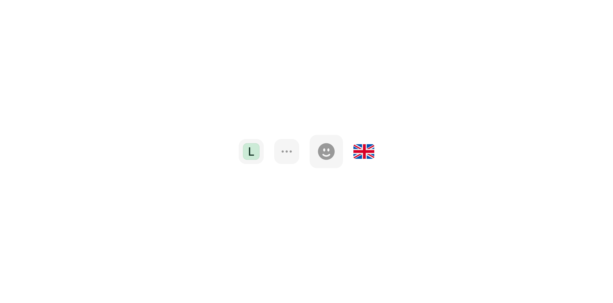

# Avatar Icon

> An internal framing component that wraps an icon or avatar in a consistently sized, optionally rounded container.

 

[View in Figma →](https://www.figma.com/design/7jCMwDng7HF5g7F3tGXf0E/Open-HR?node-id=1085-25568)


---

## Overview

Avatar Icon (`Icon or avatar container` in Figma) is a low-level utility component. It is **not used directly in product UI**, it is consumed internally by other components (e.g. Text Button's avatar slot, list items, input accessories) to provide a consistent frame for icons or small avatars.

Two modes: **wrapped** (rounded square container with background) and **unwrapped** (raw icon or avatar at intrinsic size, no container). Four sizes with proportionally scaling content dimensions.

> **This is an internal component.** Do not use it directly in product code unless you are building a new component that needs a framed icon or avatar slot. For person representations, use Avatar. For interactive icon controls, use Icon Button.

**Available in:** React · Next.js · Figma (internal)


---

## Anatomy

| Part | Description |
|------|-------------|
| Container (wrapped only) | A rounded square frame. Adds background colour and border-radius. Only rendered when `wrapped=true`. |
| Icon / Avatar | The content inside. An icon (`type="icon"`) or an Avatar instance (`type="avatar"`). Centred when wrapped; rendered at raw size when unwrapped. |


---

## Spacing tokens

All values confirmed from Figma bounding boxes.

### Wrapped (`wrapped=true`)

| Size | Figma name | Container | Border radius | Icon inside | Avatar inside |
|------|------------|-----------|---------------|-------------|---------------|
| `xs` | `xtra-Small 10 PX` | `14×14px` | `5px`         | `12×12px`   | `12×12px`     |
| `sm` | `Small`    | `24×24px` | `7px`         | `14×14px`!  | `16×16px`     |
| `md` | `Medium`   | `32×32px` | `7px`         | `20×20px`   | `20×20px`     |
| `lg` | `Large`    | `40×40px` | `7px`         | `24×24px`   | `24×24px`     |

> **Note on** `**xs**` **avatar size:** Figma does not define an avatar variant for `xs` wrapped. The icon size at xs is `12×12px`. If you need a `12px` avatar in a wrapped `xs` container, confirm with design whether that's intended, the avatar component's smallest size is `12px`.

### Unwrapped (`wrapped=false`), raw content dimensions

| Size | Icon | Avatar |
|------|------|--------|
| `xs` | `12×12px` | `12×12px` |
| `sm` | `14×14px` | `16×16px` |
| `md` | `20×20px` | `20×20px` |
| `lg` | `24×24px` | `24×24px` |

> In unwrapped mode there is no container, no border-radius, no background. The icon or avatar renders at its raw content size only.

**Avatar vs icon size discrepancy at** `**sm**`**:** The avatar inside a wrapped `sm` container is `16×16px`, while the icon is `14×14px`. This is intentional, avatars include a thin outer ring that makes them visually comparable to a slightly smaller icon.


---

## Variants

### Type (`type` / Figma: `🔄 Type`)

| Value | Figma value | Description |
|-------|-------------|-------------|
| `icon` | `Icon`      | Displays an icon component |
| `avatar` | `avatar & image` | Displays an Avatar component instance |

### Wrapped (`wrapped` / Figma: `Wrapped ?`)

| Value | Figma value | Description |
|-------|-------------|-------------|
| `true` | `Yes`       | Adds a rounded square container around the content |
| `false` | `no`        | Raw content only, no container, no border-radius |

### Size (`size` / Figma: `size`)

| Value | Figma name | Wrapped container | Icon (wrapped) | Avatar (wrapped) |
|-------|------------|-------------------|----------------|------------------|
| `xs`  | `xtra-Small 10 PX` | `14×14px`         | `12×12px`      | —                |
| `sm`  | `Small`    | `24×24px`         | `14×14px`      | `16×16px`        |
| `md`  | `Medium`   | `32×32px`         | `20×20px`      | `20×20px`        |
| `lg`  | `Large`    | `40×40px`         | `24×24px`      | `24×24px`        |

> The Figma size name `xtra-Small 10 PX` refers to the icon's visual weight (approximately 10px at `xs` raw, 12px in context). The API uses `xs/sm/md/lg` for consistency.


---

## Usage guidelines

**Do** use Avatar Icon when building a new component that needs a consistently framed icon or avatar slot, e.g. a list item's leading visual, a select option icon, or a table cell accessor. **Don't** use Avatar Icon for interactive icon controls, use Icon Button instead.

**Do** use `wrapped=true` when the icon needs a background container for visual weight. **Don't** use `wrapped=true` in a context that already provides a background, double-framing looks unintentional.

**Do** use `wrapped=false` when you need the raw icon dimensions without any container, e.g. an icon inside a button that has its own container.

**Do** use `type="icon"` for system icons and `type="avatar"` for person/entity representations. **Don't** pass an Avatar instance when `type="icon"` is set, or vice versa, the sizing expectations differ.


---

## Accessibility

Avatar Icon is a presentational component and carries no inherent accessibility semantics. Accessibility is the responsibility of the parent component:

* **Icons**, The icon inside should be `aria-hidden="true"` if the parent provides an accessible label. If the icon conveys meaning standalone, the parent must label it.
* **Avatar**, Follow Avatar component accessibility guidelines. The framing container adds no semantic meaning.
* **No interactive affordance**, Avatar Icon is never interactive itself. If you need an interactive framed icon, use Icon Button.


---

## Props / API

```ts
interface AvatarIconProps {
  type?: 'icon' | 'avatar'
  size?: 'xs' | 'sm' | 'md' | 'lg'
  wrapped?: boolean
  icon?: ReactNode
  avatar?: ReactNode
  className?: string
}
```

| Prop | Type | Default | Required | Description |
|------|------|---------|----------|-------------|
| `type` | `'icon' \| 'avatar'` | `'icon'` | No       | Content type. Determines which sizing rules apply inside the container. |
| `size` | `'xs' \| 'sm' \| 'md' \| 'lg'` | `'sm'`  | No       | Size tier. Controls container dimensions and content size. |
| `wrapped` | `boolean` | `false` | No       | `true` adds a rounded square container with background. `false` renders content at raw size with no container. |
| `icon` | `ReactNode` | —       | No       | Icon to render when `type="icon"`. |
| `avatar` | `ReactNode` | —       | No       | Avatar instance to render when `type="avatar"`. |
| `className` | `string` | —       | No       | Additional CSS class. Applied to the container when `wrapped=true`, or to the content element when `wrapped=false`. |


---

## Code examples

### Wrapped icon (inside a list item)

```tsx
// Next.js (App Router), Server Component
// No 'use client' directive needed, this component carries no browser state.

// 24×24px container, 14×14px icon inside
<AvatarIcon
  type="icon"
  size="sm"
  wrapped
  icon={<BuildingIcon aria-hidden />}
/>
```

```tsx
// React
// 24×24px container, 14×14px icon inside
<AvatarIcon
  type="icon"
  size="sm"
  wrapped
  icon={<BuildingIcon aria-hidden />}
/>
```

### Wrapped avatar (inside a select option)

```tsx
// Next.js (App Router), Server Component
// No 'use client' directive needed, this component carries no browser state.

// 24×24px container, 16×16px Avatar inside
<AvatarIcon
  type="avatar"
  size="sm"
  wrapped
  avatar={
    <Avatar
      type="initials"
      text={user.firstName[0]}
      colour={hashToColour(user.id)}
      size={16}
      aria-hidden
    />
  }
/>
```

```tsx
// React
// 24×24px container, 16×16px Avatar inside
<AvatarIcon
  type="avatar"
  size="sm"
  wrapped
  avatar={
    <Avatar
      type="initials"
      text={user.firstName[0]}
      colour={hashToColour(user.id)}
      size={16}
      aria-hidden
    />
  }
/>
```

### Unwrapped icon (inside a button that already has a container)

```tsx
// Next.js (App Router), Server Component
// No 'use client' directive needed, this component carries no browser state.

// No framing container, icon at raw 14×14px
<AvatarIcon
  type="icon"
  size="sm"
  icon={<SearchIcon aria-hidden />}
/>
```

```tsx
// React
// No framing container, icon at raw 14×14px
<AvatarIcon
  type="icon"
  size="sm"
  icon={<SearchIcon aria-hidden />}
/>
```

### Sizes comparison

```tsx
// Next.js (App Router), Server Component
// No 'use client' directive needed, this component carries no browser state.

{/* xs: 14×14px container, 12×12px icon */}
<AvatarIcon type="icon" size="xs" wrapped icon={<PlusIcon aria-hidden />} />

{/* sm: 24×24px container, 14×14px icon */}
<AvatarIcon type="icon" size="sm" wrapped icon={<PlusIcon aria-hidden />} />

{/* md: 32×32px container, 20×20px icon */}
<AvatarIcon type="icon" size="md" wrapped icon={<PlusIcon aria-hidden />} />

{/* lg: 40×40px container, 24×24px icon */}
<AvatarIcon type="icon" size="lg" wrapped icon={<PlusIcon aria-hidden />} />
```

```tsx
// React
{/* xs: 14×14px container, 12×12px icon */}
<AvatarIcon type="icon" size="xs" wrapped icon={<PlusIcon aria-hidden />} />

{/* sm: 24×24px container, 14×14px icon */}
<AvatarIcon type="icon" size="sm" wrapped icon={<PlusIcon aria-hidden />} />

{/* md: 32×32px container, 20×20px icon */}
<AvatarIcon type="icon" size="md" wrapped icon={<PlusIcon aria-hidden />} />

{/* lg: 40×40px container, 24×24px icon */}
<AvatarIcon type="icon" size="lg" wrapped icon={<PlusIcon aria-hidden />} />
```


---

## Related components

* [Avatar](./Avatar.md), Use directly for person/entity representations in product UI
* [Icon Button](/doc/6c30d09a-7648-4df4-87ed-846ff9820e40), Use for interactive framed icon controls
* [Text Button](/doc/cc668bc8-b469-48d0-a4e0-bba4bdace532), Uses Avatar Icon internally for its avatar slot