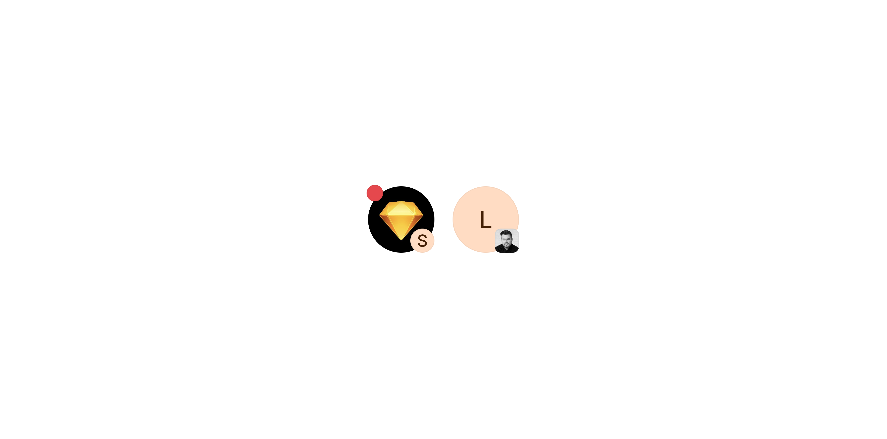

# Avatar Pair

> Displays a primary and secondary avatar in a composite frame, with the secondary overlaid at the bottom-right corner.

 

[View in Figma →](https://www.figma.com/design/7jCMwDng7HF5g7F3tGXf0E/Open-HR?node-id=707-47814)


---

## Overview

Avatar Pair combines a primary [Avatar](./Avatar.md) with a  [Avatar](./Avatar.md) secondary avatar into a single composited unit. The secondary avatar is anchored at the bottom-right corner of the primary (offset), creating a compact representation of two related entities, for example, a team member paired with their company, or the two parties in a one-on-one conversation.

There is one fixed layout, no size variants. Both avatars independently accept all Avatar content types (initials, image, image-border, icon, country) and optional notification badges. When the primary badge is shown, it moves to the top-left corner to avoid overlapping the secondary avatar.

**Available in:** React · Next.js · Figma


---

## Anatomy

| Part | Description |
|------|-------------|
| Container | The outer frame acts as the layout origin for both avatars and their badges. Must allow `overflow: visible` so badges are not clipped. |
| Primary avatar | Accepts all Avatar content types(except rectangular flags). |
| Secondary avatar | Accepts all Avatar content types(except rectangular flags). |
| Primary badge | `11×11px` xLarge Notification Badge. Positioned at (−1, −1), **top-left corner** of the container. Repositioned from the usual top-right to avoid conflict with the secondary avatar. |
| Secondary badge | should not be used |

> **Badge repositioning:** In the standalone [Avatar](./Avatar.md) component, the notification badge sits at the top-right corner. In Avatar Pair, the primary badge is deliberately placed at the top-left to keep the bottom-right clear for the secondary avatar. Implement this as a conditional CSS override on the badge position when `showPrimaryNotification=true`.


---

## Colour tokens

Avatar Pair inherits colour tokens from [Avatar](./Avatar.md)  for each slot independently.

| Part | Token |
|------|-------|
| Initials background | `bg/avatar/{colour}` |
| Initials text | `text/avatar/{colour}` |
| Image-border ring | `border/avatar/image` |
| Notification badge | `bg/notication` |
| Badge count text | `text/inverted` |

Colour options per avatar: `green` · `purple` · `aqua` · `orange` · `yellow` · `blue` · `fuchsia` · `red` · `grey` · `teal`


---

## Variants

Avatar Pair has no top-level variant axis, there is one fixed layout. Each slot independently accepts Avatar content type and colour props.

### Primary avatar

| Prop | Type | Options |
|------|------|---------|
| `primaryType` | Content type | `initials` · `image` · `image-border` · `icon` · `country` |
| `primaryColour` | Initials colour | 10 colour options |
| `primaryText` | Initials character | Single letter (or 2 chars) |
| `primarySrc` | Image URL | URL string |
| `showPrimaryNotification` | Badge visibility | `boolean` |
| `primaryNotificationCount` | Badge count | `number` |

### Secondary avatar

| Prop | Type | Options |
|------|------|---------|
| `secondaryType` | Content type | `initials` · `image` · `image-border` · `icon` · `country` |
| `secondaryColour` | Initials colour | 10 colour options |
| `secondaryText` | Initials character | Single letter (or 2 chars) |
| `secondarySrc` | Image URL | URL string |
| `showSecondaryNotification` | Badge visibility | `boolean` |

> **Secondary badge has no number.** The secondary avatar uses the `Small` (4×4px) badge, too small to display a count. Set `primaryNotificationCount` on the primary if a count is needed.

> **Figma note:** In the Figma component, content type (image, image-border, icon, country) is encoded as part of the `Colour` variant on each Avatar instance, e.g. `🖼️ Image with border`, `⬜ Icon`, `⛳ Country`. This is a Figma-side modelling quirk and does not affect the React API. See [Avatar](./avatar.md) for the full type/colour mapping.


---

## States

Avatar Pair is a display component. The composite container has no hover, focus, active, or disabled state. Badge visibility and count are the only dynamic properties and are fully controlled via props.


---

## Usage guidelines

**Do:**

* Use Avatar Pair when exactly two entities are jointly relevant in one visual slot, e.g. a candidate and hiring manager, or sender and recipient.
* Always provide an `aria-label` on the wrapper describing both entities: `"Alice Johnson and Acme Corp"`.
* Keep both avatars contextually related. Pairing unrelated entities in the same slot creates confusion.

**Don't:**

* Don't use Avatar Pair to show group membership for 3 or more people, use [Avatar Stack](./avatar-stack.md) instead.
* Don't show a number on the secondary badge, the 4×4px dot cannot legibly render a count.
* Don't use Avatar Pair in sizes other than the fixed 44×44px layout. There are no size variants.
* Don't swap the layout so the secondary is larger than the primary.


---

## Content guidelines

* `aria-label` should name both entities in natural language order: `"Victoria Adetunji and Open HR"`, not `"avatar pair"` or `"two avatars"`.
* For notification badges, announce count changes through a separate `aria-live` region, the badge dot is decorative for assistive technology.


---

## Behaviour in context

**In tables and lists:** Ensure the row height accommodates the full 44px primary avatar. Avatar-2 (16px) sits inside the 44×44px frame, it does not increase the composite height or width.

**Overflow and badge bleed:** Both badges bleed 1px outside their parent frame. The container must have `overflow: visible`. If Avatar Pair is inside a clipping ancestor (e.g. `overflow: hidden` table cells), badges will be cut off.

**Fallback chain:** Each avatar independently follows the Avatar fallback order: image → initials → icon. Wire `onError` separately for `primarySrc` and `secondarySrc`.

**Badge repositioning:** The primary badge is at the top-left when `showPrimaryNotification=true`. Implement this as a positional class, the badge element does not move by default in the base Avatar component, so Avatar Pair must override the badge's absolute position.


---

## Accessibility

* **Wrapper:** Provide `role="img"` and `aria-label` on the container naming both entities.
* **Inner avatars:** Mark both inner Avatar instances `aria-hidden="true"`, the container label is the sole accessible description.
* **Badges:** Both notification badges must be `aria-hidden="true"`. Use a separate `aria-live="polite"` region on the parent page to announce count changes.

```tsx
<div role="img" aria-label="Alice Johnson and Acme Corp">
  <AvatarPair ... />
</div>
{/* Announce notification changes separately */}
<span className="sr-only" aria-live="polite" aria-atomic="true">
  {unreadCount > 0 ? `${unreadCount} unread notifications` : ''}
</span>
```


---

## Props / API

```ts
interface AvatarPairProps {
  // Primary avatar, 44px, circular
  primaryType?: 'initials' | 'image' | 'image-border' | 'icon' | 'country'
  primaryColour?: 'green' | 'purple' | 'aqua' | 'orange' | 'yellow' | 'blue' | 'fuchsia' | 'red' | 'grey' | 'teal'
  primaryText?: string
  primarySrc?: string
  showPrimaryNotification?: boolean
  primaryNotificationCount?: number
  onPrimaryError?: () => void

  // Secondary avatar, 16px, square
  secondaryType?: 'initials' | 'image' | 'image-border' | 'icon' | 'country'
  secondaryColour?: 'green' | 'purple' | 'aqua' | 'orange' | 'yellow' | 'blue' | 'fuchsia' | 'red' | 'grey' | 'teal'
  secondaryText?: string
  secondarySrc?: string
  showSecondaryNotification?: boolean
  onSecondaryError?: () => void

  // Standard
  className?: string
  'aria-label'?: string
}
```

| Prop | Type | Default | Required | Description |
|------|------|---------|----------|-------------|
| `primaryType` | `'initials' \| 'image' \| 'image-border' \| 'icon' \| 'country'` | `'initials'` | No       | Content type for the 44px primary avatar |
| `primaryColour` | `string` | `'grey'` | No       | Initials background colour for the primary. 10 options. |
| `primaryText` | `string` | —       | No       | Initial character(s) for the primary avatar |
| `primarySrc` | `string` | —       | No       | Image URL for the primary avatar |
| `showPrimaryNotification` | `boolean` | `false` | No       | Overlays an 11×11px badge at the **top-left** of the container |
| `primaryNotificationCount` | `number` | —       | No       | Count shown in the primary badge. Renders as `99+` at ≥ 100. |
| `onPrimaryError` | `() => void` | —       | No       | Called when the primary image fails to load, use to switch to initials fallback |
| `secondaryType` | `'initials' \| 'image' \| 'image-border' \| 'icon' \| 'country'` | `'initials'` | No       | Content type for the 16px secondary avatar |
| `secondaryColour` | `string` | `'grey'` | No       | Initials background colour for the secondary |
| `secondaryText` | `string` | —       | No       | Initial character(s) for the secondary avatar |
| `secondarySrc` | `string` | —       | No       | Image URL for the secondary avatar |
| `showSecondaryNotification` | `boolean` | `false` | No       | Overlays a 4×4px dot badge on the secondary. No number display. |
| `onSecondaryError` | `() => void` | —       | No       | Called when the secondary image fails to load |
| `className` | `string` | —       | No       | Additional CSS class on the 44×44px container |
| `aria-label` | `string` | —       | No       | Accessible name describing both entities. Always provide. |


---

## Code examples

Default, initials primary, image secondary:

```tsx
// Next.js (App Router), Server Component
// No 'use client' directive needed, this component carries no browser state.

<AvatarPair
  primaryType="initials"
  primaryColour="orange"
  primaryText="V"
  secondaryType="image"
  secondarySrc="/logos/acme.png"
  aria-label="Victoria Adetunji and Acme Corp"
/>
```

```tsx
// React
<AvatarPair
  primaryType="initials"
  primaryColour="orange"
  primaryText="V"
  secondaryType="image"
  secondarySrc="/logos/acme.png"
  aria-label="Victoria Adetunji and Acme Corp"
/>
```


---

With primary notification badge and live region:

```tsx
// Next.js (App Router), Client Component
'use client'

function PairWithNotification({ unreadCount }: { unreadCount: number }) {
  return (
    <>
      <div role="img" aria-label="Alice Johnson and Acme Corp">
        <AvatarPair
          primaryType="image"
          primarySrc="/avatars/alice.jpg"
          showPrimaryNotification={unreadCount > 0}
          primaryNotificationCount={unreadCount}
          secondaryType="image"
          secondarySrc="/logos/acme.png"
        />
      </div>
      <span className="sr-only" aria-live="polite" aria-atomic="true">
        {unreadCount > 0 ? `${unreadCount} unread notification${unreadCount === 1 ? '' : 's'}` : ''}
      </span>
    </>
  )
}
```

```tsx
// React
function PairWithNotification({ unreadCount }: { unreadCount: number }) {
  return (
    <>
      <div role="img" aria-label="Alice Johnson and Acme Corp">
        <AvatarPair
          primaryType="image"
          primarySrc="/avatars/alice.jpg"
          showPrimaryNotification={unreadCount > 0}
          primaryNotificationCount={unreadCount}
          secondaryType="image"
          secondarySrc="/logos/acme.png"
        />
      </div>
      <span className="sr-only" aria-live="polite" aria-atomic="true">
        {unreadCount > 0 ? `${unreadCount} unread notification${unreadCount === 1 ? '' : 's'}` : ''}
      </span>
    </>
  )
}
```


---

With image fallback chain for both slots:

```tsx
// Next.js (App Router), Client Component
'use client'

function PairWithFallback() {
  const [primaryFailed, setPrimaryFailed] = useState(false)
  const [secondaryFailed, setSecondaryFailed] = useState(false)

  return (
    <AvatarPair
      primaryType={primaryFailed ? 'initials' : 'image'}
      primarySrc={primaryFailed ? undefined : '/avatars/alice.jpg'}
      primaryText="A"
      primaryColour="green"
      onPrimaryError={() => setPrimaryFailed(true)}
      secondaryType={secondaryFailed ? 'initials' : 'image'}
      secondarySrc={secondaryFailed ? undefined : '/logos/acme.png'}
      secondaryText="A"
      secondaryColour="blue"
      onSecondaryError={() => setSecondaryFailed(true)}
      aria-label="Alice and Acme Corp"
    />
  )
}
```

```tsx
// React
function PairWithFallback() {
  const [primaryFailed, setPrimaryFailed] = useState(false)
  const [secondaryFailed, setSecondaryFailed] = useState(false)

  return (
    <AvatarPair
      primaryType={primaryFailed ? 'initials' : 'image'}
      primarySrc={primaryFailed ? undefined : '/avatars/alice.jpg'}
      primaryText="A"
      primaryColour="green"
      onPrimaryError={() => setPrimaryFailed(true)}
      secondaryType={secondaryFailed ? 'initials' : 'image'}
      secondarySrc={secondaryFailed ? undefined : '/logos/acme.png'}
      secondaryText="A"
      secondaryColour="blue"
      onSecondaryError={() => setSecondaryFailed(true)}
      aria-label="Alice and Acme Corp"
    />
  )
}
```


---

## Related components

* [Avatar](./avatar.md), single-entity avatar; the building block for Avatar Pair
* [Avatar Stack](./avatar-stack.md), for 3 or more entities in a compact horizontal arrangement
* [Avatar Icon](./avatar-icon.md), avatar with icon content type; commonly used as the secondary slot
* [Notification Badge](./notification-badge.md), the badge sub-component used by both primary and secondary avatars