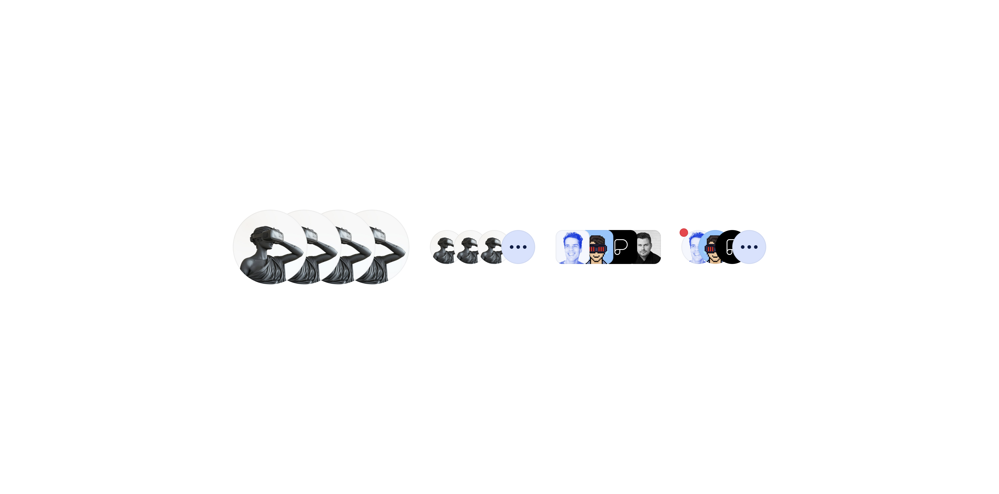

# Avatar Stack

> A horizontal row of overlapping avatars representing multiple people, companies or icons.

 

[View in Figma →](https://www.figma.com/design/7jCMwDng7HF5g7F3tGXf0E/Open-HR?node-id=709-48349)


---

## Overview

Avatar Stack displays a group of people in a compact, space-efficient row. Individual avatars overlap each other using negative spacing, creating a connected visual cluster. When the group exceeds the displayed count, a `.` overflow chip replaces the last avatar slot to show the remaining number.

Two densities are available: `standard` and `tight`. Standard works for most contexts; tight is for extremely constrained horizontal layouts.

**Available in:** React · Next.js · Figma


---

## Anatomy

| Part | Description |
|------|-------------|
| Avatar items | Individual Avatar components. The `left-most avatar` has the highest `z-index` (appears on top), this can be alternated and the `right-most avatar` can have the highest `z-index` . |
| Fixed slot count | 4 avatars when `withMore=false`, 3 avatars + 1 overflow chip when `withMore=true`. |
| Overflow chip | A circular element the same size as the avatars, showing `+N` where N is the count of hidden people. Only rendered when `withMore=true`. |

**Slot behaviour:** The component always renders exactly 4 slots at a given size. With `withMore=false`, all 4 are avatars. With `withMore=true`, the 4th slot becomes the overflow chip. If you have fewer than 4 people and `withMore=false`, render the remaining slots with no content (or reduce to the actual count, confirm the component's behaviour with the implementation).


---

## **Spacing tokens**

Overlap is achieved via negative `gap` (`itemSpacing` in Figma). All values are read directly from `itemSpacing` on the component variant. The negative gap tokens use the `-ve` suffix convention (e.g. `Spacing/gap/xl-16px-ve` = `−16px`).

### **Standard overlap (Figma:** `**Tight=no**`**)**

| **Size** | **Avatar size** | **Total width (4 items)** | **Gap (**`**itemSpacing**`**)** | **Token** |
|------|-------------|-----------------------|-----------------------|-------|
| `44` | `44×44px`   | `128px`               | `−16px`               | `Spacing/gap/xl-16px-ve` |
| `32` | `32×32px`   | `86px`                | `−14px`               | `Spacing/gap/xl-14px-ve` |
| `24` | `24×24px`   | `72px`                | `−8px`                | `Spacing/gap/sm-8px-ve` |
| `20` | `20×20px`   | `62px`                | `−6px`                | `Spacing/gap/sm-6px-ve` |
| `18` | `18×18px`   | `60px`                | `−4px`                | `Spacing/gap/xs-4px-ve` |
| `16` | `16×16px`   | `52px`                | `−4px`                | `Spacing/gap/xs-4px-ve` |
| `14` | `14×14px`   | `44px`                | `−4px`                | `Spacing/gap/xs-4px-ve` |
| `12` | `12×12px`   | `36px`                | `−4px`                | `Spacing/gap/xs-4px-ve` |

### **Tight overlap (Figma:** `**Tight=yes**`**)**

| **Size** | **Avatar size** | **Total width (4 items)** | **Gap (**`**itemSpacing**`**)** | **Token** |
|------|-------------|-----------------------|-----------------------|-------|
| `44` | `44×44px`   | `104px`               | `−24px`               | `Spacing/gap/2xl-24px-ve` |
| `32` | `32×32px`   | `80px`                | `−16px`               | `Spacing/gap/xl-16px-ve` |
| `24` | `24×24px`   | `60px`                | `−12px`               | `Spacing/gap/lg-12px-ve` |
| `20` | `20×20px`   | `50px`                | `−10px`               | `Spacing/gap/lg-10px-ve` |
| `18` | `18×18px`   | `48px`                | `−8px`                | `Spacing/gap/sm-8px-ve` |
| `16` | `16×16px`   | `40px`                | `−8px`                | `Spacing/gap/sm-8px-ve` |
| `14` | `14×14px`   | `38px`                | `−6px`                | `Spacing/gap/sm-6px-ve` |
| `12` | `12×12px`   | `30px`                | `−6px`                | `Spacing/gap/sm-6px-ve` |

**Total width formula:** `(avatarSize × count) + (gap × (count − 1))`, gap is negative, so this reduces the total.

* 44px standard, 4 avatars: `(44 × 4) + (−16 × 3) = 176 − 48 = 128px` ✓
* 44px tight, 4 avatars: `(44 × 4) + (−24 × 3) = 176 − 72 = 104px` ✓
* 24px standard, 4 avatars: `(24 × 4) + (−8 × 3) = 96 − 24 = 72px` ✓


---

## **Variants**

### **Size (**`**size**` **/ Figma:** `**size**`**)**

| **Value** | **Figma value** | **Avatar size** | **When to use** |
|-------|-------------|-------------|-------------|
| `44`  | `44 px`     | `44×44px`   | Prominent group displays, profile headers |
| `32`  | `32px`      | `32×32px`   | Card content, section headers, task assignees |
| `24`  | `24 px`     | `24×24px`   | List items, table cells |
| `20`  | `20 px`     | `20×20px`   | Compact list items, inline group references |
| `18`  | `18px`      | `18×18px`   | Dense UI    |
| `16`  | `16px`      | `16×16px`   | Very dense UI, chips |
| `14`  | `14px`      | `14×14px`   | Micro contexts |
| `12`  | `12px`      | `12×12px`   | Minimum size |

### **Overflow (**`**withMore**` **/ Figma:** `**⚪ with more**`**)**

| **Value** | **Figma value** | **Visible avatars** | **Chip shown** | **When to use** |
|-------|-------------|-----------------|------------|-------------|
| `false` | `no`        | 4 avatars       | No         | Group of ≤ 4 people where all members matter |
| `true` | `yes`       | 3 avatars + chip | Yes (`+N`) | Group larger than 3, where the total count matters |

### **Tight (**`**tight**` **/ Figma:** `**Tight**`**)**

| **Value** | **Figma value** | **Overlap** | **When to use** |
|-------|-------------|---------|-------------|
| `false` | `no`        | Standard (see table above) | General use |
| `true` | `yes`       | Greater overlap, see Tight overlap table | Extremely space-constrained layouts |


---

## **Usage guidelines**

**Do** use Avatar Stack to represent a team, group of assignees, or collaborators in a compact visual form. **Don't** use Avatar Stack when you need to show individual names, it communicates "there are people here", not "here are their names". For named lists, use a vertical list of Avatars with labels.

**Do** use `withMore=true` when the total group size exceeds 3. Show the `+N` count so users know how many people are hidden. **Don't** silently truncate without an overflow count, users need to know if the group is 4 people or 40.

**Do** order avatars by relevance or recency, the left-most avatar is visually dominant (highest `z-index`). **Don't** show more than 3 visible avatars alongside the overflow chip, beyond that the individual avatars are too small to be meaningful at most sizes.

**Do** match the stack size to the Avatar sizes used elsewhere in the same context. **Don't** use `44px` stacks in dense table rows, it inflates row heights.

**Do** make the stack clickable (opening a member list) when group membership is important to the user. **Don't** make it interactive without a visible affordance and a Tooltip explaining what clicking reveals.

**Do** render a plain Avatar (not a stack) when there is only one member. **Don't** show an empty stack, use an "Add members" button or placeholder instead.


---

## **Content guidelines**

* **Overflow chip**, Display as `+N` where N = total hidden count. If very large (e.g. 150 more), cap at `+99` rather than a three-digit number.
* **Accessible label**, The stack container needs a composite `aria-label`: `"Assigned to: Sarah C., James O., Ada N., and 4 others"`. Generate this from the member data.


---

## **Behaviour in context**

**Clickable stack:** Wrap in a `<button>`. On click, open a popover or modal listing all members. The trigger's `aria-label` should summarise the group: `"View all 7 assignees"`.

**Dynamic updates:** When group members change, update the stack. If a new member goes into overflow, increment the `+ or ...` count. An animation drawing attention to the change is helpful.

**Empty state:** If the group has zero members, don't render the stack. Show an "Add members" button or empty-state placeholder instead.

**Single member:** Render a plain Avatar, not a one-item stack. Avatar Stack implies plurality.


---

## **Accessibility**

* **Composite** `**aria-label**`, The stack container must have an `aria-label` listing visible members and the overflow count: `aria-label="Assigned to: Sarah C., James O., Ada N., and 2 others"`.
* **Individual avatars**, Each Avatar within the stack should be `aria-hidden="true"`, the accessible name is carried by the container's `aria-label`, not by individual items.
* **Overflow chip**, `aria-hidden="true"`. The overflow count is already included in the container's `aria-label`.
* **Clickable stack**, Wrap in a `<button>` with a descriptive `aria-label`: `"View all 5 assignees"`.
* **Dynamic updates**, When the member list changes, update the container's `aria-label`. Use an `aria-live="polite"` region to announce the change to screen readers.


---

## **Props / API**

```javascript
interface AvatarUser {
  id: string
  name: string
  firstName: string
  photoUrl?: string
  colour?: AvatarColour  // derived from id hash if omitted
}
interface AvatarStackProps {
  users: AvatarUser[]
  size?: 12 | 14 | 16 | 18 | 20 | 24 | 32 | 44
  tight?: boolean
  maxVisible?: number
  showOverflow?: boolean
  totalCount?: number
  onClick?: React.MouseEventHandler<HTMLButtonElement>
  'aria-label'?: string
  className?: string
}
```

| **Prop** | **Type** | **Default** | **Required** | **Description** |
|------|------|---------|----------|-------------|
| `users` | `AvatarUser[]` | —       | **Yes**  | Array of user objects to display. Pass only the visible users (up to 3 or 4 depending on `showOverflow`). |
| `size` | `12 \| 14 \| 16 \| 18 \| 20 \| 24 \| 32 \| 44` | `44`    | No       | Avatar size in px. Matches the Avatar component scale. |
| `tight` | `boolean` | `false` | No       | Increases overlap density for space-constrained layouts. |
| `maxVisible` | `number` | `4`     | No       | Maximum visible avatars before overflow. When `showOverflow=true`, set to `3`. |
| `showOverflow` | `boolean` | `false` | No       | Renders the `+N` overflow chip as the last slot. |
| `totalCount` | `number` | —       | No       | Total group size including hidden members. Used to calculate `+N`. If omitted, falls back to `users.length`. |
| `onClick` | `React.MouseEventHandler<HTMLButtonElement>` | —       | No       | Makes the stack interactive. Renders as a `<button>`. Provide an `aria-label` when using this prop. |
| `aria-label` | `string` | —       | No       | Accessible label for the stack. Auto-generated from `users` if not provided, always verify the generated output. |
| `className` | `string` | —       | No       | Additional CSS class. |


---

## **Code examples**

### **Basic stack (no overflow)**

```javascript
// Next.js (App Router), Server Component
// No 'use client' directive needed, this component carries no browser state.
<AvatarStack
  users={assignees}
  size={32}
/>
// React
<AvatarStack
  users={assignees}
  size={32}
/>
```

### **With overflow chip**

```javascript
// Next.js (App Router), Server Component
// No 'use client' directive needed, this component carries no browser state.
// 3 visible avatars + "+4 more" chip
const visible = assignees.slice(0, 3)
<AvatarStack
  users={visible}
  totalCount={assignees.length}
  size={32}
  showOverflow
  maxVisible={3}
/>
// React
// 3 visible avatars + "+4 more" chip
const visible = assignees.slice(0, 3)
<AvatarStack
  users={visible}
  totalCount={assignees.length}
  size={32}
  showOverflow
  maxVisible={3}
/>
```

### **Clickable (opens member list)**

```javascript
// Next.js (App Router), Client Component
'use client'
<AvatarStack
  users={assignees.slice(0, 3)}
  totalCount={assignees.length}
  size={24}
  showOverflow
  maxVisible={3}
  onClick={() => setMembersOpen(true)}
  aria-label={`View all ${assignees.length} assignees`}
/>
<MembersModal
  open={membersOpen}
  users={assignees}
  onClose={() => setMembersOpen(false)}
/>
// React
<AvatarStack
  users={assignees.slice(0, 3)}
  totalCount={assignees.length}
  size={24}
  showOverflow
  maxVisible={3}
  onClick={() => setMembersOpen(true)}
  aria-label={`View all ${assignees.length} assignees`}
/>
<MembersModal
  open={membersOpen}
  users={assignees}
  onClose={() => setMembersOpen(false)}
/>
```

### **Generating a descriptive accessible label**

```javascript
// Next.js (App Router), Server Component
// No 'use client' directive needed, this component carries no browser state.
function buildStackLabel(users: AvatarUser[], total: number): string {
  const visibleNames = users.map(u => u.name).join(', ')
  const hidden = total - users.length
  if (hidden <= 0) return `Assigned to: ${visibleNames}`
  return `Assigned to: ${visibleNames}, and ${hidden} ${hidden === 1 ? 'other' : 'others'}`
}
<AvatarStack
  users={visibleUsers}
  totalCount={totalCount}
  size={32}
  showOverflow={totalCount > visibleUsers.length}
  maxVisible={3}
  aria-label={buildStackLabel(visibleUsers, totalCount)}
/>
// React
function buildStackLabel(users: AvatarUser[], total: number): string {
  const visibleNames = users.map(u => u.name).join(', ')
  const hidden = total - users.length
  if (hidden <= 0) return `Assigned to: ${visibleNames}`
  return `Assigned to: ${visibleNames}, and ${hidden} ${hidden === 1 ? 'other' : 'others'}`
}
<AvatarStack
  users={visibleUsers}
  totalCount={totalCount}
  size={32}
  showOverflow={totalCount > visibleUsers.length}
  maxVisible={3}
  aria-label={buildStackLabel(visibleUsers, totalCount)}
/>
```

### **Handling edge cases**

```javascript
// Next.js (App Router), Server Component
// No 'use client' directive needed, this component carries no browser state.
function TeamStack({ members }: { members: AvatarUser[] }) {
  if (members.length === 0) {
    return <AddMembersButton />
  }
  if (members.length === 1) {
    // Single member, render a plain Avatar, not a stack
    return (
      <Avatar
        type="initials"
        text={members[0].firstName[0]}
        colour={hashToColour(members[0].id)}
        size={32}
        alt={members[0].name}
      />
    )
  }
  const visible = members.slice(0, 3)
  return (
    <AvatarStack
      users={visible}
      totalCount={members.length}
      size={32}
      showOverflow={members.length > 3}
      maxVisible={3}
      aria-label={buildStackLabel(visible, members.length)}
    />
  )
}
// React
function TeamStack({ members }: { members: AvatarUser[] }) {
  if (members.length === 0) {
    return <AddMembersButton />
  }
  if (members.length === 1) {
    // Single member, render a plain Avatar, not a stack
    return (
      <Avatar
        type="initials"
        text={members[0].firstName[0]}
        colour={hashToColour(members[0].id)}
        size={32}
        alt={members[0].name}
      />
    )
  }
  const visible = members.slice(0, 3)
  return (
    <AvatarStack
      users={visible}
      totalCount={members.length}
      size={32}
      showOverflow={members.length > 3}
      maxVisible={3}
      aria-label={buildStackLabel(visible, members.length)}
    />
  )
}
```


---

## **Related components**

* [Avatar](./Avatar.md)  -The individual avatar component used within the stack
* [Avatar Icon](./Avatar%20Icon.md)  - The internal framing component used for icons/avatars in other components