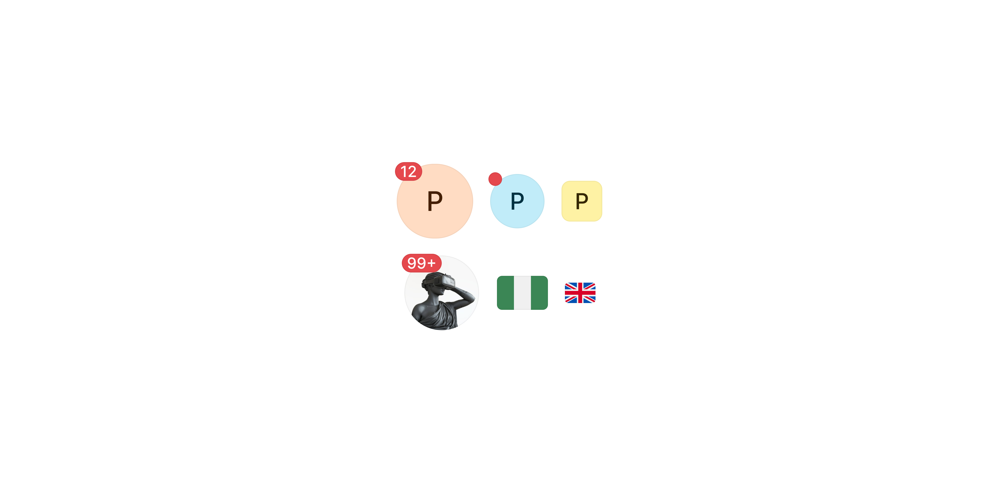

# Avatar

> A visual representation of a person, entity, or placeholder displayed as a circular or square container.

 

[View in Figma →](https://www.figma.com/design/7jCMwDng7HF5g7F3tGXf0E/Open-HR?node-id=674-46801)


---

## Overview

Avatar represents a person or entity across the Open HR interface, in navigation headers, activity feeds, tables, comments, and team lists. It supports initials (with 10 colour options), user photos (plain or with border ring), icon placeholders, and country flags.

Two shapes are available: circular (default) and square. An optional notification badge overlays the top-right corner and scales with avatar size.

**Available in:** React · Next.js · Figma


---

## Anatomy

| Part | Description |
|------|-------------|
| Container | The outer frame. Circular (`border-radius: Spacing/radius/all`) or square (rounded corners). Fixed square dimensions from `12×12px` to `44×44px`. |
| Initials | A single letter (or two characters) displayed when `type="initials"`. Centred in the container. |
| Image | A user photo displayed when `type="image"` or `type="image-border"`. `image-border` adds a visible ring around the image. |
| Icon | A placeholder icon displayed when `type="icon"`. Used when no photo or initials are available. |
| Country flag | A flag displayed when `type="country"`. Only appropriate in sizes `12–20px`. |
| Notification badge | An optional indicator overlaid on the top-right corner. Size scales with the avatar, see Spacing tokens. |

> **Figma note:** In the Figma component, `type` (image, image-border, icon, country) is encoded as part of the `Colour` variant, e.g. `🖼️ Image`, `⬜ Icon`, `⛳ Country`. This is a Figma-side modelling choice and does not affect the React API.


---

## Spacing tokens

### Container sizes

| Size | Dimensions |
|------|------------|
| `12` | `12×12px`  |
| `14` | `14×14px`  |
| `16` | `16×16px`  |
| `18` | `18×18px`  |
| `20` | `20×20px`  |
| `24` | `24×24px`  |
| `32` | `32×32px`  |
| `44` | `44×44px`  |

### Notification badge sizes (from Figma bounding boxes)

| Avatar size | Badge size |
|-------------|------------|
| `44`        | `11×11px`  |
| `32`        | `8×8px`    |
| `24`        | `8×8px`    |
| `20`        | `5×5px`    |
| `18`        | `5×5px`    |

> Badge sizes for `12`, `14`, `16` are not resolved from Figma geometry. <!-- TODO: confirm badge sizes for 12/14/16px avatars -->

**Shape radius:** Circular = `border-radius: Spacing/radius/all`. Square = rounded corners (exact radius depends on size, not resolved from Figma variables). <!-- TODO: confirm square border-radius per size -->


---

## Variants

### Type (content)

| Value | Description | Available sizes |
|-------|-------------|-----------------|
| `initials` | Single letter (or 2 chars) on a solid colour background. 10 colour options. | All sizes       |
| `image` | User photo, fills the container. No ring. | All sizes       |
| `image-border` | User photo with a visible border ring. Use to distinguish avatars from their background. | All sizes       |
| `icon` | Placeholder icon, centred in the container. | All sizes       |
| `country` | Country flag. | `12–20px` only  |

**Fallback chain:** If a photo fails to load, fall back to initials. If initials aren't available (anonymous user), fall back to `icon`. Never show a broken image state.

### Colour (for `type="initials"`)

10 colours available. **Always assign deterministically** using a hash of the user's ID or name, never randomly, so the same person always appears in the same colour across sessions and contexts.

| Value | Figma name |
|-------|------------|
| `green` | 💚 Green   |
| `purple` | 💜 Purple  |
| `aqua` | 🩵 Aqua    |
| `orange` | 🧡 Orange  |
| `yellow` | 💛 Yellow  |
| `blue` | 💙 Blue    |
| `fuchsia` | 🫶 Fuchsia |
| `red` | ❤️ Red     |
| `grey` | 🫶 Grey    |
| `teal` | 🧤Teal     |
| `image with border` | 🖼️ Image with border |
| `image` | 🖼️ Image  |
| `icon` | ◽ Icon     |
| `country` | ⛳ Country  |

### Shape (`circular` / Figma: `Circular`)

| Value | Figma value | Description |
|-------|-------------|-------------|
| `circular` (default) | `yes`       | Fully rounded, `border-radius: Spacing/radius/all` |
| `square` | `no`        | Rounded corners, exact radius per size TBC |

**Convention:** Use `circular` for people; `square` for organisations, teams, or non-person entities. Mixing shapes in the same list signals a semantic difference, don't do it without intent.


---

## States

Avatar is a display-only component, it has no interactive states of its own. When wrapped in a `<button>` or `<a>`, the interactive states belong to the wrapper, not the Avatar.

The only dynamic visual element is the notification badge (`showNotification`), which is either shown or hidden.


---

## Usage guidelines

**Do** use `type="initials"` as the fallback when no photo is available. Initials are more identifiable than a generic icon. **Don't** show a broken image, always implement an `onError` fallback.

**Do** assign avatar colours deterministically from the user's ID/name hash. The same person should always appear in the same colour. **Don't** assign colours randomly, users rely on colour consistency to recognise people they see frequently.

**Do** use `44px` for prominent profile displays (page headers, profile cards). Use `24px` or `32px` for list items, comments, and activity feeds. Use `20px` or smaller for inline text references. **Don't** use `44px` in dense table rows, it inflates row height unnecessarily.

**Do** restrict `type="country"` to sizes `12–20px`. It is not defined in Figma above `20px`. **Don't** render `type="country"` at `24px` or larger.

**Do** use `circular` for people and `square` for organisations/teams. **Don't** mix circular and square in the same list without a semantic reason.

**Do** provide `alt` text for image avatars: the person's name. **Don't** leave `alt=""` when the avatar represents a named, identifiable person.


---

## Content guidelines

* **Initials**, Use 1–2 characters. First letter of first name, or first + last initial for disambiguation. Figma defaults to `"L"`.
* **Image alt**, `alt="[Name]"` e.g. `alt="James O."`. Use `alt=""` only when the name appears in adjacent visible text.
* **Country flag alt**, `alt="[Country] flag"` or the ISO 3166-1 alpha-2 code.
* **Notification badge**, No text. Its presence signals a notification. Announce changes via a separate `aria-live` region (see Accessibility).


---

## Behaviour in context

**Image loading:** Always implement a fallback. If the image fails to load → switch to `type="initials"`. If initials aren't available → switch to `type="icon"`. Wire this up via the `onError` prop.

**Profile links:** Wrap the Avatar in an `<a>` with `aria-label="[Name]'s profile"`. The Avatar itself is `aria-hidden="true"` inside the link, the wrapper carries the accessible name.

**In a table:** Use `20px` or `24px`. Align vertically centred with row text. Set a fixed row height and let the avatar sit centred within it, don't let the avatar drive the row height.

**Notification badge:** The badge overlaps the top-right corner of the container. Ensure the parent provides enough overflow space so the badge isn't clipped. Badge size scales with the avatar (see Spacing tokens).


---

## Accessibility

* **Image avatars**, Always provide `alt` text. Use `alt=""` only when the person's name is already present in adjacent visible text.
* **Initials avatars**, The initials text may not be announced meaningfully by all screen readers. If the avatar is standalone (not inside a labelled link or table row), add `aria-label="[Name]"` on the container.
* **Icon/placeholder avatars**, Add `aria-label="Unknown user"` or `aria-hidden="true"` when context makes the meaning clear.
* **Country flag**, `alt="[Country] flag"` or the ISO code.
* **Notification badge**, Decorative visually. For screen reader announcements, use a separate `aria-live="polite"` region that announces notification count changes.
* **Clickable avatar**, Wrap in a `<button>` or `<a>` with an appropriate `aria-label`. Set `aria-hidden="true"` on the Avatar inside the wrapper, the wrapper carries the accessible name.


---

## Props / API

```ts
interface AvatarProps {
  type?: 'initials' | 'image' | 'image-border' | 'icon' | 'country'
  size?: 12 | 14 | 16 | 18 | 20 | 24 | 32 | 44
  circular?: boolean
  text?: string
  colour?: AvatarColour
  src?: string
  alt?: string
  icon?: ReactNode
  countryCode?: string
  showNotification?: boolean
  onError?: () => void
  'aria-label'?: string
  'aria-hidden'?: boolean | 'true' | 'false'
  className?: string
}

type AvatarColour =
  | 'green' | 'purple' | 'aqua' | 'orange' | 'yellow'
  | 'blue' | 'fuchsia' | 'red' | 'grey' | 'teal'
```

| Prop | Type | Default | Required | Description |
|------|------|---------|----------|-------------|
| `type` | `'initials' \| 'image' \| 'image-border' \| 'icon' \| 'country'` | `'initials'` | No       | Content type. |
| `size` | `12 \| 14 \| 16 \| 18 \| 20 \| 24 \| 32 \| 44` | `12`    | No       | Avatar dimensions in px. |
| `circular` | `boolean` | `true`  | No       | `true` = fully rounded; `false` = square with rounded corners. |
| `text` | `string` | —       | No       | Initials to display when `type="initials"`. 1–2 characters. |
| `colour` | `AvatarColour` | `'green'` | No       | Background colour for `type="initials"`. Assign deterministically from user ID. |
| `src` | `string` | —       | No       | Image URL for `type="image"` or `type="image-border"`. |
| `alt` | `string` | `''`    | No       | Alt text for image. Required when the avatar represents a named person. |
| `icon` | `ReactNode` | —       | No       | Icon component for `type="icon"`. |
| `countryCode` | `string` | —       | No       | ISO 3166-1 alpha-2 code for `type="country"`. Only rendered at sizes ≤ 20px. |
| `showNotification` | `boolean` | `false` | No       | Overlays a notification badge on the top-right. Badge size scales with `size`. |
| `onError` | `() => void` | —       | No       | Fires when the image fails to load. Use to switch to the initials fallback. |
| `aria-label` | `string` | —       | No       | Accessible name for standalone avatars not inside a labelled wrapper. |
| `aria-hidden` | `boolean \| 'true'` | —       | No       | Set `true` when the avatar is decorative inside a labelled link or button. |
| `className` | `string` | —       | No       | Additional CSS class. |


---

## Code examples

### Initials with deterministic colour

```tsx
// Next.js (App Router), Server Component
// No 'use client' directive needed, this component carries no browser state.

// Hash-based colour assignment, same user always gets the same colour
function hashToColour(id: string): AvatarColour {
  const colours: AvatarColour[] = [
    'green', 'purple', 'aqua', 'orange', 'yellow',
    'blue', 'fuchsia', 'red', 'grey', 'teal'
  ]
  const hash = id.split('').reduce((acc, char) => acc + char.charCodeAt(0), 0)
  return colours[hash % colours.length]
}

<Avatar
  type="initials"
  text={user.firstName[0]}
  colour={hashToColour(user.id)}
  size={32}
/>
```

```tsx
// React
// Hash-based colour assignment, same user always gets the same colour
function hashToColour(id: string): AvatarColour {
  const colours: AvatarColour[] = [
    'green', 'purple', 'aqua', 'orange', 'yellow',
    'blue', 'fuchsia', 'red', 'grey', 'teal'
  ]
  const hash = id.split('').reduce((acc, char) => acc + char.charCodeAt(0), 0)
  return colours[hash % colours.length]
}

<Avatar
  type="initials"
  text={user.firstName[0]}
  colour={hashToColour(user.id)}
  size={32}
/>
```

### With image and fallback chain

```tsx
// Next.js (App Router), Client Component
'use client'

function UserAvatar({ user }: { user: User }) {
  const [imageError, setImageError] = useState(false)
  const colour = hashToColour(user.id)

  return (
    <Avatar
      type={imageError || !user.photoUrl ? 'initials' : 'image'}
      src={user.photoUrl}
      text={user.firstName[0]}
      colour={colour}
      alt={user.name}
      size={32}
      onError={() => setImageError(true)}
    />
  )
}
```

```tsx
// React
function UserAvatar({ user }: { user: User }) {
  const [imageError, setImageError] = useState(false)
  const colour = hashToColour(user.id)

  return (
    <Avatar
      type={imageError || !user.photoUrl ? 'initials' : 'image'}
      src={user.photoUrl}
      text={user.firstName[0]}
      colour={colour}
      alt={user.name}
      size={32}
      onError={() => setImageError(true)}
    />
  )
}
```

### Clickable avatar (profile link)

```tsx
// Next.js (App Router), Server Component
// No 'use client' directive needed, this component carries no browser state.

<a href={`/team/${user.id}`} aria-label={`${user.name}'s profile`}>
  <Avatar
    type="initials"
    text={user.firstName[0]}
    colour={hashToColour(user.id)}
    size={32}
    aria-hidden
  />
</a>
```

```tsx
// React
<a href={`/team/${user.id}`} aria-label={`${user.name}'s profile`}>
  <Avatar
    type="initials"
    text={user.firstName[0]}
    colour={hashToColour(user.id)}
    size={32}
    aria-hidden
  />
</a>
```

### With notification badge + live region

```tsx
// Next.js (App Router), Server Component
// No 'use client' directive needed, this component carries no browser state.

<div style={{ position: 'relative', display: 'inline-block' }}>
  <Avatar
    type="image"
    src={user.photoUrl}
    alt={user.name}
    size={44}
    showNotification={unreadCount > 0}
  />
</div>
{/* Screen readers announce changes to this region, not the badge itself */}
<span aria-live="polite" className="sr-only">
  {unreadCount > 0 ? `${unreadCount} unread notifications` : ''}
</span>
```

```tsx
// React
<div style={{ position: 'relative', display: 'inline-block' }}>
  <Avatar
    type="image"
    src={user.photoUrl}
    alt={user.name}
    size={44}
    showNotification={unreadCount > 0}
  />
</div>
{/* Screen readers announce changes to this region, not the badge itself */}
<span aria-live="polite" className="sr-only">
  {unreadCount > 0 ? `${unreadCount} unread notifications` : ''}
</span>
```

### Country flag (inline size only)

```tsx
// Next.js (App Router), Server Component
// No 'use client' directive needed, this component carries no browser state.

<Avatar
  type="country"
  countryCode="NG"
  size={20}
/>
```

```tsx
// React
<Avatar
  type="country"
  countryCode="NG"
  size={20}
/>
```

### In a table row

```tsx
// Next.js (App Router), Server Component
// No 'use client' directive needed, this component carries no browser state.

<td>
  <div style={{ display: 'flex', alignItems: 'center', gap: 8 }}>
    {/* Avatar is decorative, the name cell provides the accessible label */}
    <Avatar
      type="initials"
      text={employee.firstName[0]}
      colour={hashToColour(employee.id)}
      size={24}
      aria-hidden
    />
    <span>{employee.name}</span>
  </div>
</td>
```

```tsx
// React
<td>
  <div style={{ display: 'flex', alignItems: 'center', gap: 8 }}>
    {/* Avatar is decorative, the name cell provides the accessible label */}
    <Avatar
      type="initials"
      text={employee.firstName[0]}
      colour={hashToColour(employee.id)}
      size={24}
      aria-hidden
    />
    <span>{employee.name}</span>
  </div>
</td>
```


---

## Related components

* [Avatar Stack](./Avatar%20Stack.md), Use to display multiple avatars in an overlapping row
* [Avatar Icon](./Avatar%20Icon.md), The internal framing component that wraps icons or small avatars within other components