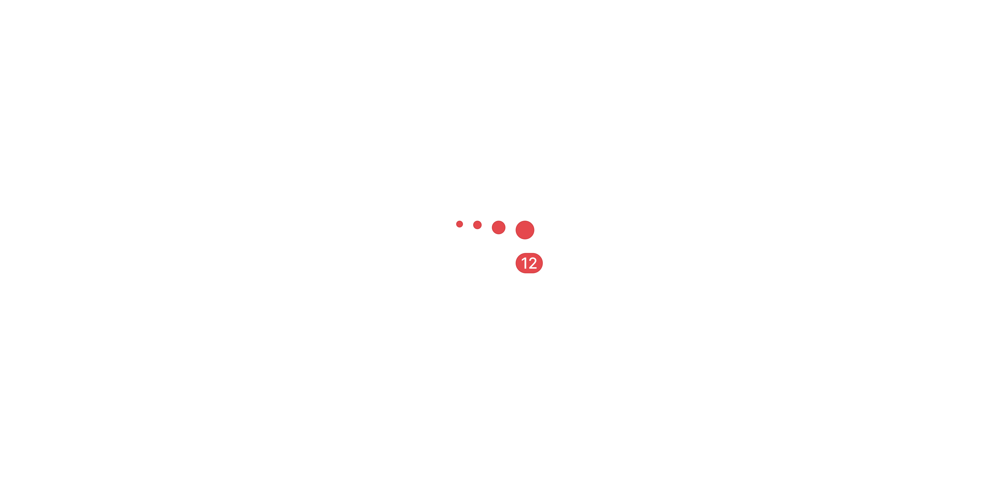

# Notification Badge

> A small red indicator that signals unread activity on an avatar, optionally displaying a numeric count.

 

[View in Figma →](https://www.figma.com/design/7jCMwDng7HF5g7F3tGXf0E/Open-HR?node-id=703-47157)


---

## Overview

Notification Badge is a sub-component used exclusively by [Avatar](./Avatar.md) and [Avatar Pair](/doc/619d3fbb-1eae-4419-855c-9a8abb54814f). It renders as a red dot in four sizes (Small 4px, Medium 5px, Large 8px, xLarge 11px), each scaled to match a specific avatar size. At `xLarge` only, a numeric count (up to `99+`) can be displayed inside the badge.

This component is not used standalone, it is always rendered by Avatar or Avatar Pair via their `showNotification` / `showPrimaryNotification` props. Developers building custom compositions on top of Avatar sub-components may access it directly.

**Available in:** React · Next.js · Figma


---

## Anatomy

| Part | Description |
|------|-------------|
| Badge container | Circular frame for `showNumber=false` (equal width and height). Pill frame for `showNumber=true` at `xLarge` (16×12px). |
| Dot fill | Solid red (`bg/notication`) covering the full container when no number is shown. |
| Count text | White 9px / weight 500 text. Visible only at `size=xLarge` with `showNumber=true`. Truncate to `99+` at 100 and above. |

> **Figma note:** The Figma component is named `.notifications` (leading dot, indicates a sub-component not intended for direct canvas use). The variant axis for number display is `1️⃣  with-number`. Strip the emoji when mapping to the API: `1️⃣  with-number` → `showNumber`.


---

## Spacing tokens

### Dot badge — all sizes (when `showNumber=false`)

| Property | `Small` | `Medium` | `Large` | `xLarge` |
|----------|-------|--------|-------|--------|
| Border radius | `Spacing/radius/sm-7px` | `Spacing/radius/sm-7px` | `Spacing/radius/sm-7px` | `Spacing/radius/sm-7px` |
| Width    | `4px` | `5px`  | `8px` | `11px` |
| Height   | `4px` | `5px`  | `8px` | `11px` |

> Border radius is `7px` across all sizes. For Small and Medium (4–5px) this exceeds half the frame, producing a perfect circle. `border-radius: 50%` is equivalent and simpler to implement.

### Number badge — `xLarge` only (when `showNumber=true`)

| Property | Value | Token |
|----------|-------|-------|
| Border radius | `Spacing/radius/sm-7px` | `Spacing/radius/sm-7px` |
| Padding left / right | `Spacing/padding/xs-3px` | `Spacing/padding/xs-3px` |
| Width    | `16px` | —     |
| Height   | `12px` | —     |
| Font size | `9px` | —     |
| Font weight | `500` | —     |


---

## Avatar size mapping

Notification Badge size is chosen automatically by Avatar based on the avatar's size prop:

| Avatar size | Badge size | Figma variant |
|-------------|------------|---------------|
| `44px`      | `11×11px`  | `xLarge`      |
| `32px`      | `8×8px`    | `Large`       |
| `24px`      | `8×8px`    | `Large`       |
| `20px`      | `5×5px`    | `Medium`      |
| `18px`      | `5×5px`    | `Medium`      |
| `16px`      | `4×4px`    | `Small`       |
| `14px`      | `4×4px`    | `Small`       |
| `12px`      | `4×4px`    | `Small`       |

> Badge sizes for avatars 12–16px are inferred from the `Small` (4×4px) variant, Figma does not explicitly map these avatar sizes to a badge size. <!-- TODO: confirm Small badge assignment for 12/14/16px avatars with design -->


---

## Colour tokens

| Part | Token |
|------|-------|
| Background | `bg/notification` |
| Count text | `text/inverted` |


---

## Variants

### size

Controls the rendered dimensions of the badge dot.

| Value | Dimensions | `showNumber` available? |
|-------|------------|-----------------------|
| `Small` | `4×4px`    | No                    |
| `Medium` | `5×5px`    | No                    |
| `Large` | `8×8px`    | No                    |
| `xLarge` | `11×11px`  | Yes, expands to `16×12px` |

Figma property: `size` · API prop: `size`

### showNumber (`1️⃣  with-number`)

Controls whether the numeric count is displayed. Only meaningful at `size=xLarge`.

| Value | Figma | Dimensions |
|-------|-------|------------|
| Dot only | `no`  | `11×11px`  |
| With count | `yes` | `16×12px`  |

Figma property: `1️⃣  with-number` · API prop: `showNumber`

> `showNumber=true` is only valid at `size=xLarge`. At smaller sizes the badge always renders as a plain dot regardless of `showNumber`.


---

## States

Notification Badge is a display sub-component. It has no interactive states, no hover, focus, active, or disabled. Visibility and count are fully controlled by the parent Avatar's props.


---

## Usage guidelines

**Do:**

* Use a dot badge (`showNumber=false`) when the exact count is not important, the badge signals only that *something* is new.
* Use a count badge (`showNumber=true`, `size=xLarge`) when the number itself is actionable, e.g. "3 unread messages".
* Cap displayed counts at `99` and render `99+` above that.

**Don't:**

* Don't use Notification Badge as a standalone element, always set it via an Avatar's `showNotification` prop.
* Don't show a count at sizes below `xLarge`, a 4–8px dot cannot legibly render a number.
* Don't rely on badge colour alone to communicate meaning, always pair badge presence with an `aria-live` announcement.


---

## Content guidelines

* Count text is white on red, always render a number ≥ 1. Never show `0` inside the badge; hide the badge entirely at zero.
* Truncate to `99+` at 100 and above.
* The badge itself has no label text, all accessible meaning comes from the parent's `aria-live` region.


---

## Behaviour in context

**Positioning:** Notification Badge is positioned at the top-right corner of the Avatar container (offset −1px, −1px so the badge slightly bleeds outside). In [Avatar Pair](/doc/3c3e49e6-1c41-47d5-85ce-57230d3b0cca), the primary badge moves to the top-left corner to avoid overlapping the secondary avatar placed at the bottom-right.

**Overflow:** The −1px bleed means the badge renders outside the parent's bounding box. Ensure parent containers allow `overflow: visible`, do not clip the avatar.

**Count updates:** When the count changes, the badge re-renders in place. Do not animate on every render, only transition when the count value itself changes.


---

## Accessibility

* **Decorative:** The badge visual is decorative for screen readers. Apply `aria-hidden="true"` directly on the badge element.
* **Live region (required on parent):** The parent component must maintain a `role="status"` and `aria-live="polite"` region that announces count changes audibly.
* Do not add an `aria-label` to the badge, screen reader users hear the live region, not the badge.


---

## Props / API

```ts
interface NotificationBadgeProps {
  size: 'Small' | 'Medium' | 'Large' | 'xLarge'
  showNumber?: boolean
  count?: number
  className?: string
  'aria-hidden'?: boolean | 'true' | 'false'
}
```

| Prop | Type | Default | Required | Description |
|------|------|---------|----------|-------------|
| `size` | `'Small' \| 'Medium' \| 'Large' \| 'xLarge'` | —       | **Yes**  | Badge dimensions. Chosen automatically by Avatar based on avatar size. |
| `showNumber` | `boolean` | `false` | No       | Renders the numeric count inside the badge. Only effective at `size=xLarge`. |
| `count` | `number` | —       | No       | Count to display. Rendered as `99+` when ≥ 100. Has no effect when `showNumber=false`. |
| `className` | `string` | —       | No       | Additional CSS class on the badge container. |
| `aria-hidden` | `boolean \| 'true' \| 'false'` | `'true'` | No       | Always `true` when used inside Avatar, the badge is decorative. |


---

## Code examples

Notification Badge is used internally by Avatar and Avatar Pair. These examples show how a composite wires it up, useful if you are building a custom avatar-like component on top of the same sub-components.

```tsx
// Next.js (App Router), Server Component
// No 'use client' directive needed, this component carries no browser state.

{/* As used inside Avatar at size=44 */}
{showNotification && (
  <NotificationBadge
    size="xLarge"
    showNumber={notificationCount !== undefined && notificationCount > 0}
    count={notificationCount}
    aria-hidden="true"
  />
)}
```

```tsx
// React
{/* As used inside Avatar at size=44 */}
{showNotification && (
  <NotificationBadge
    size="xLarge"
    showNumber={notificationCount !== undefined && notificationCount > 0}
    count={notificationCount}
    aria-hidden="true"
  />
)}
```


---

With parent live region (the required accessibility pattern):

```tsx
// Next.js (App Router), Client Component
'use client'

function AvatarWithLiveRegion({
  src,
  name,
  unreadCount,
}: {
  src: string
  name: string
  unreadCount: number
}) {
  return (
    <>
      <Avatar
        type="image"
        src={src}
        size={44}
        showNotification={unreadCount > 0}
        notificationCount={unreadCount}
      />
      <span className="sr-only" role="status" aria-live="polite" aria-atomic="true">
        {unreadCount > 0
          ? `${unreadCount} unread notification${unreadCount === 1 ? '' : 's'} for ${name}`
          : ''}
      </span>
    </>
  )
}
```

```tsx
// React
function AvatarWithLiveRegion({
  src,
  name,
  unreadCount,
}: {
  src: string
  name: string
  unreadCount: number
}) {
  return (
    <>
      <Avatar
        type="image"
        src={src}
        size={44}
        showNotification={unreadCount > 0}
        notificationCount={unreadCount}
      />
      <span className="sr-only" role="status" aria-live="polite" aria-atomic="true">
        {unreadCount > 0
          ? `${unreadCount} unread notification${unreadCount === 1 ? '' : 's'} for ${name}`
          : ''}
      </span>
    </>
  )
}
```


---

## Related components

* [Avatar](./Avatar.md) , primary consumer; selects badge size automatically from avatar size
* [Avatar Pair](./Avatar%20Pair.md) uses both `xLarge` (primary) and `Small` (secondary) badge sizes simultaneously
* [Avatar Stack](./Avatar%20Stack.md) group avatar component; individual members can show badges via their Avatar props