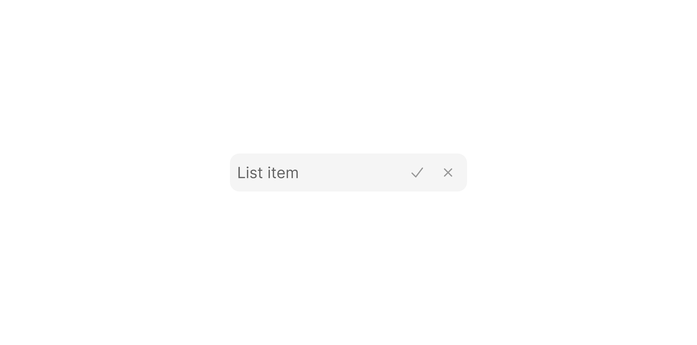

# List Item Button

> A list row with a trailing `24×24px` IconButton that appears on hover or always.

 [View in Figma →](https://www.figma.com/design/7jCMwDng7HF5g7F3tGXf0E/Open-HR?node-id=2336-64697)


---

## Overview

List Item Button adds an action button to the right edge of a list row. The button is a `24×24px` IconButton that can optionally carry a badge counter. Two button slots are supported (`one` or `two`) for layouts that need a single action or a pair. The button can be configured to always show or to reveal only on hover, the hover-reveal pattern keeps the list clean when rows are dense.

Two content types are supported: `tag` (Tag component) or `list-item` (icon + text).

**Available in:** React · Next.js · Figma (`🖱️ List Item/Button ⦿`)


---

## Anatomy

| Part | Description |
|------|-------------|
| Container | `200×32px` pill, `cornerRadius=Spacing/radius/sm-8px`, `paddingLeft=Spacing/padding/sm-6px`, `paddingRight=Spacing/padding/xs-4px`. |
| Content area | [List Item Content](./List%20Item%20Content.md) or [Tag](/doc/e11474c3-95b3-41fc-8819-7a775028b5a9) depending on `type`. |
| IconButton | `24×24px` rounded button. `cornerRadius=Spacing/radius/sm-7px`, `padding=Spacing/padding/xs-5px` top/bottom. Contains a `14×14px` icon with an optional `12×12px` badge counter. |
| Badge counter | `12×12px` pill, `cornerRadius=Spacing/radius/2xl-24px`, brand blue (`color/blue/8`), white text. Shown when the button has a pending count. |


---

## Spacing tokens

| Property | Value | Token |
|----------|-------|-------|
| Padding left | `Spacing/padding/sm-6px` | `Spacing/padding/sm-6px` |
| Padding right | `Spacing/padding/xs-4px` | `Spacing/padding/xs-4px` |
| Gap (content → button) | `Spacing/gap/sm-8px` | `Spacing/gap/sm-8px` |
| Corner radius | `Spacing/radius/sm-8px` | `Spacing/radius/sm-8px` |
| IconButton corner radius | `Spacing/radius/sm-7px` | `Spacing/radius/sm-7px` |
| Width    | `200px` | —     |
| Height   | `32px` | —     |
| Rest background | Transparent | —     |
| Hover background | `color/black/14` | —     |
| IconButton size | `24×24px` | —     |
| IconButton icon size | `14×14px` | —     |
| Badge size | `12×12px` | —     |
| Badge colour | `color/blue/8` | —     |
| Badge text colour | `color/white/white` | —     |


---

## Variants

### Type (`type`)

| Value | Figma value | Content area |
|-------|-------------|--------------|
| `list-item` | `🖱️ List-item` | [List Item Content](./List%20Item%20Content.md), icon + label |
| `tag` | `🏷️ Tag`   | [Tag](/doc/e11474c3-95b3-41fc-8819-7a775028b5a9), coloured label pill |

### Button slot (`button` / Figma: `⦿ Button`)

| Value | Figma value | Description |
|-------|-------------|-------------|
| `one` | `✌️one`     | Single action button on the right |
| `two` | `✌️two`     | Two action buttons stacked/adjacent on the right |

### Always display button (`alwaysShowButton` / Figma: `Always display Button`)

| Value | Figma value | Description |
|-------|-------------|-------------|
| `false` | `no`        | Button is hidden at rest, revealed on hover |
| `true` | `yes`       | Button is always visible regardless of hover state |

### Slot (Figma only: `Slot#2406:1`)

**Figma only, no corresponding React prop.** This SLOT property designates the content area as an injectable slot in Figma, allowing a parent component to swap any instance into this position when composing in the design tool. In code, use the `type` prop (`'list-item'` or `'tag'`) to control the content area instead.

### State (`state`)

| Value | Figma value | Visual change |
|-------|-------------|---------------|
| `rest` | `Rest`      | Transparent background; button hidden (if `alwaysShowButton=false`) |
| `hover` | `Hover`     | `color/black/14` background; button visible |


---

## States

| State | `alwaysShowButton` | Trigger | Visual change |
|-------|------------------|---------|---------------|
| Rest  | `false`          | Default | Transparent background; button present in DOM but `fill=color/non` and `stroke=color/non`, invisible yet occupying layout space |
| Rest  | `true`           | Default | Transparent background; button fully visible |
| Hover | either           | Pointer enters | `color/black/14` background; button becomes visible (if it wasn't already) |

**Layout-stability note:** When `alwaysShowButton=false`, the button is not conditionally rendered, it exists in the DOM but is fully transparent at rest. This prevents the content area from reflowing when the button appears on hover. This is the same pattern used by [Chip Remove Button](/doc/130b50e2-a391-41ac-9727-7ccd8994ea52) in its transparent state. In CSS, set `opacity: 0` (not `display: none`) at rest and `opacity: 1` on hover/focus.

⚠️ **No focus ring is defined in Figma.** When navigated by keyboard, the focused item must show a `2px outline` with `2px offset`. <!-- TODO: confirm focus ring colour with design -->


---

## Usage guidelines

**Do** use `alwaysShowButton=false` (hover-reveal) when the button is a secondary action and you don't want it cluttering every row at a glance, for example, an edit button on a list of team members.

**Do** use `alwaysShowButton=true` when the button is a primary or expected action on every row, for example, a "view details" button in a task list.

**Don't** rely on hover-reveal for touch devices. On touch, there is no hover event. Use `alwaysShowButton=true` or provide an alternative tap target when touch is likely.

**Do** use the badge counter to show pending notifications or unread counts tied to that row item.

**Don't** use two buttons (`button="two"`) unless both actions are frequently needed and contextually related. Prefer a single primary action per row.


---

## Accessibility

* The trailing IconButton must have an `aria-label` describing its action: e.g. `"Edit Victoria Adetunji"`, not just `"Edit"`.
* When the button is hidden at rest (`alwaysShowButton=false`), it must still be reachable by keyboard. Reveal it on focus as well as hover.
* The badge counter must have an accessible label: `aria-label="4 pending"` or include a visually-hidden `<span>`.


---

## Animation

| Trigger | From → To | Transition | Duration | Easing |
|---------|-----------|------------|----------|--------|
| Mouse enter (row) | `Rest` → `Hover` | Dissolve   | `100ms`  | Ease In |
| Mouse enter (inner elements) | → `Hover` | Smart Animate | `100ms`  | Ease In |
| Mouse leave (row) | `Hover` → `Rest` | Smart Animate / Dissolve\* | `100ms`  | Ease Out |
| Hover (inner icon button) | → `hover` | Smart Animate | `150ms`  | Ease Out |

\* Both Smart Animate and Dissolve leave-reactions exist across variants in the file. The hover-reveal of the trailing button is therefore animated via these row-level reactions — `100ms` total.

> **Disabled state:** No transition is defined into or out of `Disabled` in Figma — implement it as an instant swap.


---

## Props / API

```ts
interface ListItemButtonProps {
  type?: 'list-item' | 'tag'
  // type="list-item" props
  mainText?: string
  subText?: string
  subTextAlignment?: 'none' | 'left' | 'right'
  withIcon?: boolean
  iconContainer?: boolean
  icon?: React.ReactNode
  // type="tag" props
  tagLabel?: string
  tagColor?: TagProps['color']
  // button config
  button?: 'one' | 'two'
  buttonIcon?: React.ReactNode
  buttonIcon2?: React.ReactNode
  buttonBadgeCount?: number
  alwaysShowButton?: boolean
  onButtonClick?: React.MouseEventHandler<HTMLButtonElement>
  onButtonClick2?: React.MouseEventHandler<HTMLButtonElement>
  buttonAriaLabel: string        // Required, must describe the action and its target
  buttonAriaLabel2?: string
  // shared
  state?: 'rest' | 'hover'
  onClick?: React.MouseEventHandler<HTMLLIElement>
  className?: string
}
```

| Prop | Type | Default | Required | Description |
|------|------|---------|----------|-------------|
| `type` | `'list-item' \| 'tag'` | `'list-item'` | No       | Content area type |
| `mainText` | `string` | —       | When `type="list-item"` | Primary label |
| `subText` | `string` | —       | No       | Secondary label |
| `subTextAlignment` | `'none' \| 'left' \| 'right'` | `'none'` | No       | Sub-text position |
| `withIcon` | `boolean` | `true`  | No       | Show leading icon |
| `iconContainer` | `boolean` | `false` | No       | Wrap icon in container |
| `icon` | `React.ReactNode` | —       | No       | Leading icon or avatar |
| `tagLabel` | `string` | —       | When `type="tag"` | Tag label text |
| `tagColor` | `TagProps['color']` | `'empty'` | No       | Tag colour theme |
| `button` | `'one' \| 'two'` | `'one'` | No       | Number of trailing buttons. Figma: `⦿ Button` |
| `buttonIcon` | `React.ReactNode` | —       | No       | Icon for the primary trailing button |
| `buttonIcon2` | `React.ReactNode` | —       | When `button="two"` | Icon for the second button |
| `buttonBadgeCount` | `number` | —       | No       | Badge counter on the primary button |
| `alwaysShowButton` | `boolean` | `false` | No       | Show button regardless of hover. Figma: `Always display Button` |
| `onButtonClick` | `React.MouseEventHandler` | —       | No       | Primary button click handler |
| `onButtonClick2` | `React.MouseEventHandler` | —       | No       | Second button click handler |
| `buttonAriaLabel` | `string` | —       | **Yes**  | Accessible label for the primary button |
| `buttonAriaLabel2` | `string` | —       | When `button="two"` | Accessible label for the second button |
| `state` | `'rest' \| 'hover'` | `'rest'` | No       | Visual state |
| `onClick` | `React.MouseEventHandler` | —       | No       | Row click callback |
| `className` | `string` | —       | No       | Additional CSS class |


---

## Code examples

```tsx
// Next.js (App Router), Client Component
'use client'

// Hover-reveal edit button on a people list
{team.map(member => (
  <ListItemButton
    key={member.id}
    type="list-item"
    mainText={member.name}
    subText={member.role}
    subTextAlignment="left"
    withIcon
    iconContainer
    icon={<Avatar src={member.avatar} name={member.name} size="sm" />}
    buttonIcon={<Icon name="pencil" />}
    buttonAriaLabel={`Edit ${member.name}`}
    alwaysShowButton={false}
    onButtonClick={() => openEditModal(member.id)}
  />
))}

// Always-visible button with badge, inbox list
{messages.map(msg => (
  <ListItemButton
    key={msg.id}
    type="list-item"
    mainText={msg.sender}
    subText={msg.preview}
    subTextAlignment="left"
    withIcon
    iconContainer
    icon={<Avatar src={msg.avatar} name={msg.sender} size="sm" />}
    buttonIcon={<Icon name="magnifying-glass" />}
    buttonAriaLabel={`Search messages from ${msg.sender}`}
    buttonBadgeCount={msg.unread > 0 ? msg.unread : undefined}
    alwaysShowButton
    onButtonClick={() => openThread(msg.id)}
  />
))}
```

```tsx
// React
// Hover-reveal edit button on a people list
{team.map(member => (
  <ListItemButton
    key={member.id}
    type="list-item"
    mainText={member.name}
    subText={member.role}
    subTextAlignment="left"
    withIcon
    iconContainer
    icon={<Avatar src={member.avatar} name={member.name} size="sm" />}
    buttonIcon={<Icon name="pencil" />}
    buttonAriaLabel={`Edit ${member.name}`}
    alwaysShowButton={false}
    onButtonClick={() => openEditModal(member.id)}
  />
))}

// Always-visible button with badge
{messages.map(msg => (
  <ListItemButton
    key={msg.id}
    type="list-item"
    mainText={msg.sender}
    subText={msg.preview}
    subTextAlignment="left"
    withIcon
    iconContainer
    icon={<Avatar src={msg.avatar} name={msg.sender} size="sm" />}
    buttonIcon={<Icon name="magnifying-glass" />}
    buttonAriaLabel={`Search messages from ${msg.sender}`}
    buttonBadgeCount={msg.unread > 0 ? msg.unread : undefined}
    alwaysShowButton
    onButtonClick={() => openThread(msg.id)}
  />
))}
```


---

## Related components

* [List Item Default](./List%20Item%20Default.md), base list item, no trailing button
* [List Item With Icon](./List%20Item%20With%20Icon.md), trailing slot is a display icon, not interactive
* [List Item Content](./List%20Item%20Content.md), the inner content sub-component
* [Tag](/doc/e11474c3-95b3-41fc-8819-7a775028b5a9), used as the content area in `type="tag"` mode
* [Icon Button](/doc/6c30d09a-7648-4df4-87ed-846ff9820e40), the trailing action button