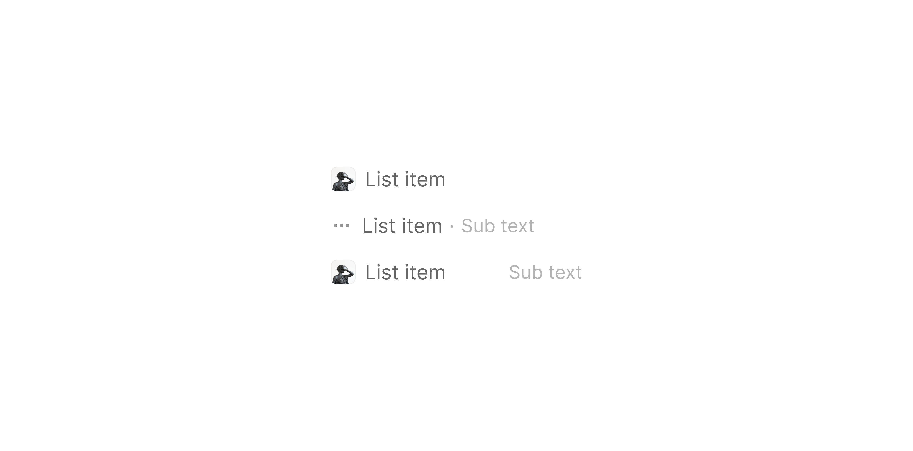

# List Item Content

> The shared sub-component providing the icon + main text + sub-text row used inside every List Item variant.

 [View in Figma →](https://www.figma.com/design/7jCMwDng7HF5g7F3tGXf0E/Open-HR?node-id=1093-25736)


---

## Overview

List Item Content is the inner content block shared by all `🖱️ List Item` variants. It composes a leading icon or avatar, a main text label, and an optional sub-text string into a single horizontal row. Parent list items position this block inside their own padding shell; they do not render content independently.

The icon slot accepts an INSTANCE_SWAP, it can hold a plain `icon`, a country flag [Country Flag](/doc/39f5e2b9-dc6a-4734-9a32-67052302d198), an image (`.image`), or any [Avatars & Icons](/doc/b6fd2dfe-9116-46df-8c83-da04f423dfc9) `avatar/Icon or avatar container` instance. When `iconContainer=yes`, the icon is wrapped in a `24×24px` rounded container with a subtle fill.

**Available in:** React · Next.js · Figma (`🖱️ List Item/.Subcomponents/Content`)


---

## Anatomy

| Part | Description |
|------|-------------|
| Icon wrapper | `14×14px` bare frame (when `iconContainer=no`) or `24×24px` rounded container (when `iconContainer=yes`). Hosts the leading icon INSTANCE_SWAP. |
| Icon container | `24×24px` frame, `cornerRadius=Spacing/radius/sm-7px`, `padding=Spacing/padding/xs-5px` all sides, fill `bg/Transparent/light`. Only present when `iconContainer=yes`. |
| Text container | Horizontal flex row, `gap=Spacing/gap/xs-4px`. Width: `140px` (no container) or `130px` (with container). |
| Main text (`none` mode) | Single text element filling the full text container width. Colour `text/Secondary`. In Figma this layer is named "sub-text", treat it as the primary label. |
| Main text (`left` mode) | First of three inline text nodes. Colour `text/Secondary`. |
| Separator dot | `4px`-wide middle text node, colour `text/light`. **Only present in** `**left**` **alignment**, not in `right`. |
| Sub-text (`left` mode) | Third inline text node. Colour `text/light`. Follows the separator dot. |
| Sub-text (`right` mode) | Second inline text node (no separator). Colour `text/light`. Pushed to the right end of the row. |


---

## Spacing tokens

The overall component width is determined by combining the icon/container width, gap, and text container width. The table below shows the **total component width** for each variant combination.

| Variant | Total width | Height | Icon→text gap |
|---------|-------------|--------|---------------|
| Icon (bare `14px`), no container | `160px`     | `20px` | `Spacing/gap/sm-6px` |
| No icon, no container | `140px`     | `20px` | n/a           |
| Icon, with container (`24px`) | `160px`     | `24px` | `Spacing/gap/sm-6px` |
| No icon, with container | `130px`     | `20px` | n/a           |

**Text container widths:** `140px` when `iconContainer=no`; `130px` when `iconContainer=yes`. The text container shrinks slightly with a container to keep the overall component at a consistent `160px`.

Text container internal gap (between text elements): `Spacing/gap/xs-4px`

Icon container padding: `Spacing/padding/xs-5px` all sides · Corner radius: `Spacing/radius/sm-7px`


---

## Variants

### with-Icon (`withIcon` / Figma: `with-Icon ?`)

| Value | Figma value | Description |
|-------|-------------|-------------|
| `true` | `Yes`       | Leading icon or avatar is rendered |
| `false` | `No`        | No leading icon, text starts at the left edge |

### Icon container (`iconContainer` / Figma: `Icon-container`)

| Value | Figma value | Description |
|-------|-------------|-------------|
| `true` | `Yes`       | Icon is wrapped in a `24×24px` rounded container with `bg/Transparent/light` background |
| `false` | `no`        | Icon renders bare at `14×14px` with no background |

### Sub-text alignment (`subTextAlignment` / Figma: `¶ sub-Text alignment ?`)

| Value | Figma value | Text nodes | Description |
|-------|-------------|------------|-------------|
| `none` | `Non`       | 1, main text only | Single label filling the full text container. The sub-text slot is hidden. |
| `left` | `⬅️ Left`   | 3, main text · separator dot · sub-text | Sub-text follows the separator dot inline after main text. Use for secondary context that reads left-to-right (e.g. "Victoria Adetunji · Engineering"). |
| `right` | `Right ➡️`  | 2, main text + sub-text (no separator dot) | Sub-text is pushed to the far right of the row with no separator. Use when sub-text is a category or count that should sit at the opposite end (e.g. name on left, "5 items" on right). |

**Key difference:** `left` renders a separator dot between the two text nodes; `right` does not. The dot is a Figma text layer, account for this in CSS (`::after` pseudo-element or an explicit element with `aria-hidden`).

### Leading icon (`leadingIcon` / Figma: `Leading Icon#1093:0`)

BOOLEAN property. Controls the visibility of the icon layer. In practice, this overlaps with `with-Icon ?=No`. Use `withIcon={false}` in the API, the `leadingIcon` boolean in Figma maps to this prop.


---

## Icon slot, INSTANCE_SWAP targets

The `icon` slot accepts any of the following:

| Source | Description |
|--------|-------------|
| `icon/*` | Any icon from the Open HR icon library (`14×14px`) |
| `.country` (974-91525) | A `30×20px` country flag. See [Country Flag](/doc/39f5e2b9-dc6a-4734-9a32-67052302d198). |
| `.image` (683-46977) | A `100×100px` sample image (people, company, app logos). Figma-only for prototyping; replace with real `` or `<Avatar>` in code. |
| `avatar/Icon or avatar container` | The standard avatar component |


---

## Usage guidelines

**Do** let the parent list item control padding and state (hover, disabled). This sub-component has no interactive states.

**Don't** use List Item Content standalone, it must be nested inside a List Item variant.

**Do** use `iconContainer=yes` when the icon needs visual separation from the text (e.g. an app logo, an avatar without a built-in shape). Use `iconContainer=no` for line icons that blend naturally.

**Don't** set `iconContainer=yes` with a country flag, flags are `30×20px` and don't fit the `14px` icon slot cleanly. Use bare `iconContainer=no` for flags.


---

## Accessibility

* The main text is the primary accessible label for the list item.
* When a leading icon or avatar is decorative (i.e. the label is already descriptive), render the icon with `aria-hidden="true"`.
* When the icon carries unique meaning (e.g. a flag indicating language), add a visually hidden `<span>` or `aria-label` describing it.
* Sub-text is supplemental, it should not be the only carrier of important information.


---

## Props / API

```ts
interface ListItemContentProps {
  mainText: string
  subText?: string
  subTextAlignment?: 'none' | 'left' | 'right'
  withIcon?: boolean
  iconContainer?: boolean
  icon?: React.ReactNode
  className?: string
}
```

| Prop | Type | Default | Required | Description |
|------|------|---------|----------|-------------|
| `mainText` | `string` | —       | **Yes**  | Primary label text. Figma: `✏️ Main Text` |
| `subText` | `string` | —       | No       | Secondary label. Shown when `subTextAlignment` is not `'none'`. Figma: `✏️ Sub-Text` |
| `subTextAlignment` | `'none' \| 'left' \| 'right'` | `'none'` | No       | Position of sub-text relative to main text. Figma: `¶ sub-Text alignment ?` |
| `withIcon` | `boolean` | `true`  | No       | Render the leading icon slot. Figma: `with-Icon ?` |
| `iconContainer` | `boolean` | `false` | No       | Wrap icon in a `24×24px` rounded container. Figma: `Icon-container` |
| `icon` | `React.ReactNode` | —       | No       | Icon, avatar, or flag element. Figma: INSTANCE_SWAP on `avatar/Icon or avatar container` |
| `className` | `string` | —       | No       | Additional CSS class |


---

## Code examples

```tsx
// Next.js (App Router), Server Component
// No 'use client' directive needed, this component carries no browser state.

// Simple text-only item
<ListItemContent mainText="Edit profile" />

// With inline icon (bare)
<ListItemContent
  mainText="Settings"
  icon={<Icon name="cog" />}
  withIcon
/>

// With container-wrapped icon + sub-text
<ListItemContent
  mainText="Victoria Adetunji"
  subText="Engineering"
  subTextAlignment="left"
  withIcon
  iconContainer
  icon={<Avatar src={user.avatar} name={user.name} size="sm" />}
/>

// With country flag (bare, no container)
<ListItemContent
  mainText="Nigeria"
  withIcon
  icon={<CountryFlag country="Nigeria" />}
/>
```

```tsx
// React
// Simple text-only item
<ListItemContent mainText="Edit profile" />

// With inline icon (bare)
<ListItemContent
  mainText="Settings"
  icon={<Icon name="cog" />}
  withIcon
/>

// With container-wrapped icon + sub-text
<ListItemContent
  mainText="Victoria Adetunji"
  subText="Engineering"
  subTextAlignment="left"
  withIcon
  iconContainer
  icon={<Avatar src={user.avatar} name={user.name} size="sm" />}
/>

// With country flag (bare, no container)
<ListItemContent
  mainText="Nigeria"
  withIcon
  icon={<CountryFlag country="Nigeria" />}
/>
```


---

## Related components

* [List Item Default](./List%20Item%20Default.md), the primary list item that wraps this content
* [List Item Multi-Select](./List%20Item%20Multi-Select.md), list item with checkbox
* [List Item Selected](./List%20Item%20Selected.md), list item with check indicator
* [List Item Button](./List%20Item%20Button.md), list item with trailing action button
* [List Item Toggle](./List%20Item%20Toggle.md), list item with toggle switch
* [Country Flag](/doc/39f5e2b9-dc6a-4734-9a32-67052302d198), flag INSTANCE_SWAP target