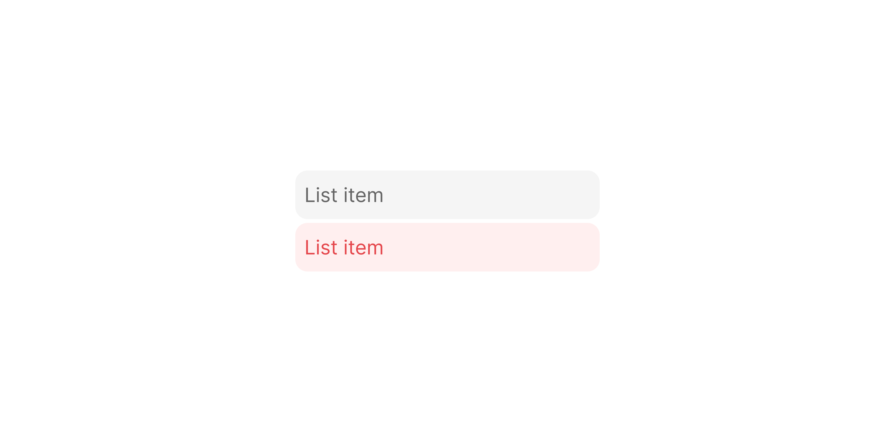

# List Item Default

> The standard dropdown/menu row, a `200×32px` pill with an optional danger variant and three interaction states.

 [View in Figma →](https://www.figma.com/design/7jCMwDng7HF5g7F3tGXf0E/Open-HR?node-id=2313-63615)


---

## Overview

List Item Default is the foundational list row used in dropdowns, command menus, and context menus. It wraps a [List Item Content](./List%20Item%20Content.md) sub-component inside a container and provides hover and disabled states. A `danger` flag switches the hover colour to a destructive red, use it for irreversible actions such as "Delete" or "Remove".

**Available in:** React · Next.js · Figma (`🖱️ List Item/Default 🔲`)

### Choosing a List Item variant

| If you need… | Use |
|--------------|-----|
| A plain clickable row | **List Item Default** (this component) |
| A row with a trailing info/status icon | [List Item With Icon](./List%20Item%20With%20Icon.md) |
| Checkboxes for multi-select | [List Item Multi-Select](./List%20Item%20Multi-Select.md) |
| A check that marks the current selection | [List Item Selected](./List%20Item%20Selected.md) |
| A hover-reveal action button | [List Item Button](./List%20Item%20Button.md) |
| An inline boolean toggle | [List Item Toggle](./List%20Item%20Toggle.md) |
| An address suggestion row | [List Item Location](./List%20Item%20Location.md) |


---

## Anatomy

| Part | Description |
|------|-------------|
| Container | `cornerRadius=Spacing/radius/sm-8px`, `paddingLeft=Spacing/padding/sm-6px`, `paddingRight=Spacing/padding/sm-6px`. Transparent at rest; tinted on hover. |
| Content | [List Item Content](./List%20Item%20Content.md) instance, icon + main text + optional sub-text. |


---

## Spacing tokens

| Property | Value |
|----------|-------|
| Padding left / right | `Spacing/padding/sm-6px` |
| Gap (icon → content) | `Spacing/gap/sm-8px` |
| Corner radius | `Spacing/radius/sm-8px` |
| Width    | `200px` |
| Height   | `32px` |
| Rest background | Transparent |
| Hover background (default) | `bg/Transparent/light` |
| Hover background (danger) | `bg/danger` |


---

## Variants

### Danger (`danger` / Figma: `🔴 Danger`)

| Value | Figma value | Hover colour | When to use |
|-------|-------------|--------------|-------------|
| `false` | `no`        | `bg/Transparent/light`, neutral grey tint | Standard action |
| `true` | `yes`       | `bg/danger`, light red | Destructive / irreversible action (delete, remove, revoke) |

### State (`state`)

| Value | Figma value | Visual change |
|-------|-------------|---------------|
| `rest` | `Rest`      | Transparent background |
| `hover` | `Hover`     | Background tint (see Danger above) |
| `disabled` | `Disabled`  | Reduced opacity; no pointer events |

**Note:** Text and icon colours in the `danger=true, state=rest` variant render in the error/destructive colour (`text/Error`) even at rest, this makes destructive items visually distinct before hover.


---

## States

| State | `danger` | Trigger | Visual change |
|-------|--------|---------|---------------|
| Rest  | `false` | Default | Transparent background; text colour `text/Secondary` |
| Rest  | `true` | Default | Transparent background; **text and icon already render in** `**text/Error**` **(destructive red)**, the danger colour is visible before hover |
| Hover | `false` | Pointer enters | Background `bg/Transparent/light`; text unchanged |
| Hover | `true` | Pointer enters | Background `bg/danger` (light red); text remains `text/Error` |
| Disabled | either | `disabled` prop | Transparent background; reduced opacity; no pointer events |


---

## Usage guidelines

**Do** use `danger=true` only for actions that permanently remove or destroy data. Pair it with a confirmation dialog for the most destructive actions.

**Don't** use `danger=true` as a general warning. If an action is risky but reversible, use `danger=false` and add explanatory sub-text.

**Do** use `disabled` for items that exist in the list but cannot currently be acted on, preserve their position so users understand the option exists.

**Don't** hide disabled items. Showing them (greyed out) with a tooltip explaining why they're unavailable is better than removing them entirely.

**Do** keep the `mainText` label concise, 1–4 words. List items are scanned, not read.


---

## Content guidelines

* Use sentence case: "Edit profile", not "Edit Profile" or "EDIT PROFILE".
* For danger items: be specific, "Delete job posting", not just "Delete".
* Sub-text is for disambiguation (e.g. showing an email alongside a name), don't use it for instructions.


---

## Accessibility

* Render each list item as a `<li>` inside a `<ul role="listbox">` (for dropdowns) or `<ul role="menu">` (for context menus).
* Use `role="option"` (listbox) or `role="menuitem"` (menu) on each item.
* `aria-disabled="true"` for disabled items, keeps them in the tab order for screen readers.
* Danger items: add `aria-label` that clarifies the destructive nature if the label alone is ambiguous.
* Keyboard: `Enter` or `Space` activates; `ArrowUp`/`ArrowDown` navigates.


---

## Animation

| Trigger | From → To | Transition | Duration | Easing |
|---------|-----------|------------|----------|--------|
| Mouse enter | `Rest` → `Hover` | Dissolve   | `100ms`  | Ease In |
| Mouse leave | `Hover` → `Rest` | Dissolve   | `100ms`  | Ease Out (one variant uses Ease In) |

> One of the two leave reactions in the file uses Ease In instead of Ease Out — likely a design-side inconsistency. Flag with design which is intended. <!-- TODO: confirm leave easing with design -->

> **Disabled state:** No transition is defined into or out of `Disabled` in Figma — implement it as an instant swap.


---

## Props / API

```ts
interface ListItemDefaultProps {
  mainText: string
  subText?: string
  subTextAlignment?: 'none' | 'left' | 'right'
  withIcon?: boolean
  iconContainer?: boolean
  icon?: React.ReactNode
  danger?: boolean
  state?: 'rest' | 'hover' | 'disabled'
  disabled?: boolean
  onClick?: React.MouseEventHandler<HTMLLIElement>
  className?: string
}
```

| Prop | Type | Default | Required | Description |
|------|------|---------|----------|-------------|
| `mainText` | `string` | —       | **Yes**  | Primary label. Figma: `✏️ Main Text` on Content |
| `subText` | `string` | —       | No       | Secondary label |
| `subTextAlignment` | `'none' \| 'left' \| 'right'` | `'none'` | No       | Sub-text position |
| `withIcon` | `boolean` | `true`  | No       | Show leading icon |
| `iconContainer` | `boolean` | `false` | No       | Wrap icon in container |
| `icon` | `React.ReactNode` | —       | No       | Leading icon or avatar |
| `danger` | `boolean` | `false` | No       | Destructive variant, red hover. Figma: `🔴 Danger` |
| `state` | `'rest' \| 'hover' \| 'disabled'` | `'rest'` | No       | Visual state. Managed by browser hover, set explicitly only for testing. |
| `disabled` | `boolean` | `false` | No       | Disables the item |
| `onClick` | `React.MouseEventHandler` | —       | No       | Action callback |
| `className` | `string` | —       | No       | Additional CSS class |


---

## Code examples

```tsx
// Next.js (App Router), Client Component
'use client'

// Standard menu item
<ListItemDefault
  mainText="Edit profile"
  icon={<Icon name="pencil" />}
  withIcon
  onClick={() => openEditProfile()}
/>

// With sub-text (role disambiguation)
<ListItemDefault
  mainText="Victoria Adetunji"
  subText="victoria@openhr.com"
  subTextAlignment="left"
  withIcon
  iconContainer
  icon={<Avatar src={user.avatar} name={user.name} size="sm" />}
  onClick={() => selectUser(user.id)}
/>

// Destructive action
<ListItemDefault
  mainText="Delete job posting"
  icon={<Icon name="trash" />}
  withIcon
  danger
  onClick={() => confirmDelete(job.id)}
/>

// Disabled item with explanation via tooltip
<ListItemDefault
  mainText="Archive role"
  icon={<Icon name="archive-box" />}
  withIcon
  disabled
/>
```

```tsx
// React
// Standard menu item
<ListItemDefault
  mainText="Edit profile"
  icon={<Icon name="pencil" />}
  withIcon
  onClick={() => openEditProfile()}
/>

// With sub-text (role disambiguation)
<ListItemDefault
  mainText="Victoria Adetunji"
  subText="victoria@openhr.com"
  subTextAlignment="left"
  withIcon
  iconContainer
  icon={<Avatar src={user.avatar} name={user.name} size="sm" />}
  onClick={() => selectUser(user.id)}
/>

// Destructive action
<ListItemDefault
  mainText="Delete job posting"
  icon={<Icon name="trash" />}
  withIcon
  danger
  onClick={() => confirmDelete(job.id)}
/>

// Disabled item
<ListItemDefault
  mainText="Archive role"
  icon={<Icon name="archive-box" />}
  withIcon
  disabled
/>
```


---

## Related components

* [List Item Content](./List%20Item%20Content.md), the inner content sub-component
* [List Item With Icon](./List%20Item%20With%20Icon.md), adds a trailing icon on the right
* [List Item Multi-Select](./List%20Item%20Multi-Select.md), adds a leading checkbox
* [List Item Selected](./List%20Item%20Selected.md), adds a trailing check when selected
* [List Item Button](./List%20Item%20Button.md), adds a trailing action button
* [List Item Toggle](./List%20Item%20Toggle.md), adds a trailing toggle switch