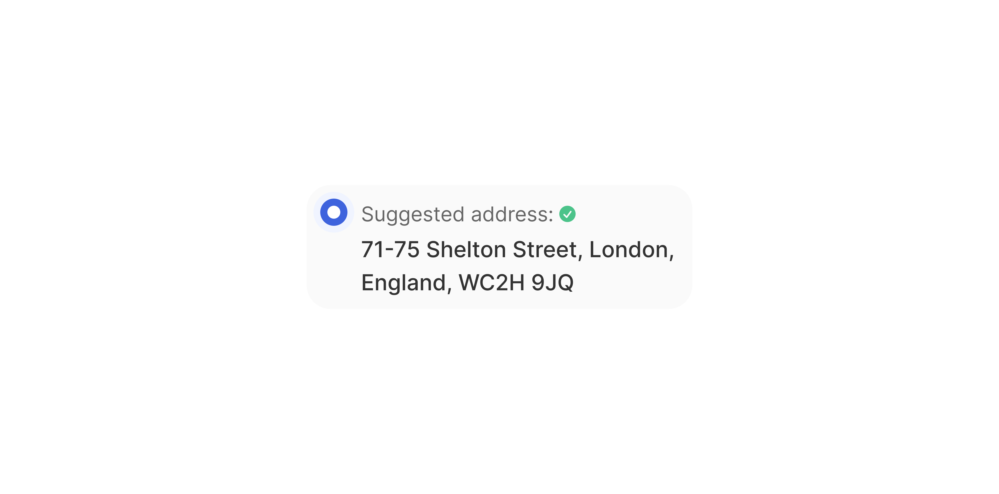

# List Item Location

> A Location/address suggestion row with a radio button, title, address sub-text, and five interaction states.

 [View in Figma →](https://www.figma.com/design/7jCMwDng7HF5g7F3tGXf0E/Open-HR?node-id=2906-32286)


---

## Overview

List Item Location is a specialised list row for address autocomplete dropdowns. It pairs a radio button with a two-line text block (a title line and a full address sub-text) to help users identify and confirm the right address from a list of suggestions. When selected, the radio button fills blue and an optional check-circle icon appears next to the title.

**Available in:** React · Next.js · Figma (`🖱️ List Item/Location 📍`)


---

## Anatomy

| Part | Description |
|------|-------------|
| Container | A semi-rounded card, `cornerRadius=Spacing/radius/xl-14`, `padding=Spacing/padding/xs-4px` all sides, `itemSpacing=Spacing/gap/xs-4px`. |
| Radio button | `24×24px` [Radio Button](/doc/7a2aa4bd-e1ab-46e1-85cc-95b14edaf6d4) (`Selection Controls/🔘Radio Button`) at rest; filled blue (`bg/selection-controls/selected`) when selected. |
| Text container | In a rectangular frame, `paddingTop=Spacing/padding/sm-7px`, `paddingBottom=Spacing/padding/sm-7px`, holding the title row and address text. |
| Title row | Horizontal flex with `itemSpacing=Spacing/gap/xs-2px`. Contains the title text and an optional `12×12px` `icon/check-circle`. |
| Title text | A `Inter/Body/xS/Regular` text, colour `text/Secondary`. Configurable via `✏️ Title` prop. Default: "Suggested Address:" |
| Check-circle icon | A hidden `12×12px` `icon/check-circle`. That's only shown when `showCheckMark=true`. |
| Address text | This is the main text of the list item, it's `Inter/Body/S/Medium` , colour `text/primary`. Configurable via `✏️ Sub-text` prop. |


---

## Spacing tokens

| Property | Value |
|----------|-------|
| Padding (all sides) | `Spacing/padding/xs-4px` |
| Gap (radio → text block) | `Spacing/gap/xs-4px` |
| Corner radius | `Spacing/radius/xl-14` |
| Text container padding top / bottom | `Spacing/padding/sm-7px` |
| Title text colour | `text/Secondary` |
| Address text colour | `text/primary` |
| Radio button size | `24×24px` |
| Radio unselected stroke | `text/Secondary`, `1px` |
| Radio selected fill | `bg/selection-controls/selected` |
| Radio selected dot | `text/inverted`, `8×8px` |
| Check-circle size | `12×12px` |


---

## Variants

### State (`state`)

| Value | Figma value | Visual change |
|-------|-------------|---------------|
| `rest` | `rest`      | Transparent background; radio outlined; check-circle hidden (by default) |
| `hover` | `Hover`     | Background tint; radio outlined |
| `selected` | `Selected`  | Radio filled blue + white centre dot; `showCheckMark` can reveal check-circle |
| `selected-hover` | `Selected-Hover` | Selected state + hover background tint |
| `disabled` | `disabled`  | Reduced opacity; no pointer events |


---

## Boolean props

| Prop | Figma | Default | Description |
|------|-------|---------|-------------|
| `showTitle` | `Show Title #1127:41` | `true`  | Show the title line above the address |
| `showSubtext` | `Show subtext#2809:20` | `true`  | Show the address sub-text |
| `showCheckMark` | `show-check mark#2915:0` | `false` | Show the `icon/check-circle` next to the title in selected states |


---

## States

| State | Trigger | Visual change |
|-------|---------|---------------|
| `rest` | Default | Transparent background; radio outlined (`text/Secondary` stroke, `1px`); check-circle hidden |
| `hover` | Pointer enters row | Background tint, not defined in Figma, apply `bg/Transparent/light` to match other variants; radio still outlined <!-- TODO: confirm hover background with design --> |
| `selected` | `state="selected"` | Radio filled brand blue (`bg/selection-controls/selected`) with white `8×8px` centre dot; `showCheckMark=true` reveals `icon/check-circle` |
| `selected-hover` | Pointer enters a selected row | Selected radio visual + hover background tint |
| `disabled` | `state="disabled"` | Reduced opacity on all content; `pointer-events: none`; radio remains outlined |

Note: the hover state should also be sued as the focus state


---

## Usage guidelines

**Do** use this component in address autocomplete flows where the user must choose from a list of matched suggestions (e.g. Google Places-style dropdowns).

**Don't** use it as a generic radio-button list, use [Radio Button](/doc/7a2aa4bd-e1ab-46e1-85cc-95b14edaf6d4) + a standard list for non-address contexts.

**Do** show `showTitle=true` with a label like "Suggested address:" to frame the suggestion clearly. Hide it (`showTitle=false`) only if the context already makes it obvious this is an address.

**Do** use `showCheckMark=true` in `selected` state to confirm the selection visually alongside the radio fill.

**Don't** truncate the address text, addresses are meaningful in full. If the container is narrow, allow the row to grow or use horizontal scrolling.


---

## Accessibility

* `role="radio"` on each row or wrap in `role="radiogroup"`.
* `aria-checked={state === 'selected' || state === 'selected-hover'}`.
* The title text and address text together form the accessible label for the radio option. Use `aria-label` or `aria-labelledby` to associate them.
* `aria-disabled="true"` for disabled items.
* Keyboard: `Space` selects; `ArrowUp`/`ArrowDown` navigates within the group.


---

## Animation

| Trigger | From → To | Transition | Duration | Easing |
|---------|-----------|------------|----------|--------|
| Mouse enter | `rest` → `Hover` | Smart Animate | `100ms`  | Ease Out |
| Mouse leave | `Hover` → `rest` | Smart Animate | `100ms`  | Ease Out |
| Click (select) | `Hover` → `Selected` | Smart Animate | `100ms`  | Ease Out |
| Mouse enter (selected) | `Selected` → `Selected-Hover` | Smart Animate | `100ms`  | Ease Out |
| Mouse leave (selected) | `Selected-Hover` → `Selected` | Smart Animate | `100ms`  | Ease Out |
| Click (deselect) | `Selected-Hover` → `Hover` | Smart Animate | `100ms`  | Ease Out |
| Inner radio: hover | → `Hover` | Dissolve   | `100ms`  | Ease In |
| Inner radio: click | → `Rest` / `Hover` | Dissolve   | `50ms`   | Ease Out |

> **Disabled state:** No transition is defined into or out of `Disabled` in Figma — implement it as an instant swap.

### Implementation reference

```css
/* Row: Smart Animate 100ms ease-out for all selection/hover transitions */
.list-item-location {
  transition: background-color 100ms ease-out, border-color 100ms ease-out;
}
/* Inner radio: Dissolve — hover 100ms ease-in, click 50ms ease-out */
.list-item-location .radio-control {
  transition: background-color 100ms ease-in, border-color 100ms ease-in;
}
```


---

## Props / API

```ts
interface ListItemLocationProps {
  title?: string
  address: string
  showTitle?: boolean
  showSubtext?: boolean
  showCheckMark?: boolean
  state?: 'rest' | 'hover' | 'selected' | 'selected-hover' | 'disabled'
  disabled?: boolean
  onClick?: React.MouseEventHandler<HTMLDivElement>
  className?: string
}
```

| Prop | Type | Default | Required | Description |
|------|------|---------|----------|-------------|
| `address` | `string` | —       | **Yes**  | The full address string. Figma: `✏️ Sub-text` |
| `title` | `string` | `'Suggested Address:'` | No       | Label above the address. Figma: `✏️ Title` |
| `showTitle` | `boolean` | `true`  | No       | Render the title line. Figma: `Show Title` |
| `showSubtext` | `boolean` | `true`  | No       | Render the address text. Figma: `Show subtext` |
| `showCheckMark` | `boolean` | `false` | No       | Show `icon/check-circle` beside title in selected states. Figma: `show-check mark` |
| `state` | `'rest' \| 'hover' \| 'selected' \| 'selected-hover' \| 'disabled'` | `'rest'` | No       | Visual state. Figma: `State` |
| `disabled` | `boolean` | `false` | No       | Disables the row |
| `onClick` | `React.MouseEventHandler` | —       | No       | Selection callback |
| `className` | `string` | —       | No       | Additional CSS class |


---

## Code examples

```tsx
// Next.js (App Router), Client Component
'use client'

// Address autocomplete suggestion list
const [selectedAddress, setSelectedAddress] = useState<string | null>(null)

<div role="radiogroup" aria-label="Select address">
  {suggestions.map(suggestion => (
    <ListItemLocation
      key={suggestion.placeId}
      title="Suggested address:"
      address={suggestion.formattedAddress}
      state={selectedAddress === suggestion.placeId ? 'selected' : 'rest'}
      showCheckMark={selectedAddress === suggestion.placeId}
      onClick={() => setSelectedAddress(suggestion.placeId)}
    />
  ))}
</div>

// Disabled (service unavailable)
<ListItemLocation
  title="Address lookup"
  address="Service temporarily unavailable"
  state="disabled"
  disabled
/>
```

```tsx
// React
// Address autocomplete suggestion list
const [selectedAddress, setSelectedAddress] = useState<string | null>(null)

<div role="radiogroup" aria-label="Select address">
  {suggestions.map(suggestion => (
    <ListItemLocation
      key={suggestion.placeId}
      title="Suggested address:"
      address={suggestion.formattedAddress}
      state={selectedAddress === suggestion.placeId ? 'selected' : 'rest'}
      showCheckMark={selectedAddress === suggestion.placeId}
      onClick={() => setSelectedAddress(suggestion.placeId)}
    />
  ))}
</div>

// Disabled
<ListItemLocation
  title="Address lookup"
  address="Service temporarily unavailable"
  state="disabled"
  disabled
/>
```


---

## Related components

* [Radio Button](/doc/7a2aa4bd-e1ab-46e1-85cc-95b14edaf6d4), the selection control used inside this component
* [List Item Default](./List%20Item%20Default.md), standard list row for non-address contexts
* [List Item Selected](./List%20Item%20Selected.md), trailing-check selection pattern without radio button