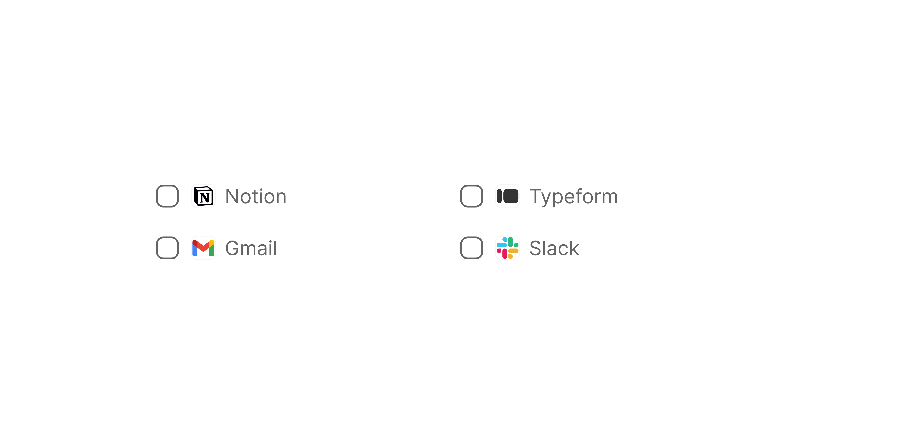

# List Item Multi-Select

> A list row with a leading checkbox for multi-select dropdowns and filter panels.

 [View in Figma →](https://www.figma.com/design/7jCMwDng7HF5g7F3tGXf0E/Open-HR?node-id=1435-25352)


---

## Overview

List Item Multi-Select pairs a checkbox with a content area to support multiple simultaneous selections within a dropdown or filter panel. Two content types are supported: `list-item` (icon + text, as in a standard list) and `tag` (a Tag component showing a coloured label). Use `list-item` for named values and `tag` when the option is already represented as a categorised tag.

**Available in:** React · Next.js · Figma (`🖱️ List Item/Multi-Select ☑️`)


---

## Anatomy

| Part | Description |
|------|-------------|
| Container | `fill×32px` pill, `cornerRadius=Spacing/radius/sm-8px`, `paddingLeft=Spacing/padding/sm-6px`, `paddingRight=Spacing/padding/sm-6px`. |
| Checkbox | [Checkbox](/doc/9a3bc1b5-2db8-4954-9935-147c6105d738) at `15×15px`, `cornerRadius=Spacing/radius/sm-5px`. Blue fill (`bg/selection-controls/selected`) when checked. |
| Content area | [List Item Content](./List%20Item%20Content.md) when `type="list-item"`, or a [Tag](/doc/e11474c3-95b3-41fc-8819-7a775028b5a9) instance when `type="tag"`. |


---

## Spacing tokens

| Property | Value |
|----------|-------|
| Padding left / right | `Spacing/padding/sm-6px` |
| Gap (checkbox → content) | `Spacing/gap/sm-8px` |
| Corner radius | `Spacing/radius/sm-8px` |
| Checkbox corner radius | `Spacing/radius/sm-5px` |
| Width    | `fill` |
| Height   | `32px` |
| Rest background | Transparent |
| Hover background | `bg/Transparent/light` |
| Checkbox size | `15×15px` |
| Checkbox checked colour | `bg/selection-controls/selected` |


---

## Variants

### Type (`type`)

| Value | Figma value | Content area |
|-------|-------------|--------------|
| `list-item` | `🖱️ list-item` | [List Item Content](./List%20Item%20Content.md), icon + label |
| `tag` | `🏷️ Tag`   | [Tag](/doc/e11474c3-95b3-41fc-8819-7a775028b5a9) component, coloured label pill |

### State (`state`)

| Value | Figma value | Visual change |
|-------|-------------|---------------|
| `rest` | `Rest`      | Transparent background |
| `hover` | `Hover`     | `bg/Transparent/light` background |

### Selected (`selected`)

| Value | Figma value | Visual change |
|-------|-------------|---------------|
| `true` | `yes`       | Checkbox filled with brand blue (`bg/selection-controls/selected`), check icon visible |
| `false` | `no`        | Checkbox outlined, unchecked |

### With checkbox (`withCheckbox` / Figma: `✅ with check_box`)

BOOLEAN. Controls whether the checkbox is rendered. Defaults to `true`. Can be set to `false` to show the content row without the checkbox affordance (e.g. in read-only display mode).


---

## States

| State | Trigger | Visual change |
|-------|---------|---------------|
| Rest, unselected | Default, `selected=false` | Transparent background; checkbox outlined (no fill) |
| Rest, selected | `selected=true` | Transparent background; checkbox filled `bg/selection-controls/selected` with white check icon |
| Hover, unselected | Pointer enters, `selected=false` | `bg/Transparent/light` background; checkbox still outlined |
| Hover, selected | Pointer enters, `selected=true` | `bg/Transparent/light` background; checkbox still filled blue |

**Note:** Use the hover state as the `focus state`


---

## Usage guidelines

**Do** use Multi-Select for dropdowns that allow the user to pick multiple values at once (e.g. filtering by multiple departments, selecting multiple assignees).

**Don't** use Multi-Select if only one value can be selected at a time, use [List Item Selected](./List%20Item%20Selected.md) or a radio-based list instead.

**Do** use `type="tag"` when options are already expressed as coloured categories (e.g. selecting multiple status tags for a filter).

**Don't** mix `type="tag"` and `type="list-item"` in the same dropdown list, pick one content type per dropdown.

**Do** persist selection state while the dropdown is open, the user should be able to check and uncheck items before closing.


---

## Accessibility

* Render as a `<ul role="listbox" aria-multiselectable="true">`.
* Each item: `<li role="option" aria-selected={selected}>`.
* The checkbox inside is decorative if the `aria-selected` on the `role="option"` already communicates selection state. Hide the checkbox from the accessibility tree with `aria-hidden="true"` on the checkbox element itself.
* `Enter` or `Space` toggles selection; `ArrowUp`/`ArrowDown` navigates.
* Announce the total selection count in a live region when selection changes: e.g. "3 items selected".


---

## Animation

| Trigger | From → To | Transition | Duration | Easing |
|---------|-----------|------------|----------|--------|
| Mouse enter (row) | `Rest` → `Hover` | Dissolve   | `100ms`  | Ease In |
| Mouse leave (row) | `Hover` → `Rest` | Smart Animate / Dissolve\* | `100ms`  | Ease Out (one variant Ease In) |
| Click (toggle checkbox) | `Hover` → `Hover` (opposite `selected`) | Dissolve   | `100ms`  | Ease In and Out / Ease In\* |
| Hover (inner checkbox) | → `hover` | Smart Animate | `150ms`  | Ease Out |

\* The file mixes transition types and easings across equivalent variants. These inconsistencies exist in Figma as read — confirm the intended single spec with design. <!-- TODO: reconcile mixed easings with design -->

> **Disabled state:** No transition is defined into or out of `Disabled` in Figma — implement it as an instant swap.


---

## Props / API

```ts
interface ListItemMultiSelectProps {
  type?: 'list-item' | 'tag'
  // type="list-item" props
  mainText?: string
  subText?: string
  subTextAlignment?: 'none' | 'left' | 'right'
  withIcon?: boolean
  iconContainer?: boolean
  icon?: React.ReactNode
  // type="tag" props
  tagLabel?: string
  tagColor?: TagProps['color']
  // shared
  selected?: boolean
  withCheckbox?: boolean
  state?: 'rest' | 'hover'
  onChange?: (selected: boolean) => void
  className?: string
}
```

| Prop | Type | Default | Required | Description |
|------|------|---------|----------|-------------|
| `type` | `'list-item' \| 'tag'` | `'list-item'` | No       | Content area type. Figma: `Type` |
| `mainText` | `string` | —       | When `type="list-item"` | Primary label |
| `subText` | `string` | —       | No       | Secondary label |
| `subTextAlignment` | `'none' \| 'left' \| 'right'` | `'none'` | No       | Sub-text position |
| `withIcon` | `boolean` | `true`  | No       | Show leading icon (list-item type) |
| `iconContainer` | `boolean` | `false` | No       | Wrap icon in container |
| `icon` | `React.ReactNode` | —       | No       | Leading icon or avatar |
| `tagLabel` | `string` | —       | When `type="tag"` | Tag label text |
| `tagColor` | `TagProps['color']` | `'empty'` | No       | Tag colour theme |
| `selected` | `boolean` | `false` | No       | Checked / selected state. Figma: `selected` |
| `withCheckbox` | `boolean` | `true`  | No       | Show the checkbox. Figma: `✅ with check_box` |
| `state` | `'rest' \| 'hover'` | `'rest'` | No       | Visual state |
| `onChange` | `(selected: boolean) => void` | —       | No       | Called when selection toggles |
| `className` | `string` | —       | No       | Additional CSS class |


---

## Code examples

```tsx
// Next.js (App Router), Client Component
'use client'

// Multi-select dropdown, named items
const [selected, setSelected] = useState<Set<string>>(new Set())

{departments.map(dept => (
  <ListItemMultiSelect
    key={dept.id}
    type="list-item"
    mainText={dept.name}
    icon={<Icon name="building-office" />}
    withIcon
    selected={selected.has(dept.id)}
    onChange={(checked) => {
      setSelected(prev => {
        const next = new Set(prev)
        checked ? next.add(dept.id) : next.delete(dept.id)
        return next
      })
    }}
  />
))}

// Multi-select with tag content
{statusOptions.map(status => (
  <ListItemMultiSelect
    key={status.value}
    type="tag"
    tagLabel={status.label}
    tagColor={status.color}
    selected={selectedStatuses.has(status.value)}
    onChange={(checked) => toggleStatus(status.value, checked)}
  />
))}
```

```tsx
// React
// Multi-select dropdown, named items
const [selected, setSelected] = useState<Set<string>>(new Set())

{departments.map(dept => (
  <ListItemMultiSelect
    key={dept.id}
    type="list-item"
    mainText={dept.name}
    icon={<Icon name="building-office" />}
    withIcon
    selected={selected.has(dept.id)}
    onChange={(checked) => {
      setSelected(prev => {
        const next = new Set(prev)
        checked ? next.add(dept.id) : next.delete(dept.id)
        return next
      })
    }}
  />
))}

// Multi-select with tag content
{statusOptions.map(status => (
  <ListItemMultiSelect
    key={status.value}
    type="tag"
    tagLabel={status.label}
    tagColor={status.color}
    selected={selectedStatuses.has(status.value)}
    onChange={(checked) => toggleStatus(status.value, checked)}
  />
))}
```


---

## Related components

* [List Item Content](./List%20Item%20Content.md), the inner content sub-component for `type="list-item"`
* [Tag](/doc/e11474c3-95b3-41fc-8819-7a775028b5a9), the coloured label used for `type="tag"`
* [Checkbox](/doc/9a3bc1b5-2db8-4954-9935-147c6105d738), the selection control rendered at the left
* [List Item Selected](./List%20Item%20Selected.md), single-select version with trailing checkmark (no checkbox)
* [List Item Default](./List%20Item%20Default.md), base list item without selection controls