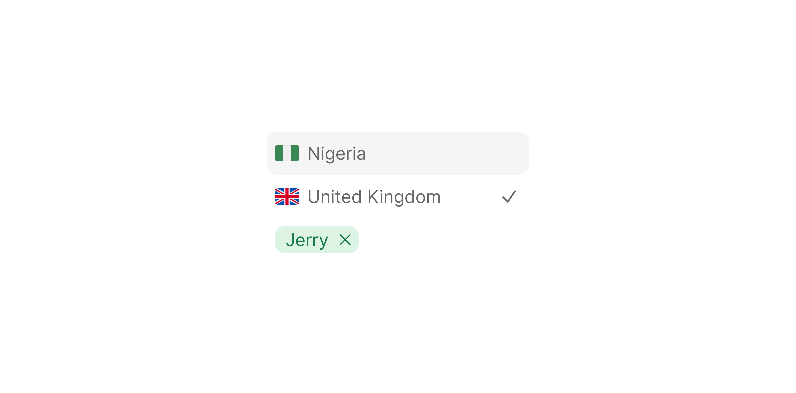

# List Item Selected

> A `200×32px` list row that shows a trailing check icon when the item is the active selection.

 [View in Figma →](https://www.figma.com/design/7jCMwDng7HF5g7F3tGXf0E/Open-HR?node-id=2336-64258)


---

## Overview

List Item Selected is used in single-select dropdowns where the currently chosen option must be visually distinguished from the rest of the list. When `selected=true`, a `14×14px` check icon (`text/Secondary`) appears at the right edge. No checkbox is used, the trailing check is the sole indicator of active selection.

Two content types are supported: `list-item` (text + icon) and `tag` (a coloured Tag component).

**Available in:** React · Next.js · Figma (`🖱️ List Item/Selected ✅`)


---

## Anatomy

| Part | Description |
|------|-------------|
| Container | `200×32px` pill, `cornerRadius=Spacing/radius/sm-8px`, `paddingLeft=Spacing/padding/sm-6px`, `paddingRight=Spacing/padding/sm-8px`. |
| Content area | [List Item Content](./List%20Item%20Content.md) or [Tag](/doc/e11474c3-95b3-41fc-8819-7a775028b5a9) depending on `type`. |
| Trailing check | `14×14px` `icon/check` in `text/Secondary`. Only rendered when `selected=true`. |


---

## Spacing tokens

| Property | Value | Token |
|----------|-------|-------|
| Padding left | `Spacing/padding/sm-6px` | `Spacing/padding/sm-6px` |
| Padding right | `Spacing/padding/sm-8px` | `Spacing/padding/sm-8px` |
| Gap (content → check icon) | `Spacing/gap/sm-8px` | `Spacing/gap/sm-8px` |
| Corner radius | `Spacing/radius/sm-8px` | `Spacing/radius/sm-8px` |
| Width    | `200px` | —     |
| Height   | `32px` | —     |
| Rest background | Transparent | —     |
| Hover background | `bg/Transparent/light` | —     |
| Check icon size | `14×14px` | —     |
| Check icon colour | `text/Secondary` | —     |


---

## Variants

### Type (`type`)

| Value | Figma value | Content area |
|-------|-------------|--------------|
| `list-item` | `🖱️ List-item` | [List Item Content](./List%20Item%20Content.md), icon + label |
| `tag` | `🏷️ Tag`   | [Tag](/doc/e11474c3-95b3-41fc-8819-7a775028b5a9), coloured label pill |

### State (`state`)

| Value | Figma value | Visual change |
|-------|-------------|---------------|
| `rest` | `Rest`      | Transparent background |
| `hover` | `Hover`     | `bg/Transparent/light` background |

### Selected (`selected`)

| Value | Figma value | Trailing check |
|-------|-------------|----------------|
| `true` | `yes`       | `icon/check` visible at right edge |
| `false` | `no`        | No trailing icon, right edge is empty |


---

## States

| State | `selected` | Trigger | Visual change |
|-------|----------|---------|---------------|
| Rest, unselected | `false`  | Default | Transparent background; no trailing icon |
| Rest, selected | `true`   | Default | Transparent background; `icon/check` (`text/Secondary`) appears at right edge |
| Hover, unselected | `false`  | Pointer enters | `bg/Transparent/light` background; no trailing icon |
| Hover, selected | `true`   | Pointer enters | `bg/Transparent/light` background; check icon remains visible |

**Note:** There is no `disabled` state variant defined in Figma for this component. To disable a specific option, apply `aria-disabled="true"` and CSS `pointer-events: none; opacity: 0.4` on the wrapper element.

⚠️ **No focus ring is defined in Figma.** When navigated by keyboard, the focused item must show a `2px outline` with `2px offset`. <!-- TODO: confirm focus ring colour with design -->


---

## Usage guidelines

**Do** use List Item Selected in single-select dropdowns where the user needs to see which option is currently active before interacting.

**Don't** use this for multi-select, use [List Item Multi-Select](./List%20Item%20Multi-Select.md) instead.

**Do** always set `selected=true` on the item that matches the current field value when the dropdown opens. Users expect to find the active selection instantly.

**Don't** remove the unselected items or reorder them, preserving list order reduces cognitive load.

**Do** place the selected item at the top of the list (or highlight it in-place). If you choose in-place highlighting, ensure it's visible without scrolling.


---

## Accessibility

* `role="listbox"` on the container; `role="option"` on each item.
* `aria-selected="true"` on the currently selected item.
* The check icon must be `aria-hidden="true"`, `aria-selected` already communicates selection state to screen readers.
* `aria-activedescendant` on the trigger button pointing to the currently selected item's id.


---

## Animation

| Trigger | From → To | Transition | Duration | Easing |
|---------|-----------|------------|----------|--------|
| Mouse enter (row) | `Rest` → `Hover` | Dissolve   | `100ms`  | Ease In |
| Mouse leave (row) | `Hover` → `Rest` | Smart Animate / Dissolve\* | `100ms`  | Ease Out (one variant Ease In) |
| Click (toggle selection) | `Hover` → `Hover` (opposite `selected`) | Dissolve   | `100ms`  | Ease In and Out / Ease In\* |
| Hover (inner element) | → `hover` | Smart Animate | `150ms`  | Ease Out |

\* The file mixes transition types and easings across equivalent variants (Smart Animate vs Dissolve on leave; Ease In and Out vs Ease In on click). These inconsistencies exist in Figma as read — confirm the intended single spec with design. <!-- TODO: reconcile mixed easings with design -->

> **Disabled state:** No transition is defined into or out of `Disabled` in Figma — implement it as an instant swap.


---

## Props / API

```ts
interface ListItemSelectedProps {
  type?: 'list-item' | 'tag'
  // type="list-item" props
  mainText?: string
  subText?: string
  subTextAlignment?: 'none' | 'left' | 'right'
  withIcon?: boolean
  iconContainer?: boolean
  icon?: React.ReactNode
  // type="tag" props
  tagLabel?: string
  tagColor?: TagProps['color']
  // shared
  selected?: boolean
  state?: 'rest' | 'hover'
  onClick?: React.MouseEventHandler<HTMLLIElement>
  className?: string
}
```

| Prop | Type | Default | Required | Description |
|------|------|---------|----------|-------------|
| `type` | `'list-item' \| 'tag'` | `'list-item'` | No       | Content area type. Figma: `Type` |
| `mainText` | `string` | —       | When `type="list-item"` | Primary label |
| `subText` | `string` | —       | No       | Secondary label |
| `subTextAlignment` | `'none' \| 'left' \| 'right'` | `'none'` | No       | Sub-text position |
| `withIcon` | `boolean` | `true`  | No       | Show leading icon |
| `iconContainer` | `boolean` | `false` | No       | Wrap icon in container |
| `icon` | `React.ReactNode` | —       | No       | Leading icon or avatar |
| `tagLabel` | `string` | —       | When `type="tag"` | Tag label text |
| `tagColor` | `TagProps['color']` | `'empty'` | No       | Tag colour theme |
| `selected` | `boolean` | `false` | No       | Shows trailing check icon. Figma: `selected` |
| `state` | `'rest' \| 'hover'` | `'rest'` | No       | Visual state |
| `onClick` | `React.MouseEventHandler` | —       | No       | Selection callback |
| `className` | `string` | —       | No       | Additional CSS class |


---

## Code examples

```tsx
// Next.js (App Router), Client Component
'use client'

// Single-select dropdown
<ul role="listbox" aria-label="Select department">
  {departments.map(dept => (
    <ListItemSelected
      key={dept.id}
      type="list-item"
      mainText={dept.name}
      icon={<Icon name="building-office" />}
      withIcon
      selected={dept.id === selectedDeptId}
      onClick={() => setSelectedDeptId(dept.id)}
    />
  ))}
</ul>

// Tag-type single-select (e.g. job status picker)
<ul role="listbox" aria-label="Select status">
  {statusOptions.map(status => (
    <ListItemSelected
      key={status.value}
      type="tag"
      tagLabel={status.label}
      tagColor={status.color}
      selected={status.value === currentStatus}
      onClick={() => setStatus(status.value)}
    />
  ))}
</ul>
```

```tsx
// React
// Single-select dropdown
<ul role="listbox" aria-label="Select department">
  {departments.map(dept => (
    <ListItemSelected
      key={dept.id}
      type="list-item"
      mainText={dept.name}
      icon={<Icon name="building-office" />}
      withIcon
      selected={dept.id === selectedDeptId}
      onClick={() => setSelectedDeptId(dept.id)}
    />
  ))}
</ul>

// Tag-type single-select
{statusOptions.map(status => (
  <ListItemSelected
    key={status.value}
    type="tag"
    tagLabel={status.label}
    tagColor={status.color}
    selected={status.value === currentStatus}
    onClick={() => setStatus(status.value)}
  />
))}
```


---

## Related components

* [List Item Multi-Select](./List%20Item%20Multi-Select.md), checkbox-based multi-select variant
* [List Item Default](./List%20Item%20Default.md), base list item with no selection indicator
* [List Item Content](./List%20Item%20Content.md), the inner content sub-component
* [Tag](/doc/e11474c3-95b3-41fc-8819-7a775028b5a9), used as the content area in `type="tag"` mode