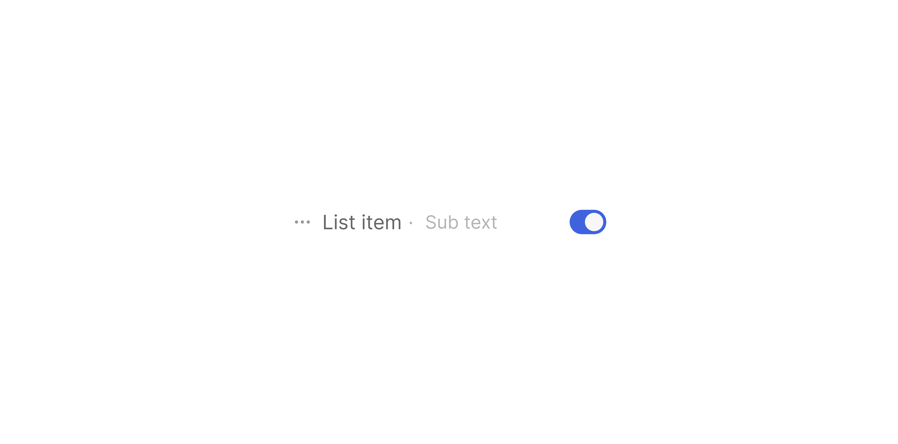

# List Item Toggle

> A `214×32px` list row with a trailing toggle switch for in-list setting controls.

 [View in Figma →](https://www.figma.com/design/7jCMwDng7HF5g7F3tGXf0E/Open-HR?node-id=1286-41575)


---

## Overview

List Item Toggle combines a [List Item Content](./List%20Item%20Content.md) label with a trailing [Toggle](/doc/3120cb7f-68db-4dd4-a193-2d5b7b1882a0) switch. It is used when a boolean setting or preference must be exposed inside a drop-down or settings list, for example, toggling notifications, enabling a feature flag, or switching a preference on/off without navigating to a separate settings page.

Unlike other list item variants, this is a **single-state component** in Figma, it has no Rest/Hover/Disabled variant set. Hover and disabled states are handled via the Toggle component itself and CSS.

**Available in:** React · Next.js · Figma (`🖱️ List Item/Toggle 🔁`)


---

## Anatomy

| Part | Description |
|------|-------------|
| Container | `214×32px` frame, `paddingLeft=Spacing/padding/xs-4px`, `paddingRight=Spacing/padding/xs-4px`, `itemSpacing=Spacing/gap/lg-10px`. No corner radius on the outer frame, inherits from the parent list container. |
| Content | [List Item Content](./List%20Item%20Content.md) at `160×20px`. Icon + label. |
| Toggle | [Toggle](/doc/3120cb7f-68db-4dd4-a193-2d5b7b1882a0) at `24×16px` (`Selection Controls/🔁Toggle`). Aligned to the right edge. |


---

## Spacing tokens

| Property | Value | Token |
|----------|-------|-------|
| Padding left / right | `Spacing/padding/xs-4px` | `Spacing/padding/xs-4px` |
| Gap (content → toggle) | `Spacing/gap/lg-10px` | `Spacing/gap/lg-10px` |
| Width    | `214px` | —     |
| Height   | `32px` | —     |
| Content width | `160px` | —     |
| Toggle size | `24×16px` | —     |


---

## Variants

This component is a **single-state COMPONENT** in Figma (node type: `COMPONENT`, not `COMPONENT_SET`). There are no variant axes, no State, Danger, Type, or Selected properties. All visual variation is driven by props passed to the inner [Toggle](/doc/3120cb7f-68db-4dd4-a193-2d5b7b1882a0) sub-component.


---

## States

This component is a **single-state COMPONENT** in Figma, there is no Rest/Hover/Disabled variant set on the outer row itself.

| State | Trigger | Visual change |
|-------|---------|---------------|
| Rest  | Default | Transparent background; toggle in its current checked/unchecked state |
| Hover | Pointer enters row | Apply `bg/Transparent/light` background via CSS, not defined in Figma |
| Disabled | `disabled` prop | Delegate to the [Toggle](/doc/3120cb7f-68db-4dd4-a193-2d5b7b1882a0) component's own disabled state; apply `pointer-events: none; opacity: 0.4` to the row |


---

## Usage guidelines

**Do** use this variant when the user needs to change a binary setting inline, without leaving the current context.

**Don't** use this for navigation, if toggling the switch should take the user elsewhere, use a standard [List Item Default](./List%20Item%20Default.md) row instead.

**Do** show the current state of the toggle when the list opens. Users expect settings lists to reflect reality, not always default to off.

**Don't** put critical toggles (e.g. "Delete all data") inside a casual dropdown. Reserve in-list toggles for lightweight preference controls.

**Do** use a clear, imperative label: "Show salary band", "Email notifications", not "Salary band" or "Notifications enabled/disabled".


---

## Accessibility

* The entire row should not be a click target that toggles the switch, only the toggle itself should be interactive. The label area (`mainText`) should be associated with the toggle via `htmlFor` or `aria-labelledby`.
* The [Toggle](/doc/3120cb7f-68db-4dd4-a193-2d5b7b1882a0) component handles its own `role="switch"` and `aria-checked`, ensure it receives the correct `checked` prop.
* If the row is inside a `<ul role="menu">`, the toggle is a `menuitemcheckbox` (`role="menuitemcheckbox" aria-checked={checked}`).


---

## Props / API

```ts
interface ListItemToggleProps {
  mainText: string
  subText?: string
  subTextAlignment?: 'none' | 'left' | 'right'
  withIcon?: boolean
  iconContainer?: boolean
  icon?: React.ReactNode
  checked?: boolean
  onChange?: (checked: boolean) => void
  disabled?: boolean
  className?: string
}
```

| Prop | Type | Default | Required | Description |
|------|------|---------|----------|-------------|
| `mainText` | `string` | —       | **Yes**  | Label for the toggle row |
| `subText` | `string` | —       | No       | Secondary label |
| `subTextAlignment` | `'none' \| 'left' \| 'right'` | `'none'` | No       | Sub-text position |
| `withIcon` | `boolean` | `true`  | No       | Show leading icon |
| `iconContainer` | `boolean` | `false` | No       | Wrap icon in container |
| `icon` | `React.ReactNode` | —       | No       | Leading icon |
| `checked` | `boolean` | `false` | No       | Toggle on/off state |
| `onChange` | `(checked: boolean) => void` | —       | No       | Called when the toggle is flipped |
| `disabled` | `boolean` | `false` | No       | Disables the toggle |
| `className` | `string` | —       | No       | Additional CSS class |


---

## Code examples

```tsx
// Next.js (App Router), Client Component
'use client'

// Settings dropdown with toggle items
const [emailNotifs, setEmailNotifs] = useState(true)
const [slackNotifs, setSlackNotifs] = useState(false)

<ListItemToggle
  mainText="Email notifications"
  icon={<Icon name="envelope" />}
  withIcon
  checked={emailNotifs}
  onChange={setEmailNotifs}
/>

<ListItemToggle
  mainText="Slack notifications"
  icon={<Icon name="chat-bubble-left" />}
  withIcon
  checked={slackNotifs}
  onChange={setSlackNotifs}
/>

// Disabled toggle, feature not available on current plan
<ListItemToggle
  mainText="Advanced analytics"
  icon={<Icon name="chart-bar" />}
  withIcon
  checked={false}
  disabled
/>
```

```tsx
// React
// Settings dropdown with toggle items
const [emailNotifs, setEmailNotifs] = useState(true)
const [slackNotifs, setSlackNotifs] = useState(false)

<ListItemToggle
  mainText="Email notifications"
  icon={<Icon name="envelope" />}
  withIcon
  checked={emailNotifs}
  onChange={setEmailNotifs}
/>

<ListItemToggle
  mainText="Slack notifications"
  icon={<Icon name="chat-bubble-left" />}
  withIcon
  checked={slackNotifs}
  onChange={setSlackNotifs}
/>

// Disabled toggle
<ListItemToggle
  mainText="Advanced analytics"
  icon={<Icon name="chart-bar" />}
  withIcon
  checked={false}
  disabled
/>
```


---

## Related components

* [Toggle](/doc/3120cb7f-68db-4dd4-a193-2d5b7b1882a0), the standalone toggle switch component
* [List Item Content](./List%20Item%20Content.md), the inner content sub-component
* [List Item Default](./List%20Item%20Default.md), base list item without toggle