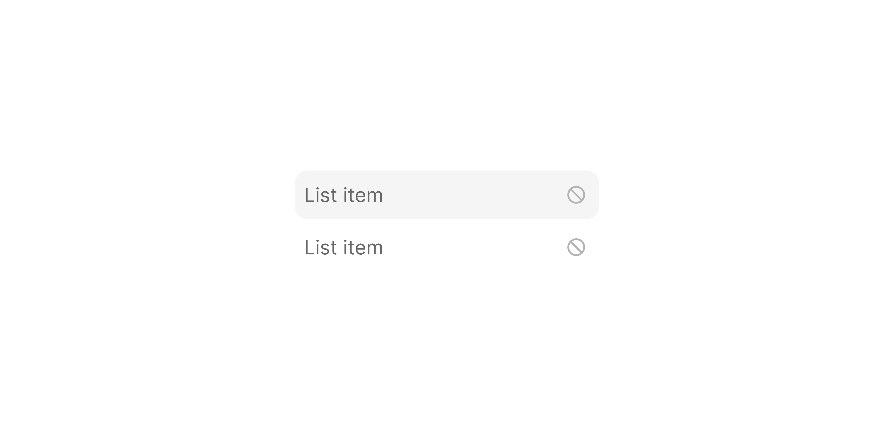

# List Item With Icon

> A list row that adds a trailing `14×14px` informational icon on the right edge.

 [View in Figma →](https://www.figma.com/design/7jCMwDng7HF5g7F3tGXf0E/Open-HR?node-id=2336-64045)


---

## Overview

List Item With Icon extends [List Item Default](./List%20Item%20Default.md) by adding a trailing icon at the right edge of the row. This icon communicates metadata about the item, for example, a lock icon to indicate a restricted option, a link icon to show the item opens a new page, or a no-symbol to indicate something is unavailable. It is always visible (not hover-reveal).

This variant has no `danger` mode, use [List Item Default](./List%20Item%20Default.md) with `danger=true` for destructive actions.

**Available in:** React · Next.js · Figma (`🖱️ List Item/with Icon ℹ️`)


---

## Anatomy

| Part | Description |
|------|-------------|
| Container | `cornerRadius=Spacing/radius/sm-8px`, `paddingLeft=Spacing/padding/sm-6px`, `paddingRight=Spacing/padding/sm-8px`. |
| Content | [List Item Content](./List%20Item%20Content.md), leading icon + main text. |
| Trailing icon | `14×14px` icon at the right edge. Default: `icon/no-symbol` (grey, `color/light-grey/7`). Swappable for any icon. |


---

## Spacing tokens

| Property | Value |
|----------|-------|
| Padding left | `Spacing/padding/sm-6px` |
| Padding right | `Spacing/padding/sm-8px` |
| Gap (content → trailing icon) | `Spacing/gap/sm-8px` |
| Corner radius | `Spacing/radius/sm-8px` |
| Width    | Fill  |
| Height   | `32px` |
| Rest background | Transparent |
| Hover background | `color/black/14` |
| Trailing icon size | `14×14px` |
| Trailing icon colour (default) | `color/light-grey/7` |


---

## Variants

### State (`state`)

| Value | Figma value | Description |
|-------|-------------|-------------|
| `rest` | `Rest`      | Default state |
| `hover` | `Hover`     | Pointer is over the row |
| `disabled` | `Disabled`  | Row is not interactive |


---

## States

| State | Trigger | Visual change |
|-------|---------|---------------|
| Rest  | Default | Transparent background; trailing icon always visible |
| Hover | Pointer enters container | `color/black/14` background tint; trailing icon unchanged |
| Disabled | `disabled` prop | Transparent background; reduced opacity on all content; no pointer events |


---

## Usage guidelines

**Do** use the trailing icon to communicate status or action type, not just for decoration. Every trailing icon should have an accessible `aria-label` or be paired with visible text.

**Don't** use a trailing icon to indicate the item is clickable, all list items are already expected to be interactive. Use it for additional meaning only.

**Do** use `icon/no-symbol` (the default) when an option is available but with restrictions not yet visible to the user, it signals "this exists but isn't always available".

**Don't** use this variant as a replacement for [List Item Selected](./List%20Item%20Selected.md), that variant is for showing a selected/chosen state, not metadata.


---

## Accessibility

* The trailing icon must be `aria-hidden="true"` if its meaning is already conveyed by the label.
* If the trailing icon carries unique meaning not in the label, add a visually hidden `<span>` or `title` attribute.
* `aria-disabled="true"` on disabled items.


---

## Animation

| Trigger | From → To | Transition | Duration | Easing |
|---------|-----------|------------|----------|--------|
| Mouse enter | `Rest` → `Hover` | Dissolve   | `100ms`  | Ease In |
| Mouse leave | `Hover` → `Rest` | Dissolve   | `100ms`  | Ease In |

> The leave easing is Ease In in the file (where sibling list items use Ease Out) — likely a design-side inconsistency. <!-- TODO: confirm leave easing with design -->

> **Disabled state:** No transition is defined into or out of `Disabled` in Figma — implement it as an instant swap.


---

## Props / API

```ts
interface ListItemWithIconProps {
  mainText: string
  subText?: string
  subTextAlignment?: 'none' | 'left' | 'right'
  withIcon?: boolean
  iconContainer?: boolean
  icon?: React.ReactNode
  trailingIcon?: React.ReactNode
  state?: 'rest' | 'hover' | 'disabled'
  disabled?: boolean
  onClick?: React.MouseEventHandler<HTMLLIElement>
  className?: string
}
```

| Prop | Type | Default | Required | Description |
|------|------|---------|----------|-------------|
| `mainText` | `string` | —       | **Yes**  | Primary label |
| `subText` | `string` | —       | No       | Secondary label |
| `subTextAlignment` | `'none' \| 'left' \| 'right'` | `'none'` | No       | Sub-text position |
| `withIcon` | `boolean` | `true`  | No       | Show leading icon |
| `iconContainer` | `boolean` | `false` | No       | Wrap leading icon in container |
| `icon` | `React.ReactNode` | —       | No       | Leading icon or avatar |
| `trailingIcon` | `React.ReactNode` | `<Icon name="no-symbol" />` | No       | Right-edge icon. Defaults to `icon/no-symbol`. Figma: trailing icon instance |
| `state` | `'rest' \| 'hover' \| 'disabled'` | `'rest'` | No       | Visual state |
| `disabled` | `boolean` | `false` | No       | Disables the item |
| `onClick` | `React.MouseEventHandler` | —       | No       | Action callback |
| `className` | `string` | —       | No       | Additional CSS class |


---

## Code examples

```tsx
// Next.js (App Router), Client Component
'use client'

// Opens a new page, trailing icon communicates navigation
<ListItemWithIcon
  mainText="View full profile"
  icon={<Icon name="user" />}
  withIcon
  trailingIcon={<Icon name="arrow-top-right-on-square" aria-hidden />}
  onClick={() => router.push(`/profile/${user.id}`)}
/>

// Restricted option, trailing lock icon
<ListItemWithIcon
  mainText="Billing settings"
  icon={<Icon name="credit-card" />}
  withIcon
  trailingIcon={<Icon name="lock-closed" aria-label="Admin only" />}
  onClick={() => openBilling()}
/>

// Disabled with unavailability indicator
<ListItemWithIcon
  mainText="Export data"
  icon={<Icon name="arrow-down-tray" />}
  withIcon
  trailingIcon={<Icon name="no-symbol" aria-hidden />}
  disabled
/>
```

```tsx
// React
// Opens a new page, trailing icon communicates navigation
<ListItemWithIcon
  mainText="View full profile"
  icon={<Icon name="user" />}
  withIcon
  trailingIcon={<Icon name="arrow-top-right-on-square" aria-hidden />}
  onClick={() => window.open(`/profile/${user.id}`)}
/>

// Restricted option, trailing lock icon
<ListItemWithIcon
  mainText="Billing settings"
  icon={<Icon name="credit-card" />}
  withIcon
  trailingIcon={<Icon name="lock-closed" aria-label="Admin only" />}
  onClick={() => openBilling()}
/>

// Disabled with unavailability indicator
<ListItemWithIcon
  mainText="Export data"
  icon={<Icon name="arrow-down-tray" />}
  withIcon
  trailingIcon={<Icon name="no-symbol" aria-hidden />}
  disabled
/>
```


---

## Related components

* [List Item Default](./List%20Item%20Default.md), the base list item without a trailing icon
* [List Item Content](./List%20Item%20Content.md), the inner content sub-component
* [List Item Button](./List%20Item%20Button.md), trailing slot is an interactive button, not a display icon