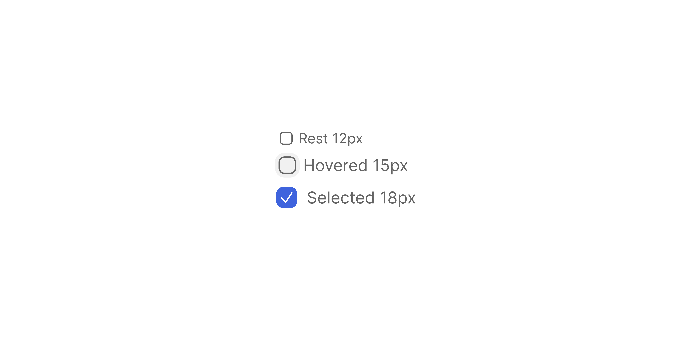

# Checkbox

> A selection control that allows a single independent choice or multiple selections within a group.

 

[View in Figma →](https://www.figma.com/design/7jCMwDng7HF5g7F3tGXf0E/Open-HR?node-id=1267-42518)

**Available in:** React · Next.js · Figma


---

# Overview

Checkbox is a form control that lets a user select or deselect a single or multiple option. It supports three selection states: `unchecked`, `checked`, and `indeterminate`. The indeterminate state represents a partial selection, a parent checkbox where some but not all children are selected, and is set programmatically only.

Labels can appear to the right or left of the control, or be omitted when space is constrained (an accessible label is still required in that case).

> **Always provide an accessible label.** Use a visible label via `label` + `textPosition`, or supply `aria-label` / `aria-labelledby` when no visible label is rendered.


---

## Anatomy

| Part | Description |
|------|-------------|
| **Check icon** | White checkmark, inset within the control. Visible in the `checked` state only. |
| **Dash icon** | White minus/dash, inset within the control. Replaces the check icon in the `indeterminate` state. |
| **Label** | Optional text adjacent to the control. Position controlled by `textPosition`. |
| **Hover ring** | A low-opacity outer frame that appears on hover. Only rendered when `hoverable={true}`. Expands the visual footprint without changing the control's own dimensions. |


---

## Sizes

| Size | Prop | Control | Hover ring outer | Border Radius | Use when |
|------|------|---------|------------------|---------------|----------|
| Small | `sm` | `11×11px` | n/a              | `Spacing/radius/xs-3px` | Dense tables, compact lists, small filter UIs, and terms |
| Medium | `md` | `15×15px` | `21×21px`        | `Spacing/radius/sm-5px` | Standard forms, settings panels |
| Large | `lg` | `18×18px` | `28×28px`        | `Spacing/radius/sm-6px` | Default; prominent selection contexts |


---

## Props

### `type`, Selection state

| Value | Visual | Notes |
|-------|--------|-------|
| `unchecked` | Outlined square, no fill | Option is not selected |
| `checked` | Blue-filled square + white checkmark icon | Option is selected |
| `indeterminate` | Blue-filled square + white dash icon | Some but not all children are selected. **Set programmatically only, never in response to a direct user click.** |


---

### `textPosition`, Label placement

| Value | Figma | Behavior |
|-------|-------|----------|
| `right` | `Right` | Label to the right of the control. Default. Follows natural reading order. |
| `left` | `Left` | Label to the left. |
| `none` | `None` | No visible label. **Requires** `aria-label` or `aria-labelledby`. |


---

### `hoverable`, Hover affordance

`hoverable` controls whether the checkbox renders a hover ring, an outer rounded frame that sits beyond the control's own border. This is not a purely visual effect: **when** `**hoverable={true}**` **the component always occupies a larger bounding box**, even at rest, because the ring is a permanent layout element.

#### How the ring behaves across states

| State | `hoverable={false}` | `hoverable={true}` |
|-------|-------------------|------------------|
| **Rest** | No ring. Control only. | Ring present as a **subtle ghost outline**, low opacity, no fill. The extra space is always reserved. |
| **Hover** | No ring.          | Ring fills with a **light background tint**, clearly visible, signals interactivity. |
| **Disabled** | No ring.          | Ring persists at **reduced opacity** alongside the rest of the component. Still occupies the larger bounding box. |

#### Layout footprint

Because the ring is always rendered (just visually quiet at rest), `hoverable` changes the component's outer dimensions:

| Size | `hoverable={false}` | `hoverable={true}` | Ring padding added |
|------|-------------------|------------------|--------------------|
| `sm` | `11×11px`         | \~`17×17px`      | \~`3px` each side  |
| `md` | `15×15px`         | `21×21px`        | `3px` each side    |
| `lg` | `18×18px`         | `28×28px`        | `5px` each side    |

> Never calculate alignment off the control dimensions alone when `hoverable={true}`, the outer bounding box is the real footprint.

#### When to use each value

| Value | Figma | Use when |
|-------|-------|----------|
| `true` | `Yes` | Any interactive context, forms, filters, settings panels, table row selectors. This is the default for anything the user clicks. |
| `false` | `No`  | Read-only display, data previews, print layouts, or embedded in a component that provides its own hover treatment. |


---

## States

Figma defines `Rest`, `Hover`, and `Disabled`. There is no Focus state in the component set, see [Accessibility](#accessibility).

| State | Trigger | Visual |
|-------|---------|--------|
| **Rest** | Default | Full-opacity control. When `hoverable={true}`, the outer ring is present as a subtle ghost outline even at rest. |
| **Hover** | Pointer enters (`hoverable={true}` required) | Outer ring fills with a light background tint. Control gets a subtle background shift. |
| **Disabled** | `disabled` prop | All elements, control, icon, label, and ring, at reduced opacity. `pointer-events: none`. Removed from tab order. |

> The `Hover` state is only reachable when `hoverable={true}`. See [`hoverable`](#hoverable--hover-affordance) for the full breakdown of how the ring behaves across all states and sizes.


---

## Usage guidelines

**Do** use Checkbox when the user can select multiple independent options at once. **Don't** use it when only one option can be active, use Radio Button instead.

**Do** use `indeterminate` for a parent checkbox with mixed child selections. Set it programmatically, never from a direct user click. **Don't** use `indeterminate` as a third logical option; it means "some children are checked", nothing else.

**Do** always pair with a visible label or `aria-label`. A checkbox without label context is inaccessible. **Don't** rely on surrounding layout text to imply a label, it must be programmatically associated.

**Do** use `lg` as the default size in forms. Reserve `sm` for dense, data-heavy contexts. **Don't** mix sizes within the same form group.

**Do** place validation messages and required indicators on the `CheckboxGroup` wrapper. **Don't** mark individual checkboxes as required, that belongs at the group level.

**Do** set `hoverable={false}` for display-only contexts. **Don't** use `disabled` to fake read-only, it reduces opacity and can make the current value hard to read.


---

## Content guidelines

* **Sentence case**, "Send me email notifications", not "Send Me Email Notifications"
* **Be specific**, "Allow data sharing with third parties", not "Data"
* **No trailing punctuation**, no period at the end of a label
* **Parallel structure in groups**, all options should share the same grammatical form (all noun phrases, or all verb phrases, not mixed)


---

## Behavior in context

**In a CheckboxGroup:** Wrap individual checkboxes in a `CheckboxGroup` that provides the shared group label, required indicator, and validation message. The group handles `aria-labelledby` linking to each control.

**Parent/child (indeterminate) pattern:**

```
☑ Select all       ← parent: indeterminate when children are mixed
  ☑ Option A       ← child
  ☐ Option B       ← child (unchecked)
  ☑ Option C       ← child
```

The parent is `checked` when all children are checked, `indeterminate` when some are, and `unchecked` when none are.

**In a table:** Use `sm` size. Align checkboxes to the left of the row. A "Select all" checkbox in the table header should be `indeterminate` when a partial row selection exists.


---

## Accessibility

| Requirement | Detail |
|-------------|--------|
| **Keyboard** | `Tab` / `Shift+Tab` to focus. `Space` to toggle. |
| **Focus ring** | use the hover state as the focus states, either it's selected or not |
| **Native element** | Use `<input type="checkbox">`. Do not recreate with `<div role="checkbox">`. |
| `**aria-checked**` | For `indeterminate`, set `aria-checked="mixed"`. The native `<input>` also needs `.indeterminate = true` set via a DOM ref, there is no HTML attribute for this. |
| `**aria-label**` **/** `**aria-labelledby**` | Required when `textPosition="none"`. |
| `**aria-describedby**` | Point to a caption or validation message element when one is present. |
| `**aria-required**` | Set on the `CheckboxGroup` wrapper, not individual checkboxes. |
| **Disabled** | Use the native `disabled` HTML attribute. Disabled checkboxes are removed from tab order and announced as unavailable by screen readers. |


---

## Animation

| Trigger | From → To | Transition | Duration | Easing |
|---------|-----------|------------|----------|--------|
| Mouse enter | `Rest` → `Hover` | Smart Animate | `70ms`   | Ease In |
| Mouse leave | `Hover` → `Rest` | Smart Animate | `50ms`   | Ease Out |
| Click (check) | `Unchecked` → `Checked` | Smart Animate | `10ms`   | Ease In |
| Click (uncheck) | `Checked` → `Unchecked` | Smart Animate | `50ms`   | Ease In |

> Note the asymmetry defined in the file: checking is near-instant (`10ms`) while unchecking takes `50ms`.

Hover transitions are defined on all `Hoverable=Yes` variants across all three sizes and all label positions (48 reaction nodes total).

> **Disabled state:** No transition is defined into or out of `Disabled` in Figma — implement it as an instant swap.

### Implementation reference

```css
/* Hover: in 70ms ease-in, out 50ms ease-out (Smart Animate) */
.checkbox-hover-ring {
  transition: background-color 50ms ease-out;
}
.checkbox:hover .checkbox-hover-ring {
  transition: background-color 70ms ease-in;
}

/* Check: 10ms ease-in · Uncheck: 50ms ease-in (Smart Animate) */
.checkbox-control,
.checkbox-icon {
  transition: background-color 50ms ease-in, opacity 50ms ease-in;
}
.checkbox[data-checked] .checkbox-control,
.checkbox[data-checked] .checkbox-icon {
  transition-duration: 10ms;
}
```


---

## Props / API

```ts
interface CheckboxProps {
  checked?: boolean | 'indeterminate'
  defaultChecked?: boolean
  onChange?: React.ChangeEventHandler<HTMLInputElement>
  size?: 'sm' | 'md' | 'lg'
  textPosition?: 'right' | 'left' | 'none'
  label?: string
  hoverable?: boolean
  disabled?: boolean
  name?: string
  value?: string
  id?: string
  'aria-label'?: string
  'aria-labelledby'?: string
  'aria-describedby'?: string
  ref?: React.Ref<HTMLInputElement>
  className?: string
}
```

| Prop | Type | Default | Required | Description |
|------|------|---------|----------|-------------|
| `checked` | `boolean \| 'indeterminate'` | —       | No       | Controlled checked state. `'indeterminate'` sets `aria-checked="mixed"` and the DOM `.indeterminate` flag. Do not use with `defaultChecked`. |
| `defaultChecked` | `boolean` | `false` | No       | Initial checked state for uncontrolled usage. Do not use with `checked`. |
| `onChange` | `React.ChangeEventHandler<HTMLInputElement>` | —       | No       | Fires on state change. In controlled mode, update `checked` here. For `indeterminate`, `e.target.checked` returns `true` (checking) or `false` (unchecking), the indeterminate state is never produced by direct user interaction. |
| `size` | `'sm' \| 'md' \| 'lg'` | `'lg'`  | No       | Control size. Maps to Figma tokens `12px`, `15px`, `18px`. |
| `textPosition` | `'right' \| 'left' \| 'none'` | `'right'` | No       | Position of the visible label. Use `'none'` with `aria-label` when no visible label is needed. |
| `label` | `string` | —       | No       | Visible label text. Required unless `textPosition="none"`. |
| `hoverable` | `boolean` | `true`  | No       | Renders the hover ring and hover state. Set `false` for display-only contexts. |
| `disabled` | `boolean` | `false` | No       | Removes from tab order; announces as unavailable to screen readers. |
| `name` | `string` | —       | No       | Groups checkboxes for form submission. |
| `value` | `string` | —       | No       | Value submitted with the form. Should be unique within a group. |
| `id` | `string` | —       | No       | Links an external `<label>` via `htmlFor`. |
| `aria-label` | `string` | —       | No       | Required when `textPosition="none"`. |
| `aria-labelledby` | `string` | —       | No       | ID of an external label element. Used by `CheckboxGroup`. |
| `aria-describedby` | `string` | —       | No       | ID of a caption or validation message element. |
| `ref` | `React.Ref<HTMLInputElement>` | —       | No       | Forwarded to the underlying `<input>`. Needed to set `.indeterminate` imperatively. |
| `className` | `string` | —       | No       | Additional CSS class for layout overrides. |


---

## Code examples

### Single checkbox (uncontrolled)

```tsx
// Next.js (App Router), Client Component
'use client'

<Checkbox
  label="Send me email updates"
  defaultChecked={false}
  onChange={(e) => console.log(e.target.checked)}
/>
```

```tsx
// React
<Checkbox
  label="Send me email updates"
  defaultChecked={false}
  onChange={(e) => console.log(e.target.checked)}
/>
```

### Controlled

```tsx
// Next.js (App Router), Client Component
'use client'

const [agreed, setAgreed] = useState(false)

<Checkbox
  label="I agree to the terms and conditions"
  checked={agreed}
  onChange={(e) => setAgreed(e.target.checked)}
/>
```

```tsx
// React
const [agreed, setAgreed] = useState(false)

<Checkbox
  label="I agree to the terms and conditions"
  checked={agreed}
  onChange={(e) => setAgreed(e.target.checked)}
/>
```

### Indeterminate parent with DOM ref

```tsx
// Next.js (App Router), Client Component
'use client'

// The 'indeterminate' HTML attribute doesn't exist, set it imperatively via ref.
const parentRef = useRef<HTMLInputElement>(null)
const allChecked = items.every(i => i.checked)
const someChecked = items.some(i => i.checked)
const checkedState = allChecked ? true : someChecked ? 'indeterminate' : false

useEffect(() => {
  if (parentRef.current) {
    parentRef.current.indeterminate = checkedState === 'indeterminate'
  }
}, [checkedState])

<Checkbox
  ref={parentRef}
  label="Select all"
  checked={checkedState === true}
  onChange={handleSelectAll}
/>
{items.map(item => (
  <Checkbox
    key={item.id}
    label={item.label}
    checked={item.checked}
    onChange={() => handleToggle(item.id)}
  />
))}
```

```tsx
// React
const parentRef = useRef<HTMLInputElement>(null)
const allChecked = items.every(i => i.checked)
const someChecked = items.some(i => i.checked)
const checkedState = allChecked ? true : someChecked ? 'indeterminate' : false

useEffect(() => {
  if (parentRef.current) {
    parentRef.current.indeterminate = checkedState === 'indeterminate'
  }
}, [checkedState])

<Checkbox
  ref={parentRef}
  label="Select all"
  checked={checkedState === true}
  onChange={handleSelectAll}
/>
{items.map(item => (
  <Checkbox
    key={item.id}
    label={item.label}
    checked={item.checked}
    onChange={() => handleToggle(item.id)}
  />
))}
```

### No visible label (table row)

```tsx
// Next.js (App Router), Client Component
'use client'

<Checkbox
  textPosition="none"
  aria-label="Select row for James O."
  checked={rowSelected}
  onChange={handleRowSelect}
  size="sm"
/>
```

```tsx
// React
<Checkbox
  textPosition="none"
  aria-label="Select row for James O."
  checked={rowSelected}
  onChange={handleRowSelect}
  size="sm"
/>
```

### Disabled with explanation

```tsx
// Next.js (App Router), Server Component

<Checkbox
  label="Admin access"
  checked={true}
  disabled
  aria-describedby="admin-reason"
/>
<span id="admin-reason" className="sr-only">
  Contact your administrator to change this setting.
</span>
```

```tsx
// React
<Checkbox
  label="Admin access"
  checked={true}
  disabled
  aria-describedby="admin-reason"
/>
<span id="admin-reason" className="sr-only">
  Contact your administrator to change this setting.
</span>
```

### Within a CheckboxGroup

```tsx
// Next.js (App Router), Server Component

<CheckboxGroup
  label="Notification preferences"
  required
  error={errors.notifications}
>
  <Checkbox value="email" label="Email" />
  <Checkbox value="sms"   label="SMS" />
  <Checkbox value="push"  label="Push notifications" />
</CheckboxGroup>
```

```tsx
// React
<CheckboxGroup
  label="Notification preferences"
  required
  error={errors.notifications}
>
  <Checkbox value="email" label="Email" />
  <Checkbox value="sms"   label="SMS" />
  <Checkbox value="push"  label="Push notifications" />
</CheckboxGroup>
```


---

## Related components

* **CheckboxGroup**, Wrapper that provides group label, required state, and validation for multiple checkboxes (no doc yet)
* [Radio Button](./Radio%20Button.md), Use when only one option can be selected from a group
* [Toggle](./Toggle.md) , Use for immediate on/off settings that take effect without a form submit