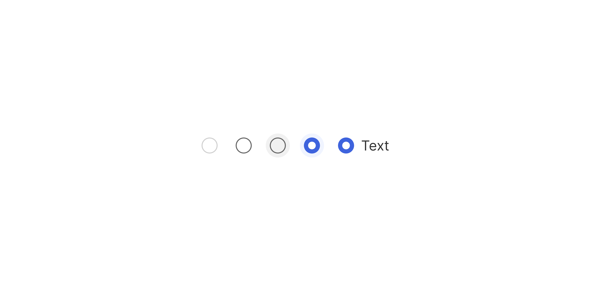

# Radio Button

> A selection control for choosing exactly one option from a set of mutually exclusive choices.

 

[View in Figma →](https://www.figma.com/design/7jCMwDng7HF5g7F3tGXf0E/Open-HR?node-id=1267-43021)


---

## Overview

Radio Button is a form control for single selection from a mutually exclusive group. Unlike [Checkbox](./Checkbox.md), a selected radio button cannot be deselected by clicking it again, the user must select a different option in the group.

Radio Button must never be used in isolation. A lone radio button provides no meaningful choice. Always render within a RadioGroup that provides the shared label and manages selection state.

**Available in:** React · Next.js · Figma


---

## Anatomy

| Part | Description |
|------|-------------|
| Click target | The interactive container, `24×24px`. Larger than the visible circle to provide a comfortable hit area. |
| Control (circle) | The visible circular indicator, `16×16px`. Unfilled when unselected; filled with an outer ring + inner dot when selected. Border `1px`. |
| Inner dot | Visible only in the `selected` state. `~7.6×7.6px`, centred within the 16px circle. |
| Label | Optional visible text. Can appear to the `right` (default), `left`, or be omitted (`none`). |

> **Click target vs visual circle:** The component's bounding box is `24×24px` but the rendered circle is `16×16px`. This `Spacing/padding/xs-4px` padding on each side is the invisible extension of the hit area. Do not reduce the container to `16×16px`, you'll shrink the touch target.


---

## Spacing tokens

| Property | Value |
|----------|-------|
| Component container (click target) | `24×24px` |
| Visible circle | `16×16px` |
| Inner dot (selected state) | `~7.6×7.6px` |
| Border width | `1px` |
| Minimum touch target | `24×24px` (component native) / `44×44px` (mobile, extend via parent padding) |


---

## Variants

### Selected state (`selected` / Figma: `Selected`)

| Value | Figma value | Description |
|-------|-------------|-------------|
| `false` | `no`        | Unselected, empty circle |
| `true` | `Yes`       | Selected, circle with filled inner dot |

Radio buttons have no `indeterminate` state. For partial/mixed selection, use Checkbox.

### Label position (`textPosition` / Figma: `📍 Text Position`)

| Value | Figma value | Description |
|-------|-------------|-------------|
| `right` | `Right`     | Label to the right of the control, standard reading order |
| `left` | `Left`      | Label to the left, right-to-left layouts or specific patterns |
| `none` | `None`      | No visible label, **requires** `aria-label` or `aria-labelledby` |

### State (Figma: `State`)

`Rest`, `Hover`, `Disabled`, no `Focus` state is defined in Figma.


---

## States

| State | Trigger | Visual change |
|-------|---------|---------------|
| Rest  | Default idle | Base appearance |
| Hover | Pointer enters | Subtle background or border shift on the circle |
| Disabled | `disabled` prop | Reduced opacity; `pointer-events: none`; removed from tab order |

> ⚠️ **No Focus state is defined in Figma. Use the Hovered state as the focus state, either it's selected or not.**


---

## Usage guidelines

**Do** use Radio Button when exactly one option must be selected from a fixed set. **Don't** use Radio Button when multiple options can be selected, use Checkbox instead.

**Do** always wrap Radio Buttons in a RadioGroup. Never render a single standalone Radio Button. **Don't** use Radio Buttons for more than \~6 options. For longer lists, use a Select/Dropdown.

**Do** provide a default selection when one option is clearly the most common or safe choice. **Don't** leave all radio buttons unselected when the field is required, it forces the user to notice and interact with a field they may intend to leave as default.

**Do** place validation messages and the required indicator on the RadioGroup wrapper, not individual Radio Buttons. **Don't** disable individual radio buttons within a group without a visible explanation for why.

**Do** use consistent label structure across all options, all noun phrases or all verb phrases. **Don't** mix styles within a group ("Weekly" / "Send me updates monthly" / "Never").


---

## Content guidelines

* **Sentence case**, "Every week", not "Every Week"
* **Short and parallel**, all options should be the same grammatical form
* **No trailing punctuation**
* **Group label**, phrase as a question or descriptor: "How often would you like updates?" or "Notification frequency"


---

## Behaviour in context

**In a RadioGroup:** The group component manages which radio is selected and wires up the `name` attribute so only one can be selected at a time.

**Keyboard navigation in a group (native browser behaviour):**

* `Tab` moves focus to the selected radio (or the first if none selected)
* Arrow keys (`↑`/`↓` or `←`/`→`) cycle through options and select them
* The entire group is a single `Tab` stop, individual options are reached with arrow keys

This is standard radio group keyboard behaviour. Use native `<input type="radio">` and `name` grouping, do not implement arrow key navigation manually.

**Preselection:** When a sensible default exists, preselect it. A blank required radio group is a common source of form submission errors.


---

## Accessibility

* **Keyboard**, `Tab` to reach the group. Arrow keys to navigate between options. The group is a single tab stop.
* **Focus state**, Not defined in Figma. **Must be implemented in code.** The focused radio must have a visible focus indicator meeting WCAG AA (3:1 contrast ratio for UI components).
* `**role="radio"**`, Use native `<input type="radio">`. Do not recreate with `<div>`.
* `**name**` **attribute**, Required for grouping. All radio buttons in the same group must share the same `name`. This is what makes them mutually exclusive via native browser behaviour.
* `**role="radiogroup"**` **+** `**aria-labelledby**`, The RadioGroup wrapper should use `role="radiogroup"` and point to the group label via `aria-labelledby`.
* `**aria-label**`, Required on individual Radio Buttons when `textPosition="none"`.
* `**aria-required**`, Set on the RadioGroup wrapper, not on individual buttons.
* **Disabled**, Use the `disabled` attribute. A disabled option within a group is skipped by arrow key navigation.


---

## Animation

| Trigger | From → To | Transition | Duration | Easing |
|---------|-----------|------------|----------|--------|
| Mouse enter | `Rest` → `Hover` | Dissolve   | `100ms`  | Ease In |
| Mouse leave | `Hover` → `Rest` | Dissolve   | `100ms`  | Ease Out |
| Click (select/deselect) | `Hover` → opposite `Selected` value | Dissolve   | `50ms`   | Ease Out |

> **Disabled state:** No transition is defined into or out of `Disabled` in Figma — implement it as an instant swap.

### Implementation reference

```css
/* Dissolve = opacity/colour cross-fade */
.radio-control {
  transition: background-color 100ms ease-in, border-color 100ms ease-in; /* hover in */
}
.radio:not(:hover) .radio-control {
  transition-duration: 100ms;
  transition-timing-function: ease-out; /* hover out */
}
.radio-dot {
  transition: opacity 50ms ease-out; /* select / deselect click */
}
```


---

## Props / API

```ts
interface RadioButtonProps {
  value: string
  name: string
  checked?: boolean
  defaultChecked?: boolean
  onChange?: React.ChangeEventHandler<HTMLInputElement>
  textPosition?: 'right' | 'left' | 'none'
  label?: string
  disabled?: boolean
  'aria-label'?: string
  'aria-labelledby'?: string
  'aria-describedby'?: string
  ref?: React.Ref<HTMLInputElement>
  className?: string
}
```

> These props are for the individual Radio Button. Most selection logic (required, validation, onChange) should live at the RadioGroup level.

| Prop | Type | Default | Required | Description |
|------|------|---------|----------|-------------|
| `value` | `string` | —       | **Yes**  | Unique identifier for this option within the group. Submitted with the form. |
| `name` | `string` | —       | **Yes**  | Groups radio buttons. All options in the same group share the same `name`. Managed automatically by RadioGroup, only set manually when used outside a RadioGroup. |
| `checked` | `boolean` | —       | No       | Controlled selected state. Do not use with `defaultChecked`. |
| `defaultChecked` | `boolean` | `false` | No       | Initial state in uncontrolled mode. |
| `onChange` | `React.ChangeEventHandler<HTMLInputElement>` | —       | No       | Fires when this option is selected. In controlled mode, manage state at the RadioGroup level. |
| `textPosition` | `'right' \| 'left' \| 'none'` | `'right'` | No       | Position of the visible label relative to the control. |
| `label` | `string` | —       | No       | Visible label text. Required unless `textPosition="none"`. |
| `disabled` | `boolean` | `false` | No       | Disables this option. Disabled options are skipped by arrow key navigation within the group. |
| `aria-label` | `string` | —       | No       | Required when `textPosition="none"`. |
| `aria-labelledby` | `string` | —       | No       | ID of external label element. |
| `aria-describedby` | `string` | —       | No       | ID of a description or error message element. |
| `ref` | `React.Ref<HTMLInputElement>` | —       | No       | Forwarded to the underlying `<input>` element. |
| `className` | `string` | —       | No       | Additional CSS class. |


---

## Code examples

### Within a RadioGroup (recommended)

```tsx
// Next.js (App Router), Client Component
'use client'

// Manage state at the group level, not on individual Radio Buttons
const [frequency, setFrequency] = useState('weekly')

<RadioGroup
  label="Notification frequency"
  name="frequency"
  value={frequency}
  onChange={(value) => setFrequency(value)}
>
  <RadioButton value="daily"   label="Daily" />
  <RadioButton value="weekly"  label="Weekly" />
  <RadioButton value="monthly" label="Monthly" />
  <RadioButton value="never"   label="Never" />
</RadioGroup>
```

```tsx
// React
// Manage state at the group level, not on individual Radio Buttons
const [frequency, setFrequency] = useState('weekly')

<RadioGroup
  label="Notification frequency"
  name="frequency"
  value={frequency}
  onChange={(value) => setFrequency(value)}
>
  <RadioButton value="daily"   label="Daily" />
  <RadioButton value="weekly"  label="Weekly" />
  <RadioButton value="monthly" label="Monthly" />
  <RadioButton value="never"   label="Never" />
</RadioGroup>
```

### With a disabled option and explanation

```tsx
// Next.js (App Router), Client Component
'use client'

<RadioGroup label="Access level" name="access" value={access} onChange={setAccess}>
  <RadioButton value="viewer" label="Viewer" />
  <RadioButton value="editor" label="Editor" />
  <RadioButton
    value="admin"
    label="Administrator"
    disabled
    aria-describedby="admin-disabled-reason"
  />
</RadioGroup>
<p id="admin-disabled-reason" className="helper-text">
  Admin access requires approval from your workspace owner.
</p>
```

```tsx
// React
<RadioGroup label="Access level" name="access" value={access} onChange={setAccess}>
  <RadioButton value="viewer" label="Viewer" />
  <RadioButton value="editor" label="Editor" />
  <RadioButton
    value="admin"
    label="Administrator"
    disabled
    aria-describedby="admin-disabled-reason"
  />
</RadioGroup>
<p id="admin-disabled-reason" className="helper-text">
  Admin access requires approval from your workspace owner.
</p>
```

### No visible label (table context)

```tsx
// Next.js (App Router), Client Component
'use client'

<RadioButton
  value="james-o"
  name="primary-contact"
  textPosition="none"
  aria-label="Set James O. as primary contact"
  checked={selected === 'james-o'}
  onChange={() => setSelected('james-o')}
/>
```

```tsx
// React
<RadioButton
  value="james-o"
  name="primary-contact"
  textPosition="none"
  aria-label="Set James O. as primary contact"
  checked={selected === 'james-o'}
  onChange={() => setSelected('james-o')}
/>
```

### With required validation

```tsx
// Next.js (App Router), Client Component
'use client'

const [leaveType, setLeaveType] = useState('')
const [submitted, setSubmitted] = useState(false)

<RadioGroup
  label="Leave type"
  name="leave-type"
  value={leaveType}
  onChange={setLeaveType}
  required
  error={submitted && !leaveType ? 'Please select a leave type' : undefined}
>
  <RadioButton value="annual"   label="Annual leave" />
  <RadioButton value="sick"     label="Sick leave" />
  <RadioButton value="unpaid"   label="Unpaid leave" />
</RadioGroup>
```

```tsx
// React
const [leaveType, setLeaveType] = useState('')
const [submitted, setSubmitted] = useState(false)

<RadioGroup
  label="Leave type"
  name="leave-type"
  value={leaveType}
  onChange={setLeaveType}
  required
  error={submitted && !leaveType ? 'Please select a leave type' : undefined}
>
  <RadioButton value="annual"   label="Annual leave" />
  <RadioButton value="sick"     label="Sick leave" />
  <RadioButton value="unpaid"   label="Unpaid leave" />
</RadioGroup>
```


---

## Related components

* **RadioGroup**, Required wrapper. Manages `name` grouping, selection state, group label, required indicator, and validation
* [Checkbox](./Checkbox.md), Use when multiple options can be selected simultaneously
* **Select**, Use for more than \~6 options, or when screen space is limited
* [Toggle](./Toggle.md), Use for a single binary on/off setting that takes effect immediately