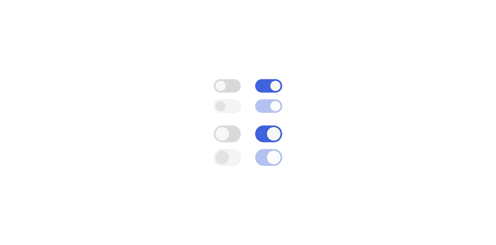

# Toggle

> An immediate on/off control for settings and preferences that take effect without a form submit.

 [View in Figma →](https://www.figma.com/design/7jCMwDng7HF5g7F3tGXf0E/Open-HR?node-id=1270-41378)


---

## **Overview**

Toggle is a binary on/off control optimized for settings that take effect immediately, no submit button required. It is visually distinct from Checkbox: a sliding pill-shaped track with a circular thumb that moves left (off) or right (on).

Use Toggle for instant-effect settings. Use Checkbox when the selection is part of a form that requires explicit submission.


---

## **Anatomy**

| **Part** | **Description** |
|------|-------------|
| **Track** | Pill-shaped container. Fully rounded (`border-radius: 80px`). Background colour reflects the toggled state, grey when off, brand blue when on. |
| **Thumb** | White circle that slides inside the track. `2px` inset from the track edge in both positions. Moves from left (off) to right (on). In the `disabled` + off state, the thumb uses a transparent dark token instead of white, it blends with the near-invisible track. |

**Thumb travel:**

| **Size** | **Track width** | **Thumb size** | **Travel** |
|------|-------------|------------|--------|
| `sm` | `24px`      | `12px`     | `8px` → formula: `24 - 12 - (2×2) = 8px` |
| `md` | `32px`      | `16px`     | `12px` → formula: `32 - 16 - (2×2) = 12px` |


---

## **Sizes**

| **Size** | **Prop** | **Track** | **Thumb** | **Use when** |
|------|------|-------|-------|----------|
| Small | `sm` | `24×16px` | `12×12px` | Dense settings panels, compact lists |
| Medium | `md` | `32×20px` | `16×16px` | Default; standard settings pages |

> Size names in Figma (`16px`, `20px`) refer to the track **height**, not the thumb size.


---

## **Props**

### `**toggled**` **— On/off state**

| **Value** | **Visual** | **Behaviour** |
|-------|--------|-----------|
| `false` | Thumb at left, grey track | Off       |
| `true` | Thumb at right, blue track | On        |


---

### `**size**` **— Track size**

| **Value** | **Figma** | **Track** | **Thumb** |
|-------|-------|-------|-------|
| `sm`  | `16px` | `24×16px` | `12×12px` |
| `md`  | `20px` | `32×20px` | `16×16px` |


---

### `**disabled**`

Renders the toggle as non-interactive. Figma defines this as a distinct `State=Disabled,` the visual treatment differs between `toggled=true` and `toggled=false`:

| **Condition** | **Visual** |
|-----------|--------|
| `disabled`, `toggled=true` | Blue track at **40% opacity** (`opacity: 0.4` on the whole component). Thumb remains white. |
| `disabled`, `toggled=false` | Track uses near-invisible token (`rgba(0,0,0,0.04)`). Thumb switches from white to a dark transparent token (`rgba(0,0,0,0.08)`), it visually blends with the faint track. |

> This is not a simple opacity reduction for both cases, the off+disabled state uses different colour tokens entirely. Implement the two disabled variants separately.


---

## **States**

Figma defines three states: `Rest`, `Hover/ Focus`, and `Disabled`.

| **State** | **Trigger** | **Visual** |
|-------|---------|--------|
| **Rest** | Default | Track at full colour. No border. |
| **Hover / Focus** | Pointer enters, or keyboard focus | A `0.5px` border appears on the track. Border token varies by `toggled` value (see table below). No change to track background or thumb position. |
| **Disabled** | `disabled` prop | Non-interactive. See [`disabled`](https://claude.ai/epitaxy/local_e0f72a18-06b1-401f-96a9-5b8a361450dd#disabled) above for the two visual variants. |

**Hover / Focus border tokens:**

| `**toggled**` | **Border token** |
|-------------|--------------|
| `false` (off) | `--border/transparent/light` |
| `true` (on) | `--border/transparent/medium` |

> We combines hover and focus into a single `Hover/ Focus` state. Both pointer hover and keyboard focus should produce the same visual, the `0.5px` track border.


---

## **Design tokens**

| **Token** | **Role** | **Value** |
|-------|------|-------|
| `--bg/selection-controls/selected` | Track background, on | `#3e63dd` |
| `--bg/transparent/strong` | Track background, off (Rest) | `rgba(0,0,0,0.15)` |
| `--bg/transparent/light` | Track background, off (Disabled) | `rgba(0,0,0,0.04)` |
| `--bg/primary` | Thumb (all interactive states) | `#f7f7f7` |
| `--bg/transparent/medium` | Thumb, off + Disabled | `rgba(0,0,0,0.08)` |
| `--border/transparent/light` | Track border, Hover/Focus, off | `rgba(0,0,0,0.04)` |
| `--border/transparent/medium` | Track border, Hover/Focus, on | `rgba(0,0,0,0.08)` |
| `--border/transparent/lighter` | Track border, Disabled | `rgba(0,0,0,0.02)` |


---

## **Usage guidelines**

**Do** use Toggle for settings that apply immediately, email notifications, dark mode, auto-save. **Don't** use Toggle inside a form that requires a submit button. The user's mental model for a toggle is "this happens now". If they need to save first, use Checkbox.

**Do** pair Toggle with a label that describes the setting, not the on/off state, "Email notifications", not "Turn on email notifications". **Don't** use the label to describe the state ("Enabled" / "Disabled"), the toggle position communicates that.

**Do** use `md` as the default size. Use `sm` only in dense, information-heavy settings panels. **Don't** mix `sm` and `md` in the same settings section.

**Do** give immediate visual feedback when the toggle changes, the transition should feel instant. **Don't** require the user to confirm a toggle change unless the consequence is severe (e.g. disabling 2FA).

**Do** explain the impact of a toggle in a caption if the consequence is non-obvious. **Don't** disable a toggle without providing a visible explanation of why, a greyed-out control with no reason is a usability dead-end.


---

## **Content guidelines**

* **Label describes the setting, not the action,** "Email notifications", not "Enable email notifications"
* **Sentence case**, "Two-factor authentication", not "Two-Factor Authentication"
* **No "on/off" in the label**, the toggle communicates that; the label names what the setting controls
* **Caption (optional)**, a short description for non-obvious settings: "You'll receive an email when someone comments on your posts"


---

## **Behaviour in context**

**Immediate effect:** When the user toggles, the change takes effect instantly. No submit needed. Show a brief success indicator (e.g. toast) when the setting is saved server-side.

**Loading / async save:** If toggling triggers an async save, disable the toggle (use `aria-disabled` to keep it focusable) and show a spinner nearby until the operation resolves. If the save fails, restore the previous state and show an error toast, do not leave the toggle in the new position.

**In a settings list:** Group related toggles under a section heading. A common layout places the label left and the toggle right, creating a clean two-column panel.

**Disabled state:** Show a `Tooltip` on hover explaining why the toggle is disabled. A disabled toggle with no explanation leaves users stuck.


---

## **Accessibility**

| **Requirement** | **Detail** |
|-------------|--------|
| **Keyboard** | `Tab` / `Shift+Tab` to focus. `Space` to toggle. |
| **Hover / Focus ring** | Figma defines a combined `Hover/ Focus` state, a `0.5px` track border. For keyboard focus, **also add a** `**2px**` **outline with** `**2px**` **offset** in the brand focus colour to meet WCAG 2.4.7. This is not in Figma and must be added in code. |
| `**role="switch"**` | Use `role="switch"` with `aria-checked="true"` or `aria-checked="false"`. Do not use `role="checkbox"` — screen readers announce these differently and the semantics differ. |
| `**aria-label**` **/** `**aria-labelledby**` | Required. The toggle must have an accessible name describing what it controls: `aria-label="Email notifications"`. |
| `**aria-describedby**` | Point to a caption or description element when one is present. |
| `**aria-busy**` | Set to `true` while an async save is in-flight. Update `aria-checked` to reflect the resolved state (not the optimistic one) when complete. |
| **Disabled** | Prefer `aria-disabled="true"` over the `disabled` HTML attribute. `aria-disabled` keeps the toggle in the tab order so users can focus it and read a tooltip explaining why it's unavailable. Block interaction via `onClick` prevention. |


---

## **Props / API**

```none
interface ToggleProps {
  toggled?: boolean
  defaultToggled?: boolean
  onChange?: (toggled: boolean) => void
  size?: 'sm' | 'md'
  disabled?: boolean
  id?: string
  'aria-label'?: string
  'aria-labelledby'?: string
  'aria-describedby'?: string
  'aria-busy'?: boolean
  ref?: React.Ref<HTMLButtonElement>
  className?: string
}
```

| **Prop** | **Type** | **Default** | **Required** | **Description** |
|------|------|---------|----------|-------------|
| `toggled` | `boolean` | —       | No       | Controlled on/off state. Use with `onChange`. Do not use with `defaultToggled`. |
| `defaultToggled` | `boolean` | `false` | No       | Initial state in uncontrolled mode. |
| `onChange` | `(toggled: boolean) => void` | —       | No       | Fires immediately on click. Receives the new boolean state, not a DOM event. |
| `size` | `'sm' \| 'md'` | `'md'`  | No       | `sm` = 24×16px track; `md` = 32×20px track. |
| `disabled` | `boolean` | `false` | No       | Blocks interaction. Visual differs between on and off, see [disabled](https://claude.ai/epitaxy/local_e0f72a18-06b1-401f-96a9-5b8a361450dd#disabled). Prefer `aria-disabled` to keep the toggle focusable. |
| `id` | `string` | —       | No       | Links an external `<label>` via `htmlFor`. |
| `aria-label` | `string` | —       | No       | Required unless `aria-labelledby` is provided. |
| `aria-labelledby` | `string` | —       | No       | ID of an external label element. |
| `aria-describedby` | `string` | —       | No       | ID of a caption or description element. |
| `aria-busy` | `boolean` | —       | No       | Set to `true` while an async save is in-flight. |
| `ref` | `React.Ref<HTMLButtonElement>` | —       | No       | Forwarded to the underlying `<button>` element. |
| `className` | `string` | —       | No       | Additional CSS class. |


---

## **Code examples**

### **Controlled**

```javascript
// Next.js (App Router), Client Component
'use client'
const [enabled, setEnabled] = useState(false)
<Toggle
  toggled={enabled}
  onChange={setEnabled}
  aria-label="Email notifications"
/>
// React
const [enabled, setEnabled] = useState(false)
<Toggle
  toggled={enabled}
  onChange={setEnabled}
  aria-label="Email notifications"
/>
```

### **With external label and caption**

```javascript
// Next.js (App Router), Client Component
'use client'
<div>
  <label id="notif-label">Email notifications</label>
  <p id="notif-desc">
    Receive an email when someone comments on your posts.
  </p>
  <Toggle
    toggled={enabled}
    onChange={setEnabled}
    aria-labelledby="notif-label"
    aria-describedby="notif-desc"
  />
</div>
// React
<div>
  <label id="notif-label">Email notifications</label>
  <p id="notif-desc">
    Receive an email when someone comments on your posts.
  </p>
  <Toggle
    toggled={enabled}
    onChange={setEnabled}
    aria-labelledby="notif-label"
    aria-describedby="notif-desc"
  />
</div>
```

### **With async save and state restoration on failure**

```javascript
// Next.js (App Router), Client Component
'use client'
const [enabled, setEnabled] = useState(false)
const [saving, setSaving] = useState(false)
async function handleToggle(next: boolean) {
  const previous = enabled
  setSaving(true)
  try {
    await saveNotificationSetting(next)
    setEnabled(next)
  } catch {
    setEnabled(previous)
    toast.error('Failed to save setting. Please try again.')
  } finally {
    setSaving(false)
  }
}
<Toggle
  toggled={enabled}
  onChange={handleToggle}
  aria-disabled={saving}
  aria-busy={saving}
  aria-label="Email notifications"
  onClick={saving ? (e) => e.preventDefault() : undefined}
/>
// React
const [enabled, setEnabled] = useState(false)
const [saving, setSaving] = useState(false)
async function handleToggle(next: boolean) {
  const previous = enabled
  setSaving(true)
  try {
    await saveNotificationSetting(next)
    setEnabled(next)
  } catch {
    setEnabled(previous)
    toast.error('Failed to save setting. Please try again.')
  } finally {
    setSaving(false)
  }
}
<Toggle
  toggled={enabled}
  onChange={handleToggle}
  aria-disabled={saving}
  aria-busy={saving}
  aria-label="Email notifications"
  onClick={saving ? (e) => e.preventDefault() : undefined}
/>
```

### **Disabled with tooltip explanation**

```javascript
// Next.js (App Router), Client Component
'use client'
<Tooltip label="You need admin permissions to change this setting">
  {/* aria-disabled keeps toggle focusable so the tooltip is reachable by keyboard */}
  <Toggle
    toggled={false}
    aria-disabled="true"
    aria-label="Two-factor authentication"
    onClick={(e) => e.preventDefault()}
  />
</Tooltip>
// React
<Tooltip label="You need admin permissions to change this setting">
  <Toggle
    toggled={false}
    aria-disabled="true"
    aria-label="Two-factor authentication"
    onClick={(e) => e.preventDefault()}
  />
</Tooltip>
```

### **Settings list pattern**

```javascript
// Next.js (App Router), Client Component
'use client'
<section>
  <h2>Notification preferences</h2>
  {settings.map(setting => (
    <div key={setting.id} className="settings-row">
      <div>
        <label id={`label-${setting.id}`}>{setting.label}</label>
        {setting.description && (
          <p id={`desc-${setting.id}`} className="settings-caption">
            {setting.description}
          </p>
        )}
      </div>
      <Toggle
        toggled={setting.enabled}
        onChange={(next) => updateSetting(setting.id, next)}
        aria-labelledby={`label-${setting.id}`}
        aria-describedby={setting.description ? `desc-${setting.id}` : undefined}
        size="sm"
      />
    </div>
  ))}
</section>
// React
<section>
  <h2>Notification preferences</h2>
  {settings.map(setting => (
    <div key={setting.id} className="settings-row">
      <div>
        <label id={`label-${setting.id}`}>{setting.label}</label>
        {setting.description && (
          <p id={`desc-${setting.id}`} className="settings-caption">
            {setting.description}
          </p>
        )}
      </div>
      <Toggle
        toggled={setting.enabled}
        onChange={(next) => updateSetting(setting.id, next)}
        aria-labelledby={`label-${setting.id}`}
        aria-describedby={setting.description ? `desc-${setting.id}` : undefined}
        size="sm"
      />
    </div>
  ))}
</section>
```


---

## **Related components**

* [Checkbox](./Checkbox.md) , Use when the selection is part of a form requiring a submit button, or for multiple simultaneous selections
* [Radio Button](./Radio%20Button.md) , Use for mutually exclusive choices within a group


---

## Animation

| Trigger | From → To | Transition | Duration | Easing |
|---------|-----------|------------|----------|--------|
| Click (toggle) | `Toggled=No` ↔ `Toggled=Yes` (in `Rest` and in `Hover/ Focus`) | Dissolve   | `50ms`   | Ease Out |

> **Note:** Figma uses a **Dissolve** (cross-fade) for the toggle flip — not a Smart Animate slide. If you implement a thumb slide instead of a cross-fade, that is a deviation from the file and should be confirmed with design. No hover-enter/leave transition is defined on the Toggle set; the `Hover/ Focus` border state has no animated entry.

> **Disabled state:** No transition is defined into or out of `Disabled` in Figma — implement it as an instant swap.

### Implementation reference

```css
/* Figma defines the flip as a 50ms ease-out Dissolve (cross-fade), not a slide. */
.toggle-track,
.toggle-thumb {
  transition: background-color 50ms ease-out, transform 50ms ease-out;
}
```


---