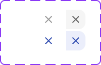

# Chip Remove Button

> The dismiss button rendered inside a removable Chip, with a transparent rest state that reveals on chip hover.

 

[View in Figma →](https://www.figma.com/design/7jCMwDng7HF5g7F3tGXf0E/Open-HR?node-id=2351-69361)


---

## Overview

Chip Remove Button is the sub-component rendered at the right edge of a [Chip](/doc/8c1588a1-e06e-43b0-9c80-413c664c883e) when `removable=true`. It is `20×20px` with `Spacing/padding/xs-3px` padding all sides, containing a `14×14px` x-mark icon. Unlike the [Tag Remove Button](/doc/ba4c8512-d2a7-455f-a91c-df926543ccbc), it has a `transparent` state, the icon is invisible while the chip is in its `rest` state, and becomes visible only when the chip is hovered. This prevents layout shifts on hover while keeping the hit area stable.

It is not used standalone.

**Available in:** React · Next.js · Figma (`🟧 Chips/.Subcomponents/Remove button`)


---

## Anatomy

| Part | Description |
|------|-------------|
| Hit area | `20×20px` container. Always present in the layout when `removable=true`, size does not change between transparent and visible states. |
| Padding | `Spacing/padding/xs-3px` all sides inside the hit area. |
| Icon | `icon/x-mark` at `14×14px`. Colour-matched to chip fill style. |
| X-mark vector | `~7px` visual mark inside the icon in `rest` and `hover` states; `~7.9px` in `transparent` state (though invisible). |


---

## Spacing tokens

| Property | Value | Token |
|----------|-------|-------|
| Padding (all sides) | `Spacing/padding/xs-3px` | `Spacing/padding/xs-3px` |
| Hit area size | `20×20px` | —     |
| Icon size | `14×14px` | —     |


---

## Variants

### State (`state`)

This component has a unique three-value state axis that manages the remove button's reveal behaviour:

| Value | Figma value | When used | Visual |
|-------|-------------|-----------|--------|
| `transparent` | `transparent` | Chip is in `rest` state | Hit area is present; icon is invisible |
| `rest` | `rest`      | Chip is in `hover` state (button becomes visible) | Icon visible; base appearance |
| `hover` | `hover`     | Pointer is directly over the remove button | Icon visible; hit area has background tint |

**Key behaviour:** When the parent chip transitions from `rest` → `hover`, the remove button transitions from `transparent` → `rest`. When the pointer moves directly over the remove button (within the hover chip), it transitions to `hover`. The layout width never changes, this is intentional.

### Colour (`color` / Figma: `🎨 color`)

Two colours match the chip's two fill styles:

| Value | Figma value | Used with |
|-------|-------------|-----------|
| `empty` | `🫥 Empty`  | `fill="default"` and `fill="transparent"` chips |
| `blue` | `💙 Blue`   | `fill="accent"` chips |


---

## States

| State | Trigger | Visual change |
|-------|---------|---------------|
| Transparent | Chip is in rest state | Icon is invisible; `20×20px` area is present but visually empty; no background fill |
| Rest  | Chip is hovered | X-mark icon becomes visible; no background fill on hit area |
| Hover | Pointer directly over the button | Hit area shows background tint: `color/black/14` for `empty` colour, `color/blue/alpha_5` for `blue` colour |

⚠️ **No Focus state is defined in Figma.** When the user tabs to the remove button, a 2px outline focus ring must be shown. <!-- TODO: confirm focus ring colour with design -->


---

## Usage guidelines

**Do** always keep the hit area present in the layout even when the icon is transparent, this prevents the chip from resizing on hover and avoids layout shifts.

**Don't** use this sub-component standalone, it belongs inside [Chip](/doc/7ec7a1d8-fe54-4282-8db9-d1da38f0ad08).

**Do** on touch devices, render the button in `rest` (visible) state by default, hover states don't exist on touch, and users need to see the remove affordance.

**Don't** hide the remove button from the accessibility tree just because it's visually transparent. It must remain `focusable` and reachable by keyboard at all times when `removable=true`.


---

## Accessibility

* Renders as a `<button type="button">`.
* `aria-label` must be `"Remove [chip label]"` (e.g. `"Remove Victoria Adetunji"`). Supplied by the parent [Chip](./Chip.md).
* The button must remain in the tab order even in its `transparent` visual state, keyboard users reach it before they can see the icon, which is acceptable as long as the focus ring is visible.
* On touch devices, the button should always render at `rest` (visible) since hover is not available.


---

## Animation

| Trigger | From → To | Transition | Duration | Easing |
|---------|-----------|------------|----------|--------|
| Hover (while hovering) | `rest` → `hover` | Smart Animate | `150ms`  | Ease Out |
| Hover (while hovering) | `transparent` → `hover` | Smart Animate | `150ms`  | Ease Out |

Both use the auto-reverting `ON_HOVER` trigger, so exit uses the same `150ms` Ease Out.

> **Disabled state:** No transition is defined into or out of `Disabled` in Figma — implement it as an instant swap.

### Implementation reference

```css
/* ON_HOVER auto-reverts: same 150ms ease-out both directions */
.chip-remove-button {
  transition: opacity 150ms ease-out, background-color 150ms ease-out;
}
```


---

## Props / API

```ts
interface ChipRemoveButtonProps {
  color?: 'empty' | 'blue'
  state?: 'transparent' | 'rest' | 'hover'
  onClick?: React.MouseEventHandler<HTMLButtonElement>
  'aria-label': string
  className?: string
}
```

| Prop | Type | Default | Required | Description |
|------|------|---------|----------|-------------|
| `color` | `'empty' \| 'blue'` | `'empty'` | No       | Icon colour. Passed automatically by parent Chip based on fill. Figma: `🎨 color` |
| `state` | `'transparent' \| 'rest' \| 'hover'` | `'transparent'` | No       | Visual state. Managed by the parent chip's hover logic. |
| `onClick` | `React.MouseEventHandler<HTMLButtonElement>` | —       | No       | Called when clicked |
| `aria-label` | `string` | —       | **Yes**  | Accessible label: `"Remove [chip label]"`. Required, the icon has no text. |
| `className` | `string` | —       | No       | Additional CSS class |


---

## Code examples

How the parent Chip wires this sub-component:

```tsx
// Next.js (App Router), Client Component
'use client'

function Chip({ label, fill = 'default', removable, onRemove }: ChipProps) {
  const [isHovered, setIsHovered] = useState(false)

  const removeButtonColor = fill === 'accent' ? 'blue' : 'empty'
  const removeButtonState = isHovered ? 'rest' : 'transparent'

  return (
    <div
      className={`chip chip--${fill}`}
      onMouseEnter={() => setIsHovered(true)}
      onMouseLeave={() => setIsHovered(false)}
    >
      <div className="chip__container">
        {/* icon + label */}
      </div>
      {removable && (
        <ChipRemoveButton
          color={removeButtonColor}
          state={removeButtonState}
          aria-label={`Remove ${label}`}
          onClick={onRemove}
        />
      )}
    </div>
  )
}
```

```tsx
// React
function Chip({ label, fill = 'default', removable, onRemove }: ChipProps) {
  const [isHovered, setIsHovered] = useState(false)

  const removeButtonColor = fill === 'accent' ? 'blue' : 'empty'
  const removeButtonState = isHovered ? 'rest' : 'transparent'

  return (
    <div
      className={`chip chip--${fill}`}
      onMouseEnter={() => setIsHovered(true)}
      onMouseLeave={() => setIsHovered(false)}
    >
      <div className="chip__container">
        {/* icon + label */}
      </div>
      {removable && (
        <ChipRemoveButton
          color={removeButtonColor}
          state={removeButtonState}
          aria-label={`Remove ${label}`}
          onClick={onRemove}
        />
      )}
    </div>
  )
}
```

Touch-friendly override, always show the remove button:

```tsx
// Next.js (App Router), Client Component
'use client'

// On touch devices, bypass the transparent/hover logic
const isTouchDevice = window.matchMedia('(hover: none)').matches

<ChipRemoveButton
  color={fill === 'accent' ? 'blue' : 'empty'}
  state={isTouchDevice ? 'rest' : removeButtonState}
  aria-label={`Remove ${label}`}
  onClick={onRemove}
/>
```

```tsx
// React
// On touch devices, bypass the transparent/hover logic
const isTouchDevice = window.matchMedia('(hover: none)').matches

<ChipRemoveButton
  color={fill === 'accent' ? 'blue' : 'empty'}
  state={isTouchDevice ? 'rest' : removeButtonState}
  aria-label={`Remove ${label}`}
  onClick={onRemove}
/>
```


---

## Related components

* [Chip](/doc/3358930c-c5bc-4887-9665-755a3449baa8), the parent component that renders this sub-component
* [Tag Remove Button](./Tag%20Remove%20Button.md), the analogous remove button for Tags (no transparent state)