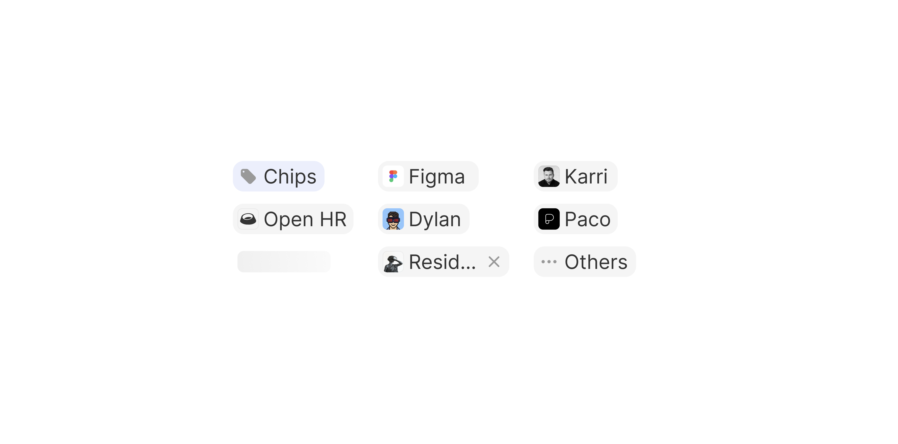

# Chip

> An interactive avatar-and-label element representing a selected person, entity, or value.

 

[View in Figma →](https://www.figma.com/design/7jCMwDng7HF5g7F3tGXf0E/Open-HR?node-id=2363-70402)


---

## Overview

Chip represents a selected item, most commonly a person, a user, or a tagged entity, inside an input field, filter bar, or assignment panel. Unlike [Tag](./Tag.md), which is a static display label, Chip is fully interactive: it has hover, disabled, loading, and placeholder states, and its icon can be swapped for any avatar or icon instance.

Every Chip carries an avatar or icon on the left and a text label. An optional remove button on the right lets users deselect the item. Three fill styles control how the chip background sits against its container.

With a fixed height of **20px,** Chip shares this height with Tag, making them interchangeable in the same row within [Input Selection](/doc/7483c753-5973-4739-8dfc-d934d4641b32).

**Available in:** React · Next.js · Figma (`🟧 Chips`)


---

## Anatomy

| Part | Description |
|------|-------------|
| Container | `20px` tall pill, `paddingLeft=Spacing/padding/xs-3px`, `cornerRadius=Spacing/radius/sm-7px`. Width is content-driven. |
| Icon / Avatar wrapper | `14×14px` frame (Figma: `wrapper`). Renders an `avatar/avatar` instance by default; swappable for any icon via `iconType`. `cornerRadius=Spacing/radius/xs-4px` on the wrapper. |
| Text wrapper | Contains the chip label. `paddingLeft=Spacing/padding/xs-1px`. When `removable=false`, `paddingRight=Spacing/padding/xs-4px`. |
| Label | Bold weight when `boldText=true`. |
| Remove button | Optional `20×20px` hit area at the right edge. Only visible on hover of the parent chip (transparent in rest state). See [Chip Remove Button](./Chip%20Remove%20Button.md). |

**Internal layout:** `container` frame (icon wrapper + text wrapper) sits inside the chip, `gap=Spacing/gap/xs-2px`. When `removable=true` and the chip is in `hover` state, the remove button is appended after the container frame; the container shrinks to accommodate it.


---

## Spacing tokens

| Property | `Removable=no` | `Removable=yes (rest)` | `Removable=yes (hover)` | Token |
|----------|--------------|----------------------|-----------------------|-------|
| Padding left (container) | `Spacing/padding/xs-3px` | `Spacing/padding/xs-3px` | `Spacing/padding/xs-3px` | `Spacing/padding/xs-3px` |
| Corner radius | `Spacing/radius/sm-7px` | `Spacing/radius/sm-7px` | `Spacing/radius/sm-7px` | `Spacing/radius/sm-7px` |
| Icon corner radius | `Spacing/radius/xs-4px` | `Spacing/radius/xs-4px` | `Spacing/radius/xs-4px` | `Spacing/radius/xs-4px` |
| Gap (icon → label) | `Spacing/gap/xs-2px` | `Spacing/gap/xs-2px` | `Spacing/gap/xs-2px`  | `Spacing/gap/xs-2px` |
| Text padding left | `Spacing/padding/xs-1px` | `Spacing/padding/xs-1px` | `Spacing/padding/xs-1px` | `Spacing/padding/xs-1px` |
| Height   | `20px`       | `20px`               | `20px`                | —     |
| Padding right (text wrapper) | `Spacing/padding/xs-4px` | `Spacing/padding/xs-4px` | `0px`                 | —     |
| Icon size | `14×14px`    | `14×14px`            | `14×14px`             | —     |
| Remove button size | —            | `20×20px` (transparent) | `20×20px` (hovered)   | —     |

**Loading state padding:** paddingLeft=Spacing/padding/xs-3px, paddingRight=Spacing/padding/xs-3px, itemSpacing=Spacing/gap/xs-3px, the internal content is replaced by a spinner.


---

## Variants

### Fill (`fill` / Figma: `🎨 Fill`)

Controls the chip background. Use in combination with the surrounding surface to ensure sufficient contrast.

| Value | Figma value | Rest background | Hover background | When to use |
|-------|-------------|-----------------|------------------|-------------|
| `default` | `⬜ default` | `bg/Transparent/light` | `bg/Transparent/medium` | Default; works on white or light grey surfaces |
| `accent` | `🟦 Accent` | `bg/Transparent/blue-accent light` | `bg/Transparent/blue-accent medium` | Selected/active state; inside accent-coloured input fields |
| `transparent` | `transparent` | No fill         | No fill          | Inline in rich text or on coloured backgrounds |

**Disabled state fill:** `default` → `bg/Transparent/lighter` (halved from rest); `accent` → `bg/Transparent/blue-accent light` (same as rest, opacity unchanged).

### Removable (`removable` / Figma: `Removable`)

| Value | Figma value | Description |
|-------|-------------|-------------|
| `false` | `no`        | No remove button. Chip is display-only or clickable, not dismissable. |
| `true` | `yes`       | Remove button is present. Hidden (transparent) in `rest` state; visible on hover. |

### Bold text (`boldText` / Figma: `Bold-text`)

| Value | Figma value | Description |
|-------|-------------|-------------|
| `false` | `no`        | Regular label weight (default) |
| `true` | `yes`       | Medium/bold label weight, use for emphasis |

### With icon (`withIcon` / Figma: `With icon`)

| Value | Description |
|-------|-------------|
| `true` (default) | Avatar/icon is rendered on the left |
| `false` | No icon, label only |


---

## States

| State | Figma value | Trigger | Visual change |
|-------|-------------|---------|---------------|
| Rest  | `rest`      | Default, not interacted with | Fill at base opacity (`default`=0.04, `accent`=0.10); remove button transparent (if present) |
| Hover | `hover`     | Pointer enters chip | Fill opacity doubles (`default` 0.04→0.08, `accent` 0.10→0.20); remove button becomes visible if `removable=true` |
| Placeholder | `Placeholder` | Chip slot is empty or in a loading/skeleton context | Muted/ghost appearance, indicates a chip will appear here |
| Disabled | `disabled`  | `disabled` prop | `default` fill drops to `bg/Transparent/lighter`; no pointer events; remove button not shown |
| Loading | `Loading`   | Async operation in progress, avatar or data not yet resolved | Spinner replaces content; paddingLeft=Spacing/padding/xs-3px, paddingRight=Spacing/padding/xs-3px, itemSpacing=Spacing/gap/xs-3px |

**Figma casing note:** `Placeholder` is title-case in Figma; `disabled` and `rest` are lowercase. API normalises all to lowercase.

**Remove button visibility:** In `state=rest`, the [Chip Remove Button](./Chip%20Remove%20Button.md) uses `state=transparent` (icon invisible, hit area present). In `state=hover`, it switches to `state=rest` (icon visible). This keeps the chip layout stable, no resize on hover.


---

## Usage guidelines

**Do** use Chip when the selected item is a person, user, or named entity with an associated avatar. The avatar makes the chip scannable in dense lists.

**Don't** use Chip for category labels or status badges, use [Tag](./Tag.md) instead. Tags communicate classification; Chips communicate selection.

**Do** use `removable=true` inside input fields where the user needs to deselect a chosen value.

**Don't** show the remove button on Chips that represent locked or non-editable assignments (e.g. a chip showing the job owner in a read-only view).

**Do** use `fill="accent"` when the chip is inside an accent-coloured context (e.g. inside a focused input field with an accent border).

**Don't** use `fill="transparent"` on a white background without adding a border or other visual anchor, transparent chips can be invisible.

**Do** use `boldText=true` to differentiate a primary chip from secondary ones in a group (e.g. the hiring manager vs other assignees).

**Do** show a `Loading` state when the avatar image is still resolving, don't render a broken image state.


---

## Content guidelines

* Label should match the display name of the entity (person's full name, team name, tag value).
* Keep labels short, if the name is very long, truncate with ellipsis at a maximum width and show the full name in a tooltip.
* For people chips: use the person's first + last name. In extremely dense contexts, first name + initial (e.g. "Victoria A.") is acceptable.


---

## Behaviour in context

**Inside Input Selection:** When a user selects a person or value from the dropdown, a Chip is added inline to the input field. The chip always appears at `20px` height, matching the [Selection Field](/doc/935cdb9e-a652-46d4-849e-dc344de6b315) row height.

**Remove button reveal:** The remove button exists in the layout at all times (when `removable=true`) but is visually transparent until the user hovers the chip. This prevents layout shifts on hover. On touch, the remove button is always visible, don't rely on hover reveal for touch-first layouts.

**Loading:** When avatar data hasn't loaded yet, display the `Loading` state (spinner). Once data resolves, transition to `rest` state. If avatar loading fails, fall back to the initials avatar using `onError`, never show a broken image.

**Disabled:** Disabled chips can appear in read-only views or locked assignment panels. They are not removed from the tab order, use `aria-disabled` instead of `disabled` if you need a tooltip to explain why the chip can't be removed.


---

## Accessibility

* The chip container should be a `<div>` or `<span>` unless the entire chip is clickable, in which case use a `<button>`.
* The remove button must be a `<button>` with `aria-label="Remove [label]"` (e.g. `"Remove Victoria Adetunji"`).
* `aria-disabled="true"` on the chip container when `state="disabled"`, this keeps the chip focusable and readable by screen readers.
* The avatar image must have `alt=""` (decorative), the chip label carries the identity information.
* The loading spinner must have `aria-label="Loading"` or `role="status"` with visually hidden text.
* In a group of chips (inside an input), the containing element should have `role="list"` and each chip `role="listitem"` so screen readers announce the count.


---

## Animation

| Trigger | From → To | Transition | Duration | Easing |
|---------|-----------|------------|----------|--------|
| Mouse enter (chip) | `rest` → `hover` | Smart Animate | `50ms`   | Ease In |
| Mouse leave (chip) | `hover` → `rest` | Smart Animate | `50ms`   | Ease Out |
| Hover (remove button, inner) | → `hover` | Smart Animate | `150ms`  | Ease Out |

The chip body animates fast (`50ms`); the inner remove button has its own slower `ON_HOVER` reaction (`150ms`, auto-reverting). No transitions are defined into `Placeholder`, `Loading`, or `disabled`.

> **Disabled state:** No transition is defined into or out of `Disabled` in Figma — implement it as an instant swap.

### Implementation reference

```css
.chip {
  transition: background-color 50ms ease-out; /* leave */
}
.chip:hover {
  transition-timing-function: ease-in; /* enter, 50ms */
}
.chip-remove-button {
  transition: opacity 150ms ease-out, background-color 150ms ease-out;
}
```


---

## Props / API

```ts
interface ChipProps {
  label: string
  fill?: 'default' | 'accent' | 'transparent'
  state?: 'rest' | 'hover' | 'placeholder' | 'disabled' | 'loading'
  removable?: boolean
  boldText?: boolean
  withIcon?: boolean
  icon?: React.ReactNode
  onRemove?: () => void
  onClick?: React.MouseEventHandler<HTMLButtonElement>
  disabled?: boolean
  'aria-label'?: string
  className?: string
}
```

| Prop | Type | Default | Required | Description |
|------|------|---------|----------|-------------|
| `label` | `string` | —       | **Yes**  | The text label. Figma: `✏️ Chip Text` |
| `fill` | `'default' \| 'accent' \| 'transparent'` | `'default'` | No       | Background fill style. Figma: `🎨 Fill` |
| `state` | `'rest' \| 'hover' \| 'placeholder' \| 'disabled' \| 'loading'` | `'rest'` | No       | Visual state. Figma: `state` |
| `removable` | `boolean` | `false` | No       | Shows a remove button. Figma: `Removable` |
| `boldText` | `boolean` | `false` | No       | Medium/bold label weight. Figma: `Bold-text` |
| `withIcon` | `boolean` | `true`  | No       | Render icon/avatar on the left. Figma: `With icon` |
| `icon` | `React.ReactNode` | Avatar  | No       | Icon or avatar element. Defaults to `avatar/avatar`. Figma: `🔄 Icon type Swap` |
| `onRemove` | `() => void` | —       | No       | Called when the remove button is clicked. Required when `removable=true`. |
| `onClick` | `React.MouseEventHandler<HTMLButtonElement>` | —       | No       | Called when the chip is clicked (if the whole chip is interactive) |
| `disabled` | `boolean` | `false` | No       | Sets `state="disabled"`. Use `aria-disabled` to keep the chip focusable for tooltip display. |
| `aria-label` | `string` | —       | No       | Accessible name when the visual label alone is insufficient |
| `className` | `string` | —       | No       | Additional CSS class |


---

## Code examples

### Default chip, selected person in an assignee field

```tsx
// Next.js (App Router), Client Component
'use client'

<Chip
  label="Victoria Adetunji"
  icon={<Avatar src={user.avatar} name={user.name} size="sm" />}
  fill="default"
  removable
  onRemove={() => removeAssignee(user.id)}
/>
```

```tsx
// React
<Chip
  label="Victoria Adetunji"
  icon={<Avatar src={user.avatar} name={user.name} size="sm" />}
  fill="default"
  removable
  onRemove={() => removeAssignee(user.id)}
/>
```

### Accent fill, inside a focused input

```tsx
// Next.js (App Router), Client Component
'use client'

<Chip
  label="Emeka Obi"
  icon={<Avatar src={user.avatar} name={user.name} size="sm" />}
  fill="accent"
  removable
  onRemove={() => removeAssignee(user.id)}
/>
```

```tsx
// React
<Chip
  label="Emeka Obi"
  icon={<Avatar src={user.avatar} name={user.name} size="sm" />}
  fill="accent"
  removable
  onRemove={() => removeAssignee(user.id)}
/>
```

### No icon, label-only chip

```tsx
// Next.js (App Router), Client Component
'use client'

<Chip
  label="Engineering"
  withIcon={false}
  fill="default"
  removable
  onRemove={() => removeFilter('department', 'Engineering')}
/>
```

```tsx
// React
<Chip
  label="Engineering"
  withIcon={false}
  fill="default"
  removable
  onRemove={() => removeFilter('department', 'Engineering')}
/>
```

### Loading state while avatar resolves

```tsx
// Next.js (App Router), Server Component
// No 'use client' directive needed, this component carries no browser state.

<Chip
  label="Loading…"
  state="loading"
  fill="default"
/>
```

```tsx
// React
<Chip
  label="Loading…"
  state="loading"
  fill="default"
/>
```

### Disabled chip with tooltip explanation

```tsx
// Next.js (App Router), Server Component
// No 'use client' directive needed, this component carries no browser state.

<Tooltip content="This assignee cannot be removed from required roles">
  <Chip
    label="Victoria Adetunji"
    icon={<Avatar src={user.avatar} name={user.name} size="sm" />}
    fill="default"
    aria-disabled="true"
  />
</Tooltip>
```

```tsx
// React
<Tooltip content="This assignee cannot be removed from required roles">
  <Chip
    label="Victoria Adetunji"
    icon={<Avatar src={user.avatar} name={user.name} size="sm" />}
    fill="default"
    aria-disabled="true"
  />
</Tooltip>
```

### Chip list inside an input field (accessible)

```tsx
// Next.js (App Router), Client Component
'use client'

<div role="list" aria-label="Selected assignees">
  {selected.map(user => (
    <div role="listitem" key={user.id}>
      <Chip
        label={user.name}
        icon={<Avatar src={user.avatar} name={user.name} size="sm" />}
        removable
        onRemove={() => removeAssignee(user.id)}
      />
    </div>
  ))}
</div>
```

```tsx
// React
<div role="list" aria-label="Selected assignees">
  {selected.map(user => (
    <div role="listitem" key={user.id}>
      <Chip
        label={user.name}
        icon={<Avatar src={user.avatar} name={user.name} size="sm" />}
        removable
        onRemove={() => removeAssignee(user.id)}
      />
    </div>
  ))}
</div>
```


---

## Related components

* [Chip Remove Button](./Chip%20Remove%20Button.md), the remove button sub-component rendered inside removable chips
* [Tag](./Tag.md), static colour-coded label; use for categories and statuses, not interactive selection
* [Tag Remove Button](./Tag%20Remove%20Button.md), the analogous remove button for Tags
* [Input Selection](/doc/7483c753-5973-4739-8dfc-d934d4641b32), multi-select composite that renders Chips as selected values
* [Selection Field](/doc/935cdb9e-a652-46d4-849e-dc344de6b315), the input field sub-component that hosts Chips and Tags inline
* [Avatar](/doc/3162e6b3-995b-4679-8ca8-d10c2fcc1206), the avatar component used as the chip icon by default