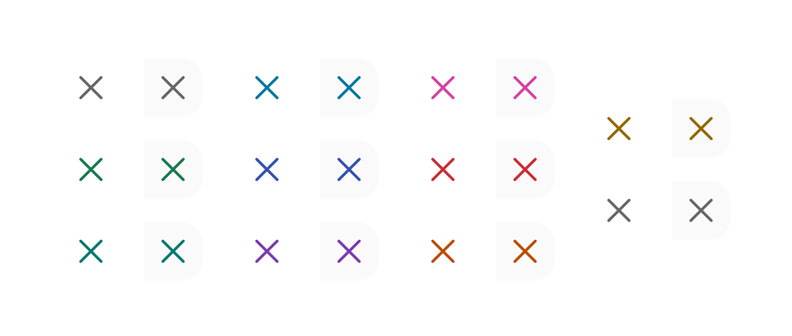

# Tag Remove Button

> The dismiss button rendered inside a removable Tag, providing a `20×20px` hit area for the x-mark action.

 

[View in Figma →](https://www.figma.com/design/7jCMwDng7HF5g7F3tGXf0E/Open-HR?node-id=910-21136)


---

## Overview

Tag Remove Button is the sub-component rendered at the right edge of a [Tag](./Tag.md) when `removable=true`. It is a `20×20px` interactive area centred around a `14×14px` x-mark icon, colour-matched to the tag's colour theme. It is not used standalone.

**Available in:** React · Next.js · Figma (`🏷️ Tags/.Subcomponents/Remove-button`)


---

## Anatomy

| Part | Description |
|------|-------------|
| Hit area | `20×20px` transparent container, the full size of the remove button, flush with the right edge of the tag. This oversized area ensures a comfortable touch target. |
| Icon | `icon/x-mark` at `14×14px`. Centred within the hit area. Colour matches the tag's colour theme. |
| X-mark vector | `~7.9×7.9px` visual mark inside the icon. |


---

## Spacing tokens

| Property | Value | Token |
|----------|-------|-------|
| Hit area size | `20×20px` | —     |
| Icon size | `14×14px` | —     |
| X-mark visual size | `~7.9×7.9px` | —     |


---

## Variants

### State (`state`)

| Value | Figma value | Visual change |
|-------|-------------|---------------|
| `rest` | `rest`      | Icon visible; colour matches tag theme |
| `hover` | `hover`     | Subtle background shift on the hit area |

### Colour (`color` / Figma: `🎨 color`)

Matches the 11 colours defined on the parent [Tag](./Tag.md). The x-mark icon colour is derived from the tag's colour theme, you do not set this independently; the parent Tag passes the colour through.

| Value | Figma value |
|-------|-------------|
| `empty` | `🫥 Empty`  |
| `green` | `💚 green`  |
| `teal` | `🧤 Teal`   |
| `aqua` | `🩵 aqua`   |
| `blue` | `💙 Blue`   |
| `purple` | `💜 Purple` |
| `grey` | `🩶 Grey`   |
| `yellow` | `💛 Yellow` |
| `red` | `❤️ Red`    |
| `fuchsia` | `🪷 Fuchsia` |
| `orange` | `🧡 Orange` |


---

## States

| State | Trigger | Visual change |
|-------|---------|---------------|
| Rest  | Default | Icon colour matches tag theme; no background fill on hit area |
| Hover | Pointer enters the `20×20px` area | Hit area shows `color/black/15` background tint, consistent across all 11 colours |

⚠️ **No Focus state is defined in Figma.** The remove button must show a visible focus ring (2px outline, 2px offset) when reached by keyboard. <!-- TODO: confirm focus ring colour with design -->


---

## Usage guidelines

**Do** always pair the remove button with an `aria-label` that names the tag being removed: `"Remove Engineering"`. The x-mark icon alone conveys nothing to screen reader users.

**Don't** use this sub-component standalone, it must appear inside a [Tag](./Tag.md).

**Do** ensure the full `20×20px` area is the interactive target, not just the visible `~7.9px` icon. The larger hit area is critical for touch usability.


---

## Accessibility

* Renders as a `<button>` element.
* `aria-label` must be `"Remove [tag label]"` (e.g. `"Remove Full-time"`). Supplied by the parent [Tag](./Tag.md).
* `type="button"` to prevent accidental form submission.
* Focus ring: 2px outline, 2px offset. <!-- TODO: confirm with design -->


---

## Animation

| Trigger | From → To | Transition | Duration | Easing |
|---------|-----------|------------|----------|--------|
| Hover (while hovering) | `rest` → `hover` | Smart Animate | `150ms`  | Ease Out |

Figma uses the `ON_HOVER` trigger (auto-reverts on pointer exit), so the same `150ms` Ease Out applies in both directions.

> **Disabled state:** No transition is defined into or out of `Disabled` in Figma — implement it as an instant swap.

### Implementation reference

```css
/* ON_HOVER auto-reverts: same 150ms ease-out both directions */
.tag-remove-button {
  transition: background-color 150ms ease-out;
}
```


---

## Props / API

```ts
interface TagRemoveButtonProps {
  color?: 'empty' | 'red' | 'green' | 'teal' | 'aqua' | 'blue' | 'purple' | 'grey' | 'yellow' | 'fuchsia' | 'orange'
  state?: 'rest' | 'hover'
  onClick?: React.MouseEventHandler<HTMLButtonElement>
  'aria-label': string
  className?: string
}
```

| Prop | Type | Default | Required | Description |
|------|------|---------|----------|-------------|
| `color` | `'empty' \| 'red' \| 'green' \| 'teal' \| 'aqua' \| 'blue' \| 'purple' \| 'grey' \| 'yellow' \| 'fuchsia' \| 'orange'` | `'empty'` | No       | Icon colour theme. Passed automatically by parent Tag. Figma: `🎨 color` |
| `state` | `'rest' \| 'hover'` | `'rest'` | No       | Visual state. Managed by browser `:hover`, set explicitly only for testing. |
| `onClick` | `React.MouseEventHandler<HTMLButtonElement>` | —       | No       | Called when the button is clicked |
| `aria-label` | `string` | —       | **Yes**  | Accessible label: `"Remove [tag label]"`. Required, the icon has no text. |
| `className` | `string` | —       | No       | Additional CSS class |


---

## Code examples

How the parent Tag wires this sub-component:

```tsx
// Next.js (App Router), Client Component
'use client'

function Tag({ label, color = 'empty', removable, onRemove }: TagProps) {
  return (
    <div className={`tag tag--${color}`}>
      <span className="tag__label">{label}</span>
      {removable && (
        <TagRemoveButton
          color={color}
          aria-label={`Remove ${label}`}
          onClick={onRemove}
        />
      )}
    </div>
  )
}
```

```tsx
// React
function Tag({ label, color = 'empty', removable, onRemove }: TagProps) {
  return (
    <div className={`tag tag--${color}`}>
      <span className="tag__label">{label}</span>
      {removable && (
        <TagRemoveButton
          color={color}
          aria-label={`Remove ${label}`}
          onClick={onRemove}
        />
      )}
    </div>
  )
}
```


---

## Related components

* [Tag](./Tag.md), the parent component that renders this sub-component
* [Chip Remove Button](./Chip%20Remove%20Button.md), the analogous remove button for Chip components