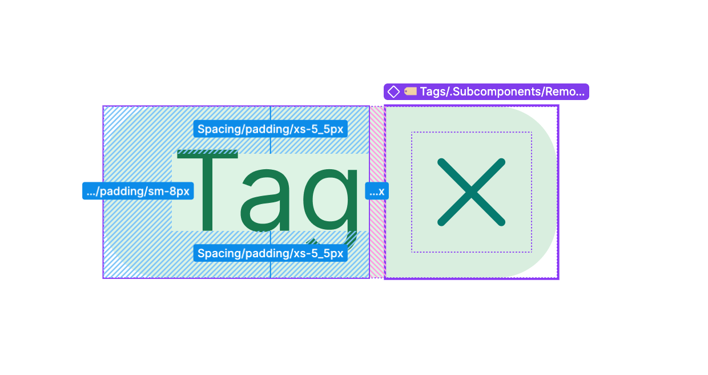

# Tag

> A compact coloured label used to categorise, classify, or surface the status of content.

 

[View in Figma →](https://www.figma.com/design/7jCMwDng7HF5g7F3tGXf0E/Open-HR?node-id=912-21312)


---

## Overview

Tag is a display component that communicates metadata, a job category, a skill, a department, a status, in a compact pill shape. It comes in 11 colours to support semantic colour-coding across different classification systems, and it can optionally carry a remove button for use inside input fields or filter bars.

With a fixed height of `20px`. Tags have no interactive states on the container itself, the only interactive element is the optional ***remove button***. For interactive selection chips that combine an avatar with a label and richer states, use [Chip](./Chip.md) .

**Available in:** React · Next.js · Figma (`🏷️ Tags`)


---

## Anatomy

| Part | Description |
|------|-------------|
| Container | `20px` tall pill with `Spacing/radius/sm-7px` border-radius and a colour-tinted background. Padding: `Spacing/padding/xs-5_5px` top/bottom, `Spacing/padding/sm-8px` left/right. |
| Label | The text string. Colour-matched to the tag's colour theme. |
| Remove button | Optional `20×20px` hit area containing a `14×14px` x-mark icon. Only present when `removable=true`. See [Tag Remove Button](./Tag%20Remove%20Button.md). |


---

## Spacing tokens

| Property | state: Without remove button | state: With remove button | Token |
|----------|------------------------------|---------------------------|-------|
| Padding top / bottom | `Spacing/padding/xs-5_5px`   | `Spacing/padding/xs-5_5px` (label frame only) | `Spacing/padding/xs-5_5px` |
| Padding left | `Spacing/padding/sm-8px`     | `Spacing/padding/sm-8px` (label frame) | `Spacing/padding/sm-8px` |
| Padding right | `Spacing/padding/sm-8px`     | `0px` (no right pad, remove button fills edge) | —     |
| Corner radius | `Spacing/radius/sm-7px`      | `Spacing/radius/sm-7px`   | `Spacing/radius/sm-7px` |
| Height   | `20px`                       | `20px`                    | —     |
| Gap (label frame → remove button) | —                            | `Spacing/gap/xs-2px`      | —     |
| Remove button size | —                            | `20×20px`                 | —     |
| Remove button icon | —                            | `14×14px` (x-mark)        | —     |
| Border (Empty Tags only) | `1px solid` `border/tags/empty` | `1px solid` `border/tags/empty` | —     |


---

## Variants

### Colour (`color` / Figma: `🎨 color`)

Colour controls both the background tint and the label and icon colours. Use semantic colour assignments consistently across the product, don't assign colours arbitrarily.

| Value | Figma value | Background | Text / icon colour | Suggested semantic use |
|-------|-------------|------------|--------------------|------------------------|
| `empty` | `🫥 Empty`  | `bg/tags/empty` + `1px border/tags/empty` | `text/tags/empty`  | Default / unclassified |
| `red` | `❤️ Red`    | `bg/tags/red` | `text/tags/red`    | Urgent, overdue, error status |
| `green` | `💚 Green`  | `bg/tags/green` | `text/tags/green`  | Active, complete, approved |
| `teal` | `🧤 Teal`   | `bg/tags/teal` | `text/tags/teal`   | In-progress, pending review |
| `aqua` | `🩵 Aqua`   | `bg/tags/aqua` | `text/tags/aqua`   | New, informational     |
| `blue` | `💙 Blue`   | `bg/tags/blue` | `text/tags/blue`   | Assigned, linked       |
| `purple` | `💜 Purple` | `bg/tags/purple` | `text/tags/purple` | Draft, trial           |
| `grey` | `🪶 Grey`   | `bg/tags/grey` | `text/tags/grey`   | Inactive, archived, closed |
| `yellow` | `💛 Yellow` | `bg/tags/yellow` | `text/tags/yellow` | At-risk, awaiting action |
| `fuchsia` | `Fuchsia`   | `bg/tags/fuchsia` | `text/tags/fuchsia` | Custom category / highlight |
| `orange` | `Orange`    | `bg/tags/orange` | `text/tags/orange` | Warning, expiring soon |

**Note:** Only `empty` has a border, all other colours use a coloured background fill with no stroke.

**Do** define a colour → meaning mapping at the product level and apply it consistently. Don't let different screens use `green` for different statuses.

### Removable (`removable` / Figma: `removable?`)

| Value | Figma value | Description |
|-------|-------------|-------------|
| `false` | `No`        | Display-only tag, no remove action |
| `true` | `Yes`       | Carries a [Tag Remove Button](./Tag%20Remove%20Button.md) . Used in input fields and filter bars where the user can dismiss a tag. |

### Weight (`weight` / Figma: `🏋️‍♂️ medium?`)

| Value | Figma value | Description |
|-------|-------------|-------------|
| `regular` | `No`        | Default label font weight |
| `medium` | `Yes`       | Medium-weight label text, use for emphasis or primary categorisation |


---

## States

Tag is a display component, the container has no hover, focus, or active state. Only the remove button (when visible) is interactive. See  [Tag Remove Button](./Tag%20Remove%20Button.md) for remove button states.

| Part | State | Trigger | Visual change |
|------|-------|---------|---------------|
| Remove button | Rest  | Default | X-mark icon visible; colour matches tag theme |
| Remove button | Hover | Pointer enters remove button | Background shift on the 20×20px area |

⚠️ **No focus state is defined on the tag container in Figma.** When `removable=true`, the remove button must be keyboard-focusable and show a visible focus ring (2px outline, 2px offset). <!-- TODO: confirm focus ring colour with design -->


---

## Usage guidelines

**Do** use Tags to label content that belongs to a category, has a status, or carries a classification the user should recognise at a glance.

**Don't** use Tags as buttons or navigation, they are labels, not actions. For interactive filtering, use [Chip](./Chip.md).

**Do** use `removable=true` inside [Input Selection](/doc/a750cc02-b3b9-4ab3-a7a5-257474da7357) when the user has selected a value and should be able to deselect it.

**Don't** use `removable=true` on tags that are read-only display data (e.g. a tag on a job card showing the department, users should not be able to remove it there).

**Do** keep tag labels short, ideally one or two words. Tags are not sentences.

**Don't** use more than 5–6 tags on a single item. If more are needed, show 3–4 and collapse the rest behind a count indicator.

**Do** keep colour assignments consistent. If `green` = "Active" in one table, it must mean "Active" everywhere in the product.


---

## Content guidelines

* Always sentence case: "Full-time", not "FULL-TIME" or "full-time".
* One concept per tag. Don't combine status and category in a single tag label ("Active/Engineering").
* Keep labels to 1–2 words wherever possible. The component has no defined maximum width, extremely long labels will expand the container.
* Error states: don't use a tag to display a validation error, use [Helper Text](/doc/40b6cfc1-eda5-404e-9ef2-62e28da64ca8) for that.


---

## Behaviour in context

**Inside Input Selection:** Tags render at `20px` height within the selection field when one or more values are selected. The `with-selection` variant of [Selection Field (sub-component)](/doc/76156f5a-ae53-40e5-9f9d-0019291052c7) displays these tags inline. Removable tags allow deselection without opening the dropdown again.

**In data tables or cards:** Tags appear as non-removable display labels next to content metadata. Multiple tags on one item should be laid out in a wrapping flex row with `Spacing/gap/xs-4px` gap.

**Filter bars:** `removable=true` tags in a filter summary bar let users see and dismiss active filters without opening the filter panel.


---

## Accessibility

* A non-removable tag is a display element, render as a `<span>`. No role or keyboard interaction needed.
* When `removable=true`, the remove button must be a `<button>` with `aria-label="Remove [tag label]"` (e.g. `"Remove Engineering"`).
* Do not render the container as a `<button>` unless clicking the whole tag triggers an action (e.g. navigating to a filtered view). In that case, add `role="button"` or use a `<button>` element with `tabIndex={0}`.
* Colour alone must not be the only way to convey meaning. Always pair colour with a text label, the label is the primary carrier of information.


---

## Props / API

```ts
interface TagProps {
  label: string
  color?: 'empty' | 'red' | 'green' | 'teal' | 'aqua' | 'blue' | 'purple' | 'grey' | 'yellow' | 'fuchsia' | 'orange'
  removable?: boolean
  weight?: 'regular' | 'medium'
  onRemove?: () => void
  'aria-label'?: string
  className?: string
}
```

| Prop | Type | Default | Required | Description |
|------|------|---------|----------|-------------|
| `label` | `string` | —       | **Yes**  | The text displayed inside the tag. Figma: `✏️ Text` |
| `color` | `'empty' \| 'red' \| 'green' \| 'teal' \| 'aqua' \| 'blue' \| 'purple' \| 'grey' \| 'yellow' \| 'fuchsia' \| 'orange'` | `'empty'` | No       | Background and text colour theme. Figma: `🎨 color` |
| `removable` | `boolean` | `false` | No       | Renders the remove button. Figma: `removable?` |
| `weight` | `'regular' \| 'medium'` | `'regular'` | No       | Label font weight. Figma: `🏋️‍♂️ medium?` (`No` = regular, `Yes` = medium) |
| `onRemove` | `() => void` | —       | No       | Called when the remove button is clicked. Required when `removable=true`. |
| `aria-label` | `string` | —       | No       | Accessible name for the tag when the visual label alone is not sufficient context |
| `className` | `string` | —       | No       | Additional CSS class |


---

## Code examples

```tsx
// Next.js (App Router), Client Component
'use client'

// Display tag, status label on a job card
<Tag label="Active" color="green" />

// Category tag with medium weight
<Tag label="Engineering" color="blue" weight="medium" />

// Removable tag inside an input field
<Tag
  label="Full-time"
  color="teal"
  removable
  onRemove={() => removeFilter('employment', 'full-time')}
/>

// Rendering a set of tags with controlled colour assignment
const STATUS_COLOURS: Record<string, TagProps['color']> = {
  active: 'green',
  inactive: 'grey',
  pending: 'yellow',
  overdue: 'red',
}

<Tag label={status} color={STATUS_COLOURS[status] ?? 'empty'} />

// Accessible removable tag, remove button gets descriptive aria-label
<Tag
  label="Engineering"
  color="blue"
  removable
  onRemove={() => removeTag('Engineering')}
  // The remove button renders: <button aria-label="Remove Engineering">
/>
```

```tsx
// React
// Display tag, status label on a job card
<Tag label="Active" color="green" />

// Category tag with medium weight
<Tag label="Engineering" color="blue" weight="medium" />

// Removable tag inside an input field
<Tag
  label="Full-time"
  color="teal"
  removable
  onRemove={() => removeFilter('employment', 'full-time')}
/>

// Rendering a set of tags with controlled colour assignment
const STATUS_COLOURS: Record<string, TagProps['color']> = {
  active: 'green',
  inactive: 'grey',
  pending: 'yellow',
  overdue: 'red',
}

<Tag label={status} color={STATUS_COLOURS[status] ?? 'empty'} />

// Accessible removable tag, remove button gets descriptive aria-label
<Tag
  label="Engineering"
  color="blue"
  removable
  onRemove={() => removeTag('Engineering')}
  // The remove button renders: <button aria-label="Remove Engineering">
/>
```


---

## Related components

* [Tag Remove Button](./Tag%20Remove%20Button.md), the remove button sub-component rendered inside removable tags
* [Chip](./Chip.md), interactive avatar+label chip with full interaction states; use when the item represents a person or entity the user can click
* [Selection Field](/doc/935cdb9e-a652-46d4-849e-dc344de6b315), input field that renders selected values as Tags
* [Input Selection](/doc/7483c753-5973-4739-8dfc-d934d4641b32), full composite for multi-select inputs using Tags