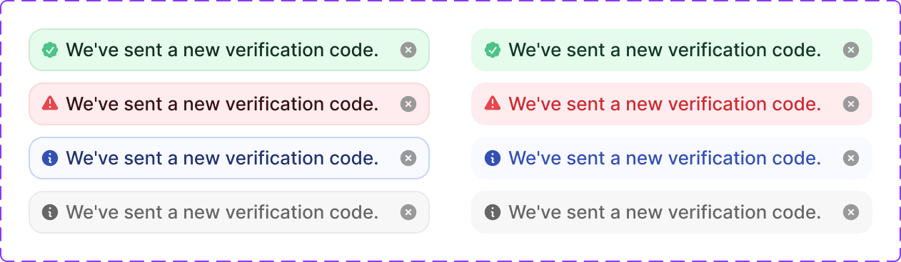

# Banner Small

> A compact inline notification strip that communicates a brief status message with optional dismiss.

 

[View in Figma →](https://www.figma.com/design/7jCMwDng7HF5g7F3tGXf0E/Open-HR?node-id=2785-34165)


---

## Overview

Banner Small is a compact, single-line feedback component used to communicate a status message, success, error, or informational, within a local UI region. Unlike a full-page alert or toast, it lives inline within a form, card, or section and does not interrupt the user's flow.

It always contains an icon (determined by the `state`) and a short message. A dismiss button is included by default and can be suppressed.

**This is a display component.** The banner itself has no interactive states. Only the close button is interactive.

**Available in:** React · Next.js · Figma


---

## Anatomy

| Part | Description |
|------|-------------|
| Container | Outer pill-shaped frame. Fixed height `30px`. Width fills the parent container. `border-radius: Spacing/radius/lg-10px`. `border: 1px`. |
| Content frame | Inner layout frame, with a Padding of `Spacing/padding/sm-8px` on all sides. Horizontal gap `Spacing/gap/xs-4px` between icon and message. |
| Status icon | A `14×14px` icon determined by `state`. Always present, cannot be removed or overridden. Each state has its own icon. |
| Message | The status text. Takes all remaining horizontal space between the icon and close button. |
| Close button | An Icon Button (`24×24px`) anchored to the right with a `3px` inset from the container edge. Toggled by `showCloseButton` (default `true`). |
| Outline | A `1px` border visible when `outline=true`. Hidden when `outline=false`, giving a filled-only appearance. |

**Width note:** The container width is flexible (but always hug the text). The fixed parts are: `padding/sm-8px` + `14px` icon + `Spacing/gap/xs-4px` gap + `[message text]` + `24px` close button + `3px` right padding = minimum \~53px before text.


---

## Spacing tokens

| Property | Value | Token |
|----------|-------|-------|
| Border radius | `Spacing/radius/lg-10px` | `Spacing/radius/lg-10px` |
| Padding (all sides, content frame) | `Spacing/padding/sm-8px` | `Spacing/padding/sm-8px` |
| Gap (icon → message) | `Spacing/gap/xs-4px` | `Spacing/gap/xs-4px` |
| Close button right inset | `Spacing/padding/xs-3px` | `Spacing/padding/xs-3px` |
| Height   | `30px` | —     |
| Border width | `1px` for  `outline=true` | —     |
| Icon size | `14×14px` | —     |
| Close button size | `24×24px` | —     |


---

## Variants

### State (`state` / Figma: `state`)

The `state` prop controls both the colour scheme and the status icon. It is not an interactive state.

| Value | Figma value | When to use |
|-------|-------------|-------------|
| `rest` | `rest`      | Neutral/default, no semantic colour. Use for generic system messages with no positive or negative connotation. |
| `success` | `Success`   | A user action completed successfully: form submitted, record saved, verification sent. |
| `error` | `Error`     | An action failed or requires the user's attention: submission failed, connection lost, invalid input. |
| `info` | `Info`      | Contextual information the user should know but doesn't need to act on immediately. |

> **Note on Figma casing:** Figma uses `rest` (lowercase) but `Success`, `Error`, `Info` (title case). The API normalises to lowercase for all values.

### Outline (`outline` / Figma: `outline`)

| Value | Figma value | When to use |
|-------|-------------|-------------|
| `true` | `Yes`       | On white or light backgrounds where the banner needs a visible boundary |
| `false` | `No`        | On coloured or patterned backgrounds, or when the banner's fill colour is sufficient to define its edge |

**All 8 combinations** (4 states × 2 outline values) are defined in Figma and are valid.

### Close button (`showCloseButton` / Figma: `👀 close button`)

| Value | Figma default | When to use |
|-------|---------------|-------------|
| `true` | Yes           | The user can dismiss this banner, most cases |
| `false` | —             | The banner must persist (e.g. a blocking error that requires action before continuing) |


---

## States

Banner Small has no interactive states of its own (no hover, focus, or disabled on the container). The `state` prop is a **semantic** state, not an interactive one.

The close button inherits its interactive states from the Icon Button component (Rest, Hover, Focus, Pressed, Disabled).


---

## Usage guidelines

**Do** use Banner Small for feedback that belongs inline within a specific UI section, within a form, below a card action, or inside a step of a multi-step flow. **Don't** use Banner Small for system-wide or page-level alerts, use a full Banner or Toast instead.

**Do** use `state="success"` immediately after a user action completes, "Verification code sent", "Changes saved". **Don't** use `state="success"` for general informational content that isn't in response to an action.

**Do** use `state="error"` when an action failed or the user cannot proceed, "Upload failed", "Connection error". **Don't** use `state="error"` for warnings or non-blocking notices, use `state="info"` or `state="rest"` instead.

**Do** set `showCloseButton={false}` when the banner communicates a condition the user must resolve before proceeding. **Don't** make a non-dismissible banner for messages the user can safely ignore, always allow dismissal.

**Do** keep the message to one line. Banner Small is `30px` tall and designed for a single short sentence. **Don't** put multi-line or complex content in a Banner Small, use a full Banner component for detailed messages.

**Do** use `outline={true}` on white or light-grey backgrounds. **Don't** use `outline={false}` on white backgrounds, the banner will appear to float without a clear boundary.


---

## Content guidelines

* **Keep it to one sentence**, the fixed 30px height can only accommodate a single line of text
* **Sentence case**, "We've sent a new verification code.", not "Verification Code Sent"
* **Actionable for errors**, tell the user what happened and what to do: "Upload failed. Try again or use a different file."
* **Past tense for success**, "Changes saved", "Code sent", "Member removed"
* **No redundant "successfully"**, "Changes saved", not "Changes saved successfully"
* **No trailing period** for very short messages (≤ 5 words); use a period for complete sentences


---

## Behaviour in context

**Inline within a form:** Place the Banner Small below the form action that triggered it or sometimes above the form block, below the submit button, or directly above the specific field group that has an error. Don't float it to the top of the page.

**After an async action:** Show the banner after the action resolves. Use a brief entrance animation (fade or slide-down) to draw attention. Auto-dismiss `success` banners after 3–5 seconds if the message is confirmation-only and requires no action.

**Non-dismissible error state:** When `showCloseButton={false}`, the banner should persist until the underlying condition is resolved, e.g. a failed payment method that blocks checkout.

**Width:** The banner fills its parent container's width. If the parent is narrow (< \~200px), the message text may be truncated, ensure the parent has enough width to display the shortest expected message without wrapping.


---

## Accessibility

* `**role="status"**` **or** `**role="alert"**`, Use `role="alert"` for `error` state (announces immediately to screen readers). Use `role="status"` for `success` and `info` (polite announcement that doesn't interrupt). Use `role="status"` for `rest`.
* `**aria-live**`, Follows from role: `aria-live="assertive"` for error, `aria-live="polite"` for success/info/rest.
* `**aria-atomic="true"**`, Set on the container so screen readers announce the full message when it updates, not just the changed portion.
* **Icon**, The status icon is decorative. Set `aria-hidden="true"` on it, the message text must convey the status without relying on the icon.
* **Close button**, Use `aria-label="Dismiss notification"` on the Icon Button. When the banner is dismissed, move focus to a logical next element (usually the element that triggered the action).
* `**aria-describedby**`, If the banner is associated with a specific form field or region, point to it with `aria-describedby`.
* **Colour alone**, Each state uses both colour and a distinct icon. Ensure the message text also communicates the status, don't rely on colour or icon alone.


---

## Props / API

```ts
interface BannerSmallProps {
  state?: 'rest' | 'success' | 'error' | 'info'
  outline?: boolean
  showCloseButton?: boolean
  onClose?: () => void
  children: React.ReactNode
  className?: string
}
```

| Prop | Type | Default | Required | Description |
|------|------|---------|----------|-------------|
| `children` | `ReactNode` | —       | **Yes**  | The banner message. Keep to one sentence, the component is `30px` tall. |
| `state` | `'rest' \| 'success' \| 'error' \| 'info'` | `'rest'` | No       | Semantic state. Controls colour scheme and status icon. |
| `outline` | `boolean` | `true`  | No       | Shows the `1px` border. Use `true` on light backgrounds, `false` on coloured backgrounds. |
| `showCloseButton` | `boolean` | `true`  | No       | Shows the dismiss Icon Button. Set `false` for errors that must be resolved before proceeding. |
| `onClose` | `() => void` | —       | No       | Fires when the close button is clicked. Use to remove the banner from the DOM. |
| `className` | `string` | —       | No       | Additional CSS class for width/margin overrides. Don't use to override visual state, use `state` and `outline`. |


---

## Code examples

### Success, after an async action

```tsx
// Next.js (App Router), Client Component
'use client'

const [banner, setBanner] = useState<'success' | 'error' | null>(null)

async function handleResendCode() {
  try {
    await resendVerificationCode()
    setBanner('success')
  } catch {
    setBanner('error')
  }
}

{banner === 'success' && (
  <BannerSmall
    state="success"
    onClose={() => setBanner(null)}
  >
    We've sent a new verification code.
  </BannerSmall>
)}

{banner === 'error' && (
  <BannerSmall
    state="error"
    onClose={() => setBanner(null)}
  >
    Failed to send code. Please try again.
  </BannerSmall>
)}
```

```tsx
// React
const [banner, setBanner] = useState<'success' | 'error' | null>(null)

async function handleResendCode() {
  try {
    await resendVerificationCode()
    setBanner('success')
  } catch {
    setBanner('error')
  }
}

{banner === 'success' && (
  <BannerSmall
    state="success"
    onClose={() => setBanner(null)}
  >
    We've sent a new verification code.
  </BannerSmall>
)}

{banner === 'error' && (
  <BannerSmall
    state="error"
    onClose={() => setBanner(null)}
  >
    Failed to send code. Please try again.
  </BannerSmall>
)}
```

### Error, non-dismissible (blocking)

```tsx
// Next.js (App Router), Server Component
// No 'use client' directive needed, this component carries no browser state.

<BannerSmall
  state="error"
  showCloseButton={false}
  role="alert"
>
  Payment method declined. Update your card to continue.
</BannerSmall>
```

```tsx
// React
<BannerSmall
  state="error"
  showCloseButton={false}
  role="alert"
>
  Payment method declined. Update your card to continue.
</BannerSmall>
```

### Info, without outline (on a coloured background)

```tsx
// Next.js (App Router), Server Component
// No 'use client' directive needed, this component carries no browser state.

<BannerSmall
  state="info"
  outline={false}
  onClose={() => setInfoDismissed(true)}
>
  Your session will expire in 5 minutes.
</BannerSmall>
```

```tsx
// React
<BannerSmall
  state="info"
  outline={false}
  onClose={() => setInfoDismissed(true)}
>
  Your session will expire in 5 minutes.
</BannerSmall>
```

### Rest, neutral system message

```tsx
// Next.js (App Router), Server Component
// No 'use client' directive needed, this component carries no browser state.

<BannerSmall
  state="rest"
  onClose={handleDismiss}
>
  Syncing your data with the server.
</BannerSmall>
```

```tsx
// React
<BannerSmall
  state="rest"
  onClose={handleDismiss}
>
  Syncing your data with the server.
</BannerSmall>
```

### Auto-dismiss success

```tsx
// Next.js (App Router), Client Component
'use client'

useEffect(() => {
  if (showSuccess) {
    const timer = setTimeout(() => setShowSuccess(false), 4000)
    return () => clearTimeout(timer)
  }
}, [showSuccess])

{showSuccess && (
  <BannerSmall state="success" onClose={() => setShowSuccess(false)}>
    Changes saved.
  </BannerSmall>
)}
```

```tsx
// React
useEffect(() => {
  if (showSuccess) {
    const timer = setTimeout(() => setShowSuccess(false), 4000)
    return () => clearTimeout(timer)
  }
}, [showSuccess])

{showSuccess && (
  <BannerSmall state="success" onClose={() => setShowSuccess(false)}>
    Changes saved.
  </BannerSmall>
)}
```


---

## Related components

* **Toast**, Use for system-wide or page-level notifications that appear outside the current content area (🚧 WIP)
* **Banner**, Use for multi-line alerts or banners that need more detail and vertical space (🚧 WIP)
* [Helper Text](/doc/40b6cfc1-eda5-404e-9ef2-62e28da64ca8), Use for persistent inline guidance directly below a form field, not for status feedback