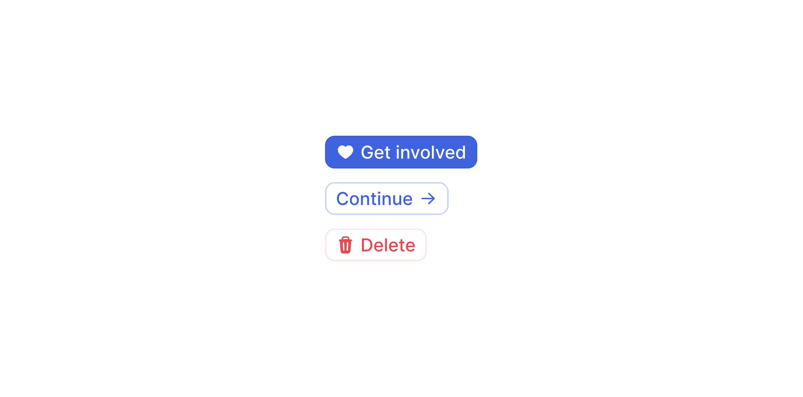

# Button

> Triggers an action or event, such as submitting a form, confirming a decision, or navigating to a new context.

 [View in Figma →](https://www.figma.com/design/7jCMwDng7HF5g7F3tGXf0E/Open-HR?node-id=549-36986)


---

## Overview

Button is the primary interactive element for user-initiated actions. It comes in **three hierarchy levels (Primary, Secondary, Tertiary), three accent colours (Default, Blue, Red), and two sizes (sm, md)**, giving 18 valid combinations across all states.

Every button requires a visible label. Use the label to describe the outcome of the action, not the mechanism (e.g. "Save changes", not "Click here"). If you need an icon-only action, use the Icon Button component instead.

**Available in:** React · Next.js · Figma

> **Note on prop naming:** Icon props are named `iconPrefix` / `iconSuffix` on Button and Flow Button, but `iconLeft` / `iconRight` on Text Button, and `icon` on Icon Button. This inconsistency exists in the current API, use the exact names documented for each component.


---

## Anatomy

| Part | Description |
|------|-------------|
| Container | Outer frame, sets background, border (`1px`), border-radius (`Spacing/radius/sm-7px`), and horizontal padding (`Spacing/padding/sm-8px`). Height is fixed at `24px` (sm) or `32px` (md). |
| Label | Required text, passed as `children`. Inter Medium, 13px, line-height 19.5px. Horizontally centred between any icons. |
| Left icon | Optional leading icon (`14×14px`). Toggled by passing `iconPrefix`. Gap between icon and label: `Spacing/gap/xs-4px`. |
| Right icon | Optional trailing icon (`14×14px`). Toggled by passing `iconSuffix`. Gap between icon and label: `Spacing/gap/xs-4px`. |


---

## Spacing tokens

| Property | Value/Token |
|----------|-------------|
| Horizontal padding | `Spacing/padding/sm-8px` (both sizes) |
| Icon-to-label gap | `Spacing/gap/xs-4px` |
| Border radius | `Spacing/radius/sm-7px` |
| Height (sm) | `24px`      |
| Height (md) | `32px`      |
| Icon size | `14×14px`   |
| Border width | `1px`       |
| Font     | `Inter/Body/S/Medium` |


---

## Variants

### Variant, hierarchy

| Value | When to use |
|-------|-------------|
| `primary` | The single most important action in a view or section. Use only one Primary per focal area. |
| `secondary` | Supporting actions that sit alongside a Primary (e.g. "Cancel" next to "Save"). |
| `tertiary` | Low-emphasis actions, optional steps, inline controls, toolbar buttons, or actions that don't require immediate attention. |

### Accent, colour

| Value | When to use | Avoid when |
|-------|-------------|------------|
| `default` | Standard actions with no specific semantic meaning | —          |
| `blue` | Informational, confirmatory, or navigational actions that benefit from positive emphasis | The action is neutral or destructive |
| `red` | Destructive or irreversible actions (delete, remove, revoke) | The action can be undone, use `default` instead |

**Valid accent × variant combinations:** All 9 combinations (3 variants × 3 accents) exist in Figma and are valid. Use `red` intentionally, a Tertiary Red button is appropriate for a quiet destructive action in a list row, while a Primary Red is appropriate for a full-page confirmation of a destructive operation.

### Size

| Value | Height | When to use |
|-------|--------|-------------|
| `sm`  | `24px` | Data-dense contexts: tables, toolbars, inline actions, filter bars |
| `md`  | `32px` | Default, forms, modals, empty states, page-level calls to action |

Don't mix `sm` and `md` within the same action group.


---

## States

| State | Trigger | Visual change |
|-------|---------|---------------|
| `rest` | Default idle | Base background and border |
| `hover` | Pointer enters the button | Subtle background shift |
| `focus` | Keyboard focus (Tab) | Visible focus ring, must meet WCAG AA contrast |
| `pressed` | Pointer down / Space or Enter held | Button appears depressed |
| `disabled` | `disabled` prop is true | Reduced opacity; pointer-events none; not focusable |

All 3 variants × 3 accents × 2 sizes have all 5 states defined in Figma.

**On** `**loading**`**:** When `loading={true}`, the button is implicitly non-interactive, clicks are blocked and the cursor changes to default. You do not need to also pass `disabled`. If both are set, `disabled` takes visual precedence (disabled styling, not loading spinner).

**On** `**disabled**`**:** Only use when the action is temporarily unavailable *and* the reason is clear from context. If the user can't tell why a button is disabled, they're stuck. Consider a tooltip on hover or an inline explanatory message instead.


---

## Usage guidelines

**Do** use one Primary button per focal area to anchor the user's attention on the most important action. **Don't** place two Primary buttons side by side, competing primaries force the user to choose between equal-looking options.

**Do** use a Red accent for destructive actions that cannot be undone, "Delete record", "Revoke access", "Remove member". **Don't** use Red for actions that are reversible. It signals permanence and creates unnecessary stress.

**Do** match button size to the density of the surrounding UI, `sm` in tables, `md` in forms and modals. **Don't** mix `sm` and `md` in the same action group. Inconsistent sizing creates visual noise.

**Do** write labels as verb phrases that describe the outcome: "Save changes", "Invite member", "Delete record". **Don't** use vague labels like "OK", "Submit", or "Yes", they don't tell the user what will happen next.

**Do** use `loading={true}` while an async action is processing. The button blocks interaction automatically, don't also disable it. **Don't** silently disable the button after a click, always give the user feedback that their action was received.

**Do** use Tertiary for optional or secondary actions that shouldn't compete with the main flow. **Don't** use Tertiary as the only available action on a page, it won't draw enough attention to be discovered.

**Do** use `type="submit"` on the Primary button inside a `<form>` so it responds to the Enter key natively. **Don't** rely on `onClick` alone for form submission, it breaks keyboard-only and assistive technology workflows.


---

## Content guidelines

* **Always start with a verb**, "Save", "Delete", "Invite", "Export", "Cancel"
* **Be specific**, "Save changes" beats "Save"; "Delete record" beats "Delete"
* **Sentence case**, "Invite member", not "Invite Member"
* **Keep it short**, aim for 1–3 words; 5 words maximum
* **No punctuation**, no periods, exclamation marks, or ellipsis
* **Loading label**, update the label to reflect the in-progress state: "Saving…", "Deleting…"


---

## Behaviour in context

**In a form:** The Primary button should be `type="submit"`. Place it at the bottom-left of the form (left-aligned with the fields), with a Secondary "Cancel" to its right. Don't float buttons to the right on full-page forms, it breaks the reading flow.

**In a modal/dialog:** Place the Primary (confirm) button on the right and Secondary (cancel) on the left of the action row. For destructive modals, use Primary + Red accent for the confirm action.

**In a toolbar:** Use `sm` size. Prefer Tertiary for actions in an action group. Use Secondary only for the most prominent toolbar action.

**Full-width on mobile:** Buttons can be set to `width: 100%` in single-column mobile layouts. Use `md` for page-level CTAs, `sm` for inline mobile actions.

**Button groups:** Spacing between buttons is a layout concern, not a Button prop, use `gap: Spacing/gap/sm-8px` on the parent container. Never put more than one Primary in a group.


---

## Accessibility

* **Keyboard**, `Tab` / `Shift+Tab` to reach. `Space` or `Enter` to activate.
* **Focus state**, Always visible. Meets WCAG AA contrast for focus indicators.
* **Native element**, Renders as `<button>`. No additional `role` needed.
* **Disabled**, The `disabled` HTML attribute removes the element from the tab order and announces the state to screen readers. If you need the button to remain focusable while inactive (e.g. to show a tooltip explaining why), use `aria-disabled="true"` + manual `onClick` blocking instead.
* **Loading**, The component sets `aria-busy="true"` internally when `loading={true}`. Update the visible label to reflect in-progress state ("Saving…"), this is what screen readers announce.
* **Icon-only**, Buttons with icons but no label need `aria-label`. Use Icon Button instead.
* **Colour alone**, Don't rely solely on the Red accent to signal a destructive action. The label must make the consequence explicit.


---

## Animation

| Trigger | From → To | Transition | Duration | Easing |
|---------|-----------|------------|----------|--------|
| Mouse enter | `Rest` → `Hover` | Dissolve   | `100ms`  | Ease In |
| Mouse leave | `Hover` → `Rest` | Dissolve   | `100ms`  | Ease Out |
| Press   | `Hover` → `Pressed` | Dissolve   | `50ms`   | Ease Out |

Defined identically across all variants (Primary / Secondary / Tertiary), all accents (Default / Blue / Red), and both sizes (36 reaction nodes). No transition is defined into `Focus`.

> **Disabled state:** No transition is defined into or out of `Disabled` in Figma — implement it as an instant swap.

### Implementation reference

```css
.button {
  transition: background-color 100ms ease-in, border-color 100ms ease-in; /* hover in */
}
.button:not(:hover) {
  transition-timing-function: ease-out; /* hover out, 100ms */
}
.button:active {
  transition-duration: 50ms;
  transition-timing-function: ease-out; /* press */
}
```


---

## Props / API

```ts
interface ButtonProps {
  children: React.ReactNode
  variant?: 'primary' | 'secondary' | 'tertiary'
  accent?: 'default' | 'blue' | 'red'
  size?: 'sm' | 'md'
  iconPrefix?: React.ReactNode
  iconSuffix?: React.ReactNode
  disabled?: boolean
  loading?: boolean
  type?: 'button' | 'submit' | 'reset'
  onClick?: React.MouseEventHandler<HTMLButtonElement>
  'aria-label'?: string
  'aria-describedby'?: string
  ref?: React.Ref<HTMLButtonElement>
  className?: string
}
```

| Prop | Type | Default | Required | Description |
|------|------|---------|----------|-------------|
| `children` | `ReactNode` | —       | **Yes**  | The button label. Always visible text, don't pass only icons here. |
| `variant` | `'primary' \| 'secondary' \|`<br>`'tertiary'` | `'primary'` | No       | Visual hierarchy |
| `accent` | `'default' \| 'blue' \| 'red'` | `'default'` | No       | Colour accent, use `red` for destructive actions |
| `size` | `'sm' \| 'md'` | `'md'`  | No       | Height: `sm` = 24px, `md` = 32px |
| `iconPrefix` | `ReactNode` | —       | No       | Icon before the label (14×14px). Pass `null` to suppress. |
| `iconSuffix` | `ReactNode` | —       | No       | Icon after the label (14×14px). Pass `null` to suppress. |
| `disabled` | `boolean` | `false` | No       | Removes from tab order; announces to screen readers. For focusable-but-inactive, use `aria-disabled` instead. |
| `loading` | `boolean` | `false` | No       | Blocks interaction and shows spinner. Implicitly non-interactive, do not also set `disabled`. |
| `type` | `'button' \| 'submit' \| 'reset'` | `'button'` | No       | HTML button type. Always set `'submit'` inside `<form>`. |
| `onClick` | `React.MouseEventHandler`<br>`<HTMLButtonElement>` | —       | No       | Fired on click. For forms, prefer `type="submit"` over `onClick`. |
| `aria-label` | `string` | —       | No       | Overrides the accessible name. Only needed when the visible label is insufficient. |
| `aria-describedby` | `string` | —       | No       | Associates a description element, use to point to a tooltip explaining a disabled state. |
| `ref` | `React.Ref<HTMLButtonElement>` | —       | No       | Forwarded to the underlying `<button>` element. |
| `className` | `string` | —       | No       | Additional CSS class for layout overrides (width, margin). Don't use to override visual style, use `variant` and `accent`. |


---

## Code examples

### Default

```tsx
// Next.js (App Router), Client Component
'use client'

<Button variant="primary" onClick={handleSave}>
  Save changes
</Button>
```

```tsx
// React
<Button variant="primary" onClick={handleSave}>
  Save changes
</Button>
```

### With icons

```tsx
// Next.js (App Router), Server Component
// No 'use client' directive needed, this component carries no browser state.

<Button variant="primary" iconPrefix={<PlusIcon />}>
  Invite member
</Button>

<Button variant="secondary" iconSuffix={<ChevronDownIcon />}>
  Export
</Button>
```

```tsx
// React
<Button variant="primary" iconPrefix={<PlusIcon />}>
  Invite member
</Button>

<Button variant="secondary" iconSuffix={<ChevronDownIcon />}>
  Export
</Button>
```

### Destructive action

```tsx
// Next.js (App Router), Client Component
'use client'

<Button variant="primary" accent="red" onClick={handleDelete}>
  Delete record
</Button>
```

```tsx
// React
<Button variant="primary" accent="red" onClick={handleDelete}>
  Delete record
</Button>
```

### Loading state

```tsx
// Next.js (App Router), Client Component
'use client'

// The button blocks interaction automatically when loading, no need to also disable it.
<Button
  variant="primary"
  loading={isSaving}
  onClick={handleSave}
>
  {isSaving ? 'Saving…' : 'Save changes'}
</Button>
```

```tsx
// React
// The button blocks interaction automatically when loading, no need to also disable it.
<Button
  variant="primary"
  loading={isSaving}
  onClick={handleSave}
>
  {isSaving ? 'Saving…' : 'Save changes'}
</Button>
```

### Disabled with explanation

```tsx
// Next.js (App Router), Server Component
// No 'use client' directive needed, this component carries no browser state.

// Use aria-describedby to point to a tooltip that explains why the button is disabled.
<>
  <Button
    variant="primary"
    disabled
    aria-describedby="submit-reason"
  >
    Submit
  </Button>
  <span id="submit-reason" role="tooltip">
    Complete all required fields before submitting.
  </span>
</>
```

```tsx
// React
// Use aria-describedby to point to a tooltip that explains why the button is disabled.
<>
  <Button
    variant="primary"
    disabled
    aria-describedby="submit-reason"
  >
    Submit
  </Button>
  <span id="submit-reason" role="tooltip">
    Complete all required fields before submitting.
  </span>
</>
```

### Form submit

```tsx
// Next.js (App Router), Client Component
'use client'

<form onSubmit={handleSubmit}>
  {/* ...fields */}
  <div style={{ display: 'flex', gap: 8 }}>
    <Button type="submit" variant="primary">Create account</Button>
    <Button type="button" variant="secondary" onClick={onCancel}>Cancel</Button>
  </div>
</form>
```

```tsx
// React
<form onSubmit={handleSubmit}>
  {/* ...fields */}
  <div style={{ display: 'flex', gap: 8 }}>
    <Button type="submit" variant="primary">Create account</Button>
    <Button type="button" variant="secondary" onClick={onCancel}>Cancel</Button>
  </div>
</form>
```

### Small size in a toolbar

```tsx
// Next.js (App Router), Server Component
// No 'use client' directive needed, this component carries no browser state.

<div style={{ display: 'flex', gap: 8 }}>
  <Button variant="tertiary" size="sm" iconPrefix={<FilterIcon />}>Filter</Button>
  <Button variant="tertiary" size="sm" iconPrefix={<SortIcon />}>Sort</Button>
</div>
```

```tsx
// React
<div style={{ display: 'flex', gap: 8 }}>
  <Button variant="tertiary" size="sm" iconPrefix={<FilterIcon />}>Filter</Button>
  <Button variant="tertiary" size="sm" iconPrefix={<SortIcon />}>Sort</Button>
</div>
```


---

## Related components

* [Icon Button](/doc/6c30d09a-7648-4df4-87ed-846ff9820e40) , Use when the action has no visible text label (icon only)
* [Flow Button](/doc/55cd9250-8692-400b-b09b-369cf5abcefc) , Use when the action is part of a sequential step-based flow
* [Text Button](/doc/cc668bc8-b469-48d0-a4e0-bba4bdace532) , Use for inline navigational links within body copy
* **Modal**, See button placement guidelines in the Modal component docs (🚧TBB)