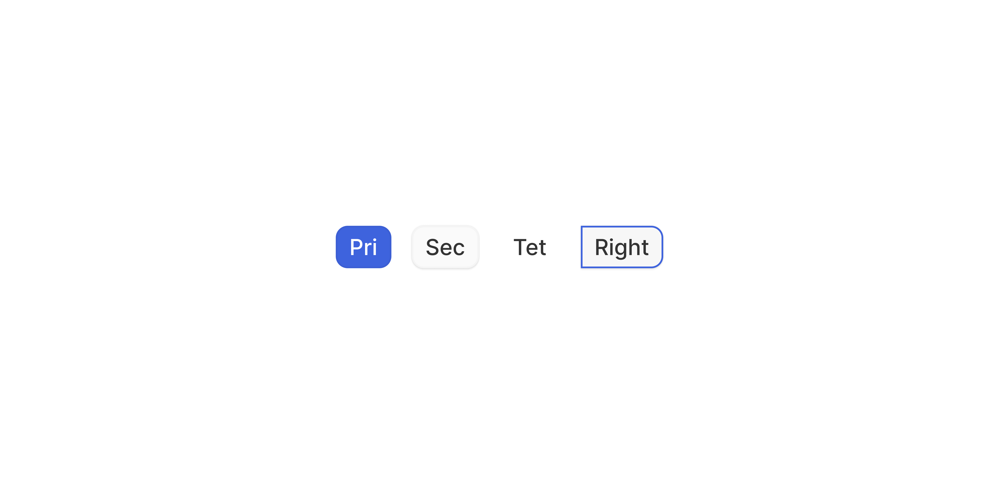

# Flow Button

> A button designed for use within step-based flows and pipelines, or areas where we need big button with a position-aware variant that sits flush against container edges.

 [View in Figma →](https://www.figma.com/design/7jCMwDng7HF5g7F3tGXf0E/Open-HR?node-id=1985-48157)


---

## Overview

Flow Button is a specialised variant of Button built for sequential, step-based UI, multi-step forms, pipeline builders, workflow editors, and progress flows. \n\nIts key distinction is the `position` prop: when set to `right`, **all** border-radius is removed so the button sits flush against the edge of an adjacent container.

It shares Button's three hierarchy levels (Primary, Secondary, Tertiary) but has three sizes (xs, sm, md) scaled to flow contexts, and no accent variants. Use standard Button for general actions; use Flow Button only when the action is part of a navigational or sequential flow.

**Available in:** React · Next.js · Figma

> **Note on size naming:** Flow Button's `sm` size is 32px tall, the same height as Button's `md`. These are different components for different contexts. Don't use this height overlap as a reason to swap them.

> **Note on prop naming:** Icon props are named `iconPrefix` / `iconSuffix` on Flow Button and Button, but `iconLeft` / `iconRight` on Text Button, and `icon` on Icon Button. Use the exact names documented for each component.


---

## Anatomy

| Part | Description |
|------|-------------|
| Container | Outer frame, sets background, border (`1px`), horizontal padding, and border-radius. Height is fixed per size. When `position="right"`, **all four corners** lose border-radius (not just the right side), the entire button becomes a rectangle to sit flush against an adjacent container edge. |
| Label | Required visible text, passed as `children`. Inter Medium. Font size varies: `13px` (xs) or `14px` (sm, md). |
| Left icon | Optional leading icon (`14×14px`). Toggled by passing `iconPrefix`. |
| Right icon | Optional trailing icon (`15×15px`). Toggled by passing `iconSuffix`. **Note:** `15px`, not `14px`, one pixel larger than Button's right icon and Flow Button's left icon. |


---

## Spacing tokens

| Property | xs (25px) | sm (32px) | md (40px) | Token |
|----------|-----------|-----------|-----------|-------|
| Height   | `25px`    | `32px`    | `40px`    | —     |
| Horizontal padding | `Spacing/padding/sm-8px` | `Spacing/padding/lg-10px` | `Spacing/padding/lg-12px` | —     |
| Icon-to-label gap | `Spacing/gap/xs-4px` | `Spacing/gap/sm-8px` | `Spacing/gap/sm-8px` | —     |
| Border radius (default) | `Spacing/radius/sm-7px` | `Spacing/radius/lg-10px` | `Spacing/radius/lg-10px` | —     |
| Border radius (`position="right"`) | `0px` right and all `Spacing/radius/sm-7px` other corners | `0px` right and all `Spacing/radius/lg-10px` other corners | `0px` right and all `Spacing/radius/lg-10px` other corners | —     |
| Border width | `1px`     | `1px`     | `1px`     | —     |
| Font size | `Inter/Body/S/Medium` | `Inter/Body/L/Medium` | `Inter/Body/L/Medium` | —     |
| Font weight | Medium (500) | Medium (500) | Medium (500) | —     |
| Left icon | `14×14px` | `14×14px` | `14×14px` | —     |
| Right icon | `15×15px` | `15×15px` | `15×15px` | —     |


---

## Variants

### Variant, hierarchy

| Value | When to use |
|-------|-------------|
| `primary` | The main progression action, "Continue", "Next step", "Submit" |
| `secondary` | Supporting flow actions, "Save draft", alternative paths |
| `tertiary` | Low-emphasis actions within a flow, "Back", optional steps, skippable actions |

No accent variants. Flow Button carries no destructive semantics, use standard Button with a confirmation dialog for destructive actions in flows.

### Position, edge attachment

| Value | Border radius | When to use |
|-------|---------------|-------------|
| `left` (default) | `7px` or `10px` on all corners | Standalone flow button, or the button does not attach to a container |
| `right` | `0px` on **all** corners | The button physically attaches to the right edge of a flow container (step card, pipeline node) creating a flush visual join |

**This prop is not CSS** `**position**`, it does not affect layout or stacking. It only controls border-radius to create a visual attachment. Layout placement is the responsibility of the parent container.

**Valid combinations:**

* `primary` + `position="right"` ✅, All 5 states, both sizes
* `secondary` + `position="right"` ✅, All 5 states, both sizes
* `tertiary` + `position="right"` ❌, Not defined in Figma. Do not use this combination.

### Size

| Value | Height | When to use |
|-------|--------|-------------|
| `xs`  | `25px` | Dense pipeline nodes, compact step navigation |
| `sm`  | `32px` | Standard multi-step forms and flow steps |
| `md`  | `40px` | Prominent flows with generous spacing, onboarding, key decision points |

> **Reminder:** `sm` here is 32px, the same as Button's `md`. They are not interchangeable.


---

## States

| State | Trigger | Visual change |
|-------|---------|---------------|
| Rest  | Default idle | Base background and border |
| Hover | Pointer enters | Subtle background shift |
| Focus | Keyboard Tab | Visible focus ring |
| Pressed | Pointer down / Space or Enter | Button appears depressed |
| Disabled | `disabled` prop | Reduced opacity; pointer-events none; removed from tab order |

All 3 variants × 3 sizes × 5 states for `position="left"`. For `position="right"`: Primary and Secondary have all 5 states; Tertiary is not defined.


---

## Usage guidelines

**Do** use Flow Button for actions that are part of an explicit sequential flow, next/back navigation, pipeline progression, multi-step forms. **Don't** use Flow Button for general page actions like "Save", "Cancel", or "Delete", use standard Button. Flow Button's sizing and edge-attachment semantics will look out of place in non-flow contexts.

**Do** use `position="right"` when the button physically attaches to the right edge of a flow container,input. **Don't** use `position="right"` on standalone buttons, the zero-radius edge looks unintentional without a container to attach to.

**Do** use Primary for the forward progression action and Secondary for backward or alternative actions. **Don't** place two Primary Flow Buttons side by side, one clear forward path per step.

**Do** scale the size to the visual weight of the flow, `xs` for dense pipelines, `md` for spacious onboarding. **Don't** mix sizes within the same flow step or pipeline node.

**Do** use Tertiary for skippable actions ("Skip this step", "Do this later"). **Don't** use Tertiary with `position="right"`, not defined in Figma.


---

## Content guidelines

* **Lead with the outcome**, "Continue to billing", not "Step 3"
* **Be directional**, "Next", "Back", "Continue", "Submit", "Skip" orient the user in the flow
* **Sentence case**, "Save and continue", not "Save And Continue"
* **Keep it short**, 1–4 words
* **Avoid "Proceed"**, too generic. Name the destination or outcome


---

## Behaviour in context

**In a multi-step form:** Primary ("Continue") right-aligned at the bottom of each step; Secondary ("Back") to its left with `gap: Spacing/gap/sm-8px` on the parent. Use `sm` (32px) as the default size.

**Attached to a container (**`**position="right"**`**):** The button's left edge aligns flush with the right edge of the adjacent container. The container's right border and the button become visually contiguous, ensure they have matching heights for a clean join. The zero-radius on all corners means both the left and right edges of the button are squared off.

**In a pipeline view:** Use `xs` (25px). `position="right"` only when the button extends from the edge of a pipeline node.

**Keyboard flow:** Ensure Tab order runs through form fields in sequence, with the Primary flow button as the last stop in each step.


---

## Accessibility

* **Keyboard**, `Tab` / `Shift+Tab` to reach. `Space` or `Enter` to activate.
* **Focus state**, Defined for all variants and both positions. Meets WCAG AA contrast.
* **Directional labels**, Screen readers announce only the label text, not the button's visual position in the flow. Make labels self-explanatory: "Continue to billing" beats "Continue" when the destination matters.
* **Step context**, Use `aria-describedby` pointing to the step heading or progress indicator so screen reader users know where they are in the flow.
* **Disabled "Next"**, Accompany with visible inline validation explaining why the step cannot advance. A disabled button with no explanation leaves keyboard users stuck.
* **Loading**, Set `aria-busy="true"` and update the visible label: "Submitting…". The component should handle `aria-busy` automatically when `loading={true}`.


---

## Animation

| Trigger | From → To | Transition | Duration | Easing |
|---------|-----------|------------|----------|--------|
| Mouse enter (Primary) | `Rest` → `Hover` | Dissolve   | `100ms`  | Ease In |
| Mouse enter (Secondary / Tertiary) | `Rest` → `Hover` | Dissolve   | `50ms`   | Ease In |
| Mouse leave | `Hover` → `Rest` | Dissolve   | `100ms`  | Ease Out |
| Press   | `Hover` → `Pressed` | Dissolve   | `50ms`   | Ease Out |

> **Variant asymmetry:** Primary hover-in is `100ms`; Secondary and Tertiary hover-in is `50ms`. This is defined per-variant in the file, not an error in this doc.

> **Disabled state:** No transition is defined into or out of `Disabled` in Figma — implement it as an instant swap.

### Implementation reference

```css
/* Secondary/Tertiary hover-in is 50ms; Primary is 100ms (per Figma) */
.flow-button {
  transition: background-color 50ms ease-in, border-color 50ms ease-in;
}
.flow-button--primary {
  transition-duration: 100ms;
}
.flow-button:not(:hover) {
  transition-duration: 100ms;
  transition-timing-function: ease-out; /* hover out */
}
.flow-button:active {
  transition-duration: 50ms;
  transition-timing-function: ease-out; /* press */
}
```


---

## Props / API

```ts
interface FlowButtonProps {
  children: React.ReactNode
  variant?: 'primary' | 'secondary' | 'tertiary'
  size?: 'xs' | 'sm' | 'md'
  position?: 'left' | 'right'
  iconPrefix?: React.ReactNode
  iconSuffix?: React.ReactNode
  disabled?: boolean
  loading?: boolean
  type?: 'button' | 'submit' | 'reset'
  onClick?: React.MouseEventHandler<HTMLButtonElement>
  'aria-label'?: string
  'aria-describedby'?: string
  'aria-busy'?: boolean
  ref?: React.Ref<HTMLButtonElement>
  className?: string
}
```

| Prop | Type | Default | Required | Description |
|------|------|---------|----------|-------------|
| `children` | `ReactNode` | —       | **Yes**  | The button label |
| `variant` | `'primary' \| 'secondary' \| 'tertiary'` | `'secondary'` | No       | Visual hierarchy. Default is `secondary`, not `primary`. |
| `size` | `'xs' \| 'sm' \| 'md'` | `'sm'`  | No       | Height: `xs`=25px, `sm`=32px, `md`=40px |
| `position` | `'left' \| 'right'` | `'left'` | No       | `right` removes **all** border-radius. Not a CSS positioning prop. Only valid with `primary` and `secondary`. |
| `iconPrefix` | `ReactNode` | —       | No       | Icon before the label (14×14px) |
| `iconSuffix` | `ReactNode` | —       | No       | Icon after the label (15×15px, slightly larger than `iconPrefix`) |
| `disabled` | `boolean` | `false` | No       | Removes from tab order; announces to screen readers |
| `loading` | `boolean` | `false` | No       | Blocks interaction; shows spinner. Do not also set `disabled`. |
| `type` | `'button' \| 'submit' \| 'reset'` | `'button'` | No       | Use `'submit'` on the final step of a form flow |
| `onClick` | `React.MouseEventHandler<HTMLButtonElement>` | —       | No       | Fired on click |
| `aria-label` | `string` | —       | No       | Override accessible name |
| `aria-describedby` | `string` | —       | No       | ID of an element describing the step context |
| `aria-busy` | `boolean` | `false` | No       | Set automatically when `loading={true}` |
| `ref` | `React.Ref<HTMLButtonElement>` | —       | No       | Forwarded to the underlying `<button>` |
| `className` | `string` | —       | No       | Additional CSS class for layout overrides |


---

## Code examples

### Standard flow navigation

```tsx
// Next.js (App Router), Client Component
'use client'

<div style={{ display: 'flex', gap: 8 }}>
  <FlowButton variant="secondary" iconPrefix={<ArrowLeftIcon />} onClick={handleBack}>
    Back
  </FlowButton>
  <FlowButton variant="primary" iconSuffix={<ArrowRightIcon />} onClick={handleNext}>
    Continue to billing
  </FlowButton>
</div>
```

```tsx
// React
<div style={{ display: 'flex', gap: 8 }}>
  <FlowButton variant="secondary" iconPrefix={<ArrowLeftIcon />} onClick={handleBack}>
    Back
  </FlowButton>
  <FlowButton variant="primary" iconSuffix={<ArrowRightIcon />} onClick={handleNext}>
    Continue to billing
  </FlowButton>
</div>
```

### Attached to a container edge

```tsx
// Next.js (App Router), Client Component
'use client'

{/*
  position="right" removes ALL border-radius.
  Ensure the step card and button have matching heights.
*/}
<div style={{ display: 'flex' }}>
  <StepCard />
  <FlowButton
    variant="primary"
    position="right"
    size="sm"
    iconSuffix={<ChevronRightIcon />}
    onClick={handleNext}
  >
    Next step
  </FlowButton>
</div>
```

```tsx
// React
{/*
  position="right" removes ALL border-radius.
  Ensure the step card and button have matching heights.
*/}
<div style={{ display: 'flex' }}>
  <StepCard />
  <FlowButton
    variant="primary"
    position="right"
    size="sm"
    iconSuffix={<ChevronRightIcon />}
    onClick={handleNext}
  >
    Next step
  </FlowButton>
</div>
```

### Sizes

```tsx
// Next.js (App Router), Server Component
// No 'use client' directive needed, this component carries no browser state.

{/* Dense pipeline node */}
<FlowButton variant="secondary" size="xs">Next</FlowButton>

{/* Standard form step */}
<FlowButton variant="primary" size="sm">Continue to billing</FlowButton>

{/* Prominent onboarding */}
<FlowButton variant="primary" size="md" iconSuffix={<ArrowRightIcon />}>
  Get started
</FlowButton>
```

```tsx
// React
{/* Dense pipeline node */}
<FlowButton variant="secondary" size="xs">Next</FlowButton>

{/* Standard form step */}
<FlowButton variant="primary" size="sm">Continue to billing</FlowButton>

{/* Prominent onboarding */}
<FlowButton variant="primary" size="md" iconSuffix={<ArrowRightIcon />}>
  Get started
</FlowButton>
```

### Final step (form submit)

```tsx
// Next.js (App Router), Server Component
// No 'use client' directive needed, this component carries no browser state.

<FlowButton
  type="submit"
  variant="primary"
  size="sm"
  loading={isSubmitting}
>
  {isSubmitting ? 'Submitting…' : 'Submit application'}
</FlowButton>
```

```tsx
// React
<FlowButton
  type="submit"
  variant="primary"
  size="sm"
  loading={isSubmitting}
>
  {isSubmitting ? 'Submitting…' : 'Submit application'}
</FlowButton>
```

### With step context for screen readers

```tsx
// Next.js (App Router), Server Component
// No 'use client' directive needed, this component carries no browser state.

<FlowButton
  variant="primary"
  aria-describedby="step-2-description"
>
  Continue to payment
</FlowButton>
<p id="step-2-description" className="sr-only">
  Step 2 of 4: Payment details
</p>
```

```tsx
// React
<FlowButton
  variant="primary"
  aria-describedby="step-2-description"
>
  Continue to payment
</FlowButton>
<p id="step-2-description" className="sr-only">
  Step 2 of 4: Payment details
</p>
```


---

## Related components

* [button](/doc/389a0b84-313d-4c32-a390-12325a0dec3c) , Use for general actions outside of a sequential flow
* [Icon Button](/doc/6c30d09a-7648-4df4-87ed-846ff9820e40) , Use for icon-only flow controls
* **Stepper / Progress indicator**, Always pair with Flow Button in multi-step interfaces (🚧TBB)