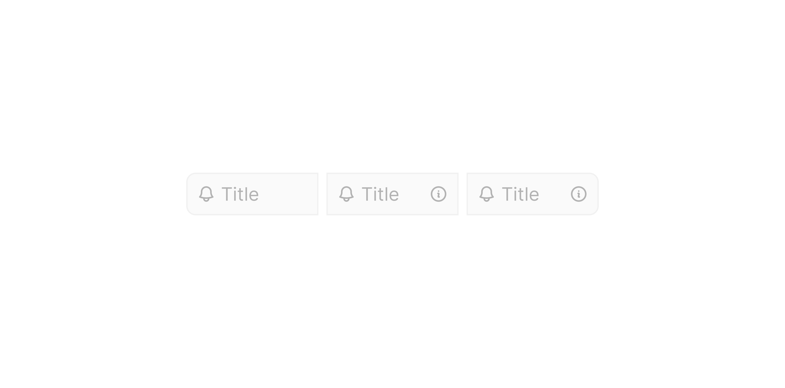

# Group Input Field

> The central text input sub-component within a Group Input, supporting prefix icons and optional suffix elements.

 [View in Figma →](https://www.figma.com/design/7jCMwDng7HF5g7F3tGXf0E/Open-HR?node-id=991-22214)


---

## Overview

Group Input Field is the text entry area inside [Group Input](/doc/90fe0ffe-ccad-4b6b-8e0e-c38d1ec37865). It sits between the left selector panel (flag, currency, or text prefix) and any optional right suffix panel. It behaves like the [Input sub-component](/doc/d4e24068-7c85-4680-8512-737df9e66622) from Text Input but is adapted for the grouped layout: it has no independent border radius on the sides that adjoin other panels, and its width is determined by the surrounding Group Input rather than a fixed size.

Three sizes are available: `sm` (25px), `md` (32px), and `lg` (40px). Three position variants exist: `left`, `center`, and `right`, these control which corners receive a border radius (matching the Group Input's `Position` variant).

**Available in:** React · Next.js · Figma (`.Subcomponents/Group-input`)


---

## Anatomy

| Part | Description |
|------|-------------|
| Prefix icon | Optional 14×14px (md/lg) or 12×12px (sm) icon on the left edge of the text field. Controlled by the `Icon/Prefix` boolean. |
| Text area | The user-editable text. Fills available horizontal space between prefix and suffix. |
| Suffix icon | Optional icon on the right edge (`Suffix=Icon-Suffix`). Non-interactive metadata indicator. |
| Suffix button | Optional interactive button on the right edge (`Suffix=Button`). Used for inline actions. |


---

## Spacing tokens

| Property | `sm` (25px) | `md` (32px) | `lg` (40px) |
|----------|-----------|-----------|-----------|
| Gap between elements | `Spacing/gap/xs-4px` | `Spacing/gap/xs-4px` | `Spacing/gap/xs-4px` |
| Field height | `25px`    | `32px`    | `40px`    |
| Padding left | `Spacing/padding/sm-8px` | `Spacing/padding/sm-8px` | `Spacing/padding/lg-12px` |
| Padding right | `Spacing/padding/sm-8px` | `Spacing/padding/sm-8px` | `Spacing/padding/lg-12px` |
| Prefix icon size | `12×12px` | `14×14px` | `14×14px` |
| Suffix icon size | `12×12px` | `14×14px` | `14×14px` |


---

## Variants

### Size (`size`)

| Value | Figma value | Height | When to use |
|-------|-------------|--------|-------------|
| `sm`  | `25px`      | `25px` | Compact/dense layouts, inline table fields |
| `md`  | `32 px`     | `32px` | Default, most form contexts |
| `lg`  | `40 px`     | `40px` | Prominent forms, touch-primary layouts |

### Position (`position` / Figma: `⛔ Position`)

Controls which border corners are rounded (the field attaches flush to adjacent panels on the other corners):

| Value | Figma value | Corner rounding | When to use |
|-------|-------------|-----------------|-------------|
| `left` | `Left`      | Right corners rounded, left corners square | Field is on the left; a panel attaches on the right |
| `center` | `Center`    | Both sides square | Field is sandwiched between two panels |
| `right` | `Right`     | Left corners square, right corners rounded | Field is on the right; a panel attaches on the left |

### Suffix (`suffix` / Figma: `Suffix 👉`)

| Value | Figma value | Description |
|-------|-------------|-------------|
| `none` | `Non`       | No suffix element |
| `icon` | `💦 Icon-Suffix` | Static icon (non-interactive), currency symbol, lock, info indicator |
| `button` | `✅ Button`  | Interactive action button, show/hide password, clear field |

**Suffix note:** Icon and button suffixes are mutually exclusive. Icon = static metadata; button = inline action. Never render both simultaneously.

### Prefix icon (`showPrefix` / Figma: `⬅️ Icon/Prefix`)

| Value | Description |
|-------|-------------|
| `true` | Prefix icon is visible |
| `false` | No prefix icon |


---

## States

States are driven by the `state` variant in Figma:

| State | Figma value | Trigger | Visual change |
|-------|-------------|---------|---------------|
| Placeholder | `Place-holder` | Field is empty, unfocused | Placeholder text colour |
| Hover | `Hover`     | Pointer enters the field | Border colour shift |
| Focus | `Focus`     | Field receives keyboard or pointer focus | Highlighted border |
| Filled | `Filled`    | Field contains a value, unfocused | Standard text colour |
| Error | `Error`     | Parent sets `errorText` | Error border and text colour |
| Disabled | `Disabled`  | Parent passes `disabled` prop | Reduced opacity, no pointer events |

**Figma casing note:** `Place-holder` is hyphenated in this sub-component (vs `"Place holder"` two-word in the Text Input composite). API normalises to `placeholder`.


---

## Usage guidelines

**Do** match the field's `size` and `position` to the surrounding Group Input panel sizes, all parts of the group must be the same height.

**Don't** add a suffix button and a suffix icon simultaneously.

**Do** use the `icon` suffix for non-interactive metadata (e.g. currency symbol in a currency input, lock icon on a read-only field).

**Do** use the `button` suffix for inline actions that change field content (show/hide password, clear all).

**Don't** use this field standalone outside of a Group Input, use [Input](/doc/d4e24068-7c85-4680-8512-737df9e66622) for standalone text fields.


---

## Behaviour in context

The field's width is flexible, it fills the remaining horizontal space inside the Group Input after the left panel(s) and right panel(s) take their fixed widths. On focus, the entire Group Input should show a focused state (the individual field border and the surrounding container).

For the `button` suffix: the suffix button must have an `aria-label` that updates when its action toggles (e.g. `"Show password"` ↔ `"Hide password"`).


---

## Accessibility

* Renders as `<input type="text">` (or appropriate `type`).
* `id` and `name` are set by the parent Group Input composite for form submission and label association.
* `aria-invalid="true"` is set when `state="error"`.
* `aria-describedby` points to the Helper Text element.
* `disabled` removes the field from tab order; use `readOnly` + `aria-disabled` when the user should still be able to read/copy the value.
* The prefix icon is `aria-hidden="true"`, it is decorative.
* A suffix button must always have `aria-label`.


---

## Animation

| Trigger | From → To | Transition | Duration | Easing |
|---------|-----------|------------|----------|--------|
| Mouse enter | `Place-holder` → `Hover` | Smart Animate | `100ms`  | Ease In |
| Mouse leave | `Hover` → `Place-holder` | Smart Animate | `100ms`  | Ease Out |
| Click   | `Hover` → `Focus` | Smart Animate | `100ms`  | Ease Out |
| Click   | `Filled` → `Focus` | Smart Animate | `100ms`  | Ease Out |
| Click (commit) | `Focus` → `Filled` | Smart Animate | `100ms`  | Ease Out |
| Mouse leave | `Focus` → `Place-holder` | Smart Animate | `100ms`  | Ease Out |

(Read from the `.Subcomponents/Group-input` component set, 96 reaction nodes. The Group Input composite inherits these field transitions; the side panels animate independently — see the Left/Right panel docs, Smart Animate `100ms` Ease Out.)

> **Disabled state:** No transition is defined into or out of `Disabled` in Figma — implement it as an instant swap.

### Implementation reference

```css
/* All transitions: Smart Animate 100ms ease-out (hover-in is ease-in on the composite field) */
.field {
  transition: border-color 100ms ease-out, background-color 100ms ease-out;
}
```


---

## Props / API

```ts
interface GroupInputFieldProps {
  value?: string
  defaultValue?: string
  placeholder?: string
  size?: 'sm' | 'md' | 'lg'
  position?: 'left' | 'center' | 'right'
  suffix?: 'none' | 'icon' | 'button'
  showPrefix?: boolean
  prefixIcon?: React.ReactNode
  suffixIcon?: React.ReactNode
  suffixButton?: React.ReactNode
  state?: 'placeholder' | 'hover' | 'focus' | 'filled' | 'error' | 'disabled'
  type?: React.HTMLInputTypeAttribute
  inputMode?: 'none' | 'text' | 'tel' | 'url' | 'email' | 'numeric' | 'decimal' | 'search'
  disabled?: boolean
  readOnly?: boolean
  name?: string
  id?: string
  ref?: React.Ref<HTMLInputElement>
  onChange?: React.ChangeEventHandler<HTMLInputElement>
  onFocus?: React.FocusEventHandler<HTMLInputElement>
  onBlur?: React.FocusEventHandler<HTMLInputElement>
  'aria-label'?: string
  'aria-labelledby'?: string
  'aria-describedby'?: string
  'aria-invalid'?: boolean
  className?: string
}
```

| Prop | Type | Default | Required | Description |
|------|------|---------|----------|-------------|
| `value` | `string` | —       | No       | Controlled value |
| `defaultValue` | `string` | —       | No       | Uncontrolled default value |
| `placeholder` | `string` | —       | No       | Placeholder text. Figma: `✏️ Input-text` |
| `size` | `'sm' \| 'md' \| 'lg'` | `'md'`  | No       | Field height. Figma: `size` |
| `position` | `'left' \| 'center' \| 'right'` | `'right'` | No       | Which corners are rounded. Figma: `⛔ Position` |
| `suffix` | `'none' \| 'icon' \| 'button'` | `'none'` | No       | Suffix element type. Figma: `Suffix 👉` |
| `showPrefix` | `boolean` | `true`  | No       | Show prefix icon. Figma: `⬅️ Icon/Prefix` |
| `prefixIcon` | `React.ReactNode` | —       | No       | Icon shown on the left of the text area |
| `suffixIcon` | `React.ReactNode` | —       | No       | Static icon on the right (when `suffix="icon"`) |
| `suffixButton` | `React.ReactNode` | —       | No       | Action button on the right (when `suffix="button"`) |
| `state` | `'placeholder' \| 'hover' \| 'focus' \| 'filled' \| 'error' \| 'disabled'` | `'placeholder'` | No       | Visual state. Derived from interaction in most cases; set explicitly only when the parent composite needs to force a state (e.g. `error`). |
| `type` | `React.HTMLInputTypeAttribute` | `'text'` | No       | HTML input type. Use `'tel'` for phone, `'email'` for email, `'url'` for URLs. |
| `inputMode` | `'none' \| 'text' \| 'tel' \| 'url' \| 'email' \| 'numeric' \| 'decimal' \| 'search'` | —       | No       | Virtual keyboard hint. Use `'numeric'` for phone digits, `'decimal'` for amounts. |
| `disabled` | `boolean` | `false` | No       | Disables the field and removes it from tab order |
| `readOnly` | `boolean` | `false` | No       | Field is visible but not editable. Stays in tab order. |
| `name` | `string` | —       | No       | Form field name for submission |
| `id` | `string` | —       | No       | Associates field with `<label>` |
| `ref` | `React.Ref<HTMLInputElement>` | —       | No       | Ref to the underlying `<input>` |
| `onChange` | `React.ChangeEventHandler<HTMLInputElement>` | —       | No       | Fires on value change |
| `onFocus` | `React.FocusEventHandler<HTMLInputElement>` | —       | No       | Fires when field gains focus |
| `onBlur` | `React.FocusEventHandler<HTMLInputElement>` | —       | No       | Fires when field loses focus |
| `aria-label` | `string` | —       | No       | Required when no visible label exists |
| `aria-labelledby` | `string` | —       | No       | ID of external label element |
| `aria-describedby` | `string` | —       | No       | ID of helper/error text element |
| `aria-invalid` | `boolean` | —       | No       | Set `true` when field is in error state |
| `className` | `string` | —       | No       | Additional CSS class |


---

## Code examples

Standard phone number field (right position, flag panel on left):

```tsx
// Next.js (App Router), Server Component
// No 'use client' directive needed, this component carries no browser state.

<GroupInputField
  id="phone"
  name="phone"
  position="right"
  size="md"
  placeholder="801 234 5678"
  showPrefix={false}
  aria-labelledby="phone-label"
  aria-describedby="phone-helper"
/>
```

```tsx
// React
<GroupInputField
  id="phone"
  name="phone"
  position="right"
  size="md"
  placeholder="801 234 5678"
  showPrefix={false}
  aria-labelledby="phone-label"
  aria-describedby="phone-helper"
/>
```

URL field (center position, text panels on both sides):

```tsx
// Next.js (App Router), Server Component
// No 'use client' directive needed, this component carries no browser state.

<GroupInputField
  id="subdomain"
  name="subdomain"
  position="center"
  size="md"
  placeholder="yourcompany"
  aria-label="Subdomain"
  aria-describedby="subdomain-helper"
/>
```

```tsx
// React
<GroupInputField
  id="subdomain"
  name="subdomain"
  position="center"
  size="md"
  placeholder="yourcompany"
  aria-label="Subdomain"
  aria-describedby="subdomain-helper"
/>
```

With suffix icon (read-only currency):

```tsx
// Next.js (App Router), Server Component
// No 'use client' directive needed, this component carries no browser state.

<GroupInputField
  id="amount"
  name="amount"
  position="right"
  size="lg"
  suffix="icon"
  suffixIcon={<Icon name="information-circle" />}
  placeholder="0.00"
/>
```

```tsx
// React
<GroupInputField
  id="amount"
  name="amount"
  position="right"
  size="lg"
  suffix="icon"
  suffixIcon={<Icon name="information-circle" />}
  placeholder="0.00"
/>
```


---

## Related components

* [Group Input](/doc/90fe0ffe-ccad-4b6b-8e0e-c38d1ec37865), the composite that renders this field
* [Input](/doc/d4e24068-7c85-4680-8512-737df9e66622), the standalone text input sub-component (for non-grouped fields)
* ,, left panel that pairs with this field
* ,, currency panel
* ,, text prefix panel
* ,, text suffix panel