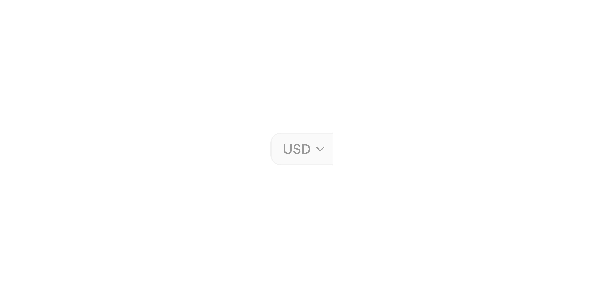

# Group Input Left - Currency

> The left-side selector panel that displays a currency code and chevron in a Group Input.

 [View in Figma →](https://www.figma.com/design/7jCMwDng7HF5g7F3tGXf0E/Open-HR?node-id=974-44159)


---

## Overview

Group Input Left, Currency is a sub-component of [Group Input](/doc/90fe0ffe-ccad-4b6b-8e0e-c38d1ec37865). It renders as a visually separated left panel containing a three-letter currency code (e.g. "USD") and a chevron-down icon to indicate that a dropdown is available. It is not used standalone.

**Available in:** React · Next.js · Figma (`.Subcomponents/Group-input/Left/Currency`)


---

## Anatomy

| Part | Description |
|------|-------------|
| Currency text | Three-letter currency code (e.g. "USD"). Bound to the `value` text property in Figma. |
| Chevron icon | `icon/chevron-down`, 12×12px across all sizes. Indicates the panel is a dropdown trigger. |


---

## Spacing tokens

| Property | `sm` (25px) | `md` (32px) | `lg` (40px) |
|----------|-----------|-----------|-----------|
| Gap (text → chevron) | `Spacing/gap/xs-3px` | `Spacing/gap/xs-3px` | `Spacing/gap/xs-3px` |
| Panel height | `25px`    | `32px`    | `40px`    |
| Panel width | `~53px`   | `53px`    | `61px`    |
| Padding left | `Spacing/padding/sm-8px` | `Spacing/padding/sm-8px` | `Spacing/padding/lg-12px` |
| Padding right | `Spacing/padding/xs-4px` | `Spacing/padding/xs-4px` | `Spacing/padding/sm-6px` |
| Chevron size | `12×12px` | `12×12px` | `12×12px` |


---

## Variants

### Height (`height`)

| Value | Figma value | When to use |
|-------|-------------|-------------|
| `sm`  | `25 px`     | Compact/dense layouts |
| `md`  | `32px`      | Default, most form contexts |
| `lg`  | `40 px`     | Prominent forms, touch-primary layouts |

### State (`state`)

| Value | Figma value | Visual change |
|-------|-------------|---------------|
| `rest` | `Rest`      | Default background |
| `hover` | `hover`     | Subtle background highlight |


---

## States

| State | Trigger | Visual change |
|-------|---------|---------------|
| Rest  | Default | Base panel background |
| Hover | Pointer enters the panel | Background colour shift to indicate interactivity |


---

## Usage guidelines

**Do** keep the currency code to exactly three characters (ISO 4217: USD, NGN, KES, GBP).

**Don't** use this sub-component standalone, it must appear inside a [Group Input](/doc/90fe0ffe-ccad-4b6b-8e0e-c38d1ec37865) with `position="right"` (selector on left, input on right) or `position="center"` (input sandwiched between two panels).

**Do** ensure the dropdown that opens on click shows the full currency name alongside the code for international users who may not recognise all codes.


---

## Content guidelines

Always use the ISO 4217 three-letter currency code in uppercase: `NGN`, `KES`, `ZAR`, `USD`, `GBP`.


---

## Behaviour in context

When tapped or clicked, this panel should open a dropdown or bottom sheet for currency selection. The selected currency code updates the `value` text. The chevron does not animate in the base Figma spec, any rotation (e.g. pointing up when open) is an implementation detail.


---

## Accessibility

* The panel must be a `<button>` element so it is keyboard-focusable.
* `aria-label` should be `"Select currency"` (or localised equivalent), the currency code alone is not descriptive enough for screen readers.
* `aria-expanded` must reflect whether the dropdown is open.
* `aria-haspopup="listbox"` communicates the type of popup.


---

## Animation

| Trigger | From → To | Transition | Duration | Easing |
|---------|-----------|------------|----------|--------|
| Mouse enter | `Rest` → `hover` | Smart Animate | `100ms`  | Ease Out |
| Mouse leave | `hover` → `Rest` | Smart Animate | `100ms`  | Ease Out |

> **Disabled state:** No transition is defined into or out of `Disabled` in Figma — implement it as an instant swap.

### Implementation reference

```css
/* Smart Animate 100ms ease-out, both directions */
.group-input-panel {
  transition: background-color 100ms ease-out;
}
```


---

## Props / API

```ts
interface GroupInputLeftCurrencyProps {
  value: string
  height?: 'sm' | 'md' | 'lg'
  state?: 'rest' | 'hover'
  onClick?: React.MouseEventHandler<HTMLButtonElement>
  'aria-label'?: string
  className?: string
}
```

| Prop | Type | Default | Required | Description |
|------|------|---------|----------|-------------|
| `value` | `string` | `'USD'` | **Yes**  | Currency code displayed in the panel. Figma: `✏️ Value` |
| `height` | `'sm' \| 'md' \| 'lg'` | `'md'`  | No       | Panel height. Figma: `height` (`25 px` / `32px` / `40 px`) |
| `state` | `'rest' \| 'hover'` | `'rest'` | No       | Visual state. Managed by the parent Group Input. |
| `onClick` | `React.MouseEventHandler<HTMLButtonElement>` | —       | No       | Called when the panel is clicked, opens the currency selector |
| `aria-label` | `string` | `'Select currency'` | No       | Screen reader label for the button |
| `className` | `string` | —       | No       | Additional CSS class |


---

## Code examples

How Group Input wires this sub-component:

```tsx
// Next.js (App Router), Client Component
'use client'

<GroupInputLeftCurrency
  value={currency}
  height="md"
  onClick={() => setDropdownOpen(true)}
  aria-label="Select currency"
  aria-expanded={dropdownOpen}
  aria-haspopup="listbox"
/>
```

```tsx
// React
<GroupInputLeftCurrency
  value={currency}
  height="md"
  onClick={() => setDropdownOpen(true)}
  aria-label="Select currency"
  aria-expanded={dropdownOpen}
  aria-haspopup="listbox"
/>
```


---

## Related components

* [Group Input](/doc/90fe0ffe-ccad-4b6b-8e0e-c38d1ec37865), the composite that renders this panel
* ,, flag variant of the left panel
* ,, plain text prefix variant