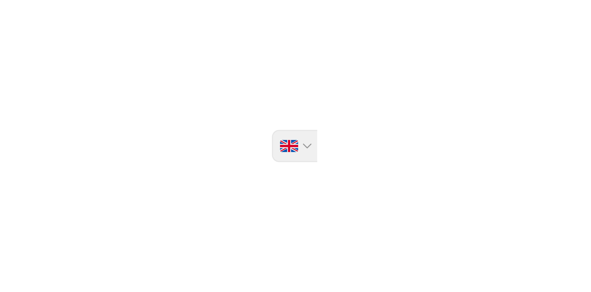

# Group Input Left - Flag

> This is a subcomponet left-side selector panel that displays a country flag and chevron in a Group Input.

 [View in Figma →](https://www.figma.com/design/7jCMwDng7HF5g7F3tGXf0E/Open-HR?node-id=974-91945)


---

## Overview

Group Input Left, Flag is a sub-component of [Group Input](/doc/90fe0ffe-ccad-4b6b-8e0e-c38d1ec37865). It renders a country flag (via the `avatar/avatar` country variant) and a chevron-down icon as a visually separated left panel. It is most commonly used for phone number inputs where the user selects a country dialling code. It is not used standalone.

**Available in:** React · Next.js · Figma (`.Subcomponents/Group-input/Left/Flag`)


---

## Anatomy

| Part | Description |
|------|-------------|
| Flag | 18×12px country flag rendered via the `avatar/avatar` country sub-component. Displays the currently selected country. |
| Chevron icon | `icon/chevron-down`, 12×12px. Indicates the panel is a dropdown trigger. |


---

## Spacing tokens

| Property | `sm` (25px) | `md` (32px) | `lg` (40px) |
|----------|-----------|-----------|-----------|
| Gap (flag → chevron) | `Spacing/gap/xs-3px` | `Spacing/gap/xs-3px` | `Spacing/gap/xs-3px` |
| Panel height | `25px`    | `32px`    | `40px`    |
| Panel width | `45px`    | `45px`    | `51px`    |
| Padding left | `Spacing/padding/sm-8px` | `Spacing/padding/sm-8px` | `Spacing/padding/lg-12px` |
| Padding right | `Spacing/padding/xs-4px` | `Spacing/padding/xs-4px` | `Spacing/padding/sm-6px` |
| Flag size | `18×12px` | `18×12px` | `18×12px` |
| Chevron size | `12×12px` | `12×12px` | `12×12px` |


---

## Variants

### Height (`height`)

| Value | Figma value | When to use |
|-------|-------------|-------------|
| `sm`  | `25 px`     | Compact/dense layouts |
| `md`  | `32px`      | Default, most form contexts |
| `lg`  | `40 px`     | Prominent forms, touch-primary layouts |

### State (`state`)

| Value | Figma value | Visual change |
|-------|-------------|---------------|
| `rest` | `Rest`      | Default background |
| `hover` | `hover`     | Subtle background highlight |


---

## States

| State | Trigger | Visual change |
|-------|---------|---------------|
| Rest  | Default | Base panel background |
| Hover | Pointer enters the panel | Background colour shift |

Note; use the hover state as the focused state


---

## Usage guidelines

**Do** use the Flag panel for phone number inputs where country selection changes the dialling code shown in the text field.

**Don't** use this sub-component standalone, it belongs inside [Group Input](/doc/90fe0ffe-ccad-4b6b-8e0e-c38d1ec37865).

**Do** update the flag immediately when the user selects a new country from the dropdown. Don't wait for form submission.

**Don't** rely on the flag alone to communicate the selected country, always show the dialling code (e.g. "+234") in the text field prefix or as a separate label for users who cannot see the flag.


---

## Content guidelines

No user-authored content. The flag is determined by the selected country code (`NG`, `KE`, `ZA`, `GB`, `US`, etc.).


---

## Behaviour in context

Clicking or tapping the panel opens a country selector (dropdown or bottom sheet). On selection, the flag updates to the chosen country and the parent Group Input typically prefills the dialling code in the text field. The chevron does not animate in the Figma spec.

On mobile, ensure the tap target meets the 44×44px minimum, extend the clickable area beyond the visible panel with padding or a transparent overlay.


---

## Accessibility

* The panel must be a `<button>` so it is keyboard-focusable.
* `aria-label` must be `"Select country"` (or localised), flags are not readable by screen readers.
* `aria-expanded` must reflect the open/closed state of the dropdown.
* `aria-haspopup="listbox"` describes the popup type.
* The flag image must have `alt=""` (decorative), the `aria-label` on the button carries the meaning.


---

## Animation

| Trigger | From → To | Transition | Duration | Easing |
|---------|-----------|------------|----------|--------|
| Mouse enter | `Rest` → `hover` | Smart Animate | `100ms`  | Ease Out |
| Mouse leave | `hover` → `Rest` | Smart Animate | `100ms`  | Ease Out |

> **Disabled state:** No transition is defined into or out of `Disabled` in Figma — implement it as an instant swap.

### Implementation reference

```css
/* Smart Animate 100ms ease-out, both directions */
.group-input-panel {
  transition: background-color 100ms ease-out;
}
```


---

## Props / API

```ts
interface GroupInputLeftFlagProps {
  countryCode: string
  height?: 'sm' | 'md' | 'lg'
  state?: 'rest' | 'hover'
  onClick?: React.MouseEventHandler<HTMLButtonElement>
  'aria-label'?: string
  className?: string
}
```

| Prop | Type | Default | Required | Description |
|------|------|---------|----------|-------------|
| `countryCode` | `string` | —       | **Yes**  | ISO 3166-1 alpha-2 code (e.g. `'NG'`, `'KE'`). Determines the flag rendered. |
| `height` | `'sm' \| 'md' \| 'lg'` | `'md'`  | No       | Panel height. Figma: `height` (`25 px` / `32px` / `40 px`) |
| `state` | `'rest' \| 'hover'` | `'rest'` | No       | Visual state. Managed by parent Group Input. |
| `onClick` | `React.MouseEventHandler<HTMLButtonElement>` | —       | No       | Opens the country selector |
| `aria-label` | `string` | `'Select country'` | No       | Screen reader label for the button |
| `className` | `string` | —       | No       | Additional CSS class |


---

## Code examples

How Group Input wires this sub-component for a phone number field:

```tsx
// Next.js (App Router), Client Component
'use client'

<GroupInputLeftFlag
  countryCode={country}
  height="md"
  onClick={() => setCountrySelectorOpen(true)}
  aria-label="Select country"
  aria-expanded={countrySelectorOpen}
  aria-haspopup="listbox"
/>
```

```tsx
// React
<GroupInputLeftFlag
  countryCode={country}
  height="md"
  onClick={() => setCountrySelectorOpen(true)}
  aria-label="Select country"
  aria-expanded={countrySelectorOpen}
  aria-haspopup="listbox"
/>
```


---

## Related components

* [Group Input](/doc/90fe0ffe-ccad-4b6b-8e0e-c38d1ec37865), the composite that renders this panel
* ,, currency code variant
* ,, plain text prefix variant