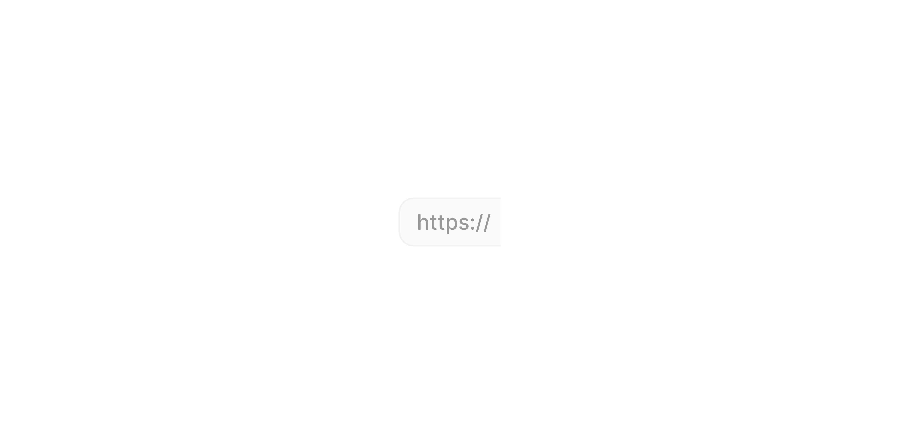

# Group Input Left - Text

> The left-side panel that displays a static text prefix in a Group Input.

 [View in Figma →](https://www.figma.com/design/7jCMwDng7HF5g7F3tGXf0E/Open-HR?node-id=974-92276)


---

## Overview

Group Input Left, Text is a sub-component of [Group Input](/doc/90fe0ffe-ccad-4b6b-8e0e-c38d1ec37865). It renders a static text string as a visually separated left panel, typically a URL protocol (`https://`), a unit prefix, or a fixed country dialling code. Unlike the Flag and Currency panels, this panel displays text only (no dropdown icon) when used as a non-interactive prefix. It is not used standalone.

**Available in:** React · Next.js · Figma (`.Subcomponents/Group-input/Left/Text-helpers`)


---

## Anatomy

| Part | Description |
|------|-------------|
| Input content | A frame containing the prefix text. Vertically centred within the panel. |
| Label | The prefix text string. Default value in Figma is `"https://"`. |


---

## Spacing tokens

| Property | `sm` (25px) | `md` (32px) | `lg` (40px) | Token |
|----------|-----------|-----------|-----------|-------|
| Gap      | `Spacing/gap/xs-3px` | `Spacing/gap/xs-3px` | `Spacing/gap/xs-3px` | `Spacing/gap/xs-3px` |
| Panel height | `25px`    | `32px`    | `~43px`   | —     |
| Panel width | `~58px`   | `58px`    | `67px`    | —     |
| Padding left | `Spacing/padding/sm-8px` | `Spacing/padding/sm-8px` | `Spacing/padding/lg-12px` | —     |
| Padding right | `Spacing/padding/xs-4px` | `Spacing/padding/xs-4px` | `Spacing/padding/sm-6px` | —     |
| Inner content frame height | `24px`    | `24px`    | `24px`    | —     |


---

## Variants

### Height (`height`)

| Value | Figma value | When to use |
|-------|-------------|-------------|
| `sm`  | `25 px`     | Compact/dense layouts |
| `md`  | `32px`      | Default, most form contexts |
| `lg`  | `40 px`     | Prominent forms, touch-primary layouts |

### State (`state`)

| Value | Figma value | Visual change |
|-------|-------------|---------------|
| `rest` | `Rest`      | Default background, static appearance |
| `hover` | `hover`     | Subtle background highlight |

**Note:** The hover state exists in Figma but this panel is typically non-interactive (no dropdown). If hover is shown, ensure there is a corresponding interactive action, or suppress the hover style.


---

## States

| State | Trigger | Visual change |
|-------|---------|---------------|
| Rest  | Default | Base panel background, static text |
| Hover | Pointer enters (only if interactive) | Background colour shift |


---

## Usage guidelines

**Do** use this panel for fixed, non-selectable prefixes, URL protocols (`https://`), measurement units (`kg`, `%`), or a fixed country code where no selection is needed.

**Don't** use this panel when the prefix is selectable, use , or , instead.

**Do** keep prefix text short, typically 2–10 characters. Longer strings push the text field content uncomfortably far right.

**Don't** use this sub-component standalone, it belongs inside [Group Input](/doc/90fe0ffe-ccad-4b6b-8e0e-c38d1ec37865).


---

## Content guidelines

* Keep to the shortest clear form: `https://` not `https://www`, `+234` not `Nigeria (+234)`.
* Do not include a trailing space, spacing is handled by the panel's internal padding.
* Non-interactive prefixes do not need punctuation.


---

## Behaviour in context

This is a display-only panel. Its text is set at render time and does not change based on user input. When used in a URL input (`Position=Center`), it pairs with , to wrap the text field between `https://` and `.com`.


---

## Accessibility

* If non-interactive: render as a `<span>` or `<div aria-hidden="true">`, the parent's `aria-label` or visible label conveys what the field collects.
* If the prefix is meaningful context that screen reader users need (e.g. the user might not know the field expects a relative URL), include it in the field's `aria-describedby` text instead.
* Do not render the panel as a `<button>` unless it triggers a selection action.


---

## Animation

| Trigger | From → To | Transition | Duration | Easing |
|---------|-----------|------------|----------|--------|
| Mouse enter | `Rest` → `hover` | Smart Animate | `100ms`  | Ease Out |
| Mouse leave | `hover` → `Rest` | Smart Animate | `100ms`  | Ease Out |

> **Disabled state:** No transition is defined into or out of `Disabled` in Figma — implement it as an instant swap.

### Implementation reference

```css
/* Smart Animate 100ms ease-out, both directions */
.group-input-panel {
  transition: background-color 100ms ease-out;
}
```


---

## Props / API

```ts
interface GroupInputLeftTextProps {
  text: string
  height?: 'sm' | 'md' | 'lg'
  state?: 'rest' | 'hover'
  className?: string
}
```

| Prop | Type | Default | Required | Description |
|------|------|---------|----------|-------------|
| `text` | `string` | `'https://'` | **Yes**  | The prefix string to display. Figma: `✏️ Text` |
| `height` | `'sm' \| 'md' \| 'lg'` | `'md'`  | No       | Panel height. Figma: `height` |
| `state` | `'rest' \| 'hover'` | `'rest'` | No       | Visual state. Managed by parent Group Input. |
| `className` | `string` | —       | No       | Additional CSS class |


---

## Code examples

How Group Input wires this sub-component for a URL field:

```tsx
// Next.js (App Router), Server Component
// No 'use client' directive needed, this component carries no browser state.

// URL input, "https://" prefix + input + ".com" suffix
<GroupInput position="center">
  <GroupInputLeftText text="https://" height="md" />
  <GroupInputField placeholder="yourdomain" />
  <GroupInputRightText text=".com" height="md" />
</GroupInput>
```

```tsx
// React
// URL input, "https://" prefix + input + ".com" suffix
<GroupInput position="center">
  <GroupInputLeftText text="https://" height="md" />
  <GroupInputField placeholder="yourdomain" />
  <GroupInputRightText text=".com" height="md" />
</GroupInput>
```

Standalone (non-interactive prefix, e.g. currency unit):

```tsx
// Next.js (App Router), Server Component
// No 'use client' directive needed, this component carries no browser state.

<GroupInputLeftText text="kg" height="md" aria-hidden="true" />
```

```tsx
// React
<GroupInputLeftText text="kg" height="md" aria-hidden="true" />
```


---

## Related components

* [Group Input](/doc/90fe0ffe-ccad-4b6b-8e0e-c38d1ec37865), the composite that renders this panel
* ,, the paired right-side text suffix
* ,, selectable currency code panel
* ,, selectable flag panel