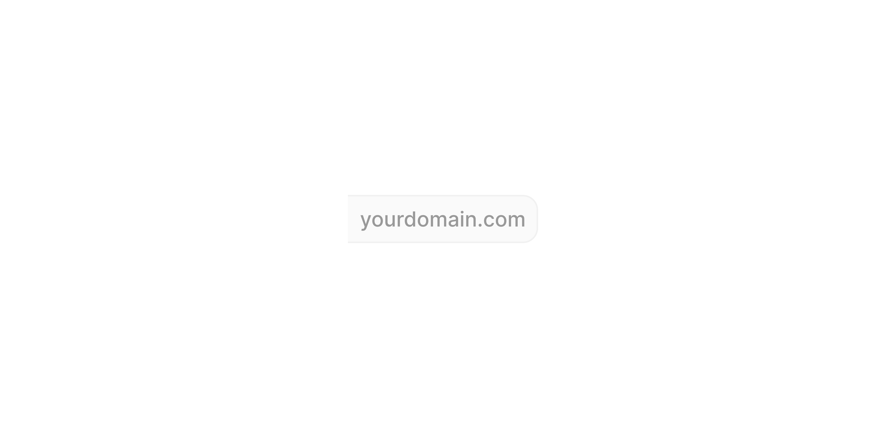

# Group Input Right - Text

> The right-side panel that displays a static text suffix in a Group Input.

 [View in Figma →](https://www.figma.com/design/7jCMwDng7HF5g7F3tGXf0E/Open-HR?node-id=974-92414)


---

## Overview

Group Input Right, Text is a sub-component of [Group Input](/doc/90fe0ffe-ccad-4b6b-8e0e-c38d1ec37865). It renders a static text string as a visually separated right panel, typically a domain suffix (`.com`), a unit suffix (`kg`, `%`), or any fixed trailing context. It appears only in the `Position=Center` layout of Group Input, pairing with a left panel to frame the text field. It is not used standalone.

**Available in:** React · Next.js · Figma (`.Subcomponents/Group-input/Right/Text-helpers`)


---

## Anatomy

| Part | Description |
|------|-------------|
| Input content | A frame containing the suffix text. Vertically centred within the panel. |
| Label | The suffix text string. Default value in Figma is `"yourdomain.com"`. |


---

## Spacing tokens

| Property | `sm` (25px) | `md` (32px) | `lg` (40px) |
|----------|-----------|-----------|-----------|
| Padding left | `Spacing/padding/sm-8px` | `Spacing/padding/sm-8px` | `Spacing/padding/sm-8px` |
| Padding right | `Spacing/padding/sm-8px` | `Spacing/padding/sm-8px` | `Spacing/padding/sm-8px` |
| Gap      | `Spacing/gap/xs-3px` | `Spacing/gap/xs-3px` | `Spacing/gap/xs-3px` |
| Panel height | `25px`    | `32px`    | `40px`    |
| Panel width | `~120px`  | `120px`   | `127px`   |
| Inner content frame height | `24px`    | `24px`    | `24px`    |

**Note:** The right text panel is wider than the left text panel (120px vs 58px at 32px height) because the default content `"yourdomain.com"` is longer than `"https://"`.


---

## Variants

### Height (`height`)

| Value | Figma value | When to use |
|-------|-------------|-------------|
| `sm`  | `25 px`     | Compact/dense layouts |
| `md`  | `32px`      | Default, most form contexts |
| `lg`  | `40 px`     | Prominent forms, touch-primary layouts |

### State (`state`)

| Value | Figma value | Visual change |
|-------|-------------|---------------|
| `rest` | `rest`      | Default background |
| `hover` | `hover`     | Subtle background highlight |

**Figma casing note:** This sub-component uses `rest` (lowercase) for the default state, unlike the Left panels which use `Rest` (title case). API values are normalised to lowercase across all panels.


---

## States

| State | Trigger | Visual change |
|-------|---------|---------------|
| Rest  | Default | Base panel background, static text |
| Hover | Pointer enters (only if interactive) | Background colour shift |


---

## Usage guidelines

**Do** use this panel for fixed, non-selectable suffixes, domain extensions (`.com`, `.ng`), unit labels (`cm`, `km/h`), or fixed trailing text.

**Don't** use this panel for selectable content. If the suffix changes based on user action, use a dropdown component instead.

**Do** keep suffix text short. The panel width adjusts to its content, but very long suffixes compress the text input uncomfortably.

**Don't** use this sub-component standalone, it belongs inside [Group Input](/doc/90fe0ffe-ccad-4b6b-8e0e-c38d1ec37865) at `Position=Center`.


---

## Content guidelines

* Keep to the shortest clear form: `.com` not `.com/`, `km/h` not `kilometres per hour`.
* Do not include a leading space, spacing is handled by the panel's internal padding.


---

## Behaviour in context

Display-only. Text is fixed at render time. Always appears on the right side of the Group Input when `Position=Center`. Pairs with either ,, ,, or , on the left.


---

## Accessibility

* Render as a `<span>` or `<div aria-hidden="true">`, it is decorative context. The field label carries the full meaning.
* If the suffix is critical to understanding what the field collects (e.g. `.com` in a subdomain field), include it in the field's `aria-describedby` text: `"Enter your subdomain. The full URL will end in .com"`.


---

## Animation

| Trigger | From → To | Transition | Duration | Easing |
|---------|-----------|------------|----------|--------|
| Mouse enter | `rest` → `hover` | Smart Animate | `100ms`  | Ease Out |
| Mouse leave | `hover` → `rest` | Smart Animate | `100ms`  | Ease Out |

> **Disabled state:** No transition is defined into or out of `Disabled` in Figma — implement it as an instant swap.

### Implementation reference

```css
/* Smart Animate 100ms ease-out, both directions */
.group-input-panel {
  transition: background-color 100ms ease-out;
}
```


---

## Props / API

```ts
interface GroupInputRightTextProps {
  text: string
  height?: 'sm' | 'md' | 'lg'
  state?: 'rest' | 'hover'
  className?: string
}
```

| Prop | Type | Default | Required | Description |
|------|------|---------|----------|-------------|
| `text` | `string` | `'yourdomain.com'` | **Yes**  | The suffix string to display. Figma: `✏️ Text` |
| `height` | `'sm' \| 'md' \| 'lg'` | `'md'`  | No       | Panel height. Figma: `height` |
| `state` | `'rest' \| 'hover'` | `'rest'` | No       | Visual state. Managed by parent Group Input. |
| `className` | `string` | —       | No       | Additional CSS class |


---

## Code examples

How Group Input wires this sub-component for a URL field:

```tsx
// Next.js (App Router), Server Component
// No 'use client' directive needed, this component carries no browser state.

// URL input with both left and right panels
<GroupInput position="center" label="Website URL">
  <GroupInputLeftText text="https://" height="md" />
  <GroupInputField placeholder="yourdomain" />
  <GroupInputRightText text=".com" height="md" />
</GroupInput>
```

```tsx
// React
// URL input with both left and right panels
<GroupInput position="center" label="Website URL">
  <GroupInputLeftText text="https://" height="md" />
  <GroupInputField placeholder="yourdomain" />
  <GroupInputRightText text=".com" height="md" />
</GroupInput>
```

Domain suffix with state management:

```tsx
// Next.js (App Router), Server Component
// No 'use client' directive needed, this component carries no browser state.

<GroupInputRightText
  text=".com"
  height="md"
  aria-hidden="true"
/>
```

```tsx
// React
<GroupInputRightText
  text=".com"
  height="md"
  aria-hidden="true"
/>
```


---

## Related components

* [Group Input](/doc/90fe0ffe-ccad-4b6b-8e0e-c38d1ec37865), the composite that renders this panel
* ,, the paired left-side text prefix
* ,, left-side flag selector
* ,, left-side currency selector