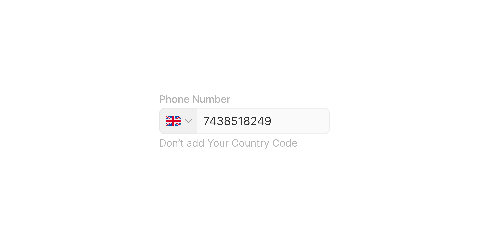

# Group Input

> A labelled grouped input field that pairs a text entry area with a left selector panel (flag, currency, or text prefix) and an optional right text suffix.

 [View in Figma →](https://www.figma.com/design/7jCMwDng7HF5g7F3tGXf0E/Open-HR?node-id=1061-48573)


---

## Overview

Group Input is a composite form field that combines a contextual selector or prefix panel on the left with a text entry field on the right, or sandwiches the text field between two panels. The most common use cases are phone number inputs (flag + dialling code + number), currency amount inputs (currency code + amount), and URL inputs (`https://` + subdomain + `.com`).

Three layout positions are available, `right` (input on the right, selector on the left), `center` (input between two panels), and `left` (input on the left, panel on the right, not visible in the composite but defined in the Group Input Field sub-component). Three sizes align with the rest of the form system: `sm` (25px), `md` (32px, default), and `lg` (40px). The label and helper text are independently toggleable. An optional inline action button can appear inside the text field via `withButton`.

**Available in:** React · Next.js · Figma (`Inputs/Text Group input ✏️`)


---

## Anatomy

| Part | Description |
|------|-------------|
| Label | The field's visible name. Toggleable via `showLabel`. When hidden, `aria-label` or `aria-labelledby` must be provided. |
| Left panel | One of: ,, ,, or ,. Always present. |
| Group Input Field | The text entry area. Width fills remaining space after panels. See [Group Input Field](/doc/f7b4d954-5bc4-4f36-bc5d-55f846d60482). |
| Right panel | Optional: ,. Only present when `position="center"`. |
| Helper Text | Optional guidance or error message below the field. See [Helper Text](/doc/40b6cfc1-eda5-404e-9ef2-62e28da64ca8). |

**Total component height (all parts visible):**

| Input size | Label | Gap | Input row | Gap | Helper | Total |
|------------|-------|-----|-----------|-----|--------|-------|
| `sm` (25px) | `9px` | `6px` | `25px`    | `6px` | `9px`  | **55px** |
| `md` (32px) | `9px` | `6px` | `32px`    | `6px` | `9px`  | **62px** |
| `lg` (40px) | `9px` | `6px` | `40px`    | `6px` | `9px`  | **70px** |


---

## Spacing tokens

| Property | `sm` (25px) | `md` (32px) | `lg` (40px) | Token |
|----------|-----------|-----------|-----------|-------|
| Gap (label → input row) | `Spacing/gap/sm-6px` | `Spacing/gap/sm-6px` | `Spacing/gap/sm-6px` | `Spacing/gap/sm-6px` |
| Gap (input row → helper) | `Spacing/gap/sm-6px` | `Spacing/gap/sm-6px` | `Spacing/gap/sm-6px` | `Spacing/gap/sm-6px` |
| Right panel padding left/right | `Spacing/padding/sm-8px` | `Spacing/padding/sm-8px` | `Spacing/padding/sm-8px` | `Spacing/padding/sm-8px` |
| Inner content gap (panels) | `Spacing/gap/xs-3px` | `Spacing/gap/xs-3px` | `Spacing/gap/xs-3px` | `Spacing/gap/xs-3px` |
| Field element gap | `Spacing/gap/xs-4px` | `Spacing/gap/xs-4px` | `Spacing/gap/xs-4px` | `Spacing/gap/xs-4px` |
| Input row height | `25px`    | `32px`    | `40px`    | —     |
| Label height | `9px`     | `9px`     | `9px`     | —     |
| Helper text height | `9px`     | `9px`     | `9px`     | —     |
| Field padding left | `Spacing/padding/sm-8px` | `Spacing/padding/sm-8px` | `Spacing/padding/lg-12px` | —     |
| Field padding right | `Spacing/padding/sm-8px` | `Spacing/padding/sm-8px` | `Spacing/padding/lg-12px` | —     |
| Left panel (flag): width | `45px`    | `45px`    | `51px`    | —     |
| Left panel (currency): width | `~53px`   | `53px`    | `61px`    | —     |
| Left panel (text): width | `~58px`   | `58px`    | `67px`    | —     |
| Right panel (text): width | `~120px`  | `120px`   | `127px`   | —     |
| Left panel padding left | `Spacing/padding/sm-8px` | `Spacing/padding/sm-8px` | `Spacing/padding/lg-12px` | —     |
| Left panel padding right | `Spacing/padding/xs-4px` | `Spacing/padding/xs-4px` | `Spacing/padding/sm-6px` | —     |
| Prefix icon size | `12×12px` | `14×14px` | `14×14px` | —     |


---

## Variants

### Size (`size` / Figma: `🏗️ Height`)

| Value | Figma value | Input row height | When to use |
|-------|-------------|------------------|-------------|
| `sm`  | `25 px`     | `25px`           | Dense layouts, data tables, compact forms |
| `md`  | `32 px`     | `32px`           | Default, most form contexts |
| `lg`  | `40 px`     | `40px`           | Prominent forms, sign-up flows, touch-primary layouts |

### Position (`position` / Figma: `⛔ Position`)

Controls the layout arrangement of panels and field. Figma emoji prefix (`⛔`) is stripped in the API.

| Value | Figma value | Layout | Typical use |
|-------|-------------|--------|-------------|
| `right` | `Right`     | Left panel + text field (field takes right portion) | Phone number, payment amount |
| `center` | `Center`    | Left panel + text field + right panel | URL input (`https://` + domain + `.com`) |
| `left` | `Left`      | Text field + right panel (defined in sub-component, not in the composite Figma set) | Less common, suffix only |

**Note:** `Position=Left` is defined as a variant on the [Group Input Field](/doc/f7b4d954-5bc4-4f36-bc5d-55f846d60482) sub-component but does not appear in the composite Figma set. Do not use `position="left"` on the composite until confirmed by design. <!-- TODO: confirm Left position layout with design -->

### With button (`withButton` / Figma: `with Button`)

| Value | Figma value | Description |
|-------|-------------|-------------|
| `false` | `no`        | Default, no suffix button in the text field |
| `true` | `yes`       | An inline action button appears inside the text field (e.g. "Verify", "Apply") |

### Show label (`showLabel` / Figma: `Show Label 🏷️`)

| Value | Description |
|-------|-------------|
| `true` (default) | Label is rendered above the input row |
| `false` | Label is hidden. `aria-label` or `aria-labelledby` must be supplied. |

### Show helper (`showHelper` / Figma: `Show Helper 💬`)

| Value | Description |
|-------|-------------|
| `true` (default) | Helper Text is rendered below the input row |
| `false` | No helper text area |


---

## States

States are managed by the [Group Input Field](/doc/f7b4d954-5bc4-4f36-bc5d-55f846d60482) sub-component and surface visually on the input row:

| State | Trigger | Visual change |
|-------|---------|---------------|
| Placeholder | Field is empty, unfocused | Placeholder text in muted colour |
| Hover | Pointer enters the text field | Field border shifts colour |
| Focus | Field gains keyboard or pointer focus | Highlighted border on the text field |
| Filled | Field has a value and is unfocused | Standard text colour |
| Error | `errorText` prop is set | Error border on field; Helper Text switches to `error` state |
| Disabled | `disabled` prop is `true` | Entire input row reduced opacity; no pointer events |

**Panel states:** The left (and right) panels have their own `rest` and `hover` states when they are interactive (flag/currency selectors). Static text panels (Left Text, Right Text) do not have hover unless they are wired to an interactive action.


---

## Usage guidelines

**Do** use Group Input for phone numbers, the flag panel makes the dialling code format clear and supports users across Nigeria, Kenya, South Africa, and the UK.

**Do** use Group Input for currency amount fields, pair with the currency selector panel so users see which currency their value is in.

**Do** use Group Input for URL subdomains, the `position="center"` layout with `https://` and `.com` panels eliminates user confusion about what portion to type.

**Don't** use Group Input when the prefix is not meaningful, a plain [Text Input](/doc/93534567-2eff-45a2-b5a8-00a8b76dc4eb) with a label is simpler and easier to use.

**Don't** nest two Group Inputs side by side with only labels to distinguish them, the connected visual style implies they are related sections of the same data.

**Do** always show the label unless space is truly unavailable (e.g. inside a dense table). Use `aria-label` whenever `showLabel=false`.

**Don't** use `withButton=true` and a suffix icon together. The button is the action; adding a decorative icon creates visual noise.

**Do** validate on blur (`onBlur`), not on `onChange`. Triggering error state while the user is still typing creates a hostile experience.


---

## Content guidelines

* **Label:** sentence case, noun phrase, no trailing colon. "Phone number", not "Phone Number:" or "Enter your phone number".
* **Placeholder:** describe the format expected in the text field area, not the whole component. For a phone number field: `"801 234 5678"` (local number after the dialling code, not the full international format).
* **Helper text:** explain the format or context only when it isn't obvious from the label and placeholder.
* **Error text:** be specific: `"Enter a valid phone number"`, not `"Invalid input"`.


---

## Behaviour in context

**Phone number input:** The flag panel triggers a country selector on click. On country selection, the text field typically prefills or shows a dialling code prefix. The text field accepts only digit input (`inputMode="numeric"`).

**Currency amount input:** The currency panel triggers a currency selector dropdown. On selection, the currency code updates. The text field accepts decimal numbers (`inputMode="decimal"`).

**URL/subdomain input:** The left and right text panels are static. The text field accepts alphanumeric characters and hyphens.

**With button:** When `withButton=true`, a button appears inside the text field's right edge (via the `button` suffix on Group Input Field). This button performs an inline action such as "Verify" or "Apply code". The button must have an `aria-label`.

**Responsive:** On narrow viewports, the left panel maintains its width; the text field compresses. At very small widths (< 320px), consider switching to a two-row layout with the panel above the field.

**Disabled vs read-only:**

* `disabled`, removes the entire row from interaction; the value cannot be read or copied by mouse.
* `readOnly`, the value is visible and copyable; the field stays in tab order. Use `readOnly` when displaying a generated or system-set value the user should see.


---

## Accessibility

* The `<label>` element must always be associated with the `<input>` via `htmlFor`/`id`. The Group Input composite sets both automatically when `id` is provided.
* `aria-describedby` on the `<input>` must point to the Helper Text element when `showHelper=true`.
* `aria-invalid="true"` is set on the `<input>` when `errorText` is present.
* When `showLabel=false`, the composite renders the label visually hidden (not `display:none`) so it remains in the accessibility tree, OR the caller must supply `aria-label`.
* The left selector panel (flag, currency) must be a `<button>` with `aria-label`, `aria-expanded`, and `aria-haspopup="listbox"`.
* Static text panels (Left Text, Right Text) are `aria-hidden="true"`.
* **Keyboard navigation:** `Tab` moves into the text field; `Shift+Tab` back out. If the selector panel is interactive, it must also be reachable by Tab.
* `autoComplete` should be set to the relevant WCAG 1.3.5 value for the data type: `"tel"` for phone, `"url"` for URLs.


---

## Animation

See [Group Input Field](/doc/f7b4d954-5bc4-4f36-bc5d-55f846d60482) and the Left/Right panel docs for the panel hover transitions.


---

## Props / API

```ts
interface GroupInputProps {
  label: string
  helperText?: string
  errorText?: string
  showLabel?: boolean
  showHelper?: boolean
  size?: 'sm' | 'md' | 'lg'
  position?: 'right' | 'center'
  withButton?: boolean
  leftPanelType?: 'flag' | 'currency' | 'text'
  leftPanelValue?: string
  onLeftPanelClick?: React.MouseEventHandler<HTMLButtonElement>
  rightPanelText?: string
  value?: string
  defaultValue?: string
  placeholder?: string
  disabled?: boolean
  readOnly?: boolean
  name?: string
  id?: string
  ref?: React.Ref<HTMLInputElement>
  onChange?: React.ChangeEventHandler<HTMLInputElement>
  onFocus?: React.FocusEventHandler<HTMLInputElement>
  onBlur?: React.FocusEventHandler<HTMLInputElement>
  type?: React.HTMLInputTypeAttribute
  inputMode?: 'none' | 'text' | 'tel' | 'url' | 'email' | 'numeric' | 'decimal' | 'search'
  autoComplete?: string
  'aria-label'?: string
  'aria-labelledby'?: string
  'aria-describedby'?: string
  className?: string
}
```

| Prop | Type | Default | Required | Description |
|------|------|---------|----------|-------------|
| `label` | `string` | —       | **Yes**  | Field label. Figma: `✏️ Label` |
| `helperText` | `string` | —       | No       | Guidance shown below the field. Sets Helper Text to `neutral` state. |
| `errorText` | `string` | —       | No       | Validation error. Replaces `helperText` visually; sets Helper Text to `error` state and `aria-invalid` on the field. |
| `showLabel` | `boolean` | `true`  | No       | Toggle label visibility. Figma: `Show Label 🏷️`. When `false`, supply `aria-label`. |
| `showHelper` | `boolean` | `true`  | No       | Toggle helper text visibility. Figma: `Show Helper 💬` |
| `size` | `'sm' \| 'md' \| 'lg'` | `'md'`  | No       | Field height. Figma: `🏗️ Height` |
| `position` | `'right' \| 'center'` | `'right'` | No       | Panel layout. Figma: `⛔ Position` |
| `withButton` | `boolean` | `false` | No       | Show an inline action button in the text field. Figma: `with Button` |
| `leftPanelType` | `'flag' \| 'currency' \| 'text'` | —       | **Yes**  | Which left panel sub-component to render |
| `leftPanelValue` | `string` | —       | No       | Country code (flag), currency code (currency), or prefix string (text) |
| `onLeftPanelClick` | `React.MouseEventHandler<HTMLButtonElement>` | —       | No       | Called when an interactive left panel is clicked. Not needed for static text panels. |
| `rightPanelText` | `string` | —       | No       | Suffix text for the right panel (only when `position="center"`) |
| `value` | `string` | —       | No       | Controlled value of the text field |
| `defaultValue` | `string` | —       | No       | Uncontrolled default value |
| `placeholder` | `string` | —       | No       | Text field placeholder |
| `disabled` | `boolean` | `false` | No       | Disables the entire field |
| `readOnly` | `boolean` | `false` | No       | Makes field non-editable but copyable |
| `name` | `string` | —       | No       | Form field name for submission |
| `id` | `string` | —       | No       | Associates field with `<label>` and helper text |
| `ref` | `React.Ref<HTMLInputElement>` | —       | No       | Ref to the underlying `<input>` element |
| `onChange` | `React.ChangeEventHandler<HTMLInputElement>` | —       | No       | Fires on text value change |
| `onFocus` | `React.FocusEventHandler<HTMLInputElement>` | —       | No       | Fires when field gains focus |
| `onBlur` | `React.FocusEventHandler<HTMLInputElement>` | —       | No       | Fires when field loses focus (validate here, not `onChange`) |
| `type` | `React.HTMLInputTypeAttribute` | `'text'` | No       | HTML input type passed to the underlying `<input>`. Use `'tel'` for phone numbers, `'email'` for email, `'url'` for URLs. |
| `inputMode` | `'none' \| 'text' \| 'tel' \| 'url' \| 'email' \| 'numeric' \| 'decimal' \| 'search'` | —       | No       | Hint to the browser on which virtual keyboard to show. Use `'numeric'` for phone digits, `'decimal'` for amounts. |
| `autoComplete` | `string` | —       | No       | WCAG 1.3.5 autocomplete token (`"tel"`, `"url"`, etc.) |
| `aria-label` | `string` | —       | No       | Required when `showLabel=false` |
| `aria-labelledby` | `string` | —       | No       | ID of an external label element |
| `aria-describedby` | `string` | —       | No       | ID of helper/error text (set automatically when `id` is provided) |
| `className` | `string` | —       | No       | Additional CSS class |


---

## Code examples

### Phone number input (flag panel, right position)

```tsx
// Next.js (App Router), Client Component
'use client'

const [country, setCountry] = useState('NG')
const [phone, setPhone] = useState('')
const [error, setError] = useState('')

<GroupInput
  id="phone"
  name="phone"
  label="Phone number"
  helperText="Include your country dialling code"
  errorText={error}
  leftPanelType="flag"
  leftPanelValue={country}
  onLeftPanelClick={() => setCountrySelectorOpen(true)}
  position="right"
  size="md"
  value={phone}
  onChange={e => setPhone(e.target.value)}
  onBlur={() => {
    if (!isValidPhone(phone)) setError('Enter a valid phone number')
    else setError('')
  }}
  autoComplete="tel"
  inputMode="numeric"
/>
```

```tsx
// React
const [country, setCountry] = useState('NG')
const [phone, setPhone] = useState('')
const [error, setError] = useState('')

<GroupInput
  id="phone"
  name="phone"
  label="Phone number"
  helperText="Include your country dialling code"
  errorText={error}
  leftPanelType="flag"
  leftPanelValue={country}
  onLeftPanelClick={() => setCountrySelectorOpen(true)}
  position="right"
  size="md"
  value={phone}
  onChange={e => setPhone(e.target.value)}
  onBlur={() => {
    if (!isValidPhone(phone)) setError('Enter a valid phone number')
    else setError('')
  }}
  autoComplete="tel"
  inputMode="numeric"
/>
```

### Currency amount input (currency panel)

```tsx
// Next.js (App Router), Client Component
'use client'

const [currency, setCurrency] = useState('NGN')
const [amount, setAmount] = useState('')

<GroupInput
  id="salary"
  name="salary"
  label="Monthly salary"
  helperText="Enter gross amount before deductions"
  leftPanelType="currency"
  leftPanelValue={currency}
  onLeftPanelClick={() => setCurrencyDropdownOpen(true)}
  position="right"
  size="lg"
  value={amount}
  onChange={e => setAmount(e.target.value)}
  autoComplete="off"
  inputMode="decimal"
/>
```

```tsx
// React
const [currency, setCurrency] = useState('NGN')
const [amount, setAmount] = useState('')

<GroupInput
  id="salary"
  name="salary"
  label="Monthly salary"
  helperText="Enter gross amount before deductions"
  leftPanelType="currency"
  leftPanelValue={currency}
  onLeftPanelClick={() => setCurrencyDropdownOpen(true)}
  position="right"
  size="lg"
  value={amount}
  onChange={e => setAmount(e.target.value)}
  autoComplete="off"
  inputMode="decimal"
/>
```

### URL / subdomain input (center position)

```tsx
// Next.js (App Router), Server Component
// No 'use client' directive needed, this component carries no browser state.

<GroupInput
  id="subdomain"
  name="subdomain"
  label="Company URL"
  helperText="Only letters, numbers, and hyphens"
  leftPanelType="text"
  leftPanelValue="https://"
  rightPanelText=".openhr.app"
  position="center"
  size="md"
  placeholder="yourcompany"
  autoComplete="url"
/>
```

```tsx
// React
<GroupInput
  id="subdomain"
  name="subdomain"
  label="Company URL"
  helperText="Only letters, numbers, and hyphens"
  leftPanelType="text"
  leftPanelValue="https://"
  rightPanelText=".openhr.app"
  position="center"
  size="md"
  placeholder="yourcompany"
  autoComplete="url"
/>
```

### Error state

```tsx
// Next.js (App Router), Client Component
'use client'

<GroupInput
  id="phone"
  name="phone"
  label="Phone number"
  errorText="Enter a valid Nigerian phone number (+234)"
  leftPanelType="flag"
  leftPanelValue="NG"
  position="right"
  size="md"
  value={phone}
  onChange={e => setPhone(e.target.value)}
/>
```

```tsx
// React
<GroupInput
  id="phone"
  name="phone"
  label="Phone number"
  errorText="Enter a valid Nigerian phone number (+234)"
  leftPanelType="flag"
  leftPanelValue="NG"
  position="right"
  size="md"
  value={phone}
  onChange={e => setPhone(e.target.value)}
/>
```

### Hidden label (accessible)

```tsx
// Next.js (App Router), Server Component
// No 'use client' directive needed, this component carries no browser state.

<GroupInput
  id="search-phone"
  name="searchPhone"
  label="Search by phone"
  showLabel={false}
  aria-label="Search by phone number"
  showHelper={false}
  leftPanelType="flag"
  leftPanelValue="NG"
  position="right"
  size="sm"
  placeholder="Search phone"
/>
```

```tsx
// React
<GroupInput
  id="search-phone"
  name="searchPhone"
  label="Search by phone"
  showLabel={false}
  aria-label="Search by phone number"
  showHelper={false}
  leftPanelType="flag"
  leftPanelValue="NG"
  position="right"
  size="sm"
  placeholder="Search phone"
/>
```

### Disabled

```tsx
// Next.js (App Router), Server Component
// No 'use client' directive needed, this component carries no browser state.

<GroupInput
  id="verified-phone"
  name="verifiedPhone"
  label="Verified phone"
  helperText="This number has been verified and cannot be changed"
  leftPanelType="flag"
  leftPanelValue="NG"
  position="right"
  size="md"
  value="+234 801 234 5678"
  disabled
/>
```

```tsx
// React
<GroupInput
  id="verified-phone"
  name="verifiedPhone"
  label="Verified phone"
  helperText="This number has been verified and cannot be changed"
  leftPanelType="flag"
  leftPanelValue="NG"
  position="right"
  size="md"
  value="+234 801 234 5678"
  disabled
/>
```


---

## Related components

* [Group Input Field](/doc/f7b4d954-5bc4-4f36-bc5d-55f846d60482), the text entry sub-component inside this composite
* ,, flag selector left panel
* ,, currency selector left panel
* ,, static text prefix panel
* ,, static text suffix panel
* [Helper Text](/doc/40b6cfc1-eda5-404e-9ef2-62e28da64ca8), helper/error text sub-component
* [Text Input](/doc/93534567-2eff-45a2-b5a8-00a8b76dc4eb), standard single-line input without grouped panels
* [Input](/doc/d4e24068-7c85-4680-8512-737df9e66622), the bare input sub-component (no label/helper wrapper)