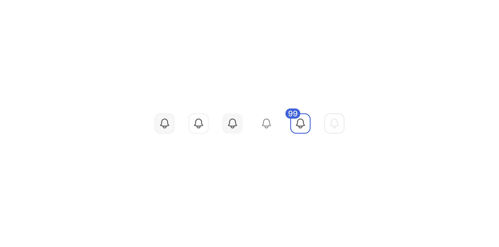

# Icon Button

> A square button that triggers an action using only an icon, with no visible text label.

 [View in Figma →](https://www.figma.com/design/7jCMwDng7HF5g7F3tGXf0E/Open-HR?node-id=551-37765)


---

## Overview

Icon Button is a compact, square action trigger used when space is limited and the icon alone communicates the action clearly enough, toolbars, table row actions, inline controls. Unlike [Button](/doc/3908a2ac-139b-49b0-840f-aaac39246de0) , it has no label and no accent variants. It has a fourth variant, `light`, designed for use on coloured or dark backgrounds.

Because there is no visible label, `aria-label` is **required** on every Icon Button, without it the button is completely inaccessible to screen reader users.

The icon is passed via the `icon` prop, not as `children`. The component does not render `children`.

**Available in:** React · Next.js · Figma


---

## Anatomy

| Part | Description |
|------|-------------|
| Container | Square outer frame, sets background, border (`1px`), border-radius (`Spacing/radius/sm-7px`), and padding. Fixed size: `24×24px` (sm) or `32×32px` (md). |
| Icon | The action icon, centred in the container (`14×14px`). Passed via `icon` prop, not `children`. |
| Icon Counter badge | Optional numeric badge (`12×12px`) that overlaps the top-right corner. Toggled via `showCounter`. [View in Figma →](https://www.figma.com/design/7jCMwDng7HF5g7F3tGXf0E/Open-HR?node-id=551-37847&t=KWBdW12gNJg7drFZ-11) |

**sm vs md padding:** The `sm` (24px) variant uses explicit `Spacing/padding/xs-5px` padding all sides. The `md` (32px) variant centres the icon via auto-layout with no explicit padding value, the icon is visually centred within the 32px container.


---

## Spacing tokens

| Property | sm  | md  |
|----------|-----|-----|
| Border radius | `Spacing/radius/sm-7px` | `Spacing/radius/sm-7px` |
| Container size | `24×24px` | `32×32px` |
| Padding  | `Spacing/padding/xs-5px` all sides | Auto-layout centred |
| Icon size | `14×14px` | `14×14px` |
| Border width | `1px` | `1px` |
| Counter badge size | `12×12px` | `12×12px` |
| Counter position | Top-right, overlapping edge | Top-right, overlapping edge |


---

## Variants

### Variant, hierarchy and surface

| Value | When to use |
|-------|-------------|
| `primary` | The most prominent icon action in a view, main toolbar action or prominent page-level control |
| `secondary` | Supporting icon actions alongside a primary, secondary toolbar controls |
| `tertiary` | Low-emphasis icon actions, inline table controls, auxiliary actions in dense UI |
| `light` | Very Low-emphasis icon, with a very stable icon color regardless of the state. |

**Key difference from Button:** No `accent` (Red/Blue) variants. For destructive icon actions, pair `tertiary` with a confirmation dialog rather than relying on colour to signal danger.

**Valid combinations:**

* `primary`, `secondary`, `tertiary` × 2 sizes × 5 states ✅, all defined
* `light` × 2 sizes × Rest, Hover, Pressed, Disabled ✅, defined
* `light` × Focus ⚠️, **not defined in Figma**. Do not use `light` in keyboard-navigable interfaces until a focus state is confirmed with design. <!-- TODO: confirm focus state for light variant -->


---

## States

| State | Trigger | Visual change |
|-------|---------|---------------|
| Rest  | Default idle | Base background and border |
| Hover | Pointer enters | Subtle background shift |
| Focus | Keyboard Tab | Visible focus ring |
| Pressed | Pointer down / Space or Enter | Button appears depressed |
| Disabled | `disabled` prop | Reduced opacity; pointer-events none; removed from tab order |


---

## Usage guidelines

**Do** use Icon Button when the icon is universally understood, close (`×`), search, add (`+`), filter, settings. **Don't** use Icon Button when the intent could be ambiguous. If there's any doubt, use Button with a label.

**Do** always provide an `aria-label` that names the action: `aria-label="Close dialog"`, `aria-label="Filter results"`. **Don't** describe the icon in the label ("magnifying glass icon"), describe the action ("Search").

**Do** use `light` on dark or coloured backgrounds. **Don't** use `light` on white or light-grey backgrounds, it will appear washed out.

**Do** use `sm` (24px) in toolbars, table rows, and data-dense UI. **Don't** mix `sm` and `md` within the same toolbar or action group.

**Do** use the counter badge for numeric indicators tied to the button's action, e.g. unread notification count. **Don't** use the counter badge as a general status indicator detached from the button's action.

**Do** pair Icon Buttons in toolbars with a Tooltip so sighted users can discover the action. **Don't** act immediately on destructive icon actions, always show a confirmation dialog first.


---

## Content guidelines

**For accessibility** `**aria-label**`, verb-first, describing the outcome:

* ✅ `"Close dialog"`, `"Search"`, `"Filter results"`, `"Delete row"`, `"Open settings"`
* ❌ `"X button"`, `"Magnifying glass"`, `"Bin icon"`

**When the counter is dynamic**, include the current count in the `aria-label` and update it when the value changes:

```tsx
aria-label={`Notifications, ${count} unread`}
```

This alone is not enough for screen readers to announce the change. Use an `aria-live` region alongside the button (see Accessibility).

**Counter badge display**, numeric only. Show `99+` when the value exceeds 99.


---

## Behaviour in context

**In a toolbar:** Use `sm` size. Group related actions with `gap: Spacing/gap/sm-8px` on the parent. Don't place more than 5–6 Icon Buttons in a row without a visual separator, the actions become hard to scan.

**In a table row:** Use `tertiary`, `sm`. Reveal row actions on hover where possible, keeps data-dense tables clean.

**On mobile:** The visual size may be `24px` but the interactive tap target must be at least `44×44px`. Achieve this with padding on the parent or a transparent hit-area wrapper, do not stretch the button itself.

**With a counter badge:** The badge overlaps the top-right corner. Ensure the parent layout provides enough overflow space so the badge isn't clipped. The badge is hidden by default.

**Tooltips:** Attach a Tooltip to every Icon Button in toolbars. The Tooltip's text content should be identical to the `aria-label` value.


---

## Accessibility

* `**aria-label**` **is required**, always. No exceptions. The component should throw a PropTypes/TypeScript warning if omitted.
* **Keyboard**, `Tab` / `Shift+Tab` to reach. `Space` or `Enter` to activate.
* **Focus state**, Defined for Primary, Secondary, Tertiary. Not defined for `light` in Figma, do not deploy `light` in keyboard-navigable contexts until resolved.
* **Dynamic counter**, Updating `aria-label` when the count changes does not automatically announce the change to screen readers. Place a visually hidden `aria-live="polite"` region elsewhere in the DOM and update its text when the count changes:

  ```tsx
  <span aria-live="polite" className="sr-only">
    {count > 0 ? `${count} unread notifications` : ''}
  </span>
  ```
* **Disabled**, Use the `disabled` HTML attribute. Screen readers will announce "dimmed" or "unavailable". To keep the button focusable (e.g. to show a tooltip explaining the disabled state), use `aria-disabled="true"` + prevent click in `onClick` instead of the `disabled` attribute.
* **Tooltips**, Associate the Tooltip with `aria-describedby` so screen reader users also receive the label. The Tooltip component should manage this automatically, confirm with its own documentation.
* **Touch target**, `44×44px` minimum on touch devices regardless of visual size.


---

## Animation

| Trigger | From → To | Transition | Duration | Easing |
|---------|-----------|------------|----------|--------|
| Mouse enter | `Rest` → `Hover` | Smart Animate | `100ms`  | Ease In |
| Mouse leave | `Hover` → `Rest` | Smart Animate | `100ms`  | Ease Out |
| Press   | `Hover` → `Pressed` | Dissolve   | `50ms`   | Ease Out |

Note the mixed transition types: hover uses **Smart Animate**, press uses **Dissolve**. No transition is defined into `Focus`.

> **Disabled state:** No transition is defined into or out of `Disabled` in Figma — implement it as an instant swap.

### Implementation reference

```css
.icon-button {
  transition: background-color 100ms ease-in, border-color 100ms ease-in; /* hover in */
}
.icon-button:not(:hover) {
  transition-timing-function: ease-out; /* hover out, 100ms */
}
.icon-button:active {
  transition-duration: 50ms;
  transition-timing-function: ease-out; /* press */
}
```


---

## Props / API

```ts
interface IconButtonProps {
  icon: React.ReactNode
  'aria-label': string
  variant?: 'primary' | 'secondary' | 'tertiary' | 'light'
  size?: 'sm' | 'md'
  showCounter?: boolean
  counter?: number
  disabled?: boolean
  onClick?: React.MouseEventHandler<HTMLButtonElement>
  type?: 'button' | 'submit' | 'reset'
  ref?: React.Ref<HTMLButtonElement>
  className?: string
}
```

| Prop | Type | Default | Required | Description |
|------|------|---------|----------|-------------|
| `icon` | `ReactNode` | —       | **Yes**  | The icon to render. Pass a 14×14px icon component. Not `children`, this component does not render children. |
| `aria-label` | `string` | —       | **Yes**  | Accessible action name. Always required, there is no visible label fallback. |
| `variant` | `'primary' \| 'secondary' \| 'tertiary' \| 'light'` | `'primary'` | No       | Visual hierarchy and surface context |
| `size` | `'sm' \| 'md'` | `'md'`  | No       | `sm` = 24×24px, `md` = 32×32px |
| `showCounter` | `boolean` | `false` | No       | Shows the numeric badge. Requires `counter` to be set. |
| `counter` | `number` | —       | No       | Badge value. The component renders `99+` when > 99. Update `aria-label` dynamically when this changes. |
| `disabled` | `boolean` | `false` | No       | Removes from tab order; announces to screen readers. Use `aria-disabled` to keep it focusable. |
| `onClick` | `React.MouseEventHandler<HTMLButtonElement>` | —       | No       | Fired on click |
| `type` | `'button' \| 'submit' \| 'reset'` | `'button'` | No       | HTML button type |
| `ref` | `React.Ref<HTMLButtonElement>` | —       | No       | Forwarded to the underlying `<button>` element |
| `className` | `string` | —       | No       | Additional CSS class for layout overrides |


---

## Code examples

### Default

```tsx
// Next.js (App Router), Server Component
// No 'use client' directive needed, this component carries no browser state.

<IconButton
  icon={<SearchIcon />}
  aria-label="Search"
/>
```

```tsx
// React
<IconButton
  icon={<SearchIcon />}
  aria-label="Search"
/>
```

### Sizes

```tsx
// Next.js (App Router), Server Component
// No 'use client' directive needed, this component carries no browser state.

<IconButton icon={<FilterIcon />} aria-label="Filter results" size="sm" />
<IconButton icon={<FilterIcon />} aria-label="Filter results" size="md" />
```

```tsx
// React
<IconButton icon={<FilterIcon />} aria-label="Filter results" size="sm" />
<IconButton icon={<FilterIcon />} aria-label="Filter results" size="md" />
```

### Variants

```tsx
// Next.js (App Router), Server Component
// No 'use client' directive needed, this component carries no browser state.

<IconButton variant="primary"   icon={<PlusIcon />}   aria-label="Add record" />
<IconButton variant="secondary" icon={<EditIcon />}    aria-label="Edit" />
<IconButton variant="tertiary"  icon={<TrashIcon />}   aria-label="Delete row" />
<IconButton variant="light"     icon={<CloseIcon />}   aria-label="Close" />
```

```tsx
// React
<IconButton variant="primary"   icon={<PlusIcon />}   aria-label="Add record" />
<IconButton variant="secondary" icon={<EditIcon />}    aria-label="Edit" />
<IconButton variant="tertiary"  icon={<TrashIcon />}   aria-label="Delete row" />
<IconButton variant="light"     icon={<CloseIcon />}   aria-label="Close" />
```

### With counter badge (dynamic)

```tsx
// Next.js (App Router), Server Component
// No 'use client' directive needed, this component carries no browser state.

// Update aria-label when count changes. Use an aria-live region for announcement.
function NotificationsButton({ count }: { count: number }) {
  return (
    <>
      <IconButton
        icon={<BellIcon />}
        aria-label={count > 0 ? `Notifications, ${count} unread` : 'Notifications'}
        showCounter={count > 0}
        counter={count}
      />
      {/* Screen readers announce changes to this region */}
      <span aria-live="polite" className="sr-only">
        {count > 0 ? `${count} unread notifications` : ''}
      </span>
    </>
  )
}
```

```tsx
// React
// Update aria-label when count changes. Use an aria-live region for announcement.
function NotificationsButton({ count }: { count: number }) {
  return (
    <>
      <IconButton
        icon={<BellIcon />}
        aria-label={count > 0 ? `Notifications, ${count} unread` : 'Notifications'}
        showCounter={count > 0}
        counter={count}
      />
      {/* Screen readers announce changes to this region */}
      <span aria-live="polite" className="sr-only">
        {count > 0 ? `${count} unread notifications` : ''}
      </span>
    </>
  )
}
```

### With Tooltip

```tsx
// Next.js (App Router), Server Component
// No 'use client' directive needed, this component carries no browser state.

// The Tooltip should manage aria-describedby internally.
// Confirm with the Tooltip component docs for the exact API.
<Tooltip label="Search">
  <IconButton
    icon={<SearchIcon />}
    aria-label="Search"
  />
</Tooltip>
```

```tsx
// React
// The Tooltip should manage aria-describedby internally.
// Confirm with the Tooltip component docs for the exact API.
<Tooltip label="Search">
  <IconButton
    icon={<SearchIcon />}
    aria-label="Search"
  />
</Tooltip>
```

### Destructive action with confirmation

```tsx
// Next.js (App Router), Client Component
'use client'

<IconButton
  variant="tertiary"
  icon={<TrashIcon />}
  aria-label="Delete record"
  onClick={() => setConfirmDialogOpen(true)}
/>
```

```tsx
// React
<IconButton
  variant="tertiary"
  icon={<TrashIcon />}
  aria-label="Delete record"
  onClick={() => setConfirmDialogOpen(true)}
/>
```

### Disabled with explanation (focusable)

```tsx
// Next.js (App Router), Client Component
'use client'

// aria-disabled keeps the button in the tab order so the tooltip is reachable.
<Tooltip label="You don't have permission to delete this record">
  <IconButton
    icon={<TrashIcon />}
    aria-label="Delete record"
    aria-disabled="true"
    onClick={(e) => e.preventDefault()}
  />
</Tooltip>
```

```tsx
// React
// aria-disabled keeps the button in the tab order so the tooltip is reachable.
<Tooltip label="You don't have permission to delete this record">
  <IconButton
    icon={<TrashIcon />}
    aria-label="Delete record"
    aria-disabled="true"
    onClick={(e) => e.preventDefault()}
  />
</Tooltip>
```


---

## Related components

* [Button](/doc/3908a2ac-139b-49b0-840f-aaac39246de0)  Use when a visible text label is needed
* **Tooltip**, Always pair with Icon Button in toolbars (🚧TBD)
* The counter badge is built into Icon Button, no separate Badge component needed for this pattern [View in Figma →](https://www.figma.com/design/7jCMwDng7HF5g7F3tGXf0E/Open-HR?node-id=551-37847&t=KWBdW12gNJg7drFZ-11)