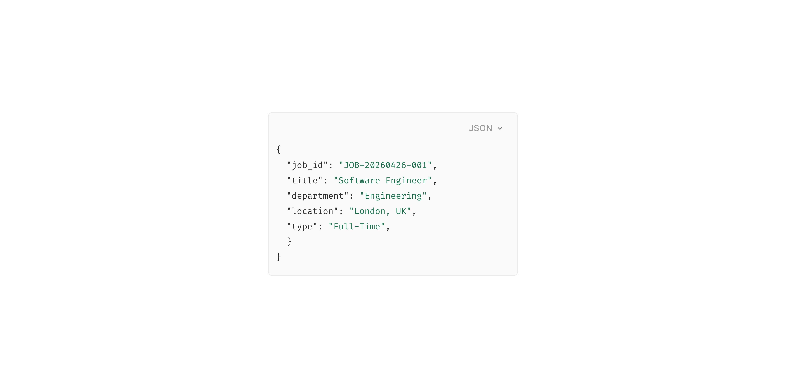

# Input Code

> A code editor field for entering structured data, configuration snippets, or code samples.

 [View in Figma →](https://www.figma.com/design/7jCMwDng7HF5g7F3tGXf0E/Open-HR?node-id=1053-47760)


---

## Overview

Input Code is a multi-line field designed for structured text, code snippets, JSON, YAML, configuration, or any content where monospace formatting matters. It shares the same label + field + helper structure as Textarea, but replaces the formatting toolbar with action buttons (Copy, Format, language selector).

**Key differences from Textarea:**

* No Bold/Italic/Underline toolbar, code formatting is not prose formatting.
* Has action buttons at the top of the field: a primary action (e.g. "Format", "Copy") and an optional secondary group.
* The field **expands significantly on Focus**, the code area grows from a compact placeholder state to a much taller edit mode.
* The placeholder and content use monospace font rendering.

Input Code composes: an optional label, the [Code Field](/doc/0f8719c0-cbee-483b-a596-3d933458d6cb) sub-component, and optional helper text.

**Available in:** React · Next.js · Figma


---

## Anatomy

| Part | Description |
|------|-------------|
| Label | Optional visible field label. |
| Code field | The multi-line code container. `Spacing/padding/lg-12px` all-side padding. `Spacing/radius/sm-7px` radius. `1px` border. Contains action buttons + code area. |
| Action button (primary) | A Button at the top of the field, `70px` wide, `24px` tall. Typical label: "Format", "Validate". |
| Action button (secondary) | An additional Button, `92px` wide, `24px` tall. Typical: "Copy code", "Clear". |
| Code area | The `<textarea>` or code editor element. `25px` collapsed height; expands to `232px+` on Focus. Monospace font. |
| Helper text | Optional guidance or error below the field. |

**Field heights (from Figma bounding boxes):**

| State | Field height | Code area height |
|-------|--------------|------------------|
| Placeholder / Hover / Filled / Error / Disabled | `85px`       | `25px`           |
| Focus | `292px`      | `232px`          |

> The dramatic height change between collapsed and focused states is intentional, the code field collapses to a compact preview when not in use and expands to a full editing surface on focus.


---

## Spacing tokens

| Property | Value |
|----------|-------|
| Field padding (all sides) | `Spacing/padding/lg-12px` |
| Field border radius | `Spacing/radius/sm-7px` |
| Gap (action buttons ↔ code area) | `Spacing/gap/lg-12px` |
| Code area top padding | `Spacing/padding/xs-4px` |
| Code area bottom padding | `Spacing/padding/lg-12px` |
| Gap (label → field) | `Spacing/gap/sm-6px` |
| Gap (field → helper) | `Spacing/gap/sm-6px` |
| Field border width | `1px` |
| Primary action button width | `70px` |
| Primary action button height | `24px` |
| Secondary action button width | `92px` |
| Secondary action button height | `24px` |
| Code area height (collapsed) | `25px` |
| Code area height (focused) | `232px` |


---

## Variants

### State (`state` / Figma: `state`)

| Value | Figma value | Visual change |
|-------|-------------|---------------|
| Placeholder | `Place holder` | Compact field; placeholder text in code area |
| Hover | `Hover`     | Border darkens |
| Focus | `Focus`     | Focus border; field expands to full editing height |
| Selected | `Selected`  | Code text selection highlight |
| Filled | `filled`    | Compact field; code content visible |
| Error | `Error`     | Red border; helper becomes error |
| Disabled | `Disabled`  | Reduced opacity; non-interactive |

### Label visibility (`showLabel` / Figma: `Show Label 🏷️`)

| Value | Default | Description |
|-------|---------|-------------|
| `true` | Yes     | Shows the label above the field |
| `false` | —       | Hidden, provide `aria-label` on the field |

### Helper visibility (`showHelper` / Figma: `Show Helper 💬`)

| Value | Default | Description |
|-------|---------|-------------|
| `true` | Yes     | Shows helper or error text below the field |
| `false` | —       | No helper text area |


---

## States

| State | Figma value | Trigger | Visual change |
|-------|-------------|---------|---------------|
| Placeholder | `Place holder` | Field empty, not focused | Compact field; placeholder text; neutral border |
| Hover | `Hover`     | Pointer enters | Border darkens |
| Focus | `Focus`     | User clicks or tabs into field | Focus border; code area expands from `25px` to `232px` |
| Selected | `Selected`  | User highlights code | Code text selection highlight |
| Filled | `filled`    | Field has content, not focused | Compact field; code content visible |
| Error | `Error`     | Validation failure or parse error | Red border; helper becomes error |
| Disabled | `Disabled`  | `disabled` prop | Reduced opacity; non-interactive |

> The `Selected` state represents native browser text selection in the code area, no prop maps to it directly.


---

## Usage guidelines

**Do** use Input Code for JSON configuration, API response samples, code snippets, or any structured text where whitespace and formatting matter. **Don't** use Input Code for prose or natural language, use Textarea or Rich Text Input.

**Do** show a "Format" or "Validate" action button when the expected input has a known schema (JSON, YAML, SQL). **Don't** show formatting buttons if the content is free-form code without a defined schema.

**Do** set `spellCheck={false}`, code editors should not flag variable names as spelling errors. **Don't** apply `autocorrect` or `autocapitalize`, these break code entry on mobile.

**Do** use syntax highlighting if the library supports it for the relevant language. **Don't** implement syntax highlighting without a fallback, plain monospace text is always acceptable.

**Do** pair with a "Copy" action button so users can easily copy the code. **Don't** rely on Ctrl+A to select all, provide explicit selection/copy affordances.


---

## Content guidelines

* **Label:** "Webhook payload", "JSON configuration", "SQL query", "Embed code"
* **Placeholder:** A concise example in the correct format, the Figma default shows a JSON object
* **Helper text:** "Valid JSON only", "Supports ES2022 syntax", "Read-only, copy to use"
* **Error:** Specific parse errors, "Invalid JSON: unexpected token at line 3", "Required field missing: `api_key`"


---

## Behaviour in context

**Expand on focus:** The code area expands from `25px` to `232px` when focused. This transition should be smooth (`transition: height 150ms ease`). When the user clicks away, the field collapses back.

**Format action:** Clicking the "Format" button runs a formatter (e.g. `JSON.stringify(JSON.parse(value), null, 2)`) on the current content. If formatting fails (invalid syntax), transition to the Error state with the parse error in the helper text.

**Copy action:** Clicking "Copy code" copies the full field content to the clipboard. Show a brief success state on the button ("Copied!") for 1.5 seconds.

**Read-only code display:** When `readOnly=true`, the field shows code without allowing edits. Always pair with a "Copy" button. The field should still be focusable (for keyboard copy).

**Paste:** Large code pastes (e.g. from an IDE) should be accepted without truncation. Don't impose artificial paste limits.


---

## Accessibility

* **Native** `**<textarea>**`, Use for the code area. Add `role="textbox"` and `aria-multiline="true"` if using a custom element.
* `**aria-label**` **/** `**<label>**`, Required. The label must describe what format of code is expected.
* `**spellCheck={false}**`, Prevents screen readers from announcing false spelling errors.
* `**autocomplete="off"**`**,** `**autocorrect="off"**`**,** `**autocapitalize="off"**`, All required for code fields.
* `**aria-invalid="true"**`, Set in the Error state (e.g. parse error).
* **Action buttons**, Each needs a descriptive `aria-label`: `"Format code"`, `"Copy code to clipboard"`.
* **Keyboard**, `Tab` moves to the next field. `Ctrl+A` selects all content inside the code area.


---

## Animation

See [Code Field (sub-component)](/doc/0f8719c0-cbee-483b-a596-3d933458d6cb).


---

## Props / API

```ts
interface InputCodeProps {
  label?: string
  showLabel?: boolean
  helperText?: string
  showHelper?: boolean
  errorText?: string
  value?: string
  defaultValue?: string
  placeholder?: string
  language?: string
  onChange?: React.ChangeEventHandler<HTMLTextAreaElement>
  onBlur?: React.FocusEventHandler<HTMLTextAreaElement>
  showActionButton?: boolean
  primaryActionLabel?: string
  onPrimaryAction?: () => void
  showSecondaryAction?: boolean
  secondaryActionLabel?: string
  onSecondaryAction?: () => void
  readOnly?: boolean
  disabled?: boolean
  required?: boolean
  name?: string
  id?: string
  'aria-label'?: string
  ref?: React.Ref<HTMLTextAreaElement>
  className?: string
}
```

| Prop | Type | Default | Required | Description |
|------|------|---------|----------|-------------|
| `label` | `string` | —       | No       | Visible field label. |
| `showLabel` | `boolean` | `true`  | No       | Renders the label. When `false`, provide `aria-label`. |
| `helperText` | `string` | —       | No       | Format guidance or constraint. |
| `showHelper` | `boolean` | `true`  | No       | Renders the helper text area. |
| `errorText` | `string` | —       | No       | Parse error or validation message. Applies Error state. |
| `value` | `string` | —       | No       | Controlled value, the raw code string. |
| `defaultValue` | `string` | —       | No       | Initial value in uncontrolled mode. |
| `placeholder` | `string` | —       | No       | Example code shown when the field is empty. |
| `language` | `string` | `'text'` | No       | Language identifier for syntax highlighting and the Format action (e.g. `'json'`, `'yaml'`, `'sql'`). |
| `showActionButton` | `boolean` | `true`  | No       | Shows the primary action button. |
| `primaryActionLabel` | `string` | `'Format'` | No       | Label for the primary action button. |
| `onPrimaryAction` | `() => void` | —       | No       | Fires when the primary action button is clicked. |
| `showSecondaryAction` | `boolean` | `false` | No       | Shows the secondary action button (e.g. "Copy"). |
| `secondaryActionLabel` | `string` | —       | No       | Label for the secondary action button. |
| `onSecondaryAction` | `() => void` | —       | No       | Fires when the secondary action button is clicked. |
| `readOnly` | `boolean` | `false` | No       | Non-editable but focusable. Always pair with a copy action. |
| `disabled` | `boolean` | `false` | No       | Non-interactive and reduced opacity. |
| `required` | `boolean` | `false` | No       | Marks the field as required. |
| `name` | `string` | —       | No       | Form field name for submission. |
| `id` | `string` | —       | No       | Auto-generated if not provided. |
| `aria-label` | `string` | —       | No       | Required when `showLabel=false`. |
| `aria-describedby` | `string` | —       | No       | ID of helper/error text element. |
| `ref` | `React.Ref<HTMLTextAreaElement>` | —       | No       | Forwarded to the `<textarea>`. |
| `className` | `string` | —       | No       | Additional CSS class on the outer wrapper. |


---

## Code examples

### JSON editor with format action

```tsx
// Next.js (App Router), Client Component
'use client'

const [json, setJson] = useState('')
const [error, setError] = useState('')

function handleFormat() {
  try {
    const formatted = JSON.stringify(JSON.parse(json), null, 2)
    setJson(formatted)
    setError('')
  } catch (e) {
    setError(`Invalid JSON: ${(e as Error).message}`)
  }
}

<InputCode
  label="Webhook payload"
  value={json}
  onChange={(e) => setJson(e.target.value)}
  language="json"
  placeholder={'{\n  "event": "employee.created",\n  "data": {}\n}'}
  primaryActionLabel="Format"
  onPrimaryAction={handleFormat}
  errorText={error}
  helperText="Valid JSON only"
/>
```

```tsx
// React
const [json, setJson] = useState('')
const [error, setError] = useState('')

function handleFormat() {
  try {
    const formatted = JSON.stringify(JSON.parse(json), null, 2)
    setJson(formatted)
    setError('')
  } catch (e) {
    setError(`Invalid JSON: ${(e as Error).message}`)
  }
}

<InputCode
  label="Webhook payload"
  value={json}
  onChange={(e) => setJson(e.target.value)}
  language="json"
  placeholder={'{\n  "event": "employee.created",\n  "data": {}\n}'}
  primaryActionLabel="Format"
  onPrimaryAction={handleFormat}
  errorText={error}
  helperText="Valid JSON only"
/>
```

### Read-only code display with copy

```tsx
// Next.js (App Router), Client Component
'use client'

const [copied, setCopied] = useState(false)

async function handleCopy() {
  await navigator.clipboard.writeText(embedCode)
  setCopied(true)
  setTimeout(() => setCopied(false), 1500)
}

<InputCode
  label="Embed code"
  value={embedCode}
  readOnly
  showActionButton={false}
  showSecondaryAction
  secondaryActionLabel={copied ? 'Copied!' : 'Copy code'}
  onSecondaryAction={handleCopy}
  helperText="Paste this snippet into your website's <head> tag"
/>
```

```tsx
// React
const [copied, setCopied] = useState(false)

async function handleCopy() {
  await navigator.clipboard.writeText(embedCode)
  setCopied(true)
  setTimeout(() => setCopied(false), 1500)
}

<InputCode
  label="Embed code"
  value={embedCode}
  readOnly
  showActionButton={false}
  showSecondaryAction
  secondaryActionLabel={copied ? 'Copied!' : 'Copy code'}
  onSecondaryAction={handleCopy}
  helperText="Paste this snippet into your website's <head> tag"
/>
```


---

## Related components

* [Textarea](/doc/a68c7ad4-0c95-4e87-8889-09d36621449c), Use for natural language multi-line input with basic text formatting
* [Rich Text Input](/doc/c988f131-ff4c-438b-bc00-edc853bbdade), Use for prose that needs rich formatting (headings, lists, links)
* [Text Input](/doc/93534567-2eff-45a2-b5a8-00a8b76dc4eb), Use for single-line text entry