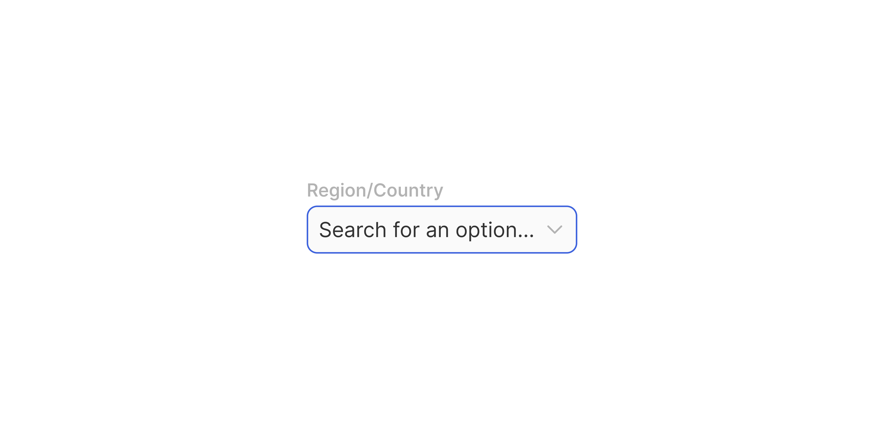

# Input Selection

> A labelled dropdown/select field for choosing one or more options from a list.

 [View in Figma →](https://www.figma.com/design/7jCMwDng7HF5g7F3tGXf0E/Open-HR?node-id=1053-47789)


---

## Overview

Input Selection is the standard field for choosing from a predefined set of options. It looks similar to Text Input but is always read-only as a text field, the user interacts by clicking to open a dropdown list, not by typing directly.

Key distinctions from Text Input:

* The suffix is always a **chevron-down icon** (not configurable), it signals this is a dropdown trigger.
* The `with-selection` variant shows selected option Tags inside the field for multi-select contexts.
* Width fills the parent container; height is fixed per size.

Input Selection composes: an optional label, the [Selection Field](/doc/935cdb9e-a652-46d4-849e-dc344de6b315) sub-component, and optional helper text.

**Available in:** React · Next.js · Figma


---

## Anatomy

| Part | Description |
|------|-------------|
| Label | Optional visible field label. No wrapper frame (unlike Text Input, the label is a direct text node). |
| Selection field | The clickable trigger. Contains an optional prefix icon, the selected value or placeholder, and a fixed chevron-down suffix. |
| Chevron-down | Always present, `14×14px` (32px size) or `12×12px` (25px size). Indicates this is a dropdown. Not configurable. |
| Tags | Shown when `withSelection=true`, selected option Tags displayed inside the field instead of a text value. `20px` tall. |
| Helper text | Optional guidance or error message below the field. `Spacing/gap/sm-6px` gap from the field. |

**Total component height (all parts visible):**

| Input size | Label | Gap | Field | Gap | Helper | Total |
|------------|-------|-----|-------|-----|--------|-------|
| `md` (32px) | `9px` | `6px` | `32px` | `6px` | `9px`  | **62px** |
| `sm` (25px) | `9px` | `6px` | `25px` | `6px` | `9px`  | **55px** |


---

## Spacing tokens

| Property | `sm` (25px) | `md` (32px) | Token |
|----------|-----------|-----------|-------|
| Padding left / right | `Spacing/padding/sm-8px` | `Spacing/padding/sm-8px` | `Spacing/padding/sm-8px` |
| Border radius | `Spacing/radius/sm-7px` | `Spacing/radius/sm-7px` | `Spacing/radius/sm-7px` |
| Gap between elements | `Spacing/gap/xs-4px` | `Spacing/gap/xs-4px` | `Spacing/gap/xs-4px` |
| Gap (label → field) | `Spacing/gap/sm-6px` | `Spacing/gap/sm-6px` | `Spacing/gap/sm-6px` |
| Gap (field → helper) | `Spacing/gap/sm-6px` | `Spacing/gap/sm-6px` | `Spacing/gap/sm-6px` |
| Field height | `25px`    | `32px`    | —     |
| Border width | `1px`     | `1px`     | —     |
| Prefix icon size | `12×12px` | `14×14px` | —     |
| Chevron suffix size | `12×12px` | `14×14px` | —     |
| Tag height (with-selection) | `20px`    | `20px`    | —     |

> **Note:** The Selection Field sub-component has a third size (`lg` / 40px) that the Input Selection composite does not expose. The 40px size is available in the sub-component for other contexts.


---

## Variants

### Size (`size` / Figma: `🏗️ Height`)

| Value | Figma value | Field height | When to use |
|-------|-------------|--------------|-------------|
| `md`  | `32px`      | `32px`       | Default, standard forms |
| `sm`  | `25px`      | `25px`       | Dense forms, compact filter panels |

### State (`state` / Figma: `state`)

| Value | Figma value | Description |
|-------|-------------|-------------|
| `placeholder` | `Place holder` | Default, no value selected |
| `hover` | `Hover`     | Pointer over the field |
| `focus` | `Focus`     | Field active (dropdown open or keyboard focus) |
| `filled` | `filled`    | Value selected, dropdown closed |
| `error` | `Error`     | Validation failure |
| `disabled` | `Disabled`  | Non-interactive |

> State is usually managed internally, set `errorText` to trigger the Error state. Pass `disabled` to trigger Disabled.

### Label visibility (`showLabel` / Figma: `Show Label 🏷️`)

| Value | Default | Description |
|-------|---------|-------------|
| `true` | Yes     | Shows the visible label above the field |
| `false` | —       | Hidden, provide `aria-label` or `aria-labelledby` |

### Helper visibility (`showHelper` / Figma: `show Helper 💬`)

| Value | Default | Description |
|-------|---------|-------------|
| `true` | Yes     | Shows the helper or error text |
| `false` | —       | No helper text area |


---

## States

| State | Figma value | Trigger | Visual change |
|-------|-------------|---------|---------------|
| Placeholder | `Place holder` | No selection made | Placeholder text visible; neutral border |
| Hover | `Hover`     | Pointer enters the field | Border darkens |
| Focus | `Focus`     | Field is active (dropdown open or keyboard focus) | Focus colour border |
| Filled | `filled`    | A value has been selected and the dropdown is closed | Selected value shown; neutral border |
| Error | `Error`     | Required field with no selection, or validation failure | Red border; helper text becomes error message |
| Disabled | `Disabled`  | `disabled` prop is set | Reduced opacity on entire component; not clickable; removed from tab order |

> Figma uses `"Place holder"` (two words) for this composite. The API normalises to `'placeholder'`.


---

## Usage guidelines

**Do** use Input Selection when the user must choose from a fixed, predefined set of options. **Don't** use Input Selection for free-text input, use Text Input.

**Do** use multi-select with the `withSelection` variant when the user can pick multiple options, selected items appear as Tags inside the field. **Don't** use checkboxes in a list as a substitute for a multi-select field when there are more than \~5 options, use Input Selection with `withSelection`.

**Do** provide a meaningful placeholder: "Select a department", "Choose a country". **Don't** use "Select..." or "Choose..." alone, always name what's being selected.

**Do** use `md` (32px) as the default in standard forms. Use `sm` in dense filter panels. **Don't** mix `sm` and `md` in the same form section.

**Do** show the number of selected options in the field when all selected items don't fit: "3 selected". **Don't** overflow tags outside the field boundary, truncate with a count indicator.

**Do** place validation errors in the helper text, not as a tooltip. **Don't** show errors before the user has interacted with the field.


---

## Content guidelines

* **Placeholder:** "Select \[noun\]", "Select a department", "Select currency", "Choose a country"
* **Label:** Same rules as Text Input, sentence case, no trailing colon, 1–3 words
* **Helper text:** Use to explain constraints: "You can select multiple options", "Changes take effect immediately"
* **Error text:** "Please select a \[noun\]", "Please select a department"
* **Tags (multi-select):** Show the option label, not its ID or code


---

## Behaviour in context

**On click:** The field opens a dropdown list (Dropdown / Listbox component). The field's visual state changes to Focus while the list is open.

**On selection:** The chosen value replaces the placeholder text. The dropdown closes. The field transitions to the Filled state.

**Multi-select:** When `withSelection=true`, Tags accumulate inside the field. When tags overflow the field width, show the visible tags plus a count: "+ 2 more". On small fields, you may only fit 1–2 tags before showing a count.

**Keyboard:** `Space` or `Enter` opens the dropdown. Arrow keys navigate the list. `Enter` selects. `Escape` closes without selecting. `Tab` moves to the next field.

**Clearable:** If the field is not required, provide a clear affordance when a value is selected (often an × icon that replaces the chevron, or a secondary × button inside the field).

**Searchable (combobox):** When the option list is long (>10 items), consider making the field searchable. In this mode, the field accepts typed characters to filter the list, while still rendering as a selection (not free-text).


---

## Accessibility

* `**role="combobox"**`, The trigger field should use `role="combobox"` with `aria-haspopup="listbox"` and `aria-expanded` toggling when the list opens/closes.
* `**aria-controls**`, Point to the `id` of the listbox that opens.
* `**aria-activedescendant**`, Set to the `id` of the currently highlighted option in the listbox.
* `**aria-required**`, Set when the field is required.
* `**aria-invalid="true"**`, Set in the Error state.
* `**aria-describedby**`, Point to the helper/error text element.
* **Keyboard**, `Space`/`Enter` to open, Arrow keys to navigate, `Enter` to select, `Escape` to close.
* **Chevron icon**, `aria-hidden="true"`, it is decorative.
* **Tags in multi-select**, Each tag should have a remove button with `aria-label="Remove [option name]"`.


---

## Animation

| Trigger | From → To | Transition | Duration | Easing |
|---------|-----------|------------|----------|--------|
| Mouse enter | `Place holder` → `Hover` | Smart Animate | `100ms`  | Ease Out |
| Mouse leave | `Hover` → `Place holder` | Smart Animate | `100ms`  | Ease Out |
| Click   | `Hover` → `Focus` | Smart Animate | `100ms`  | Ease Out |
| Click   | `Filled` → `Focus` | Smart Animate | `100ms`  | Ease Out |
| Click (commit) | `Focus` → `Filled` | Smart Animate | `100ms`  | Ease Out |
| Mouse leave | `Focus` → `Place holder` | Smart Animate | `100ms`  | Ease Out |

(Read from the `.Subcomponents/Group-selection` component set — all transitions uniform Smart Animate `100ms` Ease Out, including hover-enter.)

> **Disabled state:** No transition is defined into or out of `Disabled` in Figma — implement it as an instant swap.

### Implementation reference

```css
/* All transitions: Smart Animate 100ms ease-out (hover-in is ease-in on the composite field) */
.field {
  transition: border-color 100ms ease-out, background-color 100ms ease-out;
}
```


---

## Props / API

```ts
interface InputSelectionProps {
  label?: string
  showLabel?: boolean
  helperText?: string
  showHelper?: boolean
  errorText?: string
  size?: 'sm' | 'md'
  value?: string | string[]
  defaultValue?: string | string[]
  placeholder?: string
  options: SelectOption[]
  multiple?: boolean
  withSelection?: boolean
  onChange?: (value: string | string[]) => void
  showPrefixIcon?: boolean
  prefixIcon?: React.ReactNode
  disabled?: boolean
  required?: boolean
  clearable?: boolean
  searchable?: boolean
  'aria-label'?: string
  'aria-labelledby'?: string
  name?: string
  id?: string
  className?: string
}

interface SelectOption {
  value: string
  label: string
  disabled?: boolean
}
```

| Prop | Type | Default | Required | Description |
|------|------|---------|----------|-------------|
| `label` | `string` | —       | No       | Visible field label. |
| `showLabel` | `boolean` | `true`  | No       | Renders the label. When `false`, provide `aria-label`. |
| `helperText` | `string` | —       | No       | Guidance text shown when there is no `errorText`. |
| `showHelper` | `boolean` | `true`  | No       | Renders the helper text area. |
| `errorText` | `string` | —       | No       | Error message, also sets the field to the Error state. |
| `size` | `'sm' \| 'md'` | `'md'`  | No       | Field height: `sm`=25px, `md`=32px. |
| `value` | `string \| string[]` | —       | No       | Controlled selected value(s). `string[]` when `multiple=true`. |
| `defaultValue` | `string \| string[]` | —       | No       | Initial value(s) in uncontrolled mode. |
| `placeholder` | `string` | `'Select...'` | No       | Shown when no value is selected. Always name what's being selected. |
| `options` | `SelectOption[]` | —       | **Yes**  | The list of available options. |
| `multiple` | `boolean` | `false` | No       | Enables multi-select. Changes `value` type to `string[]`. |
| `withSelection` | `boolean` | `false` | No       | Shows selected values as Tags inside the field (multi-select mode). |
| `onChange` | `(value: string \| string[]) => void` | —       | No       | Fires when the selection changes. |
| `showPrefixIcon` | `boolean` | `false` | No       | Shows an optional leading icon. |
| `prefixIcon` | `ReactNode` | —       | No       | Icon for the prefix slot. |
| `disabled` | `boolean` | `false` | No       | Disables the entire component. |
| `required` | `boolean` | `false` | No       | Marks the field as required. |
| `clearable` | `boolean` | `false` | No       | Shows a clear button when a value is selected. |
| `searchable` | `boolean` | `false` | No       | Allows typing to filter the options list. |
| `aria-label` | `string` | —       | No       | Required when `showLabel=false`. |
| `aria-labelledby` | `string` | —       | No       | ID of an external label element. |
| `name` | `string` | —       | No       | Form field name for submission. |
| `id` | `string` | —       | No       | Auto-generated if not provided. Links the label's `htmlFor`. |
| `className` | `string` | —       | No       | Additional CSS class on the outer wrapper. |


---

## Code examples

### Single select (uncontrolled)

```tsx
// Next.js (App Router), Server Component
// No 'use client' directive needed, this component carries no browser state.

<InputSelection
  label="Department"
  placeholder="Select a department"
  options={departments.map(d => ({ value: d.id, label: d.name }))}
  required
  helperText="Select the team this role belongs to"
/>
```

```tsx
// React
<InputSelection
  label="Department"
  placeholder="Select a department"
  options={departments.map(d => ({ value: d.id, label: d.name }))}
  required
  helperText="Select the team this role belongs to"
/>
```

### Controlled with validation

```tsx
// Next.js (App Router), Client Component
'use client'

const [dept, setDept] = useState('')
const [error, setError] = useState('')

function handleSubmit() {
  if (!dept) {
    setError('Please select a department')
    return
  }
  // proceed
}

<InputSelection
  label="Department"
  placeholder="Select a department"
  options={departments}
  value={dept}
  onChange={(v) => { setDept(v as string); setError('') }}
  errorText={error}
  required
/>
```

```tsx
// React
const [dept, setDept] = useState('')
const [error, setError] = useState('')

function handleSubmit() {
  if (!dept) {
    setError('Please select a department')
    return
  }
  // proceed
}

<InputSelection
  label="Department"
  placeholder="Select a department"
  options={departments}
  value={dept}
  onChange={(v) => { setDept(v as string); setError('') }}
  errorText={error}
  required
/>
```

### Multi-select with tags

```tsx
// Next.js (App Router), Client Component
'use client'

const [skills, setSkills] = useState<string[]>([])

<InputSelection
  label="Skills required"
  placeholder="Select skills"
  options={skillOptions}
  value={skills}
  onChange={(v) => setSkills(v as string[])}
  multiple
  withSelection
  helperText="Select all that apply"
  size="md"
/>
```

```tsx
// React
const [skills, setSkills] = useState<string[]>([])

<InputSelection
  label="Skills required"
  placeholder="Select skills"
  options={skillOptions}
  value={skills}
  onChange={(v) => setSkills(v as string[])}
  multiple
  withSelection
  helperText="Select all that apply"
  size="md"
/>
```

### Searchable (long lists)

```tsx
// Next.js (App Router), Server Component
// No 'use client' directive needed, this component carries no browser state.

<InputSelection
  label="Country"
  placeholder="Select a country"
  options={countries}
  searchable
  showPrefixIcon
  prefixIcon={<GlobeIcon aria-hidden />}
/>
```

```tsx
// React
<InputSelection
  label="Country"
  placeholder="Select a country"
  options={countries}
  searchable
  showPrefixIcon
  prefixIcon={<GlobeIcon aria-hidden />}
/>
```

### Compact (filter panel)

```tsx
// Next.js (App Router), Server Component
// No 'use client' directive needed, this component carries no browser state.

<InputSelection
  label="Status"
  placeholder="All statuses"
  options={statusOptions}
  size="sm"
  clearable
  showHelper={false}
/>
```

```tsx
// React
<InputSelection
  label="Status"
  placeholder="All statuses"
  options={statusOptions}
  size="sm"
  clearable
  showHelper={false}
/>
```


---

## Related components

* [Selection Field](/doc/935cdb9e-a652-46d4-849e-dc344de6b315), The raw trigger field sub-component inside Input Selection
* [Text Input](/doc/93534567-2eff-45a2-b5a8-00a8b76dc4eb), Use for free-text entry; use Input Selection for predefined options
* [Checkbox](/doc/9a3bc1b5-2db8-4954-9935-147c6105d738), Use for multi-select with ≤5 visible options that don't need to be searchable
* [Radio Button](/doc/7a2aa4bd-e1ab-46e1-85cc-95b14edaf6d4), Use for single-select with ≤6 always-visible options