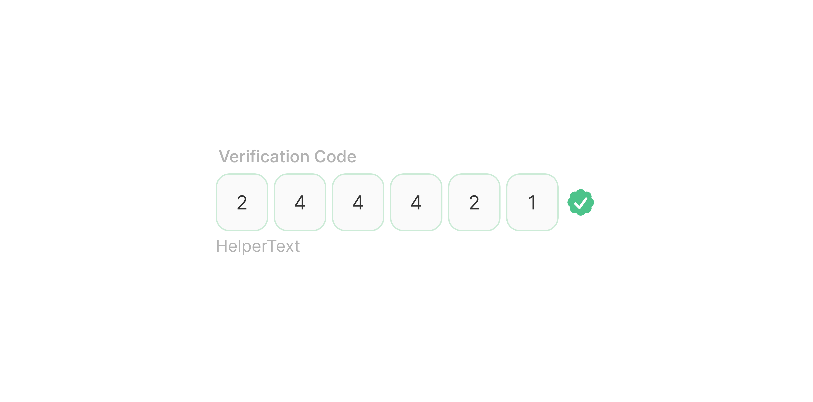

# OTP Input

> A one-time password field composed of four individual digit cells for secure code entry.

 [View in Figma →](https://www.figma.com/design/7jCMwDng7HF5g7F3tGXf0E/Open-HR?node-id=2765-34486)


---

## Overview

OTP Input is a specialised form field for entering short numeric or alphanumeric verification codes. It renders as four individual single-character cells in a row, each receiving exactly one character. When a character is entered, focus automatically advances to the next cell.

OTP Input is a composite of: an optional label, a row of four [OTP Cell](/doc/21250d70-44fe-42d1-b4ac-46eb947c6413) sub-components, and optional helper text.

**Available in:** React · Next.js · Figma


---

## Anatomy

| Part | Description |
|------|-------------|
| Label wrapper | Contains the visible field label. `2px` left indent. Toggleable via `showLabel`. |
| OTP cell row | A horizontal row of exactly four OTP Cell instances with `Spacing/gap/xs-4px` gap between them. |
| OTP Cell | A single-character input cell, `38×42px`. See [OTP Cell](/doc/21250d70-44fe-42d1-b4ac-46eb947c6413) for full anatomy. |
| Helper text | Short guidance or error message below the row. `Spacing/gap/sm-6px` gap from the cell row. Toggleable via `showHelper`. |

**Total component height:**

| Part | Height |
|------|--------|
| Label wrapper | `11px` |
| Gap  | `Spacing/gap/sm-6px` |
| OTP cell row | `42px` |
| Gap  | `Spacing/gap/sm-6px` |
| Helper text | `9px`  |
| **Total** | **74px** |

**Row width:** 4 cells × `38px` + 3 gaps × `Spacing/gap/xs-4px` = `164px` occupied by cells. The composite fills the parent container width, the cells are left-aligned within it.


---

## Spacing tokens

| Property | Value | Token |
|----------|-------|-------|
| Cell padding left / right | `Spacing/padding/lg-12px` | `Spacing/padding/lg-12px` |
| Cell corner radius | `Spacing/radius/sm-8px` | `Spacing/radius/sm-8px` |
| Gap between cells | `Spacing/gap/xs-4px` | `Spacing/gap/xs-4px` |
| Label indent | `Spacing/padding/xs-2px` | `Spacing/padding/xs-2px` |
| Gap (label → cells) | `Spacing/gap/sm-6px` | `Spacing/gap/sm-6px` |
| Gap (cells → helper) | `Spacing/gap/sm-6px` | `Spacing/gap/sm-6px` |
| Cell size | `38×42px` | —     |
| Cell border width | `1px` | —     |


---

## Variants

### State (`state` / Figma: `State`)

| Value | Figma value | Description |
|-------|-------------|-------------|
| `rest` | `Rest`      | Default, no cells focused, no input |
| `allFocused` | `All Focused` | All cells in the focused visual state, used when the field group is active |
| `error` | `Error`     | Validation failed, incorrect or expired code; all cells show the error colour |
| `success` | `Success`   | Code verified, all cells show the success colour |

> The composite state drives the visual colour of all cells simultaneously. Individual cell focus is managed internally as the user types.

### Label visibility (`showLabel` / Figma: `Show Label 🏷️`)

| Value | Default | Description |
|-------|---------|-------------|
| `true` | Yes     | Shows the label above the cells |
| `false` | —       | Hidden, provide `aria-label` on the group wrapper |

### Helper text visibility (`showHelper` / Figma: `Show Helper 💬`)

| Value | Default | Description |
|-------|---------|-------------|
| `true` | Yes     | Shows helper or error text below the cells |
| `false` | —       | No helper text |


---

## States

| State | Trigger | Visual change |
|-------|---------|---------------|
| Rest  | No input, no focus | All cells idle; neutral border |
| All Focused | User has entered the field (first cell focused) | All cells show focus styling simultaneously |
| Error | Code submission fails (incorrect/expired) | All cells turn to error colour |
| Success | Code verified successfully | All cells turn to success colour |

> Individual cell states (Hover, Focus, Filled, Disabled) are documented in [OTP Cell](/doc/21250d70-44fe-42d1-b4ac-46eb947c6413). The composite state overrides all cell states when set to Error or Success.


---

## Usage guidelines

**Do** use OTP Input exclusively for short verification codes, 2FA codes, email verification, phone verification. **Don't** use OTP Input for PINs or passwords that aren't time-limited, use a password Text Input instead.

**Do** auto-advance focus to the next cell when a character is entered. **Don't** require the user to manually click each cell.

**Do** support paste, when the user pastes a 4-digit string, distribute one character into each cell and advance to the end. **Don't** paste-block OTP fields. Password managers and SMS auto-fill rely on paste.

**Do** transition to the Error state when the submitted code is wrong. Replace the helper text with a specific message: "Incorrect code. Please try again." or "Code expired, request a new one." **Don't** clear the cells on error, let the user see what they entered and correct it.

**Do** transition to Success and immediately proceed, don't make the user click a separate "Verify" button after they've entered all four digits. **Don't** leave the user on a Success state indefinitely, proceed to the next step automatically after a brief acknowledgment (200–500ms).

**Do** show a timer or "Resend code" link in the helper text area to let the user know the code expires. **Don't** silently invalidate an expired code with a generic error, tell the user why it failed.


---

## Content guidelines

* **Label:** "Verification code", "Enter your code", "6-digit code" (even if the field is 4 cells, name it accurately)
* **Helper text (default):** "Enter the 4-digit code sent to your email" or "Check your SMS"
* **Helper text (error, wrong code):** "Incorrect code. Please check and try again."
* **Helper text (error, expired):** "This code has expired. Request a new one."
* **Helper text (success):** Not shown, proceed immediately


---

## Behaviour in context

**Auto-advance:** When the user types a character in a cell, focus moves to the next cell automatically. When the last cell is filled, submit automatically (or trigger validation).

**Backspace:** When the user presses Backspace in an empty cell, focus moves back to the previous cell and clears it.

**Paste:** Accept a paste event on any focused cell. If the pasted value has 4+ characters, take the first 4 and distribute one per cell. Trigger submission if the field is now complete.

**SMS auto-fill (iOS/Android):** Set `autocomplete="one-time-code"` on the hidden native input underlying the component (or on the first visible cell). The OS will offer to fill from SMS. Respect this, don't intercept it.

**Resend code:** Pair the OTP Input with a "Resend code" text button below the helper text. Disable the button for 30–60 seconds after the initial send (rate limiting) and show a countdown.

**Error → Edit:** When in the Error state, clicking any cell clears all cells and returns to Rest state so the user can enter a new code cleanly.


---

## Accessibility

* **Group role**, Wrap the four cells in a `<fieldset>` with a `<legend>` for the group label. This is the correct HTML grouping for related inputs.
* **Individual cell labels**, Each `<input>` needs a meaningful label: `aria-label="Digit 1"`, `aria-label="Digit 2"`, etc. Don't rely on the cell's visual position alone.
* `**autocomplete="one-time-code"**`, Set on the first cell (or the hidden native input). Enables SMS auto-fill and password manager integration.
* `**inputmode="numeric"**`, Set on all cells to bring up the numeric keyboard on mobile. Use `type="text"` not `type="number"`, number inputs strip leading zeros and behave unpredictably.
* **Error announcement**, Use `role="alert"` or `aria-live="assertive"` on the helper text when the Error state is set, so it's announced immediately.
* **Keyboard flow**, The auto-advance and backspace-retreat behaviour must work via keyboard alone, not just mouse.
* **Focus visibility**, Each cell must have a visible focus indicator meeting WCAG 2.4.7.


---

## Animation

See [OTP Cell (sub-component)](/doc/21250d70-44fe-42d1-b4ac-46eb947c6413).


---

## Props / API

```ts
interface OTPInputProps {
  value?: string                    // 0–4 characters; each char maps to one cell
  defaultValue?: string
  onChange?: (value: string) => void
  onComplete?: (value: string) => void
  state?: 'rest' | 'error' | 'success'
  label?: string
  showLabel?: boolean
  helperText?: string
  errorText?: string
  showHelper?: boolean
  disabled?: boolean
  autoSubmit?: boolean
  name?: string
  'aria-label'?: string
  'aria-describedby'?: string
  className?: string
}
```

| Prop | Type | Default | Required | Description |
|------|------|---------|----------|-------------|
| `value` | `string` | —       | No       | Controlled value, 0 to 4 characters. Each character populates one cell in order. |
| `defaultValue` | `string` | `''`    | No       | Initial value in uncontrolled mode. |
| `onChange` | `(value: string) => void` | —       | No       | Fires on every character change. Receives the full current value (1–4 chars). |
| `onComplete` | `(value: string) => void` | —       | No       | Fires when all four cells are filled. Use to trigger submission. |
| `state` | `'rest' \| 'error' \| 'success'` | `'rest'` | No       | Composite state. Overrides all cell colours when set to `'error'` or `'success'`. |
| `label` | `string` | —       | No       | Visible group label. |
| `showLabel` | `boolean` | `true`  | No       | Renders the label. When `false`, provide `aria-label`. |
| `helperText` | `string` | —       | No       | Guidance text shown when there is no `errorText` and no error state. |
| `errorText` | `string` | —       | No       | Error message shown below the cells. Setting this also applies the Error state. |
| `showHelper` | `boolean` | `true`  | No       | Renders the helper text area. |
| `disabled` | `boolean` | `false` | No       | Disables all cells. |
| `autoSubmit` | `boolean` | `true`  | No       | Automatically fires `onComplete` when the last cell is filled. Set `false` to require explicit submission. |
| `name` | `string` | —       | No       | Name of the hidden form input for form submission. |
| `aria-label` | `string` | —       | No       | Required when `showLabel=false`. |
| `aria-describedby` | `string` | —       | No       | ID of an external description element. |
| `className` | `string` | —       | No       | Additional CSS class on the outer wrapper. |


---

## Code examples

### Basic controlled with auto-submit

```tsx
// Next.js (App Router), Client Component
'use client'

const [code, setCode] = useState('')
const [state, setState] = useState<'rest' | 'error' | 'success'>('rest')

async function handleComplete(value: string) {
  try {
    await verifyCode(value)
    setState('success')
    // Proceed to next step after brief success acknowledgment
    setTimeout(() => router.push('/dashboard'), 400)
  } catch {
    setState('error')
    setCode('')  // Clear for retry
  }
}

<OTPInput
  label="Verification code"
  helperText="Enter the 4-digit code sent to your email"
  value={code}
  onChange={setCode}
  onComplete={handleComplete}
  state={state}
/>
```

```tsx
// React
const [code, setCode] = useState('')
const [state, setState] = useState<'rest' | 'error' | 'success'>('rest')

async function handleComplete(value: string) {
  try {
    await verifyCode(value)
    setState('success')
    // Proceed to next step after brief success acknowledgment
    setTimeout(() => router.push('/dashboard'), 400)
  } catch {
    setState('error')
    setCode('')  // Clear for retry
  }
}

<OTPInput
  label="Verification code"
  helperText="Enter the 4-digit code sent to your email"
  value={code}
  onChange={setCode}
  onComplete={handleComplete}
  state={state}
/>
```

### With resend code

```tsx
// Next.js (App Router), Client Component
'use client'

const [countdown, setCountdown] = useState(60)

useEffect(() => {
  if (countdown <= 0) return
  const t = setTimeout(() => setCountdown(c => c - 1), 1000)
  return () => clearTimeout(t)
}, [countdown])

<div>
  <OTPInput
    label="Verification code"
    helperText={
      state === 'error'
        ? 'Incorrect code. Please try again.'
        : 'Check your SMS for a 4-digit code'
    }
    state={state}
    onComplete={handleComplete}
  />
  <TextButton
    onClick={() => { resendCode(); setCountdown(60) }}
    disabled={countdown > 0}
  >
    {countdown > 0 ? `Resend code in ${countdown}s` : 'Resend code'}
  </TextButton>
</div>
```

```tsx
// React
const [countdown, setCountdown] = useState(60)

useEffect(() => {
  if (countdown <= 0) return
  const t = setTimeout(() => setCountdown(c => c - 1), 1000)
  return () => clearTimeout(t)
}, [countdown])

<div>
  <OTPInput
    label="Verification code"
    helperText={
      state === 'error'
        ? 'Incorrect code. Please try again.'
        : 'Check your SMS for a 4-digit code'
    }
    state={state}
    onComplete={handleComplete}
  />
  <TextButton
    onClick={() => { resendCode(); setCountdown(60) }}
    disabled={countdown > 0}
  >
    {countdown > 0 ? `Resend code in ${countdown}s` : 'Resend code'}
  </TextButton>
</div>
```

### Paste handler

```tsx
// Next.js (App Router), Client Component
'use client'

function handlePaste(e: React.ClipboardEvent) {
  e.preventDefault()
  const pasted = e.clipboardData.getData('text').replace(/\D/g, '').slice(0, 4)
  setCode(pasted)
  if (pasted.length === 4) handleComplete(pasted)
}
```

```tsx
// React
function handlePaste(e: React.ClipboardEvent) {
  e.preventDefault()
  const pasted = e.clipboardData.getData('text').replace(/\D/g, '').slice(0, 4)
  setCode(pasted)
  if (pasted.length === 4) handleComplete(pasted)
}
```


---

## Related components

* [OTP Cell](/doc/21250d70-44fe-42d1-b4ac-46eb947c6413), The individual cell sub-component used inside OTP Input
* [Text Input](/doc/93534567-2eff-45a2-b5a8-00a8b76dc4eb), Use for passwords and non-OTP codes
* [Banner Small](../../Banner%20%26%20Notifications/Banner%20Small.md), Use to display success/error feedback after code submission