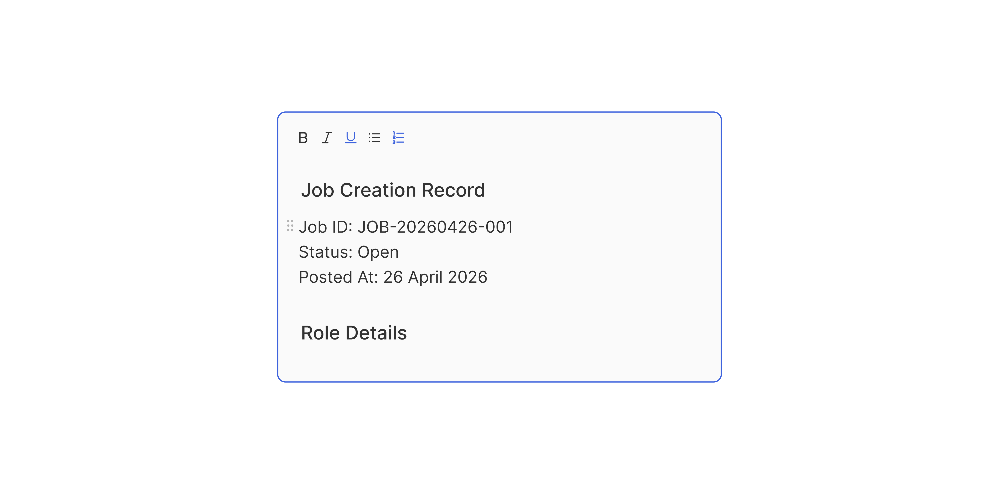

# Rich Text Input

> A multi-line editor for richly formatted content, supporting bold, italic, underline, and more.

 [View in Figma →](https://www.figma.com/design/7jCMwDng7HF5g7F3tGXf0E/Open-HR?node-id=1053-47768)


---

## Overview

Rich Text Input is a multi-line editor for producing formatted content, job descriptions, policy text, announcements, or any content where headings, bullet lists, and inline emphasis matter. It shares the same structure as Textarea but carries a richer formatting toolbar and is intended to produce structured HTML or Markdown output, not plain text.

**Key differences from Textarea:**

* The formatting toolbar has more options (5 buttons in Figma vs Textarea's 4+).
* Output is rich text (HTML/Markdown/ProseMirror Document), not a plain string.
* The content expands significantly on Focus, from `81px` collapsed to `325px` editing height.
* Use when the content will be rendered somewhere (a job board, an email, a document) where formatting is meaningful.

**Key differences from Input Code:**

* Toolbar is formatting-based (Bold/Italic/Underline/etc.), not action-based (Format/Copy).
* Output is prose for human reading, not structured machine-parseable data.

Rich Text Input composes: an optional label, the [Rich Text Field](/doc/a2e990b3-4b76-45bc-8dff-f43e3c8b8a6d) sub-component, and optional helper text.

**Available in:** React · Next.js · Figma


---

## Anatomy

| Part | Description |
|------|-------------|
| Label | Optional visible field label. |
| Rich text field | The editor container. `Spacing/padding/lg-12px` all-side padding. `Spacing/radius/sm-7px` radius. `1px` border. Contains toolbar + content area + optional action button. |
| Toolbar | A row of 5 formatting buttons (`20×20px` each). Always shown at the top of the field. Total width: `100px`. |
| Content area | The editable rich text region. `25px` collapsed; expands to `269px+` on Focus. Contains formatted "New line" blocks. |
| Action button | Optional Button at top-right, `92px` wide, `24px` tall. Typical label: "Save", "Publish". |
| Helper text | Optional guidance or error message below the field. |

**Toolbar buttons (from Figma layer names and icons):**

| Position | Icon | Action |
|----------|------|--------|
| 1        | `icon/bold` | Bold   |
| 2        | `icon/italic` | Italic |
| 3        | `icon/underline` | Underline |
| 4        | Component 9 | Strikethrough or List (confirm with design) |
| 5        | Component 10 | Link or additional format (confirm with design) |

> <!-- TODO: confirm the exact icons for toolbar buttons 4 and 5 with design, layer names are generic -->

**Field heights (from Figma bounding boxes):**

| State | Field height | Content area height |
|-------|--------------|---------------------|
| Placeholder / Hover / Filled / Error / Disabled | `81px`       | `25px`              |
| Focus | `325px`      | `269px`             |


---

## Spacing tokens

| Property | Value | Token |
|----------|-------|-------|
| Field padding (all sides) | `Spacing/padding/lg-12px` | `Spacing/padding/lg-12px` |
| Field border radius | `Spacing/radius/sm-7px` | `Spacing/radius/sm-7px` |
| Gap (toolbar ↔ content area) | `Spacing/gap/lg-12px` | `Spacing/gap/lg-12px` |
| Toolbar button padding | `Spacing/padding/xs-4px` all sides | `Spacing/padding/xs-4px` |
| Content area top padding | `Spacing/padding/xs-4px` | `Spacing/padding/xs-4px` |
| Content area bottom padding | `Spacing/padding/lg-12px` | `Spacing/padding/lg-12px` |
| Gap (label → field) | `Spacing/gap/sm-6px` | `Spacing/gap/sm-6px` |
| Gap (field → helper) | `Spacing/gap/sm-6px` | `Spacing/gap/sm-6px` |
| Field border width | `1px` | —     |
| Toolbar height | `20px` | —     |
| Toolbar button size | `20×20px` | —     |
| Toolbar button icon size | `12×12px` | —     |
| Content area height (collapsed) | `25px` | —     |
| Content area height (focused) | `269px` | —     |
| Action button width | `92px` | —     |
| Action button height | `24px` | —     |


---

## Variants

### State (`state` / Figma: `state`)

| Value | Figma value | Visual change |
|-------|-------------|---------------|
| Placeholder | `Place holder` | Compact; placeholder text in content area |
| Hover | `Hover`     | Border darkens |
| Focus | `Focus`     | Focus border; field expands to editing height |
| Selected | `Selected`  | Text selection highlight in content area |
| Filled | `filled`    | Compact; formatted content visible |
| Error | `Error`     | Red border; helper becomes error |
| Disabled | `Disabled`  | Reduced opacity; non-interactive |

### Label visibility (`showLabel` / Figma: `Show Label 🏷️`)

| Value | Default | Description |
|-------|---------|-------------|
| `true` | Yes     | Shows the label above the field |
| `false` | —       | Hidden, provide `aria-label` |

### Helper visibility (`showHelper` / Figma: `Show Helper 💬`)

| Value | Default | Description |
|-------|---------|-------------|
| `true` | Yes     | Shows helper or error text below the field |
| `false` | —       | No helper text area |


---

## States

| State | Figma value | Trigger | Visual change |
|-------|-------------|---------|---------------|
| Placeholder | `Place holder` | Editor empty, not focused | Compact; placeholder text; neutral border |
| Hover | `Hover`     | Pointer enters | Border darkens |
| Focus | `Focus`     | User clicks or tabs into editor | Focus border; content area expands from `25px` to `269px` |
| Selected | `Selected`  | User highlights formatted text | Rich text selection highlight |
| Filled | `filled`    | Editor has content, not focused | Compact; formatted content visible |
| Error | `Error`     | Validation failure | Red border; helper becomes error |
| Disabled | `Disabled`  | `disabled` prop | Reduced opacity; non-interactive |

> The `Selected` state represents native text selection inside the editor, no prop maps to it directly.


---

## Usage guidelines

**Do** use Rich Text Input when the content will be rendered with its formatting, job descriptions, policy sections, email templates, announcements. **Don't** use Rich Text Input when plain text is sufficient, use Textarea. Formatting output adds implementation complexity on both input and render sides.

**Do** pair with a rich text renderer (e.g. `dangerouslySetInnerHTML` with sanitisation, or a ProseMirror/Tiptap viewer) on the display side. **Don't** display the raw HTML or Markdown output directly, always render it through a sanitised renderer.

**Do** store rich text in a serialised format (JSON document, HTML string, Markdown) that your renderer can consume. **Don't** store raw HTML from user input without sanitising first, this is an XSS vector.

**Do** show the toolbar as long as the field is visible. The toolbar should remain accessible even before the user focuses. **Don't** hide the toolbar until focus, it signals to the user what formatting capabilities the field has.

**Do** use the `Selected` state's toolbar affordance, when the cursor is inside bold text, the Bold button should appear active (`Hover/Selected` state on the toolbar button). **Don't** always show all toolbar buttons in the rest state, reflect the formatting at the cursor position.


---

## Content guidelines

* **Label:** Names what will be created, "Job description", "Offer letter body", "Welcome message"
* **Placeholder:** A prompt in the editor, "Paste in some rich text", "Write the job description here..."
* **Helper:** Format guidance, "Formatting will be preserved when published", "Max 2,000 characters including formatting"
* **Error:** "Job description is required", "Content exceeds the 2,000 character limit"


---

## Behaviour in context

**Expand on focus:** Field grows from `81px` to `325px` on focus. The transition should be smooth. On blur (if the content is empty), the field collapses back.

**Toolbar state reflection:** When the cursor moves inside formatted text, the corresponding toolbar button(s) should show the `Hover/Selected` state. When the cursor leaves that text, the buttons return to rest.

**Paste handling:** Accept paste events. Strip unsupported formatting (e.g. complex table HTML from Word) but preserve basic formatting (bold, italic, paragraph structure). Show a toast if significant formatting was stripped.

**Action button:** "Save" or "Publish", submits the current content. Validate before saving (e.g. required field, max length). Disable the button while saving and restore it after.

**Serialisation:** The component should expose the content in a stable serialised format (e.g. a JSON ProseMirror/Tiptap document, or sanitised HTML string), not raw DOM content. This format should be the same on input and output.

**Sanitisation:** If storing HTML output, always sanitise server-side using a trusted library (e.g. DOMPurify, sanitize-html). Never trust raw HTML from user input.


---

## Accessibility

* **Editor role**, A ProseMirror / Tiptap editor uses `role="textbox"` with `aria-multiline="true"`. A native `<textarea>` approach loses formatting, confirm the technical implementation.
* `**aria-label**` **/** `**<label>**`, The editor must have an accessible name. Link via `aria-labelledby` pointing to the label element's `id`.
* `**aria-required**`, Set when the field is required.
* `**aria-invalid="true"**`, Set in the Error state.
* `**aria-describedby**`, Point to the helper/error text.
* **Toolbar buttons**, `aria-label` on each: `"Bold"`, `"Italic"`, `"Underline"`. Use `aria-pressed="true"` when the format is active at the cursor.
* **Keyboard in toolbar**, Toolbar should be reachable by `Tab`. Buttons activated with `Space` or `Enter`. Common shortcuts (`Ctrl+B`, `Ctrl+I`, `Ctrl+U`) should also work without requiring the toolbar.
* **Focus management**, After clicking a toolbar button, focus should return to the editor at the cursor position.


---

## Animation

See [Rich Text Field (sub-component)](/doc/132df6b7-a4a2-4d00-a69f-005a914c9fc9).


---

## Props / API

```ts
interface RichTextInputProps {
  label?: string
  showLabel?: boolean
  helperText?: string
  showHelper?: boolean
  errorText?: string
  value?: RichTextDocument       // serialised rich text (JSON/HTML/Markdown)
  defaultValue?: RichTextDocument
  placeholder?: string
  onChange?: (value: RichTextDocument) => void
  onBlur?: () => void
  showToolbar?: boolean
  showActionButton?: boolean
  actionButtonLabel?: string
  onAction?: () => void
  showSecondaryActions?: boolean
  maxLength?: number
  disabled?: boolean
  readOnly?: boolean
  required?: boolean
  id?: string
  'aria-label'?: string
  'aria-labelledby'?: string
  name?: string
  className?: string
}

// The serialised format depends on your rich text library (Tiptap/ProseMirror/Slate)
type RichTextDocument = object | string
```

| Prop | Type | Default | Required | Description |
|------|------|---------|----------|-------------|
| `label` | `string` | —       | No       | Visible field label. |
| `showLabel` | `boolean` | `true`  | No       | Renders the label. When `false`, provide `aria-label`. |
| `helperText` | `string` | —       | No       | Guidance text shown when there is no `errorText`. |
| `showHelper` | `boolean` | `true`  | No       | Renders the helper text area. |
| `errorText` | `string` | —       | No       | Error message. Applies the Error state. |
| `value` | `RichTextDocument` | —       | No       | Controlled value, serialised rich text document. |
| `defaultValue` | `RichTextDocument` | —       | No       | Initial value in uncontrolled mode. |
| `placeholder` | `string` | —       | No       | Placeholder prompt when the editor is empty. |
| `onChange` | `(value: RichTextDocument) => void` | —       | No       | Fires when content changes. Receives the serialised document. |
| `onBlur` | `() => void` | —       | No       | Fires when the editor loses focus. Trigger validation here. |
| `showToolbar` | `boolean` | `true`  | No       | Shows the formatting toolbar. Set `false` for read-only display. |
| `showActionButton` | `boolean` | `false` | No       | Shows the action Button inside the field. |
| `actionButtonLabel` | `string` | —       | No       | Required when `showActionButton=true`. |
| `onAction` | `() => void` | —       | No       | Fires on action button click. |
| `showSecondaryActions` | `boolean` | `false` | No       | Shows secondary action buttons. |
| `maxLength` | `number` | —       | No       | Max character count (excluding formatting markup). |
| `disabled` | `boolean` | `false` | No       | Non-interactive; reduced opacity. |
| `readOnly` | `boolean` | `false` | No       | Focusable and selectable but not editable. |
| `required` | `boolean` | `false` | No       | Marks the field as required. |
| `aria-label` | `string` | —       | No       | Required when `showLabel=false`. |
| `name` | `string` | —       | No       | Form field name for submission. |
| `id` | `string` | —       | No       | Auto-generated if not provided. |
| `className` | `string` | —       | No       | Additional CSS class on the outer wrapper. |


---

## Code examples

### Basic job description editor

```tsx
// Next.js (App Router), Client Component
'use client'

const [content, setContent] = useState<RichTextDocument | null>(null)

<RichTextInput
  label="Job description"
  placeholder="Describe the role, responsibilities, and requirements..."
  value={content}
  onChange={setContent}
  required
  helperText="Formatting is preserved when the job is published"
/>
```

```tsx
// React
const [content, setContent] = useState<RichTextDocument | null>(null)

<RichTextInput
  label="Job description"
  placeholder="Describe the role, responsibilities, and requirements..."
  value={content}
  onChange={setContent}
  required
  helperText="Formatting is preserved when the job is published"
/>
```

### With inline publish action

```tsx
// Next.js (App Router), Client Component
'use client'

const [content, setContent] = useState<RichTextDocument>(initialContent)
const [error, setError] = useState('')

async function handlePublish() {
  if (!content) {
    setError('Content is required before publishing')
    return
  }
  await publishContent(content)
}

<RichTextInput
  label="Offer letter body"
  value={content}
  onChange={setContent}
  errorText={error}
  showActionButton
  actionButtonLabel="Publish"
  onAction={handlePublish}
/>
```

```tsx
// React
const [content, setContent] = useState<RichTextDocument>(initialContent)
const [error, setError] = useState('')

async function handlePublish() {
  if (!content) {
    setError('Content is required before publishing')
    return
  }
  await publishContent(content)
}

<RichTextInput
  label="Offer letter body"
  value={content}
  onChange={setContent}
  errorText={error}
  showActionButton
  actionButtonLabel="Publish"
  onAction={handlePublish}
/>
```

### Read-only rendered display

```tsx
// Next.js (App Router), Server Component
// No 'use client' directive needed, this component carries no browser state.

{/* Don't use RichTextInput for display, use your rich text renderer directly */}
{/* Only use readOnly mode when the user needs to see and optionally edit */}
<RichTextInput
  label="Policy document"
  value={policyContent}
  readOnly
  showToolbar={false}
  showActionButton={false}
/>
```

```tsx
// React
{/* Don't use RichTextInput for display, use your rich text renderer directly */}
{/* Only use readOnly mode when the user needs to see and optionally edit */}
<RichTextInput
  label="Policy document"
  value={policyContent}
  readOnly
  showToolbar={false}
  showActionButton={false}
/>
```

### With character limit

```tsx
// Next.js (App Router), Client Component
'use client'

const [charCount, setCharCount] = useState(0)
const MAX = 2000

<RichTextInput
  label="Welcome message"
  onChange={(doc) => {
    setContent(doc)
    setCharCount(getTextLength(doc))  // strip markup, count text chars
  }}
  maxLength={MAX}
  helperText={`${charCount} / ${MAX} characters`}
  errorText={charCount > MAX ? `Exceeds ${MAX} character limit` : ''}
/>
```

```tsx
// React
const [charCount, setCharCount] = useState(0)
const MAX = 2000

<RichTextInput
  label="Welcome message"
  onChange={(doc) => {
    setContent(doc)
    setCharCount(getTextLength(doc))  // strip markup, count text chars
  }}
  maxLength={MAX}
  helperText={`${charCount} / ${MAX} characters`}
  errorText={charCount > MAX ? `Exceeds ${MAX} character limit` : ''}
/>
```


---

## Security note

Rich text output may contain HTML. **Always sanitise before rendering or storing:**

```ts
import DOMPurify from 'dompurify'

// When rendering HTML output from the editor:
const safeHTML = DOMPurify.sanitize(editorHTMLOutput)
element.innerHTML = safeHTML

// When storing: sanitise server-side as well, never trust client-side sanitisation alone
```


---

## Related components

* [Textarea](/doc/a68c7ad4-0c95-4e87-8889-09d36621449c), Use for plain text multi-line input with basic formatting
* [Input Code](/doc/a2f266e0-8f94-4efb-be2e-cca4f8c12425), Use for code, JSON, YAML, or structured data entry
* [Text Input](/doc/93534567-2eff-45a2-b5a8-00a8b76dc4eb), Use for single-line text entry