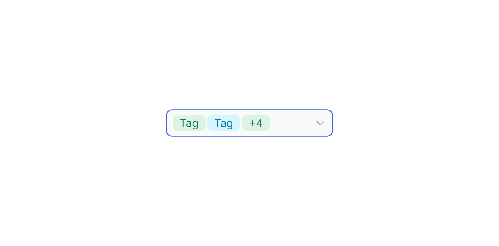

# Selection Field (sub-component)

> The raw dropdown trigger field, a low-level building block used inside Input Selection.

 [View in Figma →](https://www.figma.com/design/7jCMwDng7HF5g7F3tGXf0E/Open-HR?node-id=915-21577)


---

## Overview

Selection Field (`.Subcomponents/Input/Selection` in Figma) is the clickable trigger element that opens a dropdown list. It is consumed internally by Input Selection and other composites that need a select-type trigger.

Key differences from the [Input](/doc/d4e24068-7c85-4680-8512-737df9e66622) sub-component:

* The suffix is always a **chevron-down icon**, not configurable via the suffix variant.
* Has a `with-selection` variant that swaps the text area for a row of Tags.
* Has three sizes including a `lg` (40px) option not exposed by the Input Selection composite.

> **Use Input Selection in product code.** Only use this sub-component directly when building a custom composite (e.g. a combined search-and-select control).

**Available in:** React · Next.js · Figma (internal)


---

## Anatomy

| Part | Description |
|------|-------------|
| Container | The trigger field frame. Fixed height per size. Fills parent width. `border: 1px`. |
| Prefix icon | Optional leading icon. Size scales with height. Toggled by `showPrefixIcon`. |
| Text / Tags | When `withSelection=false`: placeholder or selected value text. When `withSelection=true`: a row of Tag components showing current selections. |
| Chevron-down | Always present trailing icon, `14×14px` (32/40px sizes) or `12×12px` (25px size). Non-configurable. |


---

## Spacing tokens

All values from Figma bounding boxes.

| Property | `sm` (25px) | `md` (32px) | `lg` (40px) | Token |
|----------|-----------|-----------|-----------|-------|
| Gap between elements | `Spacing/gap/xs-4px` | `Spacing/gap/xs-4px` | `Spacing/gap/xs-4px` | `Spacing/gap/xs-4px` |
| Gap between tags | `Spacing/gap/xs-2px` | `Spacing/gap/xs-2px` | `Spacing/gap/xs-2px` | `Spacing/gap/xs-2px` |
| Field height | `25px`    | `32px`    | `40px`    | —     |
| Padding left / right | `Spacing/padding/sm-8px` | `Spacing/padding/sm-8px` | `Spacing/padding/lg-12px` | —     |
| Border radius | `Spacing/radius/sm-7px` | `Spacing/radius/sm-7px` | `Spacing/radius/lg-10px` | —     |
| Border width | `1px`     | `1px`     | `1px`     | —     |
| Prefix icon size | `12×12px` | `14×14px` | `14×14px` | —     |
| Chevron suffix size | `12×12px` | `14×14px` | `14×14px` | —     |
| Tag height (`with-selection`) | `20px`    | `20px`    | `20px`    | —     |


---

## Variants

### Size (`size` / Figma: `🏗️ Height`)

| Value | Figma value | Height | Padding | Radius | When to use |
|-------|-------------|--------|---------|--------|-------------|
| `sm`  | `24px`\*    | `25px` | `Spacing/padding/sm-8px` | `Spacing/radius/sm-7px` | Dense/compact |
| `md`  | `32px`      | `32px` | `Spacing/padding/sm-8px` | `Spacing/radius/sm-7px` | Standard (default) |
| `lg`  | `40 px`     | `40px` | `Spacing/padding/lg-12px` | `Spacing/radius/lg-10px` | Prominent / hero contexts |

> \*Figma labels the smallest size `"24px"` but the actual bounding box is `25px`. Use `25px` in implementation.

### State (`state` / Figma: `state`)

| Value | Figma value | Description |
|-------|-------------|-------------|
| `placeholder` | `Place holder` | No selection; placeholder text |
| `hover` | `Hover`     | Pointer enters field |
| `focus` | `Focus`     | Field focused (list open) |
| `filled` | `Filled`    | A value is selected, list closed |
| `disabled` | `Disabled`  | Reduced opacity; non-interactive |
| `error` | `Error`     | Invalid / required unset |

### With-selection (`withSelection` / Figma: `with-selection`)

| Value | Figma value | Description |
|-------|-------------|-------------|
| `false` | `No`        | Text area for placeholder or single selected value |
| `true` | `Yes`       | Tags row showing multiple selected options |

### Prefix icon (`showPrefixIcon` / Figma: `⬅️ Icon/Prefix`)

| Value | Default | Description |
|-------|---------|-------------|
| `true` | Yes     | Shows a leading icon |
| `false` | —       | No leading icon |


---

## Accessibility

The Selection Field renders as a `<button>` or a combobox trigger, not a native `<select>`. All ARIA semantics are the parent composite's responsibility:

* `**role="combobox"**` on the trigger
* `**aria-haspopup="listbox"**`
* `**aria-expanded**` toggling when the dropdown opens/closes
* `**aria-controls**` pointing to the listbox `id`
* **Chevron**, `aria-hidden="true"`
* **Tags**, each tag's remove button needs `aria-label="Remove [option name]"`


---

## Animation

| Trigger | From → To | Transition | Duration | Easing |
|---------|-----------|------------|----------|--------|
| Mouse enter | `Place holder` → `Hover` | Dissolve   | `100ms`  | Ease In |
| Mouse leave | `Hover` → `Place holder` | Dissolve   | `100ms`  | Ease Out |
| Click   | `Hover` → `Focus` | Dissolve   | `100ms`  | Ease Out |
| Click   | `Filled` → `Focus` | Dissolve   | `100ms`  | Ease Out |
| Click (commit) | `Focus` → `Filled` | Dissolve   | `100ms`  | Ease Out |
| Mouse leave | `Focus` → `Place holder` | Dissolve   | `100ms`  | Ease Out |

> **Disabled state:** No transition is defined into or out of `Disabled` in Figma — implement it as an instant swap.

### Implementation reference

```css
/* All field state changes are 100ms: hover-in ease-in (Dissolve), all other transitions ease-out */
.field {
  transition: border-color 100ms ease-out, background-color 100ms ease-out;
}
.field:hover {
  transition-timing-function: ease-in;
}
.field:focus-within {
  transition-timing-function: ease-out;
}
```


---

## Props / API

```ts
interface SelectionFieldProps {
  size?: 'sm' | 'md' | 'lg'
  state?: 'placeholder' | 'hover' | 'focus' | 'filled' | 'disabled' | 'error'
  showPrefixIcon?: boolean
  prefixIcon?: React.ReactNode
  withSelection?: boolean
  tags?: React.ReactNode[]
  placeholder?: string
  value?: string
  onClick?: React.MouseEventHandler<HTMLButtonElement>
  disabled?: boolean
  'aria-label'?: string
  'aria-labelledby'?: string
  'aria-expanded'?: boolean
  'aria-controls'?: string
  ref?: React.Ref<HTMLButtonElement>
  className?: string
}
```

| Prop | Type | Default | Required | Description |
|------|------|---------|----------|-------------|
| `size` | `'sm' \| 'md' \| 'lg'` | `'md'`  | No       | Field height: `sm`=25px, `md`=32px, `lg`=40px. |
| `state` | see table above | `'placeholder'` | No       | Visual state. |
| `showPrefixIcon` | `boolean` | `false` | No       | Shows the leading icon slot. |
| `prefixIcon` | `ReactNode` | —       | No       | Icon component for the prefix slot. |
| `withSelection` | `boolean` | `false` | No       | Shows Tags instead of text. |
| `tags` | `ReactNode[]` | —       | No       | Tag elements rendered inside the field when `withSelection=true`. |
| `placeholder` | `string` | —       | No       | Text shown when nothing is selected. |
| `value` | `string` | —       | No       | The label of the currently selected option. |
| `onClick` | `React.MouseEventHandler<HTMLButtonElement>` | —       | No       | Opens the dropdown listbox. |
| `disabled` | `boolean` | `false` | No       | Disables the trigger. |
| `aria-expanded` | `boolean` | —       | No       | Set to `true` while the listbox is open. |
| `aria-controls` | `string` | —       | No       | `id` of the listbox element. |
| `ref` | `React.Ref<HTMLButtonElement>` | —       | No       | Forwarded to the trigger element. |
| `className` | `string` | —       | No       | Additional CSS class. |


---

## Code examples

### Single-value trigger (used inside Input Selection)

```tsx
// Next.js (App Router), Client Component
'use client'

// This is how InputSelection renders the trigger, use InputSelection in product code
<SelectionField
  size="md"
  state={isOpen ? 'focus' : value ? 'filled' : 'placeholder'}
  placeholder="Select a department"
  value={selectedLabel}
  showPrefixIcon
  prefixIcon={<BuildingIcon aria-hidden />}
  role="combobox"
  aria-haspopup="listbox"
  aria-expanded={isOpen}
  aria-controls="dept-listbox"
  aria-labelledby="dept-label"
  onClick={() => setIsOpen(v => !v)}
/>
```

```tsx
// React
// This is how InputSelection renders the trigger, use InputSelection in product code
<SelectionField
  size="md"
  state={isOpen ? 'focus' : value ? 'filled' : 'placeholder'}
  placeholder="Select a department"
  value={selectedLabel}
  showPrefixIcon
  prefixIcon={<BuildingIcon aria-hidden />}
  role="combobox"
  aria-haspopup="listbox"
  aria-expanded={isOpen}
  aria-controls="dept-listbox"
  aria-labelledby="dept-label"
  onClick={() => setIsOpen(v => !v)}
/>
```

### Multi-select with tags

```tsx
// Next.js (App Router), Client Component
'use client'

<SelectionField
  size="md"
  state={isOpen ? 'focus' : selected.length ? 'filled' : 'placeholder'}
  withSelection
  tags={selected.map(opt => (
    <Tag key={opt.value} onRemove={() => removeOption(opt.value)}>
      {opt.label}
    </Tag>
  ))}
  aria-expanded={isOpen}
  aria-controls="skills-listbox"
  onClick={() => setIsOpen(v => !v)}
/>
```

```tsx
// React
<SelectionField
  size="md"
  state={isOpen ? 'focus' : selected.length ? 'filled' : 'placeholder'}
  withSelection
  tags={selected.map(opt => (
    <Tag key={opt.value} onRemove={() => removeOption(opt.value)}>
      {opt.label}
    </Tag>
  ))}
  aria-expanded={isOpen}
  aria-controls="skills-listbox"
  onClick={() => setIsOpen(v => !v)}
/>
```

### Large size (in a search-and-select context)

```tsx
// Next.js (App Router), Client Component
'use client'

<SelectionField
  size="lg"
  placeholder="Search for a country"
  state="placeholder"
  showPrefixIcon
  prefixIcon={<GlobeIcon aria-hidden />}
  onClick={openDropdown}
/>
```

```tsx
// React
<SelectionField
  size="lg"
  placeholder="Search for a country"
  state="placeholder"
  showPrefixIcon
  prefixIcon={<GlobeIcon aria-hidden />}
  onClick={openDropdown}
/>
```


---

## Related components

* [Input Selection](/doc/7483c753-5973-4739-8dfc-d934d4641b32), The composite that wraps this sub-component with a label and helper. Use this in product code.
* [Input](/doc/ef934d93-8038-4979-b8ff-780731203f60), The Text Input's raw field sub-component, no chevron, free-text entry.