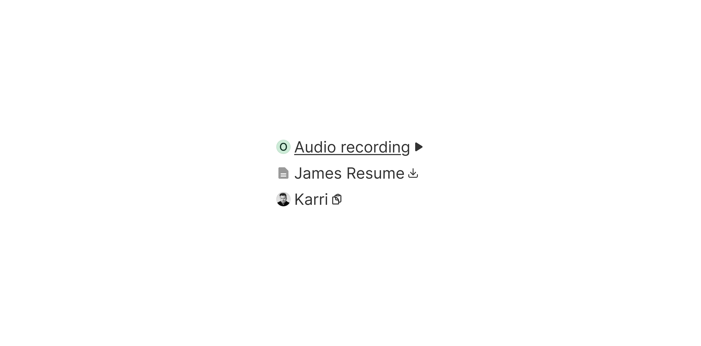

# Text Button

> An inline text-based action trigger with no background or border, used within body copy or as a standalone navigational link.

 [View in Figma →](https://www.figma.com/design/7jCMwDng7HF5g7F3tGXf0E/Open-HR?node-id=2859-27385)


---

## Overview

Text Button is the lightest action element in the Open HR button family. Unlike Button, Icon Button, and Flow Button, it has no container, no background, no border, no padding. It sits inline with surrounding text or floats as a minimal standalone action.

It comes in three text sizes (sm, md, lg), optional bold weight, and a configurable underline behaviour. Optional left icon, right icon, and avatar slots allow richer inline context.

When `href` is provided, the component renders as an `<a>` element instead of `<button>`. Several button-specific props (`type`, native `disabled`) become invalid in this mode, see __Rendering as a link below__.

Use Text Button when the action is supplementary, navigational, or embedded within a sentence. Use standard Button when the action needs visual weight and a clear hit target.

**Available in:** React · Next.js · Figma

> **Note on prop naming:** Icon props are `iconLeft` / `iconRight` on Text Button, but `iconPrefix` / `iconSuffix` on [button](/doc/389a0b84-313d-4c32-a390-12325a0dec3c)  and [Flow Button](/doc/55cd9250-8692-400b-b09b-369cf5abcefc) , and `icon` on [Icon Button](/doc/6c30d09a-7648-4df4-87ed-846ff9820e40). Use the exact names documented for each component.


---

## Anatomy

| Part | Description |
|------|-------------|
| Left icon | Optional leading icon. Size scales with text: `10×10px` (sm/12px), `11×11px` (md/13px), `12×12px` (lg/14px). Pass via `iconLeft`. |
| Avatar | Optional avatar before the label. `13×12px` wrapper. **Only available in** `**md**` **and** `**lg**` **sizes, not** `**sm**`**.** Pass via `avatar`. |
| Label | Required visible text, passed as `children`. No container. Inter Regular (400) by default; Medium (500) when `bold`. |
| Right icon | Optional trailing icon. `10×10px` for sm and md; `12×12px` for lg. Defaults to the external-link icon, signalling outbound navigation. Pass via `iconRight`. |

There is no container, background, border, or padding. The component's bounds are defined entirely by its content.


---

## Spacing tokens

| Property | sm (12px) | md (13px) | lg (14px) | Token |
|----------|-----------|-----------|-----------|-------|
| Icon-to-label gap | `Spacing/gap/xs-2px` | `Spacing/gap/xs-2px` | `Spacing/gap/xs-2px` | `Spacing/gap/xs-2px` |
| Font size | `12px`    | `13px`    | `14px`    | —     |
| Font weight (default) | Regular (400) | Regular (400) | Regular (400) | —     |
| Font weight (bold) | Medium (500) | Medium (500) | Medium (500) | —     |
| Left icon | `10×10px` | `11×11px` | `12×12px` | —     |
| Right icon | `10×10px` | `10×10px` | `12×12px` | —     |
| Avatar   | *(not available for sm text-btn)* | `12×12px` with  a `Spacing/padding/xs-1px` right padding | `12×12px` with `Spacing/padding/xs-1px` right padding | —     |


---

## Variants

### Size

Match to the surrounding body text so the Text Button reads as part of the same typographic context.

| Prop value | Font size | When to use |
|------------|-----------|-------------|
| `sm`       | `12px`    | Dense UI, captions, table cells, helper text |
| `md`       | `13px`    | Standard body copy, form helper text, sidebar content |
| `lg`       | `14px`    | Large body copy, section descriptions, prominent inline actions |

> **Note on size naming:** The labels were named `12 px`, `13 px`, `14 px` in Figma. The API uses `sm`/`md`/`lg`, a standard naming convention rather than raw pixel values, which are an implementation detail. The pixel sizes are documented above for reference.

### Bold

| Value | Font weight | When to use |
|-------|-------------|-------------|
| `false` (default) | Regular (400) | Inline within body copy, blends with surrounding text |
| `true` | Medium (500) | Standalone Text Button needing slightly more prominence than surrounding copy |

### Underline

Controls whether the underline is visible at rest.

| Value | At rest | On hover/focus | When to use |
|-------|---------|----------------|-------------|
| `false` (default) | Hidden  | Visible        | Inline within copy, a permanent underline would add noise |
| `true` | Visible | Visible        | Standalone Text Button where interactivity must be immediately discoverable |


---

## States

| State | Trigger | Visual change |
|-------|---------|---------------|
| Rest  | Default idle | Text at full opacity; underline per `underline` prop |
| Hover | Pointer enters | Underline appears regardless of `underline` setting; colour shift |
| Pressed | Pointer down / Space or Enter | Colour darkens |
| Focus | Keyboard Tab | Visible focus indicator |
| Disabled | `disabled` prop (button mode only) | Reduced opacity; pointer-events none |

All 3 sizes × 2 bold values × 2 underline values have all 5 states in Figma.


---

## Rendering as a link

When `href` is provided, the component renders as `<a>` instead of `<button>`. This changes several behaviours:

`**disabled**` **does not work on** `**<a>**` **elements.** The `disabled` HTML attribute is invalid on anchors. To visually and functionally disable a link-mode Text Button:

```tsx
<TextButton
  href="/report"
  aria-disabled="true"
  onClick={(e) => e.preventDefault()}
  style={{ pointerEvents: 'none', opacity: 0.4 }}
>
  View report
</TextButton>
```

`**type**` **is ignored in link mode.** `type="submit"` has no effect when rendering as `<a>`.

**External links require** `**rel**`**.** Always set `rel="noopener noreferrer"` when using `target="_blank"`.

**React Router / Next.js links:** If your app uses client-side routing, pass your router's `Link` component via the `as` prop instead of using `href` directly:

```tsx
// Next.js
<TextButton as={NextLink} href="/dashboard">
  Go to dashboard
</TextButton>

// React Router
<TextButton as={RouterLink} to="/dashboard">
  Go to dashboard
</TextButton>
```


---

## Usage guidelines

**Do** use Text Button for inline actions within body copy, "Read the full policy", "Learn more", "View details". **Don't** use Text Button as the primary or only action in a view, it doesn't carry enough visual weight. Use Button.

**Do** match the Text Button's size to the surrounding copy. **Don't** use `lg` (14px) inside `sm` (12px) body text, mismatched sizes break reading rhythm.

**Do** use `underline={true}` for standalone Text Buttons not surrounded by explanatory copy. **Don't** rely on colour alone to distinguish a Text Button from static text, this fails WCAG 1.4.1.

**Do** use the right icon (external link) when navigating to an external URL or new tab. **Don't** use the external link icon for in-app navigation, it sets the wrong expectation.

**Do** use `bold={true}` for standalone Text Buttons needing slightly more prominence. **Don't** use `bold={true}` mid-sentence, the weight contrast draws unwanted attention.

**Do** use the avatar slot to identify a person inline, "Approved by \[Avatar\] Sarah Chen". **Don't** use the avatar slot for non-person content.

**Don't** use Text Button for destructive actions, it provides no warning weight and no confirmation affordance.


---

## Content guidelines

* **Descriptive**, "View payslip", "Edit details", not "Click here" or "More"
* **Sentence case**, "View full report", not "View Full Report"
* **Short**, 2–5 words; long inline links break reading flow
* **No trailing punctuation**, no period or ellipsis unless the ellipsis means "truncated"
* **External links**, add `<span className="sr-only">(opens in new tab)</span>` inside the component for screen reader users


---

## Behaviour in context

**Inline within body copy:** Use `underline={false}`, let hover reveal the underline. Ensure the link colour has sufficient contrast against the body text colour (WCAG AA: 4.5:1 for text).

**Standalone below a content block:** Use `underline={true}`. Common pattern: a card with "View details →" below the content.

**In a table cell:** Use `sm` or `md` size. Prefer one Text Button per cell, multiple links in a cell create confusing tap targets.

**External navigation:** Pair `target="_blank"` with `rel="noopener noreferrer"`. Announce the new-tab behaviour to screen readers.

**Avatar + name pattern:** Appears in activity feeds, approval flows, audit trails, "Reviewed by \[Avatar\] James O." Keep the label to first name or full name only.


---

## Accessibility

* **Keyboard**, `Tab` / `Shift+Tab` to reach. `Space` or `Enter` to activate (button mode). `Enter` only in link mode.
* **Focus indicator**, Defined for all variants. Must meet WCAG AA contrast.
* **Colour + underline**, Colour alone to indicate a link fails WCAG 1.4.1 (Use of Color). Ensure hover underline is always present; use `underline={true}` for standalone links.
* **External links**, `<span className="sr-only">(opens in new tab)</span>` inside the button text, plus `target="_blank"` + `rel="noopener noreferrer"`.
* **Avatar**, Decorative in most contexts. Set `aria-hidden="true"` on the avatar image. The label text must be self-explanatory without it.
* **Icons**, When both label and icons are present, icons are decorative. Set `aria-hidden="true"` on icon elements, the label carries the accessible name.
* **Disabled in link mode**, Use `aria-disabled="true"` + `onClick` prevention. The native `disabled` attribute is not valid on `<a>`.


---

## Animation

| Trigger | From → To | Transition | Duration | Easing |
|---------|-----------|------------|----------|--------|
| Mouse enter | `Rest` → `Hover` | Smart Animate | `100ms`  | Ease In |
| Mouse leave | `Hover` → `Rest` | Smart Animate | `100ms`  | Ease Out |
| Press   | `Hover` → `Pressed` | Smart Animate | `100ms`  | Ease In |

Defined across all 12 size/bold/underline combinations. The hover underline reveal therefore animates via Smart Animate over `100ms`.

> **Disabled state:** No transition is defined into or out of `Disabled` in Figma — implement it as an instant swap.

### Implementation reference

```css
/* Uniform 100ms Smart Animate for hover, leave, and press */
.text-button {
  transition: color 100ms ease-out, text-decoration-color 100ms ease-out; /* leave */
}
.text-button:hover,
.text-button:active {
  transition-timing-function: ease-in; /* enter / press */
}
```


---

## Props / API

| Prop | Type | Default | Required | Description |
|------|------|---------|----------|-------------|
| `children` | `ReactNode` | —       | **Yes**  | The link/button label |
| `size` | `'sm' \| 'md' \| 'lg'` | `'md'`  | No       | Font size: `sm`=12px, `md`=13px, `lg`=14px |
| `bold` | `boolean` | `false` | No       | Medium (500) weight when true |
| `underline` | `boolean` | `false` | No       | Shows underline at rest. Both values show underline on hover. |
| `iconLeft` | `ReactNode` | —       | No       | Icon before the label. If provided, it renders. Pass `null` or omit to suppress. |
| `iconRight` | `ReactNode` | —       | No       | Icon after the label. Defaults to the external-link icon when `href` is set to an external URL; otherwise absent by default. |
| `avatar` | `ReactNode` | —       | No       | Avatar before the label. Only available in `md` and `lg` sizes, ignored in `sm`. |
| `href` | `string` | —       | No       | Renders as `<a>` when provided. For client-side routing, use `as` instead. |
| `as` | `React.ElementType` | `'button'` | No       | Override the root element. Pass a router `Link` component for client-side navigation. |
| `target` | `string` | —       | No       | `'_blank'` for external links. Must be paired with `rel="noopener noreferrer"`. |
| `rel` | `string` | —       | No       | Always `'noopener noreferrer'` when `target='_blank'`. |
| `disabled` | `boolean` | `false` | No       | **Button mode only.** Not valid in link mode, use `aria-disabled` instead. |
| `aria-disabled` | `boolean` | —       | No       | Use in link mode to indicate a non-interactive state without invalid HTML. |
| `onClick` | `React.MouseEventHandler<HTMLButtonElement \| HTMLAnchorElement>` | —       | No       | Fired on click. In link mode, call `e.preventDefault()` to block navigation. |
| `ref` | `React.Ref<HTMLButtonElement \| HTMLAnchorElement>` | —       | No       | Forwarded to the underlying element |
| `className` | `string` | —       | No       | Additional CSS class |


---

## Code examples

### Default inline link

```tsx
// Next.js (App Router), Server Component
// No 'use client' directive needed, this component carries no browser state.

<TextButton href="/payslips">
  View payslip
</TextButton>
```

```tsx
// React
<TextButton href="/payslips">
  View payslip
</TextButton>
```

### Always-underlined standalone action

```tsx
// Next.js (App Router), Server Component
// No 'use client' directive needed, this component carries no browser state.

<TextButton underline href="/leave-policy">
  Read the full leave policy
</TextButton>
```

```tsx
// React
<TextButton underline href="/leave-policy">
  Read the full leave policy
</TextButton>
```

### Bold standalone action

```tsx
// Next.js (App Router), Server Component
// No 'use client' directive needed, this component carries no browser state.

<TextButton size="lg" bold underline href="/report">
  View full report
</TextButton>
```

```tsx
// React
<TextButton size="lg" bold underline href="/report">
  View full report
</TextButton>
```

### External link

```tsx
// Next.js (App Router), Server Component
// No 'use client' directive needed, this component carries no browser state.

<TextButton
  href="https://help.openhr.com"
  target="_blank"
  rel="noopener noreferrer"
  iconRight={<ExternalLinkIcon aria-hidden />}
>
  Open help centre
  <span className="sr-only">(opens in new tab)</span>
</TextButton>
```

```tsx
// React
<TextButton
  href="https://help.openhr.com"
  target="_blank"
  rel="noopener noreferrer"
  iconRight={<ExternalLinkIcon aria-hidden />}
>
  Open help centre
  <span className="sr-only">(opens in new tab)</span>
</TextButton>
```

### With left icon (action)

```tsx
// Next.js (App Router), Client Component
'use client'

<TextButton iconLeft={<DownloadIcon aria-hidden />} onClick={handleDownload}>
  Download contract
</TextButton>
```

```tsx
// React
<TextButton iconLeft={<DownloadIcon aria-hidden />} onClick={handleDownload}>
  Download contract
</TextButton>
```

### Inline person reference with avatar

```tsx
// Next.js (App Router), Server Component
// No 'use client' directive needed, this component carries no browser state.

<TextButton
  size="md"
  avatar={<Avatar src={user.photo} aria-hidden />}
  href={`/team/${user.id}`}
>
  {user.name}
</TextButton>
```

```tsx
// React
<TextButton
  size="md"
  avatar={<Avatar src={user.photo} aria-hidden />}
  href={`/team/${user.id}`}
>
  {user.name}
</TextButton>
```

### Client-side routing (Next.js)

```tsx
// Next.js (App Router), Server Component
// No 'use client' directive needed, this component carries no browser state.

import NextLink from 'next/link'

<TextButton as={NextLink} href="/dashboard">
  Go to dashboard
</TextButton>
```

```tsx
// React
import NextLink from 'next/link'

<TextButton as={NextLink} href="/dashboard">
  Go to dashboard
</TextButton>
```

### Disabled in link mode

```tsx
// Next.js (App Router), Client Component
'use client'

<TextButton
  href="/report"
  aria-disabled="true"
  onClick={(e) => e.preventDefault()}
  className="opacity-40 pointer-events-none"
>
  View report
</TextButton>
```

```tsx
// React
<TextButton
  href="/report"
  aria-disabled="true"
  onClick={(e) => e.preventDefault()}
  className="opacity-40 pointer-events-none"
>
  View report
</TextButton>
```


---

## Related components

* [button](/doc/389a0b84-313d-4c32-a390-12325a0dec3c)  Use when the action needs a visible container and a clear hit target
* [Icon Button](/doc/6c30d09a-7648-4df4-87ed-846ff9820e40) Use for icon-only inline actions