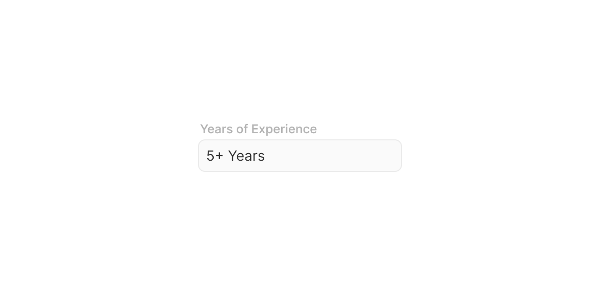

# Text Input

> A labelled form field for collecting a single line of free-text user input.

 [View in Figma →](https://www.figma.com/design/7jCMwDng7HF5g7F3tGXf0E/Open-HR?node-id=1053-47802)


---

## Overview

Text Input is the standard form field for single-line text entry, names, emails, passwords, numbers, search terms. It composes three parts: an optional label above, the input field, and optional helper text below.

Two sizes are available: `md` (32px, default) and `sm` (25px, compact). The label and helper text are independently toggleable. The underlying input field supports a prefix icon and a suffix (icon or action button), see the [Input sub-component](/doc/d4e24068-7c85-4680-8512-737df9e66622) for the complete suffix API.

**Available in:** React · Next.js · Figma


---

## Anatomy

| Part | Description |
|------|-------------|
| Label wrapper | Contains the visible field label. `2px` left indent. Toggleable via `showLabel`. When hidden, `aria-label` or `aria-labelledby` must be provided to the field. |
| Label | The field's visible name. Font size matches the body text of the surrounding context. Always sentence case. |
| Input field | The interactive text field. Contains prefix icon (optional), text area, and suffix (optional). See [Input](/doc/d4e24068-7c85-4680-8512-737df9e66622) for full anatomy. |
| Helper text | A short description, hint, or error message below the field. `Spacing/gap/sm-6px` gap from the input. Toggleable via `showHelper`. |

**Total component height (all parts visible):**

| Input size | Label | Gap | Input | Gap | Helper |
|------------|-------|-----|-------|-----|--------|
| `md` (32px) | `9px` | `6px` | `32px` | `6px` | `9px`  |
| `sm` (25px) | `9px` | `6px` | `25px` | `6px` | `9px`  |


---

## Spacing tokens

| Property | `sm` | `md` |
|----------|-----|-----|
| Input padding left/right | `Spacing/padding/sm-8px` | `Spacing/padding/sm-8px` |
| Input border radius | `Spacing/radius/sm-7px` | `Spacing/radius/sm-7px` |
| Gap (label → input) | `Spacing/gap/sm-6px` | `Spacing/gap/sm-6px` |
| Gap (input → helper) | `Spacing/gap/sm-6px` | `Spacing/gap/sm-6px` |
| Label indent | `Spacing/padding/xs-2px` | `Spacing/padding/xs-2px` |
| Gap between input elements | `Spacing/gap/xs-4px` | `Spacing/gap/xs-4px` |
| Input field height | `25px` | `32px` |
| Input border width | `1px` | `1px` |
| Prefix icon size | `12×12px` | `14×14px` |
| Suffix icon size | `12×12px` | `14×14px` |
| Label height | `9px` | `9px` |
| Helper text height | `9px` | `9px` |


---

## Variants

### Size (`size` / Figma: `🏗️ Height`)

| Value | Figma value | Input height | When to use |
|-------|-------------|--------------|-------------|
| `md`  | `32px`      | `32px`       | Default, standard forms, settings pages, modals |
| `sm`  | `25px`      | `25px`       | Dense forms, compact filter panels, data-heavy layouts |

> **Note:** The Input sub-component supports a third size (`lg` / 40px), but the Text Input composite only exposes `md` and `sm`. The 40px size is used in other composites (e.g. Search). Do not pass `size="lg"` to Text Input.

### Label visibility (`showLabel` / Figma: `Show Label 🏷️`)

| Value | Figma default | Description |
|-------|---------------|-------------|
| `true` | Yes           | Shows the label above the field, default and preferred |
| `false` | —             | Hides the label. **Requires** `aria-label` or `aria-labelledby` on the field for accessibility. |

### Helper text visibility (`showHelper` / Figma: `Show Helper 💬`)

| Value | Figma default | Description |
|-------|---------------|-------------|
| `true` | Yes           | Shows the helper text below the field |
| `false` | —             | No helper text, the component's total height is reduced accordingly |


---

## States

| State | Figma value | Trigger | Visual change |
|-------|-------------|---------|---------------|
| Placeholder | `Place holder` | Field is empty, not focused | Placeholder text; neutral border |
| Hover | `Hover`     | Pointer enters the field | Border darkens subtly |
| Focus | `Focus`     | Field has keyboard focus (Tab or click) | Border changes to focus colour |
| Filled | `filled`    | User has typed text; field not focused | Same as Placeholder but with real content |
| Error | `Error`     | Validation failure after user interaction | Red border; helper text becomes error message |
| Disabled | `Disabled`  | `disabled` prop | Reduced opacity on entire component (label, field, helper); `pointer-events: none`; removed from tab order |

> **Figma casing note:** Figma uses `"Place holder"` (two words, no hyphen) for the composite and `"Place-holder"` (hyphenated) for the sub-component. The API normalises to `'placeholder'`.

> **Filled state:** Visually identical to Placeholder but with user content in the field. It is a distinct Figma variant used to verify correct rendering with real text values.

**Validate on blur, not on change.** Show errors after the user has finished interacting with the field, not while they are still typing. The exception is async validation (e.g. checking if a username is taken), which can validate after a debounce.


---

## Usage guidelines

**Do** use Text Input for all single-line free-text entry: names, emails, passwords, phone numbers, amounts. **Don't** use Text Input for multi-line text, use Textarea instead.

**Do** always show a visible label. `showLabel={false}` is only appropriate when the context (e.g. an obvious search box with a search icon) makes the purpose self-evident, and even then, always provide `aria-label`. **Don't** rely on placeholder text as the label. Placeholder disappears when the user starts typing.

**Do** use helper text to explain format constraints upfront: "Use your company email", "Minimum 8 characters". **Don't** put the only guidance in an error message, if the user needs to know the format, tell them before they make a mistake.

**Do** use `state="error"` only after the user has had a chance to interact with the field (on blur or on submit). Replace the helper text with a specific, actionable error message. **Don't** show an error before the user has touched the field, it creates a hostile form experience.

**Do** use `md` (32px) as the default size in all standard forms. **Don't** mix `sm` and `md` within the same form section, use one size consistently per form.

**Do** use the prefix icon to add semantic context: a 📧 mail icon on an email field, a 🔒 lock on a password field. **Don't** use the prefix icon decoratively with no relationship to the field's content type.

**Do** mark required fields explicitly, either with an asterisk in the label or a "(required)" suffix, and explain the convention to the user once at the top of the form. **Don't** mark optional fields, it's less disruptive to mark only the required ones.

**Do** pair the error state with a specific message in the helper text: "Email address is required" or "This email is already in use." **Don't** use generic messages like "Invalid input", they don't help the user fix the problem.


---

## Content guidelines

**Label:**

* Sentence case, "First name", not "First Name"
* Short noun phrase, 1–3 words; no trailing colon
* Describes what to enter, not what the field is: "Company email", not "Email field"

**Placeholder text:**

* Provide an example, not a restatement of the label, for "Email address", use `"you@company.com"`, not `"Enter your email"`
* Omit if the label and field type make the expected format obvious
* Never use placeholder as the only way to communicate format constraints, it disappears on input

**Helper text:**

* Proactive guidance: "Use the email registered with your company account"
* Format hint: "YYYY-MM-DD" / "Include country code: +234"
* Character limits: "Maximum 100 characters"

**Error messages:**

* Specific and actionable: "Email address is required", "Password must be at least 8 characters"
* Don't echo the label: "Email is invalid" tells the user less than "Enter a valid email address (e.g. you@company.com)"
* No trailing full stops on fragments; full stops on complete sentences


---

## Behaviour in context

**In a form:** Stack fields vertically with consistent vertical spacing between them. Use `md` (32px) size. Place labels above fields, not inline or to the left. Place the submit button at the bottom-left, aligned with the left edge of the fields.

**Error on submit:** When the user submits with validation errors, set all invalid fields to the Error state, move focus to the first invalid field, and announce the error count with a live region: "3 errors found, please correct the highlighted fields."

**Async validation (username/email availability):** Debounce for at least 500ms after the user stops typing. Show a loading state on the field while checking. Resolve to Error (if taken) or Filled (if available). Don't block form submission while checking, validate again on submit.

**Autofill:** Use correct `autocomplete` attributes so browsers can fill fields correctly (`autocomplete="email"`, `autocomplete="new-password"`, etc.). Don't disable autofill.

**Password fields:** Use `type="password"` with a Show/Hide suffix button. The suffix button toggles `type` between `"password"` and `"text"`. Update `aria-label` on the button when it toggles.

**Disabled fields:** The disabled state reduces opacity on the entire component, label, field, and helper text. Use `readOnly` instead if the user needs to see and copy the value clearly. A read-only field is focusable and selectable; a disabled field is not.


---

## Accessibility

* `**<label>**` **association**, The label must be programmatically associated with the `<input>` via `htmlFor` + `id`. Text Input manages this automatically when `showLabel=true`. When `showLabel=false`, pass `aria-label` or `aria-labelledby`.
* `**aria-required**`, Set on the `<input>` for required fields. Also show a visual indicator (asterisk or "(required)").
* `**aria-invalid="true"**`, Set on the `<input>` when in the Error state. Pair with `aria-describedby` pointing to the error message.
* `**aria-describedby**`, Always point to the helper text element. When in Error state, the helper text becomes the error message, the same `id` still works.
* `**aria-disabled="true"**`, Prefer over the HTML `disabled` attribute if you need the field to remain focusable (e.g. to read the value via keyboard). For a truly inactive field, use the `disabled` attribute.
* **Error announcement**, Use `role="alert"` or `aria-live="assertive"` on the error message so it's announced immediately when it appears.
* **Placeholder**, Never rely on placeholder as a label substitute. Placeholder has insufficient contrast in most browsers (< 4.5:1) and disappears on input.
* `**autocomplete**`, Set appropriate `autocomplete` values for all personal data fields. Required under WCAG 1.3.5 (Identify Input Purpose).


---

## Animation

See [Input (sub-component)](/doc/d4e24068-7c85-4680-8512-737df9e66622).


---

## Props / API

```ts
interface TextInputProps {
  label?: string
  showLabel?: boolean
  helperText?: string
  showHelper?: boolean
  errorText?: string
  size?: 'sm' | 'md'
  value?: string
  defaultValue?: string
  placeholder?: string
  onChange?: React.ChangeEventHandler<HTMLInputElement>
  onBlur?: React.FocusEventHandler<HTMLInputElement>
  onFocus?: React.FocusEventHandler<HTMLInputElement>
  showPrefixIcon?: boolean
  prefixIcon?: React.ReactNode
  suffix?: 'none' | 'icon' | 'button'
  suffixIcon?: React.ReactNode
  suffixButton?: React.ReactNode
  disabled?: boolean
  readOnly?: boolean
  required?: boolean
  type?: string
  name?: string
  id?: string
  autoComplete?: string
  'aria-label'?: string
  'aria-labelledby'?: string
  ref?: React.Ref<HTMLInputElement>
  className?: string
}
```

| Prop | Type | Default | Required | Description |
|------|------|---------|----------|-------------|
| `label` | `string` | —       | No       | Visible field label. Required unless `showLabel=false`, in that case provide `aria-label`. |
| `showLabel` | `boolean` | `true`  | No       | Renders the label above the field. When `false`, provide `aria-label` or `aria-labelledby`. |
| `helperText` | `string` | —       | No       | Descriptive text below the field. Shown when `showHelper=true` and there is no `errorText`. |
| `showHelper` | `boolean` | `true`  | No       | Controls whether helper text is rendered. Set `false` to reduce component height when no hint is needed. |
| `errorText` | `string` | —       | No       | Error message shown below the field instead of `helperText` when validation fails. Setting this also applies the Error state to the field border. |
| `size` | `'sm' \| 'md'` | `'md'`  | No       | Field height. `sm`=25px, `md`=32px. |
| `value` | `string` | —       | No       | Controlled value. Use with `onChange`. |
| `defaultValue` | `string` | —       | No       | Initial uncontrolled value. |
| `placeholder` | `string` | —       | No       | Placeholder text, shown when field is empty. Use an example value, not a restatement of the label. |
| `onChange` | `React.ChangeEventHandler<HTMLInputElement>` | —       | No       | Fires on every keystroke. |
| `onBlur` | `React.FocusEventHandler<HTMLInputElement>` | —       | No       | Fires on blur. Trigger validation here. |
| `onFocus` | `React.FocusEventHandler<HTMLInputElement>` | —       | No       | Fires on focus. |
| `showPrefixIcon` | `boolean` | `false` | No       | Shows the prefix icon slot. |
| `prefixIcon` | `ReactNode` | —       | No       | Icon for the prefix slot. Required when `showPrefixIcon=true`. |
| `suffix` | `'none' \| 'icon' \| 'button'` | `'none'` | No       | Suffix type. `'icon'` for static metadata; `'button'` for interactive inline actions. |
| `suffixIcon` | `ReactNode` | —       | No       | Icon for `suffix='icon'`. |
| `suffixButton` | `ReactNode` | —       | No       | Button for `suffix='button'`. Must include an `aria-label`. |
| `disabled` | `boolean` | `false` | No       | Disables the entire component (label, field, helper all reduce opacity). |
| `readOnly` | `boolean` | `false` | No       | Field is focusable and selectable but not editable. Use instead of `disabled` when the value must be readable. |
| `required` | `boolean` | `false` | No       | Marks the field as required. Sets `aria-required` on the `<input>` and shows a visual indicator on the label. |
| `type` | `string` | `'text'` | No       | HTML input type: `'email'`, `'password'`, `'number'`, `'tel'`, `'search'`, etc. |
| `name` | `string` | —       | No       | Form field name for form submission. |
| `id` | `string` | —       | No       | Auto-generated if not provided. Used to link the label's `htmlFor`. |
| `autoComplete` | `string` | —       | No       | HTML `autocomplete` attribute. Use WCAG-required values for personal data: `'email'`, `'name'`, `'new-password'`, etc. |
| `aria-label` | `string` | —       | No       | Required when `showLabel=false`. |
| `aria-labelledby` | `string` | —       | No       | ID of an external label. |
| `ref` | `React.Ref<HTMLInputElement>` | —       | No       | Forwarded to the underlying `<input>` element. |
| `className` | `string` | —       | No       | Additional CSS class. Applied to the outer wrapper. |


---

## Code examples

### Default (uncontrolled)

```tsx
// Next.js (App Router), Server Component
// No 'use client' directive needed, this component carries no browser state.

<TextInput
  label="First name"
  placeholder="e.g. Amara"
  name="firstName"
  autoComplete="given-name"
/>
```

```tsx
// React
<TextInput
  label="First name"
  placeholder="e.g. Amara"
  name="firstName"
  autoComplete="given-name"
/>
```

### Controlled with validation on blur

```tsx
// Next.js (App Router), Client Component
'use client'

const [email, setEmail] = useState('')
const [error, setError] = useState('')

function validateEmail(value: string) {
  if (!value) return 'Email address is required'
  if (!/^[^\s@]+@[^\s@]+\.[^\s@]+$/.test(value)) return 'Enter a valid email address'
  return ''
}

<TextInput
  label="Work email"
  type="email"
  value={email}
  placeholder="you@company.com"
  onChange={(e) => setEmail(e.target.value)}
  onBlur={(e) => setError(validateEmail(e.target.value))}
  errorText={error}
  helperText="Use the email address registered with your organisation"
  showPrefixIcon
  prefixIcon={<MailIcon aria-hidden />}
  autoComplete="email"
  required
/>
```

```tsx
// React
const [email, setEmail] = useState('')
const [error, setError] = useState('')

function validateEmail(value: string) {
  if (!value) return 'Email address is required'
  if (!/^[^\s@]+@[^\s@]+\.[^\s@]+$/.test(value)) return 'Enter a valid email address'
  return ''
}

<TextInput
  label="Work email"
  type="email"
  value={email}
  placeholder="you@company.com"
  onChange={(e) => setEmail(e.target.value)}
  onBlur={(e) => setError(validateEmail(e.target.value))}
  errorText={error}
  helperText="Use the email address registered with your organisation"
  showPrefixIcon
  prefixIcon={<MailIcon aria-hidden />}
  autoComplete="email"
  required
/>
```

### Password with show/hide toggle

```tsx
// Next.js (App Router), Client Component
'use client'

const [password, setPassword] = useState('')
const [showPassword, setShowPassword] = useState(false)
const [error, setError] = useState('')

<TextInput
  label="Password"
  type={showPassword ? 'text' : 'password'}
  value={password}
  placeholder="Minimum 8 characters"
  onChange={(e) => setPassword(e.target.value)}
  onBlur={() => {
    if (password.length < 8) setError('Password must be at least 8 characters')
    else setError('')
  }}
  errorText={error}
  helperText="Must be at least 8 characters"
  suffix="button"
  suffixButton={
    <button
      type="button"
      aria-label={showPassword ? 'Hide password' : 'Show password'}
      onClick={() => setShowPassword(v => !v)}
    >
      {showPassword
        ? <EyeOffIcon aria-hidden />
        : <EyeIcon aria-hidden />}
    </button>
  }
  autoComplete="new-password"
  required
/>
```

```tsx
// React
const [password, setPassword] = useState('')
const [showPassword, setShowPassword] = useState(false)
const [error, setError] = useState('')

<TextInput
  label="Password"
  type={showPassword ? 'text' : 'password'}
  value={password}
  placeholder="Minimum 8 characters"
  onChange={(e) => setPassword(e.target.value)}
  onBlur={() => {
    if (password.length < 8) setError('Password must be at least 8 characters')
    else setError('')
  }}
  errorText={error}
  helperText="Must be at least 8 characters"
  suffix="button"
  suffixButton={
    <button
      type="button"
      aria-label={showPassword ? 'Hide password' : 'Show password'}
      onClick={() => setShowPassword(v => !v)}
    >
      {showPassword
        ? <EyeOffIcon aria-hidden />
        : <EyeIcon aria-hidden />}
    </button>
  }
  autoComplete="new-password"
  required
/>
```

### Without label (search context)

```tsx
// Next.js (App Router), Server Component
// No 'use client' directive needed, this component carries no browser state.

// Always provide aria-label when showLabel=false
<TextInput
  showLabel={false}
  showHelper={false}
  placeholder="Search employees"
  aria-label="Search employees"
  showPrefixIcon
  prefixIcon={<SearchIcon aria-hidden />}
  size="md"
/>
```

```tsx
// React
// Always provide aria-label when showLabel=false
<TextInput
  showLabel={false}
  showHelper={false}
  placeholder="Search employees"
  aria-label="Search employees"
  showPrefixIcon
  prefixIcon={<SearchIcon aria-hidden />}
  size="md"
/>
```

### Compact size in a filter panel

```tsx
// Next.js (App Router), Client Component
'use client'

<TextInput
  label="Job title"
  size="sm"
  placeholder="e.g. Engineer"
  value={filter.jobTitle}
  onChange={(e) => setFilter(f => ({ ...f, jobTitle: e.target.value }))}
  showHelper={false}
/>
```

```tsx
// React
<TextInput
  label="Job title"
  size="sm"
  placeholder="e.g. Engineer"
  value={filter.jobTitle}
  onChange={(e) => setFilter(f => ({ ...f, jobTitle: e.target.value }))}
  showHelper={false}
/>
```

### Disabled (read-only value display)

```tsx
// Next.js (App Router), Server Component
// No 'use client' directive needed, this component carries no browser state.

{/* Use readOnly (not disabled) when the user needs to see and copy the value */}
<TextInput
  label="Employee ID"
  value={employee.id}
  readOnly
  helperText="Contact HR to update your employee ID"
/>
```

```tsx
// React
{/* Use readOnly (not disabled) when the user needs to see and copy the value */}
<TextInput
  label="Employee ID"
  value={employee.id}
  readOnly
  helperText="Contact HR to update your employee ID"
/>
```

### Full form with error submission handling

```tsx
// Next.js (App Router), Client Component
'use client'

function PersonalDetailsForm() {
  const [values, setValues] = useState({ firstName: '', lastName: '', email: '' })
  const [errors, setErrors] = useState<Record<string, string>>({})
  const firstErrorRef = useRef<HTMLInputElement>(null)

  function validate() {
    const next: Record<string, string> = {}
    if (!values.firstName) next.firstName = 'First name is required'
    if (!values.lastName)  next.lastName  = 'Last name is required'
    if (!values.email)     next.email     = 'Email address is required'
    return next
  }

  function handleSubmit(e: React.FormEvent) {
    e.preventDefault()
    const next = validate()
    setErrors(next)
    if (Object.keys(next).length > 0) {
      firstErrorRef.current?.focus()
      return
    }
    // submit
  }

  return (
    <form onSubmit={handleSubmit} noValidate>
      <TextInput
        label="First name"
        value={values.firstName}
        onChange={(e) => setValues(v => ({ ...v, firstName: e.target.value }))}
        errorText={errors.firstName}
        required
        autoComplete="given-name"
        ref={errors.firstName ? firstErrorRef : undefined}
      />
      <TextInput
        label="Last name"
        value={values.lastName}
        onChange={(e) => setValues(v => ({ ...v, lastName: e.target.value }))}
        errorText={errors.lastName}
        required
        autoComplete="family-name"
      />
      <TextInput
        label="Work email"
        type="email"
        value={values.email}
        onChange={(e) => setValues(v => ({ ...v, email: e.target.value }))}
        errorText={errors.email}
        required
        autoComplete="email"
      />
      <Button type="submit" variant="primary">Save details</Button>
    </form>
  )
}
```

```tsx
// React
function PersonalDetailsForm() {
  const [values, setValues] = useState({ firstName: '', lastName: '', email: '' })
  const [errors, setErrors] = useState<Record<string, string>>({})
  const firstErrorRef = useRef<HTMLInputElement>(null)

  function validate() {
    const next: Record<string, string> = {}
    if (!values.firstName) next.firstName = 'First name is required'
    if (!values.lastName)  next.lastName  = 'Last name is required'
    if (!values.email)     next.email     = 'Email address is required'
    return next
  }

  function handleSubmit(e: React.FormEvent) {
    e.preventDefault()
    const next = validate()
    setErrors(next)
    if (Object.keys(next).length > 0) {
      firstErrorRef.current?.focus()
      return
    }
    // submit
  }

  return (
    <form onSubmit={handleSubmit} noValidate>
      <TextInput
        label="First name"
        value={values.firstName}
        onChange={(e) => setValues(v => ({ ...v, firstName: e.target.value }))}
        errorText={errors.firstName}
        required
        autoComplete="given-name"
        ref={errors.firstName ? firstErrorRef : undefined}
      />
      <TextInput
        label="Last name"
        value={values.lastName}
        onChange={(e) => setValues(v => ({ ...v, lastName: e.target.value }))}
        errorText={errors.lastName}
        required
        autoComplete="family-name"
      />
      <TextInput
        label="Work email"
        type="email"
        value={values.email}
        onChange={(e) => setValues(v => ({ ...v, email: e.target.value }))}
        errorText={errors.email}
        required
        autoComplete="email"
      />
      <Button type="submit" variant="primary">Save details</Button>
    </form>
  )
}
```


---

## Related components

* [Input](/doc/d4e24068-7c85-4680-8512-737df9e66622), The raw input field sub-component. Used internally by Text Input. Only use directly when building a new form composite.
* [Textarea](/doc/a68c7ad4-0c95-4e87-8889-09d36621449c), Use for multi-line text entry.
* [Input Selection](/doc/7483c753-5973-4739-8dfc-d934d4641b32), Use when the user must choose from a predefined list of options.
* [Banner Small](/doc/7eeb5d1c-5f32-4e2a-a350-ce7decba8c84), Use to display inline field-level success or error feedback after form submission.
* [Helper Text](/doc/40b6cfc1-eda5-404e-9ef2-62e28da64ca8), The helper text sub-component rendered below the field. Referenced via `💬 Helper-Text` in Figma. <!-- No doc yet -->