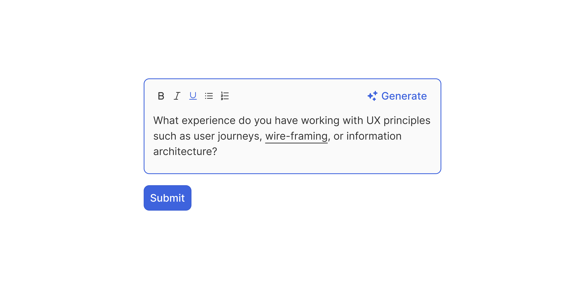

# Textarea

> A multi-line text input for longer free-form responses, with an optional formatting toolbar.

 [View in Figma →](https://www.figma.com/design/7jCMwDng7HF5g7F3tGXf0E/Open-HR?node-id=1053-47776)


---

## Overview

Textarea is the standard field for collecting multi-line text, comments, descriptions, notes, and open-ended answers. It shares the same label + field + helper structure as Text Input, but uses a resizable multi-line field with a formatting toolbar for basic text styling.

**Key differences from Text Input:**

* No size variants, one height only (flexible height, starts at `80px` for the field).
* Has a formatting toolbar (Bold / Italic / Underline / more) above the text area.
* The field **expands on Focus**, the text area grows to accommodate content as the user types.
* Has a `Selected` state, for when the user has highlighted text inside the field.
* Has an optional secondary action button (e.g. "Save" or "Cancel").

Textarea composes: an optional label, the [Textarea Field](/doc/de96f61e-3bf7-44c7-87f1-a03229b61a83) sub-component, and optional helper text.

**Available in:** React · Next.js · Figma


---

## Anatomy

| Part | Description |
|------|-------------|
| Label | Optional visible field label. Direct text node (no wrapper frame). |
| Textarea field | The multi-line input container. `Spacing/padding/lg-12px` all-side padding. `Spacing/radius/sm-7px` radius. `1px` border. Contains toolbar + text area + optional action button. |
| Toolbar | A horizontal row of formatting buttons (Bold, Italic, Underline, etc.). Each button is `20×20px`. `20px` total toolbar height. Toggleable. |
| Text area | The `<textarea>` element. `25px` minimum height (collapses to this when unfocused). Grows to fit content when focused. |
| Action button | An optional Button at the top-right of the field. `24px` height. Used for "Submit", "Save", or "Cancel" actions. Toggleable. |
| Helper text | Optional guidance or error message below the field. `Spacing/gap/sm-6px` gap from the field. |

**Total component height:**

| Part | Collapsed (placeholder) | Expanded (focus) |
|------|-------------------------|------------------|
| Label | `9px`                   | `9px`            |
| Gap  | `Spacing/gap/sm-6px`    | `Spacing/gap/sm-6px` |
| Field (incl. toolbar + text box) | `80px`                  | Grows with content |
| Gap  | `Spacing/gap/sm-6px`    | `Spacing/gap/sm-6px` |
| Helper | `9px`                   | `9px`            |
| **Total** | **\~110px**             | **Variable**     |


---

## Spacing tokens

| Property | Value | Token |
|----------|-------|-------|
| Field padding (all sides) | `Spacing/padding/lg-12px` | `Spacing/padding/lg-12px` |
| Field border radius | `Spacing/radius/sm-7px` | `Spacing/radius/sm-7px` |
| Gap between toolbar and text box | `Spacing/gap/lg-12px` | `Spacing/gap/lg-12px` |
| Toolbar button padding | `Spacing/padding/xs-4px` all sides | `Spacing/padding/xs-4px` |
| Gap (label → field) | `Spacing/gap/sm-6px` | `Spacing/gap/sm-6px` |
| Gap (field → helper) | `Spacing/gap/sm-6px` | `Spacing/gap/sm-6px` |
| Field border width | `1px` | —     |
| Toolbar height | `20px` | —     |
| Toolbar button size | `20×20px` | —     |
| Toolbar button icon size | `12×12px` | —     |
| Text box minimum height | `25px` | —     |
| Action button height | `24px` | —     |


---

## Variants

### State (`state` / Figma: `state`)

| Value | Figma value | Trigger | Visual change |
|-------|-------------|---------|---------------|
| Placeholder | `Place holder` | Empty, not focused | Placeholder text; neutral border |
| Hover | `Hover`     | Pointer enters | Border darkens |
| Focus | `Focus`     | User clicks or tabs into field | Focus border; field expands to full edit height |
| Selected | `Selected`  | User has highlighted text | Text selection highlight visible |
| Filled | `filled`    | Field has content, not focused | Content visible; neutral border |
| Error | `Error`     | Validation failure | Red border; helper becomes error message |
| Disabled | `Disabled`  | `disabled` prop | Reduced opacity; not editable |

> **Selected state:** This represents the browser's native text selection state (highlighted text), not a component-level selection prop. It is documented to ensure the design covers this visual state. No prop is needed, it happens automatically.

### Label visibility (`showLabel` / Figma: `Show Label 🏷️`)

| Value | Default | Description |
|-------|---------|-------------|
| `true` | Yes     | Shows the label above the field |
| `false` | —       | Hidden, provide `aria-label` |

### Helper visibility (`showHelper` / Figma: `Show Helper 💬`)

| Value | Default | Description |
|-------|---------|-------------|
| `true` | Yes     | Shows the helper text |
| `false` | —       | No helper text |


---

## Usage guidelines

**Do** use Textarea for responses longer than a single sentence, cover letter sections, job descriptions, feedback, notes. **Don't** use Textarea for single-line input, use Text Input.

**Do** show the toolbar for all contexts where formatting may be useful. **Don't** show the toolbar in contexts where formatted text would be meaningless (e.g. a free-text search query). Hide it with `showToolbar={false}`.

**Do** let the field expand as the user types. Don't impose a hard max height without a scrollable overflow. **Don't** set a fixed pixel height that doesn't grow, users will lose sight of what they've typed.

**Do** use a character count when a limit applies. Place it in the helper text area. **Don't** silently truncate content at a character limit, warn the user before they hit it.

**Do** validate on blur (when the user leaves the field), not on every keystroke. **Don't** show an error before the user has finished typing.

**Do** use the action button slot for submit/save actions that are tightly coupled to this specific field (e.g. submitting a comment inline). **Don't** use the action button for form-level submission, use a full Button component outside the field for that.


---

## Content guidelines

* **Label:** Noun describing what to write, "Cover letter", "Job description", "Additional notes"
* **Placeholder:** A brief prompt, "Describe the role and its key responsibilities", "Add any notes here"
* **Helper text:** Format constraints or tips, "Minimum 100 words", "Markdown supported"
* **Error:** Specific feedback, "Description is required", "Response must be at least 50 characters"
* **Character count:** "150 / 500 characters"


---

## Behaviour in context

**Auto-expand on focus:** When the user focuses the field, it expands from the collapsed placeholder height to a larger editing height. This is the expected behaviour, don't prevent it with `overflow: hidden` on the field.

**Toolbar formatting:** The toolbar is always visible (it appears above the text area inside the field). Clicking Bold/Italic/Underline wraps selected text in the appropriate markdown or HTML format. The toolbar button's visual state changes to `Hover/Selected` when the current cursor position is inside bold/italic/underlined text.

**Action button:** The optional Button at the top-right is typically "Save" or "Submit", positioned within the field border to signal it's scoped to this field's content. When clicked, it should validate and save the field content.

**Secondary actions:** When `showSecondaryActions=true`, additional buttons (e.g. "Cancel") appear alongside the primary action button.

**Resize handle:** The underlying `<textarea>` should be resizable vertically (`resize: vertical`). Disable horizontal resizing (`resize: none` or `resize: vertical`), horizontal resizing breaks layouts.


---

## Accessibility

* `**<textarea>**` **element**, Use a native `<textarea>` for the text area. Do not use a `<div contenteditable>`, it lacks native keyboard support, `autocomplete`, and `spellcheck`.
* `**<label>**` **association**, Link via `htmlFor` + `id`. Managed automatically when `showLabel=true`.
* `**aria-label**`, Required when `showLabel=false`.
* `**aria-required**`, Set on the `<textarea>` for required fields.
* `**aria-invalid="true"**`, Set in the Error state.
* `**aria-describedby**`, Point to the helper/error text element and any character counter.
* **Toolbar buttons**, Each formatting button needs an `aria-label`: `"Bold"`, `"Italic"`, `"Underline"`. Use `aria-pressed="true"` when a format is active at the cursor position.
* `**rows**` **attribute**, Set a reasonable minimum (e.g. `rows={4}`) to avoid a one-line textarea that doesn't signal multi-line intent.
* `**spellCheck**`, Default to `true` for natural language fields. Set `false` for code or technical input.


---

## Animation

See [Textarea Field (sub-component)](/doc/de96f61e-3bf7-44c7-87f1-a03229b61a83).


---

## Props / API

```ts
interface TextareaProps {
  label?: string
  showLabel?: boolean
  helperText?: string
  showHelper?: boolean
  errorText?: string
  value?: string
  defaultValue?: string
  placeholder?: string
  onChange?: React.ChangeEventHandler<HTMLTextAreaElement>
  onBlur?: React.FocusEventHandler<HTMLTextAreaElement>
  showToolbar?: boolean
  showActionButton?: boolean
  actionButtonLabel?: string
  onAction?: () => void
  showSecondaryActions?: boolean
  maxLength?: number
  rows?: number
  disabled?: boolean
  readOnly?: boolean
  required?: boolean
  name?: string
  id?: string
  'aria-label'?: string
  'aria-labelledby'?: string
  ref?: React.Ref<HTMLTextAreaElement>
  className?: string
}
```

| Prop | Type | Default | Required | Description |
|------|------|---------|----------|-------------|
| `label` | `string` | —       | No       | Visible label above the field. |
| `showLabel` | `boolean` | `true`  | No       | Renders the label. When `false`, provide `aria-label`. |
| `helperText` | `string` | —       | No       | Guidance text. Replaced by `errorText` when in Error state. |
| `showHelper` | `boolean` | `true`  | No       | Renders the helper text area. |
| `errorText` | `string` | —       | No       | Error message, also applies the Error state to the field border. |
| `value` | `string` | —       | No       | Controlled value. |
| `defaultValue` | `string` | —       | No       | Initial value in uncontrolled mode. |
| `placeholder` | `string` | —       | No       | Placeholder prompt when the field is empty. |
| `onChange` | `React.ChangeEventHandler<HTMLTextAreaElement>` | —       | No       | Fires on every keystroke. |
| `onBlur` | `React.FocusEventHandler<HTMLTextAreaElement>` | —       | No       | Fires on blur. Trigger validation here. |
| `showToolbar` | `boolean` | `true`  | No       | Shows the Bold/Italic/Underline formatting toolbar. |
| `showActionButton` | `boolean` | `false` | No       | Shows the action Button inside the field (top-right). |
| `actionButtonLabel` | `string` | —       | No       | Label for the action button. Required when `showActionButton=true`. |
| `onAction` | `() => void` | —       | No       | Fires when the action button is clicked. |
| `showSecondaryActions` | `boolean` | `false` | No       | Shows secondary action buttons alongside the primary. |
| `maxLength` | `number` | —       | No       | Character limit. Show a count in helper text when set. |
| `rows` | `number` | `4`     | No       | Minimum visible rows on the `<textarea>`. |
| `disabled` | `boolean` | `false` | No       | Disables the field and toolbar. |
| `readOnly` | `boolean` | `false` | No       | Focusable but not editable. |
| `required` | `boolean` | `false` | No       | Marks the field as required. |
| `name` | `string` | —       | No       | Form field name. |
| `id` | `string` | —       | No       | Auto-generated if not provided. |
| `aria-label` | `string` | —       | No       | Required when `showLabel=false`. |
| `ref` | `React.Ref<HTMLTextAreaElement>` | —       | No       | Forwarded to the `<textarea>` element. |
| `className` | `string` | —       | No       | Additional CSS class on the outer wrapper. |


---

## Code examples

### Basic

```tsx
// Next.js (App Router), Server Component
// No 'use client' directive needed, this component carries no browser state.

<Textarea
  label="Cover letter"
  placeholder="Describe why you're a strong fit for this role"
  required
  helperText="Minimum 100 words"
/>
```

```tsx
// React
<Textarea
  label="Cover letter"
  placeholder="Describe why you're a strong fit for this role"
  required
  helperText="Minimum 100 words"
/>
```

### Controlled with character count

```tsx
// Next.js (App Router), Client Component
'use client'

const [text, setText] = useState('')
const MAX = 500

<Textarea
  label="Additional notes"
  value={text}
  onChange={(e) => setText(e.target.value)}
  maxLength={MAX}
  helperText={`${text.length} / ${MAX} characters`}
  showToolbar={false}
/>
```

```tsx
// React
const [text, setText] = useState('')
const MAX = 500

<Textarea
  label="Additional notes"
  value={text}
  onChange={(e) => setText(e.target.value)}
  maxLength={MAX}
  helperText={`${text.length} / ${MAX} characters`}
  showToolbar={false}
/>
```

### With inline save action

```tsx
// Next.js (App Router), Client Component
'use client'

const [comment, setComment] = useState('')

async function handleSave() {
  await saveComment(comment)
  setComment('')
}

<Textarea
  label="Comment"
  placeholder="Add a comment..."
  value={comment}
  onChange={(e) => setComment(e.target.value)}
  showActionButton
  actionButtonLabel="Post"
  onAction={handleSave}
/>
```

```tsx
// React
const [comment, setComment] = useState('')

async function handleSave() {
  await saveComment(comment)
  setComment('')
}

<Textarea
  label="Comment"
  placeholder="Add a comment..."
  value={comment}
  onChange={(e) => setComment(e.target.value)}
  showActionButton
  actionButtonLabel="Post"
  onAction={handleSave}
/>
```

### Error state

```tsx
// Next.js (App Router), Client Component
'use client'

<Textarea
  label="Job description"
  value={description}
  onChange={(e) => setDescription(e.target.value)}
  onBlur={() => {
    if (!description.trim()) setError('Job description is required')
    else setError('')
  }}
  errorText={error}
  required
/>
```

```tsx
// React
<Textarea
  label="Job description"
  value={description}
  onChange={(e) => setDescription(e.target.value)}
  onBlur={() => {
    if (!description.trim()) setError('Job description is required')
    else setError('')
  }}
  errorText={error}
  required
/>
```

### No toolbar (plain text only)

```tsx
// Next.js (App Router), Server Component
// No 'use client' directive needed, this component carries no browser state.

<Textarea
  label="Internal notes"
  placeholder="Add internal notes (not visible to candidates)"
  showToolbar={false}
  rows={3}
/>
```

```tsx
// React
<Textarea
  label="Internal notes"
  placeholder="Add internal notes (not visible to candidates)"
  showToolbar={false}
  rows={3}
/>
```


---

## Related components

* [Textarea Field](/doc/de96f61e-3bf7-44c7-87f1-a03229b61a83), The raw multi-line field sub-component
* [Text Input](/doc/93534567-2eff-45a2-b5a8-00a8b76dc4eb), Use for single-line free text
* [Rich Text Input](/doc/c988f131-ff4c-438b-bc00-edc853bbdade), Use when users need to produce richly formatted content with more formatting options
* [Input Code](/doc/a2f266e0-8f94-4efb-be2e-cca4f8c12425), Use for code or structured data entry